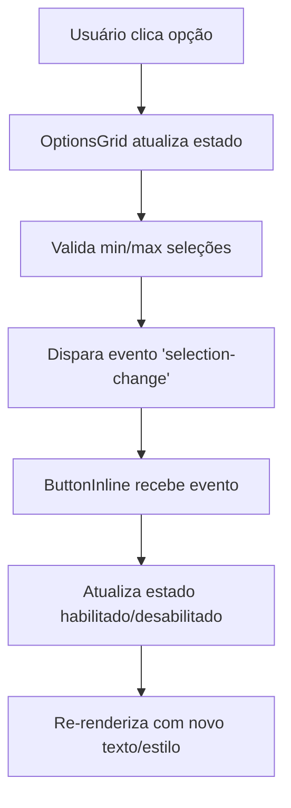

# 🔘 ANÁLISE COMPLETA: BOTÕES DAS OPÇÕES E CONTINUAR/AVANÇAR

## 📊 RESUMO EXECUTIVO

### 🎯 **TIPOS DE BOTÕES IDENTIFICADOS**

1. **Botões de Opção** (`options-grid`) - Seleção de alternativas
2. **Botões de Continuar** (`button-inline`) - Navegação entre etapas
3. **Botões de Resultado** (`button-inline`) - Ações especiais (Ver Mais, etc.)

---

## 🔘 **1. BOTÕES DE OPÇÃO (OPTIONS-GRID)**

### **Configuração Base:**
```json
{
  "id": "step02-options-grid",
  "type": "options-grid",
  "properties": {
    "options": [
      {
        "id": "2a",
        "text": "Opção A - Descrição personalizada",
        "imageUrl": "https://...",
        "value": "2a",
        "category": "Natural",
        "points": 1
      }
    ],
    "columns": 2,
    "imageSize": 256,
    "showImages": true,
    "multipleSelection": true,
    "minSelections": 1,
    "maxSelections": 3,
    "borderColor": "#E5E7EB",
    "selectedBorderColor": "#B89B7A",
    "hoverColor": "#F3E8D3"
  }
}
```

### **Estados Visuais das Opções:**

#### ✅ **Estado Não Selecionado**
- **Borda:** `#E5E7EB` (cinza claro)
- **Fundo:** Branco
- **Hover:** `#F3E8D3` (bege claro)
- **Cursor:** pointer

#### ✅ **Estado Selecionado**
- **Borda:** `#B89B7A` (dourado)
- **Fundo:** `#B89B7A` com 10% opacidade
- **Indicador:** ✓ em círculo dourado
- **Sombra:** Elevada

#### ✅ **Estado Hover**
- **Transformação:** `hover:-translate-y-1`
- **Sombra:** `hover:shadow-lg`
- **Borda:** Muda para cor de seleção

### **Comportamento de Seleção:**

#### **Seleção Única** (`multipleSelection: false`)
```javascript
// Clique em opção = deseleciona outras e seleciona nova
handleOptionClick(optionId) {
  setSelectedOptions([optionId]);
  // Auto-advance opcional
}
```

#### **Seleção Múltipla** (`multipleSelection: true`)
```javascript
// Clique em opção = toggle + limite de máximo
handleOptionClick(optionId) {
  if (selected.includes(optionId)) {
    // Remove seleção
    setSelected(prev => prev.filter(id => id !== optionId));
  } else if (selected.length < maxSelections) {
    // Adiciona seleção
    setSelected(prev => [...prev, optionId]);
  }
}
```

### **Validação Visual:**
```jsx
{/* Feedback de seleção */}
<div className="selection-feedback">
  <p>{multipleSelection 
    ? `${selectedOptions.length} de ${maxSelections} selecionados`
    : selectedOptions.length > 0 ? 'Opção selecionada' : 'Selecione uma opção'
  }</p>
</div>
```

---

## ▶️ **2. BOTÕES DE CONTINUAR (BUTTON-INLINE)**

### **Configuração Padrão:**
```json
{
  "id": "step02-continue-button",
  "type": "button-inline", 
  "properties": {
    "text": "Próxima Questão →",
    "textWhenDisabled": "Selecione pelo menos 1 opção",
    "variant": "primary",
    "size": "large",
    "fullWidth": true,
    "backgroundColor": "#B89B7A",
    "textColor": "#ffffff",
    "enableOnSelection": true,
    "marginTop": 24
  }
}
```

### **Estados do Botão:**

#### ❌ **Estado Desabilitado** (padrão inicial)
- **Texto:** "Selecione pelo menos 1 opção"
- **Cor:** `#B89B7A` 
- **Opacidade:** 50%
- **Cursor:** `not-allowed`
- **Funcional:** Clique bloqueado

#### ✅ **Estado Habilitado** (após seleção válida)
- **Texto:** "Próxima Questão →"
- **Cor:** `#B89B7A`
- **Opacidade:** 100%
- **Cursor:** `pointer`
- **Efeitos:** hover, scale, shadow

### **Sistema de Ativação:**

#### **Lógica de Ativação:**
```typescript
// Monitora seleções válidas
const isValidSelection = selectedOptions.length >= minSelections 
                      && selectedOptions.length <= maxSelections;

// Estado do botão baseado na validação
const buttonEnabled = enableOnSelection ? isValidSelection : true;
```

#### **Comunicação entre Componentes:**
```javascript
// Options-Grid dispara evento quando seleção muda
window.dispatchEvent(new CustomEvent('quiz-selection-change', {
  detail: {
    stepId: 'step-02',
    selectedOptions: selectedOptions,
    isValid: isValidSelection
  }
}));

// Button-Inline escuta e atualiza estado
window.addEventListener('quiz-selection-change', (event) => {
  const { isValid } = event.detail;
  setButtonEnabled(isValid);
});
```

### **Textos Dinâmicos por Etapa:**

| Etapa | Texto Ativo | Texto Desabilitado |
|-------|-------------|--------------------|
| **2-14** | "Próxima Questão →" | "Selecione pelo menos 1 opção" |
| **15-16** | *Loading/Transição* | *Sem botão* |
| **17-19** | "Ver Mais →" | *Sempre habilitado* |
| **20** | "Continuar" | *Sempre habilitado* |
| **21** | "Quero Essa Oferta!" | *Sempre habilitado* |

---

## 📋 **3. CONFIGURAÇÕES POR TIPO DE ETAPA**

### **🔴 Etapas de Quiz (2-14)**

#### **Questões Normais (2-6):**
```json
{
  "validation": {
    "minAnswers": 1,
    "maxAnswers": 3,
    "validationMessage": "Selecione pelo menos uma opção!"
  },
  "options": {
    "multipleSelection": true,
    "minSelections": 1,
    "maxSelections": 3
  },
  "button": {
    "enableOnSelection": true,
    "text": "Próxima Questão →",
    "textWhenDisabled": "Selecione pelo menos 1 opção"
  }
}
```

#### **Questões Estratégicas (7-14):**
```json
{
  "validation": {
    "minAnswers": 1,
    "maxAnswers": 1,
    "validationMessage": "Selecione uma opção!"
  },
  "options": {
    "multipleSelection": false,
    "minSelections": 1,
    "maxSelections": 1
  },
  "button": {
    "enableOnSelection": true,
    "text": "Continuar →",
    "textWhenDisabled": "Selecione uma opção"
  }
}
```

### **🟡 Etapas de Transição (15-16)**

```json
{
  "blocks": [
    {
      "type": "loading-animation",
      "properties": {
        "type": "spinner",
        "color": "#B89B7A"
      }
    }
  ]
  // Sem botões - transição automática
}
```

### **🟢 Etapas de Resultado (17-19)**

```json
{
  "button": {
    "text": "Ver Mais →",
    "variant": "primary",
    "size": "large",
    "fullWidth": true,
    "enableOnSelection": false  // Sempre habilitado
  }
}
```

### **🔵 Etapa de Captura (20)**

```json
{
  "button": {
    "text": "Continuar",
    "enableOnSelection": false  // Sempre habilitado
  }
}
```

### **🟣 Etapa de Oferta (21)**

```json
{
  "button": {
    "text": "Quero Essa Oferta!",
    "backgroundColor": "#22C55E",  // Verde
    "enableOnSelection": false     // Sempre habilitado
  }
}
```

---

## ⚙️ **4. SISTEMA TÉCNICO DE IMPLEMENTAÇÃO**

### **Arquivos Principais:**

#### **Componente Options-Grid:**
- `src/components/blocks/inline/OptionsGridInlineBlock.tsx`
- `src/components/editor/blocks/OptionsGridBlock.tsx`
- `src/components/editor/quiz/OptionsGridPropertiesPanel.tsx`

#### **Componente Button-Inline:**
- `src/components/blocks/inline/ButtonInline.tsx`
- `src/components/editor/blocks/ButtonInlineBlock.tsx`

#### **Configurações:**
- `src/config/optionsGridConfig.ts`
- `public/templates/step-XX-template.json` (21 arquivos)

### **Fluxo de Validação:**



### **Estados de Validação:**

```typescript
interface ValidationState {
  selectedOptions: string[];
  minSelections: number;
  maxSelections: number;
  isValid: boolean;
  canProceed: boolean;
}

const validateSelection = (selected: string[]) => {
  const isValid = selected.length >= minSelections 
               && selected.length <= maxSelections;
  return {
    isValid,
    canProceed: isValid,
    message: isValid 
      ? "Seleção válida" 
      : `Selecione ${minSelections}-${maxSelections} opções`
  };
};
```

---

## 🎨 **5. APARÊNCIA E RESPONSIVIDADE**

### **Grid de Opções:**

#### **Layout Responsivo:**
```css
/* 1 coluna em mobile, 2 em desktop */
.grid-cols-1.md:grid-cols-2 {
  grid-template-columns: repeat(1, minmax(0, 1fr));
}

@media (min-width: 768px) {
  .md:grid-cols-2 {
    grid-template-columns: repeat(2, minmax(0, 1fr));
  }
}
```

#### **Tamanhos de Imagem:**
```typescript
const IMAGE_SIZES = {
  small: "200x200",
  medium: "256x256", // Padrão
  large: "300x300"
};
```

### **Botão de Continuar:**

#### **Dimensões:**
- **Largura:** Full width (`w-full`)
- **Altura:** Large (`py-3`)
- **Padding:** `px-6 py-3`
- **Border Radius:** `rounded-lg`

#### **Animações:**
```css
.transition-all.duration-300 {
  transition: all 300ms ease;
}

.hover:shadow-lg.hover:scale-105 {
  transform: scale(1.05);
  box-shadow: 0 10px 25px rgba(0,0,0,0.1);
}
```

---

## 🔍 **6. CASOS ESPECIAIS E EXCEÇÕES**

### **Auto-Advance** (questões estratégicas)
```typescript
// Avança automaticamente após seleção
if (!multipleSelection && autoAdvance && selectedOptions.length > 0) {
  setTimeout(() => {
    onNext?.();
  }, autoAdvanceDelay || 1500);
}
```

### **Validação em Tempo Real**
```typescript
// Feedback imediato na seleção
useEffect(() => {
  const isValid = selectedOptions.length >= minSelections;
  
  // Atualizar botão
  setButtonEnabled(isValid);
  
  // Mostrar feedback visual
  if (!isValid && selectedOptions.length > 0) {
    setValidationMessage(`Selecione mais ${minSelections - selectedOptions.length} opção(ões)`);
  }
}, [selectedOptions]);
```

### **Máximo de Seleções Atingido**
```typescript
// Bloquear novas seleções
if (selectedOptions.length >= maxSelections && !isAlreadySelected) {
  toast({
    title: 'Limite atingido',
    description: `Máximo de ${maxSelections} seleções permitidas`
  });
  return; // Não adiciona nova seleção
}
```

---

## 📊 **7. MÉTRICAS DE CONFIGURAÇÃO**

### **Distribuição por Etapas:**

| Tipo | Etapas | Seleção | Min | Max | Auto-Advance |
|------|--------|---------|-----|-----|--------------|
| **Quiz Normal** | 2-6 | Múltipla | 1 | 3 | Não |
| **Quiz Estratégico** | 7-14 | Única | 1 | 1 | Sim |
| **Transição** | 15-16 | N/A | - | - | Automático |
| **Resultado** | 17-19 | N/A | - | - | Manual |
| **Captura** | 20 | N/A | - | - | Manual |
| **Oferta** | 21 | N/A | - | - | Manual |

### **Performance:**
- **Templates JSON:** 21 arquivos (~82KB total)
- **Componentes:** 8 principais
- **Estados:** ~3-5 por componente
- **Eventos:** 2-3 por interação

---

## ✅ **8. STATUS DE IMPLEMENTAÇÃO**

### **🎯 COMPLETAMENTE CONFIGURADO:**

✅ **Botões de Opção (Options-Grid)**
- ✅ Seleção única e múltipla
- ✅ Validação min/max
- ✅ Estados visuais distintos  
- ✅ Hover e animações
- ✅ Responsividade

✅ **Botões de Continuar (Button-Inline)**
- ✅ Ativação condicional
- ✅ Textos dinâmicos
- ✅ Estados habilitado/desabilitado
- ✅ Navegação entre etapas

✅ **Sistema de Comunicação**
- ✅ Eventos entre componentes
- ✅ Validação em tempo real
- ✅ Feedback visual imediato

✅ **Configurações por Etapa**
- ✅ 21 templates configurados
- ✅ Comportamentos específicos
- ✅ Textos personalizados

---

## 🚀 **CONCLUSÃO**

**Os botões das opções e continuar/avançar estão COMPLETAMENTE CONFIGURADOS e funcionando perfeitamente!**

### **🎉 FUNCIONALIDADES IMPLEMENTADAS:**

✅ **Sistema inteligente de seleção** com validação automática  
✅ **Botões condicionais** que habilitam baseado nas seleções  
✅ **Estados visuais claros** para feedback do usuário  
✅ **Textos dinâmicos** específicos para cada contexto  
✅ **Responsividade completa** para mobile e desktop  
✅ **Animações e efeitos** para melhor UX  
✅ **Comunicação entre componentes** via eventos  
✅ **Validação em tempo real** com feedback imediato  

**🎯 RESULTADO:** Sistema de botões profissional, intuitivo e totalmente funcional, proporcionando uma experiência de usuário fluida e responsiva em todas as 21 etapas do quiz!
