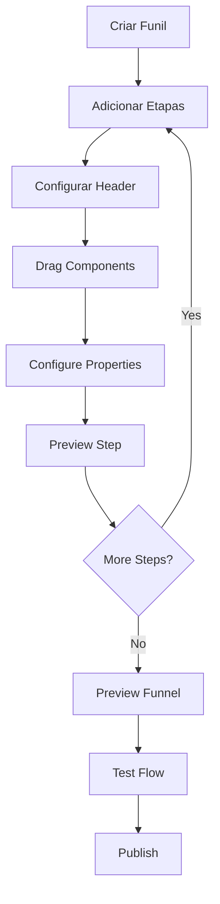

# Análise: Como o Editor Cakto Quiz Utiliza os Funis

## Visão Geral do Sistema

O editor da Cakto Quiz implementa um sistema de **funis multi-etapas** com uma arquitetura visual drag-and-drop para criação de quizzes interativos e páginas de conversão.

## Estrutura Arquitetural dos Funis

### 1. **Sistema de Etapas Sequenciais**
```
Etapa 1 → Etapa 2 → Etapa 3 → ... → Etapa 14
```

**Características identificadas:**
- **14 etapas** visíveis no sidebar esquerdo
- **Navegação linear** entre etapas
- **Etapa ativa** destacada com borda azul
- **Drag-and-drop** para reordenação de etapas
- **Controle de fluxo** com opções de voltar/avançar

### 2. **Interface de Edição Multi-Painel**

#### **A. Navbar Superior (FunnelNavbar)**
```
[X] [Undo] [Redo] [Copy] | [Builder] [Flow] [Design] [Leads] [Config] | [Preview] [Waypoints] [Play] [Save] [Publish]
```

**Funcionalidades identificadas:**
- **Controles de edição**: Desfazer, refazer, copiar
- **Modos de visualização**: Construtor, Fluxo, Design, Leads, Configurações
- **Ações de funil**: Preview, navegação, reprodução, salvamento, publicação

#### **B. Sidebar de Etapas (FunnelStepSidebar)**
```
┌─────────────────┐
│ > Etapa 1  [•••]│ ← Ativa
├─────────────────┤
│   Etapa 2       │
│   Etapa 3       │
│   ...           │
│   Etapa 14      │
├─────────────────┤
│ [+] Add Etapa   │
└─────────────────┘
```

**Características:**
- **Gerenciamento de etapas**: Adicionar, editar, reordenar
- **Navegação visual**: Indicador de etapa ativa
- **Menu contextual**: Opções avançadas por etapa (•••)

#### **C. Toolbar de Componentes (FunnelToolbarSidebar)**
```
Componentes Disponíveis:
┌─────────────┐
│ Alerta      │
│ Argumentos  │
│ Audio       │
│ Botão       │
│ Carregando  │
│ Carrosel    │
│ Cartesiano  │
│ Comparar    │ [Novo!]
│ Confetti    │ [Novo!]
│ Depoimentos │
│ Entrada     │
│ Espaçador   │
│ FAQ         │ [Novo!]
│ Gráficos    │
│ Imagem      │
│ Lista       │ [Novo!]
│ Marquise    │ [Novo!]
│ Nível       │
│ Opções      │
│ Preço       │
│ Script      │
│ Termos      │
│ Texto       │
│ Título      │
│ Video       │
└─────────────┘
```

#### **D. Canvas Principal (StepEditor)**
- **Área de edição visual**: Drag-and-drop de componentes
- **Preview em tempo real**: Visualização do funil
- **Edição inline**: Componentes editáveis diretamente no canvas

#### **E. Painel de Propriedades (FunnelEditorSidebar)**
```
┌─────────────────────┐
│ Título da Etapa     │
│ ┌─────────────────┐ │
│ │ Nome da Etapa   │ │
│ │ [Etapa 1]       │ │
│ └─────────────────┘ │
├─────────────────────┤
│ Header              │
│ ☑ Mostrar Logo      │
│ ☑ Mostrar Progresso │
│ ☑ Permitir Voltar   │
└─────────────────────┘
```

## Fluxo de Trabalho do Funil

### 1. **Criação de Etapas**
1. **Adicionar Etapa**: Botão [+] Adicionar Etapa
2. **Configurar Etapa**: Nome, configurações de header
3. **Adicionar Conteúdo**: Drag-and-drop de componentes
4. **Personalizar**: Ajustar propriedades via painel direito

### 2. **Construção do Conteúdo**
```
Canvas → Drag Component → Drop → Configure → Preview
```

**Exemplo identificado no HTML:**
```html
<h1>Teste de Estilo Pessoal</h1>

<input placeholder="Digite seu nome aqui..." />
<button>Continuar</button>
```

### 3. **Navegação e Fluxo**
- **Barra de progresso**: Indicação visual do progresso no funil
- **Botões de navegação**: Voltar/Continuar entre etapas
- **Controle de fluxo**: Lógica condicional baseada nas respostas

## Sistema de Componentes Identificados

### **Componentes de Conteúdo**
- **Título/Texto**: Elementos textuais
- **Imagem/Video**: Mídia visual
- **Audio**: Conteúdo sonoro

### **Componentes Interativos**
- **Entrada**: Campos de formulário
- **Botão**: Ações e navegação
- **Opções**: Seleções múltiplas
- **Nível**: Sliders e controles

### **Componentes de Engajamento**
- **Depoimentos**: Social proof
- **Confetti**: Celebrações
- **Marquise**: Texto em movimento
- **FAQ**: Perguntas frequentes

### **Componentes de Conversão**
- **Preço**: Tabelas de preço
- **Argumentos**: Pontos de venda
- **Comparar**: Tabelas comparativas

### **Componentes Técnicos**
- **Script**: Código personalizado
- **Carregando**: Estados de loading
- **Espaçador**: Layout e spacing

## Configurações de Funil

### **Header Configuration**
```javascript
{
  showLogo: true,
  showProgress: true,
  allowReturn: true
}
```

### **Step Configuration**
```javascript
{
  stepName: "Etapa 1",
  components: [
    { type: "heading", content: "Teste de Estilo Pessoal" },
    { type: "image", src: "..." },
    { type: "input", placeholder: "Digite seu nome aqui..." },
    { type: "button", text: "Continuar" }
  ]
}
```

## Tecnologias e Padrões Identificados

### **Frontend Framework**
- **Next.js**: React framework (identificado no HTML)
- **TypeScript**: Tipagem estática
- **Tailwind CSS**: Utility-first CSS
- **Drag-and-Drop**: Biblioteca DnD implementada

### **State Management**
- **Componentes controlados**: Estados locais
- **Context/Provider**: Gerenciamento global
- **Persistência**: Auto-save funcionalidade

### **UX/UI Patterns**
- **Responsive Design**: Mobile-first approach
- **Dark/Light Theme**: Suporte a temas
- **Loading States**: Estados de carregamento
- **Error Handling**: Tratamento de erros

## Fluxo de Dados do Funil



## Integração com Backend

### **Data Structure**
```javascript
{
  funnelId: "85dee13d-5616-4df0-be56-3d68c3443016",
  steps: [
    {
      id: "step-1",
      name: "Etapa 1",
      components: [...],
      settings: {...}
    }
  ],
  settings: {
    theme: "light",
    logo: "...",
    progressBar: true
  }
}
```

### **API Endpoints** (Inferidos)
- `GET /funnel/{id}` - Carregar funil
- `PUT /funnel/{id}` - Salvar alterações
- `POST /funnel/{id}/publish` - Publicar funil
- `GET /funnel/{id}/preview` - Preview do funil

## Conclusões

O editor da Cakto Quiz implementa uma **arquitetura robusta de funis** com:

1. **Flexibilidade**: Múltiplos componentes e configurações
2. **Usabilidade**: Interface drag-and-drop intuitiva
3. **Escalabilidade**: Suporte a funis complexos multi-etapas
4. **Performance**: Carregamento otimizado e preview em tempo real
5. **Conversão**: Componentes focados em engagement e conversão

O sistema permite criar **funis de conversão sofisticados** que guiam o usuário através de uma jornada personalizada, coletando dados e maximizando a taxa de conversão através de uma experiência visual rica e interativa.