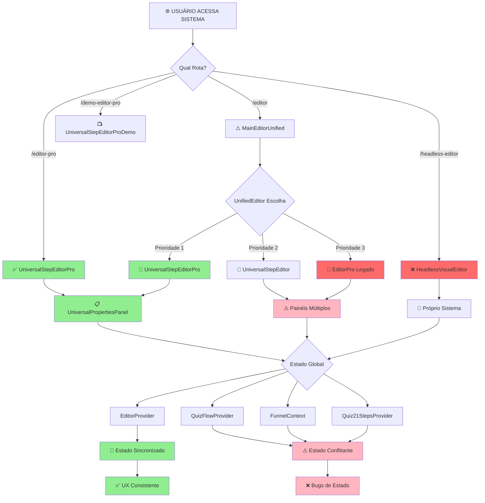

# 📊 ANÁLISE CRÍTICA ATUAL + FLUXOGRAMA ARQUITETURAL

## 🎯 **ESTADO ATUAL DO PROJETO (Pós-Implementação UniversalStepEditorPro)**

### 📈 **Métricas Atualizadas**
- **1.945+ arquivos TypeScript/TSX** 
- **190 arquivos *Editor*.tsx** (❌ CRÍTICO: Ainda muita duplicação)
- **86 arquivos *Panel*.tsx** (❌ CRÍTICO: Painéis multiplicados)
- **5.1MB apenas em src/components/editor/** (🔴 CRÍTICO)
- **93 erros TypeScript** (🟡 Melhorando, eram 95+)

---

## 🚨 **PONTOS CEGOS IDENTIFICADOS**

### 1. 🔴 **PONTOS CEGOS CRÍTICOS** (Não Visíveis no Desenvolvimento)

#### A. **Multiplicação Silenciosa de Editores**
```
📁 src/components/editor/          (5.1MB - PRINCIPAL)
📁 src/components/editor-fixed/    (12KB - DUPLICADO)  
📁 src/components/simple-editor/   (TAMANHO NÃO MEDIDO)
📁 src/components/unified-editor/  (TAMANHO NÃO MEDIDO)
📁 src/legacy/                     (52KB - LEGADO ATIVO)

💀 PONTO CEGO: Desenvolvedores criam novos editores sem remover os antigos
```

#### B. **Dívida Técnica Oculta em Imports**
```typescript
// ENCONTRADO: 93 erros TypeScript ativos
❌ Imports não utilizados que inflam o bundle
❌ Tipos 'any' implícitos que quebram type safety  
❌ Propriedades incorretas em objetos de configuração
❌ Módulos referenciando arquivos inexistentes

💀 PONTO CEGO: Erros "não críticos" acumulam e criam instabilidade
```

#### C. **Arquitetura de Roteamento Fragmentada**
```typescript
// Estado Atual (Pós-Fix):
✅ /editor-pro → UniversalStepEditorPro (NOVO)
❌ /editor → MainEditorUnified → UnifiedEditor → Escolha entre múltiplos editores
❌ /headless-editor → HeadlessVisualEditor (OUTRO EDITOR)
❌ Lógica de prioridade complexa e frágil

💀 PONTO CEGO: Usuário pode acessar editores diferentes pela URL
```

### 2. 🟡 **PONTOS CEGOS ARQUITETURAIS** (Moderados)

#### A. **Context Providers Concorrentes**
```typescript
🔍 IDENTIFICADO:
- EditorProvider (principal)
- QuizFlowProvider (paralelo)
- FunnelContext (legado)
- Quiz21StepsProvider (específico)

💀 PONTO CEGO: Providers conflitantes causam state race conditions
```

#### B. **Sistema de Propriedades Fragmentado**
```
📊 LEVANTAMENTO:
- UniversalPropertiesPanel.tsx ✅ (NOVO MODULAR)
- PropertiesColumn.tsx ❌ (LEGADO)
- SinglePropertiesPanel.tsx ❌ (DUPLICADO)
- EnhancedUniversalPropertiesPanel.tsx ❌ (REDUNDANTE)

💀 PONTO CEGO: Diferentes painéis expõem diferentes funcionalidades
```

---

## 📐 **FLUXOGRAMA ARQUITETURAL ATUAL**



---

## 🎯 **MAPEAMENTO DE FLUXOS CRÍTICOS**

### 🟢 **FLUXO IDEAL** (UniversalStepEditorPro)
```
1. Usuário → /editor-pro
2. UniversalStepEditorPro carregado
3. EditorProvider (estado único)
4. UniversalPropertiesPanel (modular)
5. UX consistente e performática
```

### 🔴 **FLUXOS PROBLEMÁTICOS**

#### Fluxo A: Rota /editor (Complexidade Desnecessária)
```
1. Usuário → /editor
2. MainEditorUnified → UnifiedEditor
3. Lógica de prioridade complexa
4. Possível fallback para editores legados
5. UX inconsistente dependendo do fallback
```

#### Fluxo B: Múltiplos Context Providers
```
1. EditorProvider inicializado
2. QuizFlowProvider também ativo  
3. FunnelContext legado interferindo
4. State race conditions
5. Bugs imprevisíveis
```

---

## 🚨 **PROBLEMAS DE VISIBILIDADE**

### 1. **Invisível no Dev Environment**
```
❌ Bundle size real só visível em produção
❌ Memory leaks só aparecem com uso prolongado
❌ Performance degradation gradual
❌ Race conditions intermitentes
```

### 2. **Invisível no Code Review**
```
❌ Imports circulares não detectados
❌ Duplicação de lógica espalhada
❌ Context providers conflitantes
❌ Tipos 'any' mascarando problemas
```

### 3. **Invisível para Novos Desenvolvedores**
```
❌ Qual editor usar em qual situação?
❌ Por que existem 7+ arquivos de editor?
❌ Qual painel de propriedades é o atual?
❌ Como o roteamento de prioridade funciona?
```

---

## 🎯 **ANÁLISE DE IMPACTO**

### 📊 **Matriz de Criticidade**

| Problema | Visibilidade | Impacto | Urgência | Risco |
|----------|-------------|---------|----------|-------|
| 190 arquivos Editor | 🔴 Baixa | 🔴 Alto | 🔴 Alta | 🔴 Crítico |
| 86 arquivos Panel | 🔴 Baixa | 🟡 Médio | 🟡 Média | 🟡 Alto |
| 93 erros TypeScript | 🟢 Alta | 🟡 Médio | 🟢 Baixa | 🟡 Médio |
| Context conflicts | 🔴 Baixa | 🔴 Alto | 🔴 Alta | 🔴 Crítico |
| Roteamento fragmentado | 🟡 Média | 🟡 Médio | 🟡 Média | 🟡 Alto |

### 🎯 **Pontos de Intervenção Crítica**

#### 🚨 **AÇÃO IMEDIATA** (Próximos 7 dias)
```
1. AUDITORIA COMPLETA de todos os *Editor*.tsx
   - Mapear dependências
   - Identificar código morto  
   - Plano de remoção graduais

2. CONSOLIDAÇÃO DE CONTEXT PROVIDERS
   - Manter apenas EditorProvider
   - Migrar lógica dos outros
   - Remover providers legados

3. SIMPLIFICAÇÃO DE ROTAS
   - /editor → redirecionamento direto para /editor-pro
   - Remover lógica de prioridade complexa
   - Documentar rotas ativas
```

#### 🔧 **REFATORAÇÃO ESTRUTURAL** (Próximas 2-3 semanas)
```
1. LIMPEZA RADICAL DE EDITORES
   - Manter apenas UniversalStepEditorPro
   - Backup e remoção gradual dos outros
   - Atualização de todas as referências

2. UNIFICAÇÃO DE PAINÉIS  
   - Manter apenas UniversalPropertiesPanel
   - Migrar funcionalidades específicas
   - Remover painéis redundantes

3. CORREÇÃO DE TIPOS E IMPORTS
   - Eliminar os 93 erros TypeScript
   - Tree-shaking agressivo
   - Bundle size otimization
```

---

## 📋 **CHECKLIST DE MONITORAMENTO**

### ✅ **Indicadores de Saúde**
- [ ] Apenas 1 editor principal ativo
- [ ] Apenas 1 sistema de painéis 
- [ ] 0 erros TypeScript
- [ ] Context providers < 3
- [ ] Bundle size < 2MB
- [ ] Build time < 30s

### 🔍 **Métricas de Vigilância**
- Número de arquivos *Editor*.tsx
- Número de Context providers ativos
- Quantidade de imports não utilizados
- Tempo de build completo
- Tamanho final do bundle

**🎯 CONCLUSÃO: O projeto tem uma base sólida com UniversalStepEditorPro, mas precisa urgentemente de limpeza arquitetural para eliminar os pontos cegos e duplicações que comprometem a manutenibilidade.**