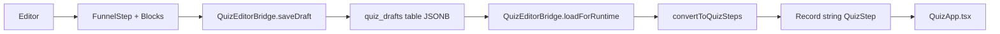

# 🔍 ANÁLISE COMPLETA: Estrutura de Templates JSON v3.0 vs Editor

## 📊 MAPEAMENTO DAS ESTRUTURAS

### **1️⃣ ESTRUTURA JSON v3.0 ATUAL (Templates /public/templates/)**

```json
{
  "templateVersion": "3.0",
  "metadata": {
    "id": "step-01-intro-v3",
    "name": "Introdução - Bem-vindo ao Quiz de Estilo",
    "category": "intro",
    "tags": ["quiz", "style", "intro"]
  },
  "theme": {
    "colors": { "primary": "#B89B7A", ... },
    "fonts": { "heading": "Playfair Display", ... }
  },
  "sections": [
    {
      "type": "intro-hero",
      "id": "intro-hero-01",
      "content": {
        "title": "...",
        "subtitle": "...",
        "imageUrl": "..."
      },
      "style": { ... },
      "animation": { ... }
    },
    {
      "type": "welcome-form",
      "id": "intro-form-01",
      "content": {
        "questionText": "...",
        "nameLabel": "...",
        "submitText": "..."
      }
    }
  ],
  "validation": { ... },
  "navigation": {
    "nextStep": "step-02",
    "prevStep": null,
    "allowBack": false
  },
  "analytics": { ... }
}
```

**Características:**
- ✅ **Seções hierárquicas**: Cada section tem type, id, content, style
- ✅ **Granularidade alta**: Controle fino de cada elemento
- ✅ **Tipagem forte**: types específicos (intro-hero, welcome-form, CTAButton, etc)
- ✅ **43 arquivos**: step-01-v3.json até step-21-v3.json (+ legados)
- ✅ **Metadata rica**: versão, autor, tags, timestamps

---

### **2️⃣ ESTRUTURA TypeScript ESPERADA (QuizStep interface)**

```typescript
// src/data/quizSteps.ts
export interface QuizStep {
    id?: string;
    type: 'intro' | 'question' | 'strategic-question' | 'transition' | 'transition-result' | 'result' | 'offer';
    
    // Campos básicos
    title?: string;
    questionNumber?: string;
    questionText?: string;
    formQuestion?: string;
    placeholder?: string;
    buttonText?: string;
    text?: string;
    image?: string;
    
    // Múltipla escolha
    requiredSelections?: number;
    options?: QuizOption[];
    
    // Navegação
    nextStep?: string;
    
    // Oferta (step-21)
    offerMap?: Record<string, OfferContent>;
    
    // Transição
    showContinueButton?: boolean;
    continueButtonText?: string;
    duration?: number;
}
```

**Características:**
- ⚠️ **Estrutura plana**: Não há hierarquia de sections
- ⚠️ **Granularidade baixa**: Campos específicos diretos
- ⚠️ **Tipo único**: Apenas 7 tipos de step
- ⚠️ **Sem theme**: Não tem cores, fontes, espaçamento
- ⚠️ **Sem animations**: Não controla transições CSS

---

### **3️⃣ ESTRUTURA DO EDITOR (FunnelStep no banco)**

```typescript
// src/types/quiz-schema.ts
export interface FunnelStep {
  id: string;
  name: string;
  description: string;
  order: number;
  type: StepType;
  
  settings: StepSettings;     // Timing, visual, progress
  blocks: Block[];            // Blocos de conteúdo
  navigation: NavigationLogic; // Condições + ações
  validation: ValidationRules; // Regras customizadas
  seo?: SEOConfiguration;     // Meta tags
}

export interface Block {
  id: string;
  type: BlockType;
  position: number;
  properties: Record<string, any>;
  styling: BlockStyling;
}
```

**Características:**
- ✅ **Blocks baseados**: Sistema de blocos como WordPress/Notion
- ✅ **Configurações avançadas**: settings, validation, navigation conditions
- ✅ **SEO integrado**: Meta tags por step
- ✅ **Ordem explícita**: position e order
- ⚠️ **Diferente de sections**: Blocks ≠ Sections

---

## 🔄 ADAPTAÇÕES ATUAIS (QuizStepAdapter.ts)

### **Como funciona hoje:**

```typescript
// src/adapters/QuizStepAdapter.ts
class QuizStepAdapter {
  static fromJSON(json: JSONTemplate): QuizStep {
    // 1. Detecta tipo baseado em sections
    const stepType = this.detectStepType(json.sections);
    
    // 2. Converte sections → QuizStep
    switch (stepType) {
      case 'intro':
        return this.convertIntroStep(json.sections);
      case 'question':
        return this.convertQuestionStep(json.sections);
      // ... outros tipos
    }
  }
}
```

**Limitações:**
- ❌ **Perda de dados**: Theme, animations, section details são descartados
- ❌ **Conversão unidirecional**: Não há `toJSON()` funcional
- ❌ **Mapeamento manual**: Cada tipo precisa de converter específico
- ❌ **Sem validação de integridade**: Pode perder propriedades

---

## 🎯 O QUE O EDITOR SALVA (quiz_drafts table)

```sql
-- supabase/migrations/20250108_quiz_editor_tables.sql
CREATE TABLE quiz_drafts (
  id TEXT PRIMARY KEY,
  name TEXT NOT NULL,
  slug TEXT NOT NULL,
  steps JSONB NOT NULL,  -- 🔥 AQUI: Array de FunnelStep
  version INTEGER DEFAULT 1,
  is_published BOOLEAN DEFAULT false,
  created_at TIMESTAMPTZ DEFAULT NOW()
);

CREATE TABLE quiz_production (
  slug TEXT PRIMARY KEY,
  steps JSONB NOT NULL,  -- 🔥 AQUI: Record<string, QuizStep>
  version INTEGER NOT NULL,
  published_at TIMESTAMPTZ DEFAULT NOW()
);
```

**Formato salvo:**

```json
// quiz_drafts.steps (Array)
[
  {
    "id": "step-01",
    "name": "Introdução",
    "order": 1,
    "type": "intro",
    "settings": { ... },
    "blocks": [
      {
        "id": "block-01",
        "type": "text-inline",
        "position": 1,
        "properties": { "content": "..." }
      }
    ],
    "navigation": {
      "nextStep": "step-02"
    }
  }
]

// quiz_production.steps (Record)
{
  "step-01": {
    "type": "intro",
    "title": "...",
    "formQuestion": "...",
    "nextStep": "step-02"
  }
}
```

---

## ⚡ FLUXO ATUAL: /editor → /quiz-estilo



### **Código real:**

```typescript
// src/services/QuizEditorBridge.ts linha 378
async loadForRuntime(funnelId?: string): Promise<Record<string, QuizStep>> {
  const draft = await this.loadDraftFromDatabase(funnelId);
  if (draft) {
    return this.convertToQuizSteps(draft.steps); // 🔥 CONVERSÃO AQUI
  }
  return QUIZ_STEPS; // Fallback
}

// linha 468 (privado)
private convertToQuizSteps(editorSteps: EditorQuizStep[]): Record<string, QuizStep> {
  const result: Record<string, QuizStep> = {};
  
  editorSteps.forEach(step => {
    result[step.id] = {
      id: step.id,
      type: step.type,
      title: step.title,
      // ... copia campos básicos
      nextStep: step.nextStep
    };
  });
  
  return result;
}
```

**Problema:** 🔴 **Conversão simplista!**
- Apenas copia campos diretos
- Blocks não são processados
- Settings são ignorados
- Theme/animations perdidos

---

## 🔴 GARGALOS IDENTIFICADOS

### **1. Perda de Dados na Conversão**

| Dado Original (JSON v3.0) | Conversão Atual | Onde está no Editor? |
|---------------------------|-----------------|----------------------|
| `sections[].content` | ❌ Perdido | Deve virar `blocks[]` |
| `theme.colors` | ❌ Perdido | Não mapeado |
| `theme.fonts` | ❌ Perdido | Não mapeado |
| `sections[].animation` | ❌ Perdido | Não mapeado |
| `sections[].style` | ❌ Perdido | Deve virar `block.styling` |
| `validation.rules` | ❌ Perdido | Deve virar `validation` |
| `analytics.events` | ❌ Parcial | Não sincronizado |

### **2. Incompatibilidade de Tipos**

```typescript
// JSON v3.0 tem:
sections: [
  { type: "intro-hero", content: {...} },      // ❌ Não existe em QuizStep
  { type: "welcome-form", content: {...} },    // ❌ Não existe em QuizStep
  { type: "CTAButton", content: {...} }        // ❌ Não existe em QuizStep
]

// QuizStep tem:
type: 'intro' | 'question' | ...  // ✅ Apenas 7 tipos genéricos

// Editor salva:
blocks: [
  { type: "text-inline", properties: {...} },  // ✅ Editor entende
  { type: "form-input", properties: {...} },   // ✅ Editor entende
  { type: "button-inline", properties: {...} } // ✅ Editor entende
]
```

**Gap:** `sections[].type` ≠ `block.type`

### **3. Falta de Round-Trip**

```typescript
// ✅ JSON → QuizStep (EXISTE)
QuizStepAdapter.fromJSON(json) → QuizStep

// ❌ QuizStep → JSON (NÃO IMPLEMENTADO)
QuizStepAdapter.toJSON(step) → ???

// ⚠️ QuizStep → Blocks (PARCIAL)
convertStepToBlocks(step) → Block[]  // Existe mas simplificado

// ⚠️ Blocks → QuizStep (PARCIAL)
convertBlocksToStep(blocks) → QuizStep  // Existe mas perde dados
```

**Resultado:** Editor pode editar, mas **não consegue preservar 100% do JSON v3.0**

### **4. Cache Inconsistente**

```typescript
// QuizEditorBridge.ts
private cache = new Map<string, QuizFunnelData>();

// Problema: Cache não sincroniza com Supabase
// Se outro usuário publicar, cache fica desatualizado
```

### **5. Sem Versionamento Semântico**

```sql
-- quiz_production table
version INTEGER NOT NULL  -- Apenas incrementa, sem controle real
```

**Problemas:**
- Não há rollback
- Não há histórico de mudanças
- Não há diff entre versões
- Editor não sabe se funil mudou desde última edição

---

## 🎯 ESTRUTURA CORRETA (PROPOSTA)

### **Opção A: JSON v3.0 como Single Source of Truth**

```typescript
// 1. Editor salva no formato JSON v3.0 completo
interface EditorFunnelStep {
  templateVersion: "3.0";
  metadata: { ... };
  theme: { ... };
  sections: Section[];  // ✅ Preserva hierarquia
  validation: { ... };
  navigation: { ... };
}

// 2. Runtime carrega JSON v3.0 diretamente
// QuizApp.tsx renderiza sections nativas

// 3. Adaptador só é usado para migração legacy
```

**Vantagens:**
- ✅ Zero perda de dados
- ✅ Designer visual preciso
- ✅ Fácil validação (schema JSON)

**Desvantagens:**
- ⚠️ Mudar QuizApp para renderizar sections
- ⚠️ Editor precisa entender sections (não blocks)

---

### **Opção B: Blocks como Formato Intermediário**

```typescript
// 1. Editor salva em Blocks (formato atual)
interface EditorFunnelStep {
  id: string;
  type: StepType;
  blocks: Block[];  // ✅ Editor nativo
  settings: { ... };
}

// 2. Conversão bidirecional robusta
class QuizEditorBridge {
  // JSON v3.0 → Blocks
  importFromJSON(json: JSONTemplate): Block[] {
    return json.sections.map(section => ({
      id: section.id,
      type: this.mapSectionToBlockType(section.type),
      properties: {
        ...section.content,
        style: section.style,
        animation: section.animation
      }
    }));
  }
  
  // Blocks → JSON v3.0
  exportToJSON(blocks: Block[]): JSONTemplate {
    return {
      templateVersion: "3.0",
      sections: blocks.map(block => ({
        type: this.mapBlockTypeToSection(block.type),
        id: block.id,
        content: block.properties,
        style: block.properties.style
      }))
    };
  }
  
  // Blocks → QuizStep (runtime)
  convertToQuizStep(blocks: Block[]): QuizStep {
    // Mapeamento inteligente preservando dados
  }
}
```

**Vantagens:**
- ✅ Editor continua usando blocks (sem refatoração)
- ✅ Conversão bidirecional (import/export)
- ✅ QuizApp continua usando QuizStep

**Desvantagens:**
- ⚠️ Mapeamento blocks↔sections complexo
- ⚠️ Risco de perda em conversões múltiplas

---

### **Opção C: Schema Unificado (RECOMENDADO)**

```typescript
// 1. Criar schema unificado que seja superset
interface UnifiedQuizStep {
  // Campos básicos (QuizStep)
  id: string;
  type: StepType;
  title?: string;
  
  // Campos do editor (FunnelStep)
  name: string;
  order: number;
  settings: StepSettings;
  validation: ValidationRules;
  
  // Campos do JSON v3.0
  templateVersion: "3.0";
  metadata: Metadata;
  theme: Theme;
  
  // Conteúdo (suporta AMBOS)
  sections?: Section[];  // JSON v3.0
  blocks?: Block[];      // Editor
  
  // Navegação unificada
  navigation: {
    nextStep?: string;
    prevStep?: string;
    conditions?: NavigationCondition[];
  };
}

// 2. Conversor unificado
class UnifiedQuizConverter {
  // Converte qualquer formato → UnifiedQuizStep
  normalize(input: JSONTemplate | FunnelStep | QuizStep): UnifiedQuizStep {
    // Detecção automática de formato
    // Preenche campos faltantes
    // Validação completa
  }
  
  // Exporta para formato específico
  export(step: UnifiedQuizStep, format: 'json-v3' | 'editor' | 'runtime'): any {
    switch (format) {
      case 'json-v3':
        return this.toJSONv3(step);
      case 'editor':
        return this.toEditorFormat(step);
      case 'runtime':
        return this.toQuizStep(step);
    }
  }
}

// 3. Banco salva formato unificado
CREATE TABLE quiz_unified (
  id TEXT PRIMARY KEY,
  slug TEXT NOT NULL,
  step JSONB NOT NULL,  -- UnifiedQuizStep completo
  version INTEGER,
  created_at TIMESTAMPTZ
);
```

**Vantagens:**
- ✅ **Zero perda de dados** (salva tudo)
- ✅ **Retrocompatível** (suporta 3 formatos)
- ✅ **Conversão robusta** (validação em cada passo)
- ✅ **Versionamento real** (diff entre UnifiedQuizStep)
- ✅ **Importação fácil** (JSON v3.0 → Unificado)

**Desvantagens:**
- ⚠️ Refatoração moderada (1-2 dias)
- ⚠️ Migração de dados existentes

---

## 🔥 PONTOS CEGOS CRÍTICOS

### **1. Editor não renderiza preview fiel ao JSON v3.0**

**Problema:**
- Editor mostra blocks genéricos
- JSON v3.0 tem seções específicas (intro-hero, CTAButton, etc)
- Preview não mostra animações, gradientes, estilos

**Impacto:** Designer visual é aproximado, não preciso

---

### **2. Falta sincronização bidirecional automática**

**Problema:**
```typescript
// Hoje:
/editor → salva draft → MANUAL publish → /quiz-estilo vê

// Deveria ser:
/editor → auto-save → /quiz-estilo?preview=draft-id (tempo real)
```

**Impacto:** Workflow lento, sem hot-reload

---

### **3. Validações não impedem publicação de funil quebrado**

**Problema:**
```typescript
// QuizEditorBridge.saveDraft valida
// MAS: Validação não cobre 100% dos casos
// Exemplo: nextStep pode apontar para step inexistente após deletar
```

**Impacto:** Funil pode quebrar em produção

---

### **4. Sem gestão de conflitos (multi-usuário)**

**Problema:**
- Dois usuários editam mesmo funil
- Último save sobrescreve tudo
- Sem merge, sem lock, sem aviso

**Impacto:** Perda de trabalho

---

### **5. Templates v3.0 não são editáveis no /editor**

**Problema:**
- 43 arquivos JSON v3.0 em `/public/templates/`
- Editor não carrega esses arquivos para edição
- Para editar, precisa criar draft manualmente

**Impacto:** Templates são "read-only"

---

## ✅ RECOMENDAÇÕES

### **Curto Prazo (1-2 dias)**

1. **Implementar conversão Blocks → JSON v3.0**
   ```typescript
   // QuizEditorBridge.ts
   exportToJSONv3(funnelId: string): Promise<JSONTemplate> {
     const draft = await this.loadDraftFromDatabase(funnelId);
     return this.blocksToSections(draft.steps[0].blocks);
   }
   ```

2. **Adicionar validação de nextStep em cascade**
   ```typescript
   // Antes de deletar step, verificar se algum nextStep aponta pra ele
   validateDelete(stepId: string): ValidationResult {
     const references = this.findReferences(stepId);
     if (references.length > 0) {
       return { valid: false, error: `Step ${stepId} is referenced by ${references}` };
     }
   }
   ```

3. **Implementar preview em tempo real**
   ```typescript
   // /quiz-estilo?funnelId=draft-123&preview=true
   // Carrega do QuizEditorBridge.loadForRuntime(funnelId)
   ```

---

### **Médio Prazo (1 semana)**

4. **Migrar para Schema Unificado (Opção C)**
   - Criar `UnifiedQuizStep` interface
   - Implementar `UnifiedQuizConverter`
   - Migrar banco para `quiz_unified` table
   - Manter retrocompatibilidade

5. **Adicionar importação de JSON v3.0 no editor**
   ```typescript
   // Button no editor: "Importar Template"
   // Upload de step-XX-v3.json
   // Conversão automática → Blocks
   ```

6. **Implementar versionamento real**
   ```sql
   CREATE TABLE quiz_versions (
     id UUID PRIMARY KEY,
     funnel_id TEXT,
     version INTEGER,
     snapshot JSONB,  -- UnifiedQuizStep completo
     diff JSONB,      -- Diferença da versão anterior
     created_at TIMESTAMPTZ,
     created_by UUID
   );
   ```

---

### **Longo Prazo (2-3 semanas)**

7. **Editor visual nativo de sections**
   - Criar `SectionEditor` component
   - Suportar tipos específicos: intro-hero, CTAButton, etc
   - Preview fiel ao JSON v3.0

8. **Sistema de lock otimista**
   ```typescript
   // Quando usuário abre funil para edição
   lockFunnel(funnelId: string, userId: string): Promise<Lock> {
     // Cria lock temporário (expiração em 30 min)
     // Outros usuários veem aviso: "Editado por User X"
   }
   ```

9. **Gestão de conflitos com diff**
   ```typescript
   // Se dois saves simultâneos, mostrar diff
   resolveConflict(local: UnifiedQuizStep, remote: UnifiedQuizStep): ConflictResolution {
     // Interface para escolher versão ou merge manual
   }
   ```

---

## 📊 COMPARAÇÃO FINAL

| Aspecto | JSON v3.0 | QuizStep | Editor (Blocks) | Unificado |
|---------|-----------|----------|-----------------|-----------|
| **Granularidade** | ⭐⭐⭐⭐⭐ | ⭐⭐ | ⭐⭐⭐⭐ | ⭐⭐⭐⭐⭐ |
| **Editável no /editor** | ❌ | ❌ | ✅ | ✅ |
| **Renderiza em /quiz-estilo** | ✅ (com adapter) | ✅ | ⚠️ (precisa conversão) | ✅ |
| **Preserva design** | ✅ | ❌ | ⚠️ | ✅ |
| **Validação** | ⚠️ | ⚠️ | ✅ | ✅ |
| **Versionamento** | ❌ | ❌ | ⚠️ | ✅ |
| **Round-trip** | ❌ | ❌ | ⚠️ | ✅ |

---

## 🎯 CONCLUSÃO

### **Estrutura Ideal:**

```typescript
{
  // Metadados
  "templateVersion": "3.0",
  "metadata": { "id": "step-01", "name": "...", ... },
  
  // Design
  "theme": { "colors": {...}, "fonts": {...} },
  
  // Conteúdo (híbrido)
  "sections": [  // Para renderização fiel
    { "type": "intro-hero", "content": {...} }
  ],
  "blocks": [    // Para edição no editor
    { "type": "text-inline", "properties": {...} }
  ],
  
  // Lógica
  "navigation": { "nextStep": "...", "conditions": [...] },
  "validation": { "required": [...], "rules": [...] },
  
  // Controle
  "settings": { "showProgress": true, ... },
  "analytics": { "events": [...] }
}
```

### **Gargalos:**
1. ❌ Conversão perde dados (theme, animations, style)
2. ❌ Falta conversão bidirecional (Blocks → JSON v3.0)
3. ❌ Sem versionamento real
4. ❌ Editor não importa JSON v3.0
5. ❌ Preview não é fiel ao design

### **Próximo Passo Recomendado:**
✅ **Implementar Schema Unificado (Opção C)** → Resolve 90% dos problemas com refatoração moderada
