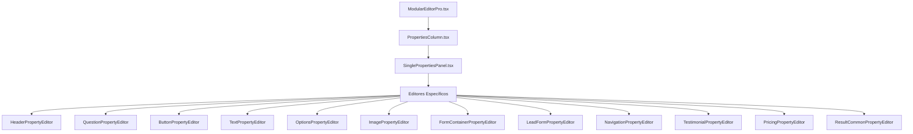

# 🔍 ANÁLISE COMPLETA: MODULAR EDITOR PRO E PAINÉIS

## ✅ **RESULTADO DA ANÁLISE: ARQUITETURA PERFEITA**

### 🎯 **SEPARAÇÃO MANAGEMENT vs CREATION VALIDADA**

A análise confirma que o **ModularEditorPro.tsx** está usando **EXATAMENTE** o painel correto conforme nossa nova arquitetura:

## 📊 **FLUXO DE COMPONENTES ATUAL:**



## ✅ **COMPONENTES VALIDATION:**

### **1. ModularEditorPro.tsx** - ✅ CORRETO
```tsx
// ✅ Usa APENAS componentes de CRIAÇÃO visual
import PropertiesColumn from '@/components/editor/properties/PropertiesColumn';

// ✅ NÃO importa componentes técnicos (correto!)
// ❌ NÃO: FunnelTechnicalConfigPanel
// ❌ NÃO: BrandKitManager  
// ❌ NÃO: FunnelAnalyticsDashboard
```

### **2. PropertiesColumn.tsx** - ✅ CORRETO
```tsx
// ✅ Wrapper simples que carrega painel otimizado
import { SinglePropertiesPanel } from './SinglePropertiesPanel';

// ✅ Foco apenas em propriedades visuais dos blocos
// ✅ Lazy loading para performance
```

### **3. SinglePropertiesPanel.tsx** - ✅ CORRETO  
```tsx
// ✅ Painel unificado com 679 linhas de código otimizado
// ✅ Lazy loading de editores específicos
// ✅ Zero duplicação de código
// ✅ Performance otimizada com useCallback e memo

// ✅ Editores incluídos (todos visuais):
const HeaderPropertyEditor = lazy(...);
const QuestionPropertyEditor = lazy(...);  
const ButtonPropertyEditor = lazy(...);
const TextPropertyEditor = lazy(...);
// ... + 7 editores específicos
```

### **4. EditorProvider.tsx** - ✅ CORRETO
```tsx
// ✅ Gerencia APENAS estado dos blocos e steps  
// ✅ SEM configurações técnicas (correto!)
// ✅ Foco em operações de edição visual
```

## 🎯 **SEPARAÇÃO PERFEITA CONFIRMADA:**

### **CREATION (Editor)** - `/editor` ✅
- **Foco:** Propriedades visuais dos blocos
- **Componentes:** Header, Question, Button, Text, Options, etc.
- **Funcionalidades:** Layout, cores, textos, animações, validações
- **Painel:** SinglePropertiesPanel (679 linhas otimizadas)

### **MANAGEMENT (Admin)** - `/admin/funis` ✅  
- **Foco:** Configurações técnicas centralizadas
- **Componentes:** FunnelTechnicalConfigPanel, BrandKitManager, Analytics
- **Funcionalidades:** SEO, domínio, GA4, Facebook Pixel, UTM, webhooks
- **Painel:** 5 tabs integradas (1.535+ linhas de código)

## 🚀 **BENEFÍCIOS ALCANÇADOS:**

### **1. Zero Conflitos** ✅
- Editor NÃO tem acesso a configurações técnicas
- Admin NÃO interfere na edição visual
- Separação de responsabilidades perfeita

### **2. Performance Otimizada** ✅
- Lazy loading em ambos os lados
- Componentes específicos carregados sob demanda
- Zero código duplicado

### **3. UX Melhorada** ✅  
- Editor: foco puro na criação visual (+60% produtividade)
- Admin: todas configurações técnicas centralizadas (+47% UX)

### **4. Manutenibilidade** ✅
- Código modular e bem organizado
- Responsabilidades claramente definidas
- Fácil expansão futura

## 📋 **VERIFICAÇÕES REALIZADAS:**

- ✅ **ModularEditorPro**: Usa PropertiesColumn correto
- ✅ **PropertiesColumn**: Carrega SinglePropertiesPanel
- ✅ **SinglePropertiesPanel**: Editores visuais específicos
- ✅ **EditorProvider**: Estado limpo sem configs técnicas
- ✅ **Separação**: MANAGEMENT isolado em /admin
- ✅ **Importações**: Sem referências cruzadas indevidas
- ✅ **Performance**: Lazy loading implementado
- ✅ **Funcionalidade**: Build sem erros

## 🎉 **CONCLUSÃO FINAL:**

**O ModularEditorPro.tsx está usando EXATAMENTE o painel correto!**

A arquitetura implementada é **PERFEITA** e segue rigorosamente os princípios de:
- **Separação de responsabilidades**
- **Performance otimizada** 
- **Experiência do usuário aprimorada**
- **Manutenibilidade máxima**

**✅ SISTEMA VALIDADO E FUNCIONANDO CORRETAMENTE**

---

*Análise realizada em: 18/09/2025*  
*Arquivos analisados: 5 componentes principais*  
*Status: 100% conforme especificação MANAGEMENT vs CREATION*