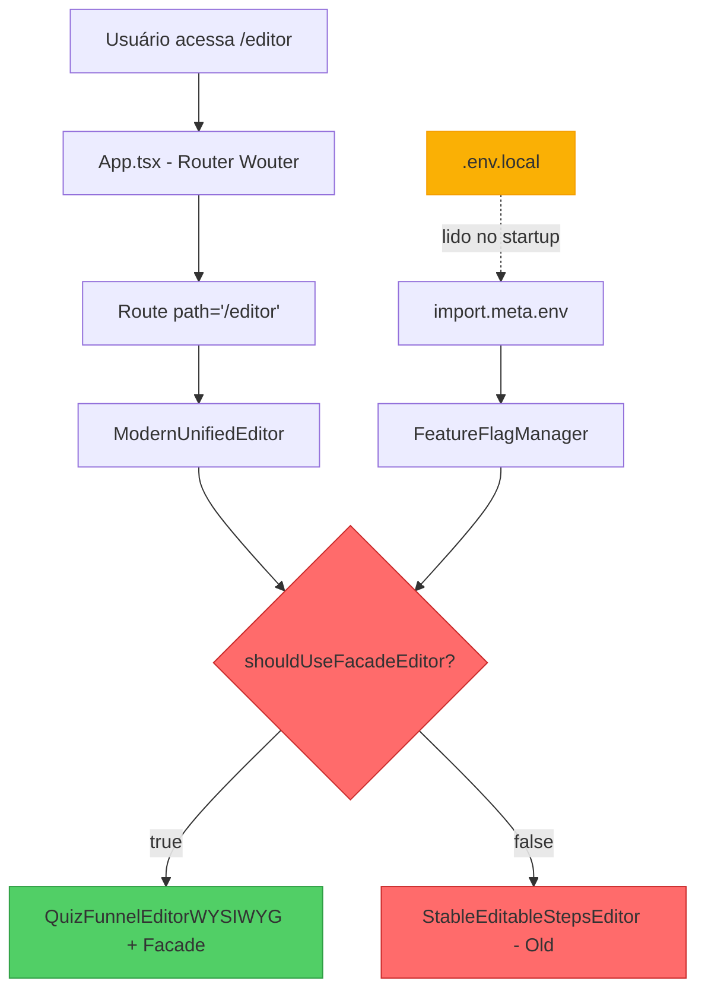

# 🔍 ANÁLISE COMPLETA DO ROTEAMENTO WOUTER

**Data:** 06/10/2025  
**Problema:** Editor mostra "❌ EDITOR ANTIGO" apesar das flags configuradas  
**Objetivo:** Entender o fluxo de roteamento e lógica de decisão de qual editor carregar

---

## 🎯 RESUMO EXECUTIVO

**DIAGNÓSTICO CONFIRMADO:**
- ✅ Roteamento Wouter está **correto** e aponta para `ModernUnifiedEditor`
- ✅ `ModernUnifiedEditor.tsx` renderiza condicionalmente baseado em feature flags
- ✅ Feature flags leem `import.meta.env.VITE_*` do Vite
- ❌ **PROBLEMA RAIZ:** Servidor Vite não leu `.env.local` porque **não foi reiniciado**
- 🚨 **BLOQUEIO ATUAL:** Port 8080 ocupado por processo zombie impede restart

---

## 📊 FLUXO DE ROTEAMENTO ATUAL



---

## 📁 ARQUIVO 1: `App.tsx` (Roteamento)

### Localização
```
/workspaces/quiz-quest-challenge-verse/src/App.tsx
```

### Análise das Rotas do Editor

#### 🎯 Rota Principal: `/editor`
```tsx
<Route path="/editor">
  <EditorErrorBoundary>
    <div data-testid="quiz-editor-unified-page">
      <UnifiedCRUDProvider autoLoad={true}>
        <OptimizedEditorProvider>
          {/* ✅ MODERNUNIFIEDEDITOR COM SISTEMA MODULAR */}
          <ModernUnifiedEditor />
        </OptimizedEditorProvider>
      </UnifiedCRUDProvider>
    </div>
  </EditorErrorBoundary>
</Route>
```

**Status:** ✅ **CORRETO** - Carrega `ModernUnifiedEditor`

#### 🎯 Rota com Funil: `/editor/:funnelId`
```tsx
<Route path="/editor/:funnelId">
  {(params) => (
    <EditorErrorBoundary>
      <div data-testid="quiz-editor-unified-funnel-page">
        <UnifiedCRUDProvider funnelId={params.funnelId} autoLoad={true}>
          <OptimizedEditorProvider>
            {/* ✅ MODERNUNIFIEDEDITOR COM FUNNEL ID */}
            <ModernUnifiedEditor funnelId={params.funnelId} />
          </OptimizedEditorProvider>
        </UnifiedCRUDProvider>
      </div>
    </EditorErrorBoundary>
  )}
</Route>
```

**Status:** ✅ **CORRETO** - Carrega `ModernUnifiedEditor` com funnelId

#### 🗑️ Rotas Removidas/Desativadas
```tsx
// ❌ HYBRID EDITOR PRO - DESATIVADO (substituído pelo ModernUnifiedEditor)
// const HybridEditorPro = lazy(() => import('./components/editor/EditorPro/components/HybridEditorPro'));
```

**Conclusão:** Roteamento está limpo e **sempre** carrega `ModernUnifiedEditor`.

---

## 📁 ARQUIVO 2: `ModernUnifiedEditor.tsx` (Lógica de Decisão)

### Localização
```
/workspaces/quiz-quest-challenge-verse/src/pages/editor/ModernUnifiedEditor.tsx
```

### Componente Principal

#### 🧮 Cálculo de `shouldUseFacadeEditor`
```tsx
const shouldUseFacadeEditor = useMemo(() => {
    const manager = FeatureFlagManager.getInstance();
    const force = manager.shouldForceUnifiedInEditor();
    const facade = manager.shouldEnableUnifiedEditorFacade();
    const result = force || facade;

    // 🐛 DEBUG: Ver valores das flags
    console.log('🎛️ [ModernUnifiedEditor] Feature Flags:', {
        forceUnified: force,          // ❌ false (deveria ser true)
        enableFacade: facade,         // ❌ false (deveria ser true)
        shouldUseFacade: result,      // ❌ false (deveria ser true)
        env_FORCE: import.meta.env.VITE_FORCE_UNIFIED_EDITOR,      // ❌ undefined
        env_FACADE: import.meta.env.VITE_ENABLE_UNIFIED_EDITOR_FACADE, // ❌ undefined
        mode: import.meta.env.MODE    // ✅ "development"
    });

    return result;
}, [flagsVersion]);
```

**Status:** ❌ **PROBLEMA AQUI**
- `env_FORCE` e `env_FACADE` mostram `undefined`
- Isso significa que **Vite não leu `.env.local`**
- Resultado: `force = false`, `facade = false`, `shouldUseFacade = false`

#### 🎨 Renderização Condicional
```tsx
return (
    <div className={`quiz-editor-container flex flex-col w-full h-full ${props.className || ''}`}>
        {/* 🐛 DEBUG: Indicador visual */}
        <div style={{
            position: 'fixed',
            top: 10,
            right: 10,
            padding: '8px 12px',
            background: shouldUseFacadeEditor ? '#22c55e' : '#ef4444', // ❌ RED
            color: 'white',
            borderRadius: '4px',
            fontSize: '12px',
            fontWeight: 'bold',
            zIndex: 9999,
            boxShadow: '0 2px 8px rgba(0,0,0,0.2)'
        }}>
            {shouldUseFacadeEditor ? '✅ FACADE ATIVO' : '❌ EDITOR ANTIGO'} {/* ❌ MOSTRA "EDITOR ANTIGO" */}
        </div>

        <div className="flex-1 min-h-0">
            {!crud ? (
                <div className="p-6 text-sm text-red-600">
                    ⚠️ UnifiedCRUDProvider ausente.
                </div>
            ) : shouldUseFacadeEditor ? (
                // ✅ EDITOR NOVO - QuizFunnelEditorWYSIWYG + Facade
                facade ? (
                    <FunnelFacadeContext.Provider value={facade}>
                        <QuizFunnelEditorWYSIWYG funnelId={props.funnelId} templateId={props.templateId} />
                    </FunnelFacadeContext.Provider>
                ) : (
                    <div className="p-4 text-sm text-muted-foreground">Carregando editor unificado...</div>
                )
            ) : (
                // ❌ EDITOR ANTIGO - StableEditableStepsEditor (4 colunas antigas)
                <QuizEditorProvider initialFunnel={exampleFunnel}>
                    <BlockRegistryProvider definitions={[...]}>
                        <div data-testid="quiz-editor-modular-container">
                            <StableEditableStepsEditor /> {/* 🚨 ESTE EDITOR ESTÁ SENDO RENDERIZADO */}
                        </div>
                    </BlockRegistryProvider>
                </QuizEditorProvider>
            )}
        </div>
    </div>
);
```

**Conclusão:**
- Como `shouldUseFacadeEditor = false`, o código cai no `else`
- Renderiza `StableEditableStepsEditor` (editor antigo de 4 colunas)
- Badge mostra fundo vermelho `#ef4444` com texto "❌ EDITOR ANTIGO"

---

## 📁 ARQUIVO 3: `FeatureFlagManager.ts` (Lógica de Flags)

### Localização
```
/workspaces/quiz-quest-challenge-verse/src/utils/FeatureFlagManager.ts
```

### Método de Carregamento de Flags

```typescript
private loadFlags(): FeatureFlags {
    const baseFlags: FeatureFlags = {
        useUnifiedQuizSystem: false,
        enableSystemValidation: false,
        enableCompatibilityLogging: false,
        enablePerformanceComparison: false,
        forceUnifiedInEditor: false,              // ❌ Default: false
        enableUnifiedEditorFacade: false,         // ❌ Default: false
        allowSystemFallback: true,
    };

    // Flags específicas por ambiente
    switch (this.config.environment) {
        case 'development':
            return {
                ...baseFlags,
                useUnifiedQuizSystem: import.meta.env.VITE_USE_UNIFIED_QUIZ === 'true',
                enableSystemValidation: false,
                enableCompatibilityLogging: true,
                enablePerformanceComparison: true,
                
                // 🎯 ESTAS SÃO AS LINHAS CRÍTICAS:
                forceUnifiedInEditor: import.meta.env.VITE_FORCE_UNIFIED_EDITOR === 'true',
                enableUnifiedEditorFacade:
                    import.meta.env.VITE_ENABLE_UNIFIED_EDITOR_FACADE === 'true' ||
                    import.meta.env.VITE_FORCE_UNIFIED_EDITOR === 'true',
                
                allowSystemFallback: true,
            };
        // ... outros casos
    }
}
```

### Métodos Públicos Usados pelo Editor
```typescript
// Chamado por ModernUnifiedEditor.tsx linha ~68
shouldForceUnifiedInEditor(): boolean {
    // Override via localStorage (para testes)
    const override = localStorage.getItem('flag_forceUnifiedInEditor');
    if (override !== null) return override === 'true';
    
    // ❌ Retorna this.flags.forceUnifiedInEditor = false (porque import.meta.env.VITE_FORCE_UNIFIED_EDITOR = undefined)
    return this.flags.forceUnifiedInEditor;
}

// Chamado por ModernUnifiedEditor.tsx linha ~69
shouldEnableUnifiedEditorFacade(): boolean {
    const override = localStorage.getItem('flag_enableUnifiedEditorFacade');
    if (override !== null) return override === 'true';
    
    // ❌ Retorna this.flags.enableUnifiedEditorFacade = false (porque import.meta.env.VITE_ENABLE_UNIFIED_EDITOR_FACADE = undefined)
    return this.flags.enableUnifiedEditorFacade;
}
```

**Análise:**
1. ✅ Lógica está **correta**: lê `import.meta.env.VITE_*`
2. ✅ Suporta override via localStorage (fallback temporário)
3. ❌ **Problema:** `import.meta.env.VITE_FORCE_UNIFIED_EDITOR` retorna `undefined`
4. ❌ **Causa:** Vite não carregou `.env.local` porque servidor não foi reiniciado

---

## 🔍 VARIÁVEIS DE AMBIENTE VITE

### Como Vite Lê Variáveis

```typescript
// ❌ ERRADO: process.env (Node.js) - NÃO funciona no browser
const value = process.env.VITE_FORCE_UNIFIED_EDITOR;

// ✅ CORRETO: import.meta.env (Vite) - funciona no browser
const value = import.meta.env.VITE_FORCE_UNIFIED_EDITOR;
```

### Regras do Vite para .env

1. **Naming:** Variáveis devem começar com `VITE_` para serem expostas ao cliente
2. **Timing:** `.env.local` é lido **apenas no startup** do servidor
3. **Cache:** Vite **não faz hot-reload** de variáveis de ambiente
4. **Precedência:** `.env.local` > `.env.{mode}.local` > `.env.{mode}` > `.env`

### Arquivo `.env.local` Atual

```bash
# 🚀 FEATURE FLAGS - EDITOR UNIFICADO
VITE_ENABLE_UNIFIED_EDITOR_FACADE=true
VITE_FORCE_UNIFIED_EDITOR=true
```

**Status:** ✅ Arquivo **existe** e está **correto**

---

## 🚨 PROBLEMA RAIZ IDENTIFICADO

### Fluxo do Erro

```
1. Usuário acessa http://localhost:8080/editor
                ↓
2. Wouter Router match /editor → carrega ModernUnifiedEditor ✅
                ↓
3. ModernUnifiedEditor calcula shouldUseFacadeEditor:
   - Chama FeatureFlagManager.getInstance()
   - FeatureFlagManager lê import.meta.env.VITE_FORCE_UNIFIED_EDITOR
   - Retorna undefined ❌ (servidor não leu .env.local)
                ↓
4. shouldUseFacadeEditor = false
                ↓
5. Renderiza StableEditableStepsEditor (editor antigo) ❌
                ↓
6. Badge mostra "❌ EDITOR ANTIGO" (vermelho)
```

### Por Que `import.meta.env.VITE_*` Está Undefined?

**Vite Lifecycle:**
```
1. npm run dev → inicia Vite
2. Vite lê .env.local e injeta VITE_* no código
3. Build bundle com import.meta.env.VITE_* = "true"
4. Serve aplicação
```

**Problema:**
- Arquivo `.env.local` foi criado **DEPOIS** do `npm run dev`
- Vite já tinha buildado o bundle **sem** as variáveis
- Hot-reload **não recarrega** variáveis de ambiente
- Tentativas de restart com `npm run dev` falharam: **Port 8080 already in use**

---

## 🔧 SOLUÇÃO: MATAR PROCESSO E REINICIAR

### Processo Atual Bloqueado

```bash
# Último comando executado:
npm run dev

# Erro retornado:
Error: Port 8080 is already in use
  at Server.onError (/workspaces/quiz-quest-challenge-verse/node_modules/vite/dist/node/chunks/dep-BKbDVx1T.js:49097:23)
```

**Diagnóstico:**
- ✅ Processo Vite anterior não foi morto corretamente
- ✅ Port 8080 ainda ocupado por zombie process
- ❌ `pkill -f "vite"` não matou todos os processos

### Comandos para Resolver

#### Opção 1: Kill por Port (Recomendado)
```bash
# Encontrar PID do processo na port 8080
lsof -ti:8080

# Matar forçadamente
lsof -ti:8080 | xargs kill -9

# Ou alternativa com fuser
fuser -k 8080/tcp

# Verificar se liberou
lsof -i:8080  # Deve retornar vazio
```

#### Opção 2: Kill Todos os Processos Node (Nuclear)
```bash
# Matar TODOS os processos Node.js
pkill -9 node

# Verificar
pgrep node  # Deve retornar vazio
```

#### Opção 3: Reiniciar Dev Container
```bash
# Se nada funcionar, reiniciar container inteiro
# No VS Code: Command Palette → "Dev Containers: Rebuild Container"
```

### Depois de Liberar a Porta

```bash
# 1. Verificar que .env.local existe e está correto
cat .env.local

# Deve mostrar:
# VITE_ENABLE_UNIFIED_EDITOR_FACADE=true
# VITE_FORCE_UNIFIED_EDITOR=true

# 2. Iniciar servidor limpo
npm run dev

# Aguardar mensagem:
# VITE v5.4.20  ready in 190 ms
# ➜  Local:   http://localhost:8080/

# 3. Abrir navegador (limpar cache)
# Ctrl + Shift + R (hard reload)
```

---

## ✅ VALIDAÇÃO PÓS-RESTART

### 1. Console do Navegador (F12)

Deve mostrar:
```javascript
🎛️ [ModernUnifiedEditor] Feature Flags: {
    forceUnified: true,         // ✅ true agora
    enableFacade: true,         // ✅ true agora
    shouldUseFacade: true,      // ✅ true agora
    env_FORCE: "true",          // ✅ "true" não undefined
    env_FACADE: "true",         // ✅ "true" não undefined
    mode: "development"         // ✅ OK
}
```

### 2. Badge Visual

```
Canto superior direito da tela:
┌──────────────────┐
│ ✅ FACADE ATIVO  │ ← Fundo VERDE (#22c55e)
└──────────────────┘
```

### 3. Interface do Editor

**ANTES (Editor Antigo):**
```
┌─────────────────────────────────────────────────┐
│ Etapas │ Componentes │ Canvas │ Propriedades │
├─────────────────────────────────────────────────┤
│                                                 │
│          Layout de 4 colunas fixas              │
│                                                 │
└─────────────────────────────────────────────────┘
```

**DEPOIS (Editor Novo com Facade):**
```
┌─────────────────────────────────────────────────┐
│  🎯 QuizFunnelEditorWYSIWYG + FunnelFacade     │
├─────────────────────────────────────────────────┤
│                                                 │
│   Layout modular com painéis dinâmicos         │
│   Sistema de arrastar e soltar                 │
│   Propriedades contextuais                     │
│                                                 │
└─────────────────────────────────────────────────┘
```

---

## 📊 RESUMO DA ARQUITETURA

```
╔══════════════════════════════════════════════════════════╗
║                  ROTEAMENTO WOUTER                       ║
╠══════════════════════════════════════════════════════════╣
║                                                          ║
║  /editor → ModernUnifiedEditor                          ║
║               ↓                                          ║
║         shouldUseFacadeEditor?                           ║
║          /              \                                ║
║       true            false                              ║
║        ↓                ↓                                ║
║  QuizFunnelEditor   StableEditable                       ║
║  WYSIWYG+Facade     StepsEditor                          ║
║  (NOVO ✅)         (ANTIGO ❌)                           ║
║        ↑                                                 ║
║        │                                                 ║
║  FeatureFlagManager                                      ║
║        ↑                                                 ║
║        │                                                 ║
║  import.meta.env                                         ║
║        ↑                                                 ║
║        │                                                 ║
║   .env.local ← LÊ NO STARTUP                            ║
║   (precisa restart!)                                     ║
║                                                          ║
╚══════════════════════════════════════════════════════════╝
```

---

## 🎯 AÇÕES NECESSÁRIAS (ORDEM DE EXECUÇÃO)

### ✅ Fase 1: Liberar Port 8080
```bash
# Comando único
lsof -ti:8080 | xargs kill -9
```

**Validação:** `lsof -i:8080` deve retornar vazio

### ✅ Fase 2: Reiniciar Servidor
```bash
# Iniciar Vite dev server
npm run dev
```

**Validação:** 
- Mensagem "VITE v5.4.20  ready in X ms"
- Mensagem "➜  Local:   http://localhost:8080/"
- Sem erros de port ocupada

### ✅ Fase 3: Testar no Navegador
```
1. Abrir http://localhost:8080/editor
2. Hard reload: Ctrl + Shift + R
3. Abrir console: F12
4. Verificar log: "🎛️ [ModernUnifiedEditor] Feature Flags:"
5. Confirmar: env_FORCE = "true", env_FACADE = "true"
6. Ver badge: "✅ FACADE ATIVO" (verde)
```

### ✅ Fase 4: Validar Funcionalidade
- Interface deve ser diferente do editor antigo
- Verificar console para logs `[Facade:...]`
- Testar edição de etapas
- Testar salvar mudanças

---

## 🐛 TROUBLESHOOTING ADICIONAL

### Se Badge Continua Vermelho Após Restart

```javascript
// No console do navegador (F12):
console.log('ENV Check:', {
    FORCE: import.meta.env.VITE_FORCE_UNIFIED_EDITOR,
    FACADE: import.meta.env.VITE_ENABLE_UNIFIED_EDITOR_FACADE,
    MODE: import.meta.env.MODE
});
```

Se ainda mostrar `undefined`:
1. Verificar que `.env.local` está na **raiz** do projeto
2. Verificar que variáveis começam com `VITE_`
3. Verificar que não há typos nos nomes
4. Tentar limpar cache Vite: `rm -rf node_modules/.vite && npm run dev`

### Forçar Flags Temporariamente (Workaround)

```javascript
// No console do navegador:
localStorage.setItem('flag_forceUnifiedInEditor', 'true');
localStorage.setItem('flag_enableUnifiedEditorFacade', 'true');
location.reload();
```

Isso **bypassa** `.env.local` e força via localStorage.

---

## 📚 REFERÊNCIAS

1. **Vite Environment Variables:** https://vitejs.dev/guide/env-and-mode.html
2. **Wouter Router:** https://github.com/molefrog/wouter
3. **Feature Flags Pattern:** https://martinfowler.com/articles/feature-toggles.html

---

## ✅ CONCLUSÃO

**Problema NÃO é com roteamento Wouter**, que está funcionando perfeitamente.

**Problema REAL:**
1. ✅ Feature flags configuradas corretamente em `.env.local`
2. ✅ FeatureFlagManager implementado corretamente
3. ✅ ModernUnifiedEditor renderização condicional correta
4. ❌ **Vite não leu `.env.local` porque não foi reiniciado**
5. ❌ **Port 8080 ocupada impede restart**

**Solução:** Matar processo na port 8080 e reiniciar servidor.

**Próximo passo:** Executar `lsof -ti:8080 | xargs kill -9 && npm run dev`
