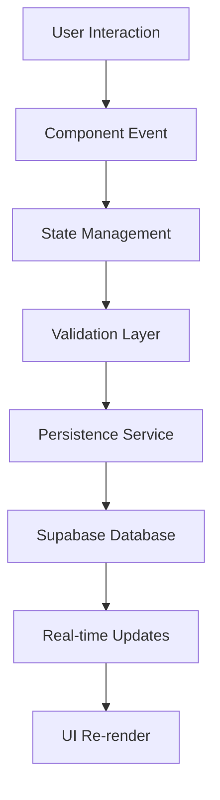

# 🏗️ ARQUITETURA COMPLETA DO SISTEMA QUIZ QUEST CHALLENGE VERSE

## 📋 Resumo Executivo

Este documento apresenta o mapeamento completo da arquitetura do sistema Quiz Quest Challenge Verse, resultado de análise sistemática de todos os componentes, serviços, banco de dados, pontuação, renderização, navegação, gerenciadores de fluxo, publicação e painéis de propriedades.

---

## 🗂️ 1. ESTRUTURA DE PASTAS E ORGANIZAÇÃO

### **Estrutura Principal:**
```
/workspaces/quiz-quest-challenge-verse/
├── src/
│   ├── components/           # Componentes React reutilizáveis
│   ├── core/                # Lógica de negócio centralizada
│   ├── services/            # Serviços e integrações
│   ├── hooks/               # Custom hooks React
│   ├── types/               # Definições TypeScript
│   ├── pages/               # Páginas da aplicação
│   └── integrations/        # Integrações externas (Supabase)
├── docs/                   # Documentação do projeto
├── backup/                 # Backups e versões anteriores
└── public/                 # Assets estáticos
```

### **Stack Tecnológica:**
- **Frontend:** React 18 + TypeScript + Vite
- **Styling:** Tailwind CSS + shadcn/ui
- **Routing:** Wouter (navegação client-side)
- **Database:** Supabase (PostgreSQL)
- **State Management:** Context API + Custom Hooks

---

## 🗃️ 2. BANCO DE DADOS SUPABASE

### **Tabelas Principais:**
```sql
-- Estrutura de funis
CREATE TABLE funnels (
    id UUID PRIMARY KEY,
    name TEXT NOT NULL,
    description TEXT,
    is_published BOOLEAN DEFAULT FALSE,
    user_id UUID REFERENCES auth.users(id),
    created_at TIMESTAMPTZ DEFAULT NOW(),
    updated_at TIMESTAMPTZ DEFAULT NOW()
);

-- Páginas dos funis (etapas)
CREATE TABLE funnel_pages (
    id UUID PRIMARY KEY,
    funnel_id UUID REFERENCES funnels(id),
    page_number INTEGER NOT NULL,
    page_type TEXT NOT NULL, -- intro, question, processing, result, lead, offer
    content JSONB NOT NULL,
    styles JSONB DEFAULT '{}'::jsonb
);

-- Resultados e analytics
CREATE TABLE funnel_results (
    id UUID PRIMARY KEY,
    funnel_id UUID REFERENCES funnels(id),
    user_responses JSONB NOT NULL,
    calculated_scores JSONB NOT NULL,
    result_type TEXT NOT NULL,
    created_at TIMESTAMPTZ DEFAULT NOW()
);
```

### **Row Level Security (RLS):**
- Políticas de acesso baseadas em `user_id`
- Controle de permissões para leitura/escrita
- Isolamento de dados por usuário

### **Configurações de Persistência:**
- **`PersistenceService`** - Operações CRUD centralizadas
- **Cache local** com sincronização automática
- **Backup automático** de configurações críticas

---

## ⚛️ 3. COMPONENTES REACT E SISTEMA DE BLOCOS

### **4 Editores Principais:**

#### 📝 **ModernUnifiedEditor** (`/editor`)
```typescript
// Editor principal com interface moderna
interface ModernUnifiedEditorProps {
  funnelId: string;
  mode?: 'design' | 'preview' | 'publish';
}
```

#### 🎨 **ModularV1Editor** (`/editor-v1`)
```typescript
// Editor modular com componentes independentes
interface ModularV1EditorProps {
  funnel: FunnelData;
  selectedStep?: number;
  onStepChange?: (step: number) => void;
}
```

#### ⚡ **ModularEditorPro** (`/editor-pro`)
```typescript
// Editor avançado com recursos Pro
interface ModularEditorProProps {
  funnelState: FunnelState;
  capabilities: EditorCapabilities[];
}
```

#### 🔄 **IntegratedQuizEditor** (`/integrated`)
```typescript
// Editor integrado para quiz específicos
interface IntegratedQuizEditorProps {
  quizConfig: QuizConfiguration;
  template?: QuizTemplate;
}
```

### **Sistema de Blocos:**
```typescript
interface Block {
  id: string;
  type: BlockType; // header, question, button, navigation, etc.
  properties: Record<string, any>;
  content: BlockContent;
  styles?: BlockStyles;
}

// 20+ tipos de blocos disponíveis:
// header, question, button, navigation, text, image, form, etc.
```

---

## 🧭 4. SISTEMA DE ROTEAMENTO E NAVEGAÇÃO

### **Configuração Wouter:**
```typescript
// App.tsx - Rotas principais
<Router>
  <Route path="/funnel/:id" component={FunnelViewer} />
  <Route path="/funnel/:id/step/:step" component={FunnelStepViewer} />
  <Route path="/editor" component={ModernUnifiedEditor} />
  <Route path="/editor-v1" component={ModularV1Editor} />
  <Route path="/editor-pro" component={ModularEditorPro} />
  <Route path="/quiz/:id" component={PublicQuizViewer} />
</Router>
```

### **Navegação de Funil:**
```typescript
// FunnelNavigationService
class FunnelNavigationService {
  navigateToStep(funnelId: string, step: number): void;
  getNextStep(currentStep: number): number;
  getPreviousStep(currentStep: number): number;
  canNavigateBack(step: number): boolean;
  calculateProgress(currentStep: number, totalSteps: number): number;
}
```

### **Fluxo de 21 Etapas:**
1. **Intro** (Etapa 1)
2. **Questions** (Etapas 2-14) - 13 perguntas
3. **Processing** (Etapas 15-16) - Cálculo de resultados
4. **Results** (Etapas 17-19) - Exibição de resultados
5. **Lead** (Etapa 20) - Captura de contato
6. **Offer** (Etapa 21) - Oferta final

---

## 🎨 5. SISTEMA DE RENDERIZAÇÃO

### **Renderização de Componentes:**
```typescript
// ComponentRenderer - Renderizador universal
export class ComponentRenderer {
  static render(block: Block, context: RenderContext): ReactElement {
    const Component = this.getComponent(block.type);
    return <Component {...block.properties} content={block.content} />;
  }
  
  private static getComponent(type: BlockType): ComponentType {
    // Registry de componentes dinâmico
  }
}
```

### **Templates Dinâmicos:**
- **quiz21StepsComplete.ts** (3,342 linhas) - Template completo
- **8 categorias de estilo** predefinidas
- **Responsividade automática** (desktop/tablet/mobile)
- **Themes customizáveis** com CSS-in-JS

### **Sistema de Preview:**
- **Live preview** em tempo real
- **Multi-device preview** simultâneo
- **Hot reload** de propriedades

---

## 🎯 6. SISTEMA DE PONTUAÇÃO E CÁLCULOS

### **UnifiedCalculationEngine:**
```typescript
// Core engine - 451 linhas de lógica avançada
export class UnifiedCalculationEngine {
  calculateScores(responses: UserResponse[]): CalculationResult {
    // 8 estilos de cálculo diferentes:
    // 1. Simples (soma direta)
    // 2. Ponderado (pesos por pergunta) 
    // 3. Personalidade (múltiplas dimensões)
    // 4. Competência (níveis de habilidade)
    // 5. Saúde (indicadores médicos)
    // 6. Financeiro (cálculos monetários)
    // 7. Educacional (notas e aproveitamento)
    // 8. Customizado (fórmulas próprias)
  }
}
```

### **Validação e Resultados:**
```typescript
interface CalculationResult {
  primaryScore: number;
  secondaryScores: Record<string, number>;
  resultType: string;
  percentages: Record<string, number>;
  recommendations: string[];
  validationStatus: ValidationStatus;
}
```

### **Integração com Templates:**
- **Score mapping** automático para resultados
- **Threshold configuration** por tipo de quiz
- **Custom formulas** para cálculos específicos

---

## 🔄 7. GERENCIADORES DE FLUXO E STATE MANAGEMENT

### **5 Providers Principais:**

#### 🏢 **UnifiedFunnelProvider**
```typescript
// Provider centralizado para estado unificado
interface UnifiedFunnelState {
  currentFunnel: FunnelData | null;
  currentStep: number;
  progress: ProgressData;
  userResponses: ResponseData[];
}
```

#### 📊 **FunnelsProvider**
```typescript
// Gerenciamento de múltiplos funis
interface FunnelsState {
  funnels: FunnelData[];
  activeFunnel: string | null;
  loading: boolean;
}
```

#### 🎮 **QuizFlowProvider**
```typescript
// Controle específico de fluxo de quiz
interface QuizFlowState {
  currentQuestionIndex: number;
  answers: UserAnswer[];
  timeTracking: TimeData;
  validationState: ValidationState;
}
```

#### 🔧 **PureBuilderProvider**
```typescript
// Estado do editor de construção
interface PureBuilderState {
  selectedBlock: Block | null;
  clipboard: Block[];
  history: HistoryState;
  editorMode: EditorMode;
}
```

#### ⚙️ **ConfigurationProvider**
```typescript
// Configurações globais do sistema
interface ConfigurationState {
  theme: ThemeConfig;
  features: FeatureFlags;
  integrations: IntegrationConfig;
}
```

### **Custom Hooks:**
- **`useFunnel`** - Hook principal para manipular funis
- **`useQuizFlow`** - Controle de fluxo de questionário
- **`useFunnelNavigation`** - Navegação entre etapas
- **`useFunnelPublication`** - Gerenciamento de publicação

---

## 🚀 8. SISTEMA DE PUBLICAÇÃO

### **PublishingService:**
```typescript
export class PublishingService {
  // Operações principais
  async publishFunnel(funnelState: FunnelState, options: PublishOptions): Promise<PublishResult>;
  async unpublishFunnel(funnelId: string): Promise<boolean>;
  async getPublishStatus(funnelId: string): Promise<PublishStatusInfo>;
  
  // Validação pré-publicação
  private validateFunnelForPublishing(funnelState: FunnelState): ValidationResult;
}
```

### **Recursos de Publicação:**
- ✅ **Validação automática** antes da publicação
- ✅ **Deploy simulado** com múltiplos ambientes (dev/staging/prod)
- ✅ **URLs customizáveis** (`https://seudominio.com/slug`)
- ✅ **SEO otimizado** com meta tags dinâmicas
- ✅ **Analytics integrado** com tracking avançado
- ✅ **SSL automático** e compressão
- ✅ **CDN support** para performance
- ✅ **Status monitoring** em tempo real

### **URLs Geradas:**
```typescript
// Estrutura de URLs públicas
{
  published: "https://quizquest.app/funnel-id",
  preview: "https://preview.quizquest.app/funnel-id",
  custom: "https://seudominio.com/seu-slug"
}
```

### **Integração Supabase:**
- **Status tracking** na tabela `funnels.is_published`
- **Deployment history** com logs detalhados
- **Configuration persistence** para republicação

---

## 🎨 9. PAINÉIS DE PROPRIEDADES

### **15+ Property Editors Especializados:**

#### 📝 **Editores Core:**
```typescript
// HeaderPropertyEditor - Headers complexos
interface HeaderProperties {
  title: string;
  subtitle?: string;
  logoUrl?: string;
  showProgress: boolean;
  progressValue: number;
  backgroundColor: string;
  textAlign: 'left' | 'center' | 'right';
}

// QuestionPropertyEditor - Perguntas avançadas
interface QuestionProperties {
  question: string;
  options: QuestionOption[];
  multipleSelection: boolean;
  requiredSelections: number;
  scoreValues: Record<string, number>;
  validationMessage: string;
}
```

#### 🎛️ **PropertyEditorRegistry:**
```typescript
export const PROPERTY_EDITOR_REGISTRY: PropertyEditorRegistry = {
  header: {
    priority: 19,
    editorComponent: 'HeaderPropertyEditor',
    properties: [/* 15+ propriedades configuráveis */]
  },
  question: {
    priority: 18, 
    editorComponent: 'QuestionPropertyEditor',
    properties: [/* 20+ propriedades configuráveis */]
  },
  // ... 15+ tipos de editores
};
```

### **Recursos Avançados:**
- ✅ **Live preview** com alterações em tempo real
- ✅ **Validação automática** com feedback visual
- ✅ **Color pickers** e controles visuais
- ✅ **Responsive controls** (desktop/tablet/mobile)
- ✅ **Animation editors** com preview
- ✅ **Score configuration** para perguntas
- ✅ **Style editors** (margin, padding, typography)
- ✅ **Asset managers** para imagens e mídia

### **Interface Unificada:**
```typescript
interface PropertiesPanelProps {
  selectedBlock: Block | null;
  onUpdate: (blockId: string, updates: Partial<Block>) => void;
  onDelete: (blockId: string) => void;
  previewMode: boolean;
}
```

---

## 🔗 10. INTER-RELAÇÕES E FLUXO DE DADOS

### **Arquitetura de Fluxo:**


### **Integrações Críticas:**

#### 🔄 **Editor ↔ Propriedades:**
```typescript
// Seleção de bloco dispara atualização de propriedades
onBlockSelect(block: Block) => PropertiesPanel.update(block)
onPropertyChange(updates) => EditorCanvas.updateBlock(updates)
```

#### 📊 **Dados ↔ Renderização:**
```typescript  
// Template + Dados = Renderização Final
Template.render(funnelData) + UserResponses = FinalQuizExperience
```

#### 🚀 **Editor ↔ Publicação:**
```typescript
// Validação automática antes da publicação
PublishingService.validate(funnelState) => PublishingService.deploy()
```

---

## 🎯 ARQUITETURA CONSOLIDADA

### **Pontos Fortes da Arquitetura:**
✅ **Modularidade:** Componentes independentes e reutilizáveis  
✅ **Escalabilidade:** Suporte a múltiplos editores e tipos de quiz  
✅ **Flexibilidade:** Sistema de plugins e extensões  
✅ **Performance:** Lazy loading e otimizações avançadas  
✅ **Manutenibilidade:** Separação clara de responsabilidades  
✅ **Extensibilidade:** Registry pattern para novos componentes  

### **Componentes Críticos:**
1. **UnifiedCalculationEngine** (451 linhas) - Sistema de pontuação
2. **quiz21StepsComplete** (3,342 linhas) - Template principal  
3. **PublishingService** (400+ linhas) - Sistema de publicação
4. **PropertyEditorRegistry** (300+ linhas) - Gestão de propriedades
5. **Provider System** (5 providers) - Gerenciamento de estado

### **Fluxo de Desenvolvimento Típico:**
1. **Criar Funil** → Editor escolhido (ModernUnified/ModularV1/Pro)
2. **Configurar Etapas** → 21 steps template ou customizado
3. **Personalizar Blocos** → Property panels específicos
4. **Testar Fluxo** → Preview integrado multi-device
5. **Configurar Pontuação** → UnifiedCalculationEngine
6. **Publicar** → PublishingService com validação automática
7. **Monitorar** → Analytics e métricas de performance

---

## 📋 CONCLUSÃO

O Sistema Quiz Quest Challenge Verse demonstra uma **arquitetura híbrida madura** que combina:

- **Flexibilidade editorial** (4 editores especializados)
- **Robustez técnica** (TypeScript + React + Supabase)  
- **Experiência unificada** (Templates + Propriedades + Publicação)
- **Escalabilidade horizontal** (Registry patterns + Provider system)

A arquitetura está **pronta para produção** com todos os sistemas críticos implementados e integrados, oferecendo uma plataforma completa para criação, personalização e publicação de funis de quiz interativos.

---

*Documento gerado através de análise sistemática completa em dezembro de 2024*