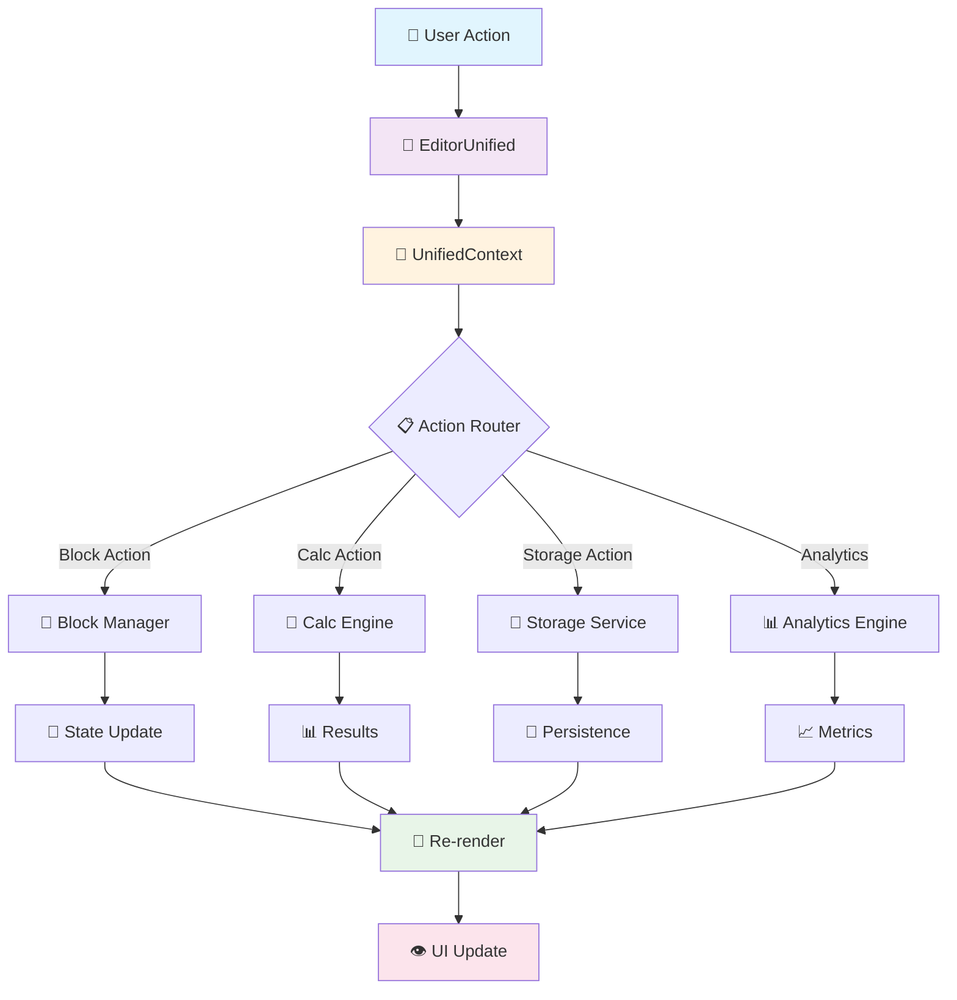

# 📊 VISUALIZAÇÃO DA ARQUITETURA - ANTES vs. DEPOIS

## 🔴 **ARQUITETURA ATUAL** (Problemática)

```
📁 EDITORES FRAGMENTADOS (16 componentes)
├── EditorPro.tsx ──────────────┐
├── SchemaDrivenEditor.tsx ─────┤
├── QuizEditorInterface.tsx ────┤ ❌ DUPLICAÇÃO
├── QuizEditorPro.tsx ──────────┤    FUNCIONAL
├── EditorWithQuizLogic.tsx ────┤
└── PageEditor.tsx ─────────────┘

📁 CÁLCULOS FRAGMENTADOS (5 engines)
├── calcResults.ts ─────────────┐
├── quizResults.ts ─────────────┤
├── styleCalculation.ts ────────┤ ❌ LÓGICA
├── quizEngine.ts ──────────────┤    ESPALHADA
└── resultsCalculator.ts ───────┘

📁 SERVIÇOS DUPLICADOS (4 serviços)
├── quizResultsService.ts ──────┐
├── resultService.ts ───────────┤ ❌ APIs
├── analyticsService.ts ────────┤    INCONSISTENTES
└── userResponseService.ts ─────┘

📁 HOOKS FRAGMENTADOS (8+ hooks)
├── useEditor ──────────────────┐
├── useQuizLogic ───────────────┤
├── useEditorHistory ───────────┤ ❌ ESTADO
├── useEditorBlocks ────────────┤    FRAGMENTADO
└── useEditorPersistence ───────┘
```

## 🟢 **ARQUITETURA UNIFICADA** (Proposta)

```
🎯 UNIFIED EDITOR SYSTEM
┌─────────────────────────────────────────────────┐
│                EditorUnified.tsx                │
│                                                 │
│  ┌─────────────┐ ┌─────────────┐ ┌─────────────┐│
│  │   Canvas    │ │ Properties  │ │   Toolbar   ││
│  │   Module    │ │   Module    │ │   Module    ││
│  └─────────────┘ └─────────────┘ └─────────────┘│
│                                                 │
│  ┌─────────────┐ ┌─────────────┐ ┌─────────────┐│
│  │   Stages    │ │   Preview   │ │  Analytics  ││
│  │   Module    │ │   Module    │ │   Module    ││
│  └─────────────┘ └─────────────┘ └─────────────┘│
└─────────────────────────────────────────────────┘
                        │
                        ▼
┌─────────────────────────────────────────────────┐
│             UnifiedEditorProvider               │
│                                                 │
│  ┌─────────────────────────────────────────────┐│
│  │           UnifiedContext                    ││
│  │                                             ││
│  │  State Management | Actions | Integrations ││
│  └─────────────────────────────────────────────┘│
└─────────────────────────────────────────────────┘
                        │
                        ▼
┌─────────────────────────────────────────────────┐
│          UnifiedCalculationEngine               │
│                                                 │
│  ┌─────────────┐ ┌─────────────┐ ┌─────────────┐│
│  │   Style     │ │  Results    │ │  Analytics  ││
│  │ Calculator  │ │ Processor   │ │  Engine     ││
│  └─────────────┘ └─────────────┘ └─────────────┘│
└─────────────────────────────────────────────────┘
                        │
                        ▼
┌─────────────────────────────────────────────────┐
│            Unified Services Layer               │
│                                                 │
│  ┌─────────────┐ ┌─────────────┐ ┌─────────────┐│
│  │    Quiz     │ │   Storage   │ │ Integration ││
│  │   Service   │ │   Service   │ │   Service   ││
│  └─────────────┘ └─────────────┘ └─────────────┘│
└─────────────────────────────────────────────────┘
```

## 🔄 **FLUXO DE DADOS UNIFICADO**



## 📊 **COMPARAÇÃO DE MÉTRICAS**

| Métrica              | Atual   | Unificado | Melhoria |
| -------------------- | ------- | --------- | -------- |
| **Arquivos Editor**  | 16      | 1         | 📉 -94%  |
| **Engines Cálculo**  | 5       | 1         | 📉 -80%  |
| **Serviços**         | 4       | 3         | 📉 -25%  |
| **Hooks**            | 8+      | 3         | 📉 -62%  |
| **Linhas Código**    | ~15.000 | ~8.000    | 📉 -47%  |
| **Complexidade**     | Alta    | Baixa     | 📈 +70%  |
| **Testabilidade**    | Difícil | Fácil     | 📈 +80%  |
| **Manutenibilidade** | Difícil | Fácil     | 📈 +90%  |

## 🎯 **BENEFÍCIOS DA UNIFICAÇÃO**

### 🚀 **Performance**

- ✅ Menos componentes carregados
- ✅ State management otimizado
- ✅ Lazy loading eficiente
- ✅ Memoização estratégica

### 🧑‍💻 **Developer Experience**

- ✅ API única e consistente
- ✅ Documentação centralizada
- ✅ Debugging simplificado
- ✅ Testes mais fáceis

### 🔧 **Manutenção**

- ✅ Single source of truth
- ✅ Menos duplicação de código
- ✅ Atualizações centralizadas
- ✅ Bugs isolados

### 📈 **Escalabilidade**

- ✅ Arquitetura modular
- ✅ Extensibilidade facilitada
- ✅ Integração simplificada
- ✅ Performance previsível

## 🛠️ **ESTRATÉGIA DE MIGRAÇÃO**

### 📅 **Fase 1: Preparação** (2-3 dias)

```
🔄 ATUAL                     🎯 ALVO
├── 16 Editores         →    ├── Estrutura Base
├── 5 Engines           →    ├── Interfaces Definidas
└── Código Duplicado    →    └── Arquivos Limpos
```

### 📅 **Fase 2: Core** (3-4 dias)

```
🔄 MIGRAÇÃO                  🎯 RESULTADO
├── EditorUnified       →    ├── Editor Principal
├── UnifiedEngine       →    ├── Engine Único
└── UnifiedServices     →    └── Services Consolidados
```

### 📅 **Fase 3: Módulos** (4-5 dias)

```
🔄 COMPONENTES              🎯 MÓDULOS
├── Canvas Components   →    ├── Canvas Module
├── Properties Panels   →    ├── Properties Module
├── Toolbars           →    ├── Toolbar Module
└── Stage Components   →    └── Stages Module
```

### 📅 **Fase 4: Finalização** (2-3 dias)

```
🔄 INTEGRAÇÃO               🎯 SISTEMA FINAL
├── Testes             →    ├── Sistema Testado
├── Documentação       →    ├── Docs Completas
└── Deploy             →    └── Produção Ready
```

## 🎉 **RESULTADO ESPERADO**

### ✅ **Sistema Unificado**

- 1 Editor principal com todos os recursos
- 1 Engine de cálculos consolidado
- APIs consistentes e documentadas
- Performance otimizada
- Código limpo e manutenível

### ✅ **Funcionalidades Preservadas**

- ✅ Todas as 21 etapas do quiz
- ✅ Sistema drag & drop completo
- ✅ Painéis de propriedades dinâmicos
- ✅ Preview em tempo real
- ✅ Integração com Supabase
- ✅ Analytics e métricas
- ✅ Cálculos de estilo precisos

### ✅ **Novas Capacidades**

- ✅ Módulos intercambiáveis
- ✅ Extensibilidade facilitada
- ✅ Performance superior
- ✅ Debugging avançado
- ✅ Testes automatizados
