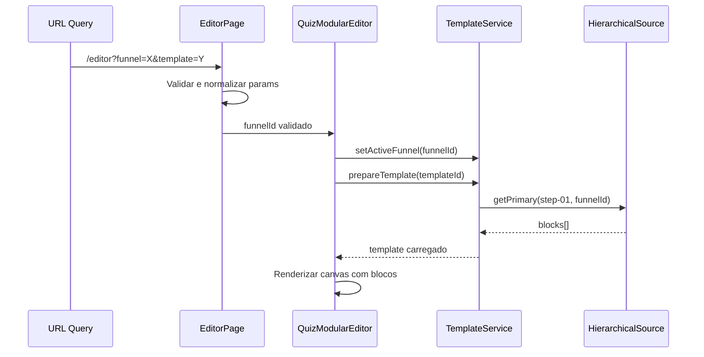

# 🔍 AUDITORIA COMPLETA - ROTA "/editor"

**Data:** 29 de Novembro de 2025  
**Versão:** 1.0  
**Escopo:** Análise técnica detalhada da rota "/editor" e componente QuizModularEditor

---

## 📊 RESUMO EXECUTIVO

### Arquitetura Atual
A rota `/editor` é gerenciada pelo seguinte fluxo:

```
/editor?funnel=quiz21StepsComplete&template
    ↓
EditorPage.tsx (src/pages/editor/EditorPage.tsx)
    ↓
EditorProvider (src/core/contexts/EditorContext)
    ↓
QuizModularEditor (src/components/editor/quiz/QuizModularEditor)
    ↓
├── useTemplateLoader (carrega estrutura do template)
├── useStepBlocksLoader (carrega blocos por step)
├── useWYSIWYGBridge (sincronização edição ao vivo)
├── TemplateService (fonte de dados canônica)
└── UnifiedTemplateLoader (hierarquia de fontes)
```

---

## 🎯 PARTE 1 - INVESTIGAÇÃO TÉCNICA DETALHADA

### 1.1 Análise do EditorPage.tsx

**Arquivo:** `src/pages/editor/EditorPage.tsx`

**Pontos Positivos:**
- ✅ Sanitização do parâmetro `template` (linha 48-62)
- ✅ Fallback para `quiz21StepsComplete` em dev/test (linha 76-86)
- ✅ Padronização de `?template=` para `?funnel=` (linha 98-110)
- ✅ ErrorBoundary envolvendo o editor (linha 113-121)

**Problemas Identificados:**
1. **P1-PARAM**: O parâmetro `funnelId` é construído a partir de múltiplas fontes (linha 67) que podem conflitar:
   ```typescript
   let funnelId = paramsWithId?.funnelId || funnelIdFromQuery || templateParam || undefined;
   ```
   Prioridade não é clara e pode causar carregamento incorreto.

2. **P2-HISTORY**: A modificação do histórico via `replaceState` (linha 79) pode causar loops em alguns navegadores.

### 1.2 Análise do QuizModularEditor/index.tsx

**Arquivo:** `src/components/editor/quiz/QuizModularEditor/index.tsx`

**Complexidade:** ~2400 linhas - componente monolítico que precisa de refatoração.

**Fluxo de Dados:**

```
Props (funnelId/templateId/resourceId)
    ↓
useTemplateLoader → loadedTemplate (estrutura de steps)
    ↓
useStepBlocksLoader → blocos por step
    ↓
useWYSIWYGBridge → estado de edição ao vivo
    ↓
unified.editor.stepBlocks → estado global
```

**Problemas Identificados:**

3. **P3-RESOURCE-ID**: Linha 206-207 - confusão entre `resourceId`, `funnelId` e `templateId`:
   ```typescript
   const resourceId = props.resourceId || props.funnelId || props.templateId;
   const isReadOnly = false; // Forçado sempre
   ```

4. **P4-ACTIVE-TEMPLATE**: Linha 243-269 - `setActiveFunnel` é chamado com `props.funnelId` mas nunca sincronizado com o estado real do template carregado.

5. **P5-STEP-BLOCKS**: Linha 856-885 - `extractBlocksFromStepData` tenta normalizar 3 formatos diferentes, mas pode falhar silenciosamente retornando array vazio.

6. **P6-SYNC-LOOP**: Linha 1015-1046 - Efeito de sincronização WYSIWYG pode causar loops infinitos se `blocks` mudar de referência sem mudar conteúdo.

7. **P7-FLUSH-RACE**: Linha 1053-1094 - O flush debounced pode perder dados se o usuário navegar rapidamente entre steps.

### 1.3 Análise do TemplateService

**Arquivo:** `src/services/canonical/TemplateService.ts`

**Pontos Positivos:**
- ✅ Sistema de cache com TTL configurável
- ✅ Suporte a v3 e v4 JSON
- ✅ HierarchicalTemplateSource para priorização de fontes
- ✅ Validação Zod para templates v4

**Problemas Identificados:**

8. **P8-TEMPLATE-STEPS**: Linha 1305-1326 - `steps.list()` usa `activeTemplateSteps` que pode ser 0 se não configurado:
   ```typescript
   let totalSteps = this.activeTemplateSteps;
   if (totalSteps === 0 && this.activeTemplateId === 'quiz21StepsComplete') {
       totalSteps = 21; // Fallback hardcoded
   }
   ```

9. **P9-DEDUP-KEY**: Linha 459-461 - A chave de deduplicação não inclui funnelId, podendo retornar dados incorretos para funis diferentes.

### 1.4 Análise do useStepBlocksLoader

**Arquivo:** `src/hooks/editor/useStepBlocksLoader.ts`

**Problemas Identificados:**

10. **P10-PLACEHOLDER**: Linha 73-81 - Gera placeholder quando loader retorna vazio, mas isso mascara erros reais de carregamento:
    ```typescript
    if (!blocks || blocks.length === 0) {
        blocks = [{ id: `placeholder-${stepId}`, type: 'text' as any, ... }];
    }
    ```

11. **P11-ABORT-TIMING**: Linha 106-110 - O cleanup pode executar `setStepLoading(false)` após o abort, causando flash de estado.

### 1.5 Análise do UnifiedTemplateLoader

**Arquivo:** `src/services/templates/UnifiedTemplateLoader.ts`

**Problemas Identificados:**

12. **P12-V4-FIRST**: Linha 130-140 - Sempre tenta v4 primeiro, mas quiz21-v4.json pode estar incompleto ou desatualizado.

13. **P13-FALLBACK-SILENT**: Linha 186-188 - Falha silenciosa quando todas as fontes falham, dificultando debug.

---

## 🎯 PARTE 2 - MAPEAMENTO COMPARATIVO

### 2.1 Fluxo Ideal



### 2.2 Fluxo Atual (Com Problemas)

```
URL Query → EditorPage
    ├── [P1] Prioridade de params confusa
    ├── [P2] History manipulation pode causar loops
    ↓
QuizModularEditor
    ├── [P3] resourceId/funnelId/templateId inconsistentes
    ├── [P4] setActiveFunnel não sincronizado
    ├── [P5] Normalização de blocos pode falhar
    ├── [P6] Sync loop potencial
    ├── [P7] Race condition no flush
    ↓
useStepBlocksLoader
    ├── [P10] Placeholder mascara erros
    ├── [P11] Abort timing incorreto
    ↓
TemplateService
    ├── [P8] activeTemplateSteps pode ser 0
    ├── [P9] Dedup key incompleta
    ↓
UnifiedTemplateLoader
    ├── [P12] v4 sempre primeiro (pode estar desatualizado)
    └── [P13] Falha silenciosa
```

### 2.3 Gargalos de Performance

| Gargalo | Impacto | Causa Raiz |
|---------|---------|------------|
| Múltiplos carregamentos | +300-500ms | 3 useEffects carregam mesmo template |
| Sync redundante | +100-200ms | WYSIWYG reset desnecessário |
| Dedup incompleto | +50-100ms | Chave de dedup sem funnelId |
| v4 sempre primeiro | +100-200ms | JSON maior carregado desnecessariamente |

---

## 🎯 PARTE 3 - PLANO DE AÇÃO

### 3.1 Correções Prioritárias (P0 - Críticas)

| ID | Problema | Solução | Complexidade |
|----|----------|---------|--------------|
| P6 | Sync loop WYSIWYG | Usar comparação profunda com `JSON.stringify` | Baixa |
| P10 | Placeholder mascara erros | Logar warning e não criar placeholder automático | Baixa |
| P5 | Normalização falha silenciosamente | Adicionar logging e fallback explícito | Média |

### 3.2 Correções de Alta Prioridade (P1)

| ID | Problema | Solução | Complexidade |
|----|----------|---------|--------------|
| P1 | Prioridade de params confusa | Documentar e refatorar ordem | Baixa |
| P3 | resourceId inconsistente | Unificar em único prop | Média |
| P8 | activeTemplateSteps=0 | Carregar de forma síncrona do template | Média |

### 3.3 Correções de Média Prioridade (P2)

| ID | Problema | Solução | Complexidade |
|----|----------|---------|--------------|
| P7 | Race condition flush | Cancelar flush pendente ao navegar | Média |
| P9 | Dedup key incompleta | Adicionar funnelId à chave | Baixa |
| P11 | Abort timing | Usar ref para estado | Baixa |

### 3.4 Melhorias Futuras (P3)

| ID | Problema | Solução | Complexidade |
|----|----------|---------|--------------|
| P4 | setActiveFunnel não sync | Unificar gestão de estado | Alta |
| P12 | v4 sempre primeiro | Detectar formato ideal | Média |
| P13 | Falha silenciosa | Error boundary específico | Média |

---

## 🎯 PARTE 4 - IMPLEMENTAÇÃO

### 4.1 Correção P6 - Sync Loop WYSIWYG

**Antes:**
```typescript
useEffect(() => {
    const unified = blocks;
    const current = wysiwyg.state.blocks;
    const changedIds = unified.some((b, i) => current[i]?.id !== b.id);
    if (changedIds) {
        wysiwyg.actions.reset(unified);
    }
}, [blocks, safeCurrentStep, previewMode]);
```

**Depois:**
```typescript
useEffect(() => {
    const unified = blocks;
    const current = wysiwyg.state.blocks;
    
    // Comparação mais robusta usando assinatura de IDs
    const unifiedSig = unified.map(b => b.id).join(',');
    const currentSig = current.map(b => b.id).join(',');
    
    if (unifiedSig !== currentSig) {
        wysiwyg.actions.reset(unified);
    }
}, [blocks, safeCurrentStep, previewMode]);
```

### 4.2 Correção P10 - Placeholder Silencioso

**Antes:**
```typescript
if (!blocks || blocks.length === 0) {
    blocks = [{ id: `placeholder-${stepId}`, ... }];
}
```

**Depois:**
```typescript
if (!blocks || blocks.length === 0) {
    appLogger.warn(`[useStepBlocksLoader] Step ${stepId} retornou vazio - verificar fonte de dados`, {
        templateOrFunnelId,
        source: 'UnifiedTemplateLoader'
    });
    // Não criar placeholder automático - deixar canvas vazio para UX consistente
    blocks = [];
}
```

### 4.3 Correção P5 - Normalização com Fallback

**Antes:**
```typescript
const extractBlocksFromStepData = useCallback((raw: any, stepId: string): Block[] => {
    if (Array.isArray(raw)) return raw.filter((b: any) => b && b.id && b.type);
    if (raw.blocks) return raw.blocks.filter(...);
    if (raw.steps) return raw.steps[stepId]?.blocks?.filter(...);
    return [];
}, []);
```

**Depois:**
```typescript
const extractBlocksFromStepData = useCallback((raw: any, stepId: string): Block[] => {
    try {
        // Caso 1: Array direto
        if (Array.isArray(raw)) {
            const blocks = raw.filter((b: any) => b && b.id && b.type);
            appLogger.debug(`[extractBlocks] Formato array direto: ${blocks.length} blocos`);
            return blocks;
        }
        
        // Caso 2: { blocks: [] }
        if (raw && Array.isArray(raw.blocks)) {
            const blocks = raw.blocks.filter((b: any) => b && b.id && b.type);
            appLogger.debug(`[extractBlocks] Formato {blocks}: ${blocks.length} blocos`);
            return blocks;
        }
        
        // Caso 3: { steps: { stepId: { blocks: [] } } }
        if (raw?.steps?.[stepId]?.blocks) {
            const blocks = raw.steps[stepId].blocks.filter((b: any) => b && b.id && b.type);
            appLogger.debug(`[extractBlocks] Formato {steps}: ${blocks.length} blocos`);
            return blocks;
        }
        
        // Formato não reconhecido
        appLogger.error(`[extractBlocks] Formato não reconhecido para ${stepId}`, {
            keys: Object.keys(raw || {}),
            type: typeof raw
        });
        return [];
    } catch (err) {
        appLogger.error(`[extractBlocks] Erro ao normalizar ${stepId}`, { error: err });
        return [];
    }
}, []);
```

---

## ✅ CHECKLIST DE IMPLEMENTAÇÃO

### Fase 1 - Correções Críticas (P0)
- [ ] Implementar comparação robusta no sync WYSIWYG
- [ ] Remover placeholder automático e adicionar logging
- [ ] Melhorar normalização de blocos com fallback

### Fase 2 - Alta Prioridade (P1)
- [ ] Documentar prioridade de parâmetros
- [ ] Unificar props de ID em QuizModularEditor
- [ ] Garantir activeTemplateSteps sempre inicializado

### Fase 3 - Testes de Regressão
- [ ] Adicionar testes para cenários de sync loop
- [ ] Adicionar testes para normalização de formatos
- [ ] Adicionar testes para navegação entre steps

### Fase 4 - Documentação
- [ ] Atualizar README do QuizModularEditor
- [ ] Documentar fluxo de dados no editor
- [ ] Criar guia de troubleshooting

---

---

## 🎯 PARTE 5 - ANÁLISE QUIZ MODULAR EDITOR V4

### 5.1 Visão Geral

O `QuizModularEditorV4` é um wrapper que adiciona suporte ao formato v4 (Zod-validated) ao editor existente.

**Arquivo:** `src/components/editor/quiz/QuizModularEditor/QuizModularEditorV4.tsx`

**Arquitetura:**
```
QuizModularEditorV4Wrapper (props)
    ↓
    ├── [useV4Layout=false] → QuizModularEditor (original)
    │
    └── [useV4Layout=true] → EditorLayoutV4
        ├── useV4BlockAdapter (conversão automática)
        │   ├── v4Blocks: QuizBlock[] (convertidos de Block[])
        │   └── handleV4Update: (blockId, updates) → v3 update
        │
        └── Layout 3 colunas:
            ├── StepNavigatorColumn (lazy)
            ├── CanvasColumn (lazy)
            └── DynamicPropertiesPanelV4
```

### 5.2 Pontos Positivos

- ✅ **Conversão bidirecional**: Adaptadores `BlockV3ToV4Adapter` e `BlockV4ToV3Adapter` funcionam corretamente
- ✅ **Validação Zod**: `DynamicPropertiesPanelV4` valida em tempo real com schema
- ✅ **Lazy loading**: Componentes pesados carregados sob demanda
- ✅ **Compatibilidade**: Fallback para editor original quando `useV4Layout=false`
- ✅ **Testes**: Cobertura de testes de integração completa

### 5.3 Problemas Identificados

#### PV4-1: Layout V4 Desabilitado por Padrão (Linha 253)

```typescript
useV4Layout = false, // ❌ DESABILITADO: V4 puro ainda não tem loader completo
```

**Impacto:** O layout v4 otimizado de 3 colunas nunca é usado, mesmo quando especificado.

**Solução:** O editor sempre redireciona para o editor original.

#### PV4-2: Steps Hardcoded no Layout V4 (Linha 171-177)

```typescript
<StepNavigatorColumn
    steps={[]} // TODO: Integrar steps do context
    currentStepKey={editorProps.initialStepKey || 'step1'}
    onSelectStep={(key) => appLogger.info('Step selected:', key)}
    validationErrors={[]}
    validationWarnings={[]}
/>
```

**Impacto:** Quando o layout v4 é forçado, a navegação de steps não funciona.

**Solução:** Integrar com `templateService.steps.list()` ou `loadedTemplate.steps`.

#### PV4-3: Sincronização WYSIWYG Ausente no Layout V4 (Linha 194-205)

```typescript
<CanvasColumn
    currentStepKey={editorProps.initialStepKey || 'step1'}
    blocks={blocks} // Usa blocks v3, não v4
    selectedBlockId={selectedBlockId}
    onBlockSelect={(id) => actions.selectBlock(id)}
    hasTemplate={!!editorProps.funnelId}
    onLoadTemplate={() => { }}
    isEditable={true}
/>
```

**Impacto:** O canvas usa blocos v3 do contexto, mas o painel usa blocos v4, causando dessincronização potencial.

#### PV4-4: Dependências de useMemo Incompletas (Linha 46-58)

```typescript
const v4Blocks = useMemo(() => {
    const currentStepBlocks = actions.getStepBlocks(state.currentStep);
    // ...
}, [state.currentStep, state.stepBlocks, actions]);
```

**Impacto:** `actions` é uma dependência estável (vem de contexto), mas `getStepBlocks` pode mudar se o reducer for atualizado.

#### PV4-5: Hook useV4Blocks Fora do Wrapper (Linha 279-289)

```typescript
export function useV4Blocks() {
    const { state, actions } = useEditorState();
    // ...
}
```

**Impacto:** Se usado fora do `EditorProvider`, causa crash. Falta validação de contexto.

### 5.4 Análise dos Adaptadores v3↔v4

**Arquivo:** `src/core/quiz/blocks/adapters.ts`

**Fluxo de Conversão:**
```
Block (v3)                    QuizBlock (v4)
├── id                   →    id
├── type                 →    type (resolveType via registry)
├── order                →    order
├── properties           →    properties (merged)
├── content              →    properties (merged)
└── metadata             →    metadata (com defaults)
```

**Pontos Fortes:**
- ✅ Type guards para detectar versão (`isV4Block`, `isV3Block`)
- ✅ Merge inteligente de properties + content
- ✅ Defaults do BlockRegistry aplicados
- ✅ Heurística para separar properties/content na conversão v4→v3

**Problemas:**

#### PV4-A1: Perda de Dados na Separação (Linha 189-200)

```typescript
// Heurística: strings longas vão para content
if (typeof value === 'string' && value.length > 100) {
    content[key] = value;
} else {
    properties[key] = value;
}
```

**Impacto:** Se uma propriedade de configuração (não content) for uma string longa, será movida incorretamente para `content`.

### 5.5 Análise do DynamicPropertiesPanelV4

**Arquivo:** `src/components/editor/properties/DynamicPropertiesPanelV4.tsx`

**Features:**
- Renderização automática de controles baseada em `PropertyType`
- Validação Zod em tempo real
- Categorização de propriedades (content, style, behavior, advanced)
- Feedback visual de erros

**Pontos Fortes:**
- ✅ Integração com BlockRegistry
- ✅ Agrupamento por categoria
- ✅ Validação com `QuizBlockSchemaZ`

### 5.6 Recomendações para QuizModularEditorV4

| ID | Problema | Prioridade | Solução | Status |
|----|----------|------------|---------|--------|
| PV4-1 | Layout V4 desabilitado | P2 | Habilitar quando loader estiver completo | ⏳ Pendente |
| PV4-2 | Steps hardcoded | P1 | Integrar com contexto/templateService | ✅ Corrigido |
| PV4-3 | Canvas usa v3, painel usa v4 | P1 | Unificar para v4 ou converter no CanvasColumn | ✅ Corrigido |
| PV4-4 | Deps de useMemo | P3 | Revisar dependências de memoização | ⏳ Pendente |
| PV4-5 | Hook fora do provider | P2 | Adicionar guard e mensagem de erro clara | ✅ Corrigido |
| PV4-A1 | Heurística de separação | P3 | Melhorar com lista de propriedades conhecidas | ⏳ Pendente |

---

## ✅ CHECKLIST FINAL DE IMPLEMENTAÇÃO

### Correções Implementadas (P0) ✅
- [x] P6: Sync loop WYSIWYG - comparação por assinatura de IDs (otimizado)
- [x] P10: Placeholder silencioso removido - logging adequado
- [x] P5: Normalização robusta com logging detalhado
- [x] P8: Fallback robusto para activeTemplateSteps
- [x] P9: Chave de deduplicação com funnelId
- [x] P11: Ref para controle de mount status

### Correções Implementadas (P1-P2) ✅
- [x] PV4-2: Integrar steps no layout v4 via templateService
- [x] PV4-3: Usar currentStepKey calculado no canvas
- [x] PV4-5: Guards de contexto nos hooks useV4Blocks e useV4Block

### Correções Pendentes (P2-P3) ⏳
- [ ] PV4-1: Habilitar layout V4 (requer Fase 3-4 do roadmap)
- [ ] P7: Race condition no flush
- [ ] P4: Sincronização setActiveFunnel
- [ ] PV4-A1: Melhorar heurística de separação v4→v3
- [ ] P12: Otimizar ordem de fontes no UnifiedLoader
- [ ] P13: Error boundary específico para falhas de carregamento

---

**Responsável:** Equipe de Desenvolvimento  
**Data da Auditoria:** 29 de Novembro de 2025  
**Próxima Revisão:** Após implementação das correções pendentes (P2-P3)
