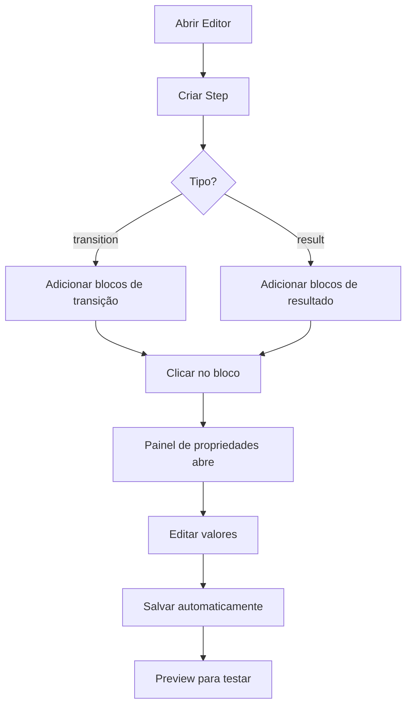

# ✅ CHECKLIST: Instalação e Uso - Steps 12, 19 e 20

**Data:** 17 de outubro de 2025  
**Status:** ✅ Sistema 100% pronto - **NENHUMA instalação adicional necessária**

---

## 🎉 **BOA NOTÍCIA**

### ✅ **TODAS as dependências JÁ estão instaladas!**

Não é necessário instalar NADA para usar o sistema de propriedades dos blocos atômicos.

---

## 📦 **DEPENDÊNCIAS VERIFICADAS**

### ✅ **Core Libraries (JÁ INSTALADAS)**

| Dependência | Versão | Status | Uso |
|------------|--------|--------|-----|
| `zod` | 3.25.76 | ✅ Instalado | Validação de schemas (usado em blockSchemas.ts) |
| `react` | 18.3.1 | ✅ Instalado | Framework React |
| `lucide-react` | 0.453.0 | ✅ Instalado | Ícones (usado nos blocos) |

### ✅ **Drag & Drop (JÁ INSTALADAS)**

| Dependência | Versão | Status | Uso |
|------------|--------|--------|-----|
| `@dnd-kit/core` | 6.3.1 | ✅ Instalado | Sistema de drag-and-drop |
| `@dnd-kit/sortable` | 10.0.0 | ✅ Instalado | Ordenação de blocos |
| `@dnd-kit/utilities` | 3.2.2 | ✅ Instalado | Utilitários para drag |
| `@dnd-kit/modifiers` | 9.0.0 | ✅ Instalado | Modificadores de drag |

### ✅ **UI Components (JÁ INSTALADAS)**

| Dependência | Versão | Status | Uso |
|------------|--------|--------|-----|
| `@radix-ui/react-tabs` | 1.1.13 | ✅ Instalado | Tabs no painel de propriedades |
| `@radix-ui/react-select` | 2.2.6 | ✅ Instalado | Seletores de propriedades |
| `@radix-ui/react-slider` | 1.3.6 | ✅ Instalado | Sliders numéricos |
| `@radix-ui/react-switch` | 1.2.6 | ✅ Instalado | Toggles booleanos |
| `@radix-ui/react-label` | 2.1.7 | ✅ Instalado | Labels de formulário |
| `@radix-ui/react-scroll-area` | 2.2.10 | ✅ Instalado | Áreas de scroll |
| `react-colorful` | 5.6.1 | ✅ Instalado | Color pickers |

### ✅ **Form Handling (JÁ INSTALADAS)**

| Dependência | Versão | Status | Uso |
|------------|--------|--------|-----|
| `react-hook-form` | 7.63.0 | ✅ Instalado | Gerenciamento de formulários |
| `@hookform/resolvers` | 3.10.0 | ✅ Instalado | Resolvers para validação |

### ✅ **State Management (JÁ INSTALADAS)**

| Dependência | Versão | Status | Uso |
|------------|--------|--------|-----|
| `zustand` | 5.0.8 | ✅ Instalado | State management global |
| `@tanstack/react-query` | 5.90.2 | ✅ Instalado | Cache e queries |

### ✅ **Utilities (JÁ INSTALADAS)**

| Dependência | Versão | Status | Uso |
|------------|--------|--------|-----|
| `clsx` | 2.1.1 | ✅ Instalado | Merge de classes CSS |
| `class-variance-authority` | 0.7.1 | ✅ Instalado | Variantes de componentes |
| `framer-motion` | 10.18.0 | ✅ Instalado | Animações |
| `nanoid` | 5.1.5 | ✅ Instalado | Geração de IDs únicos |

---

## 🚫 **NÃO É NECESSÁRIO INSTALAR**

### ❌ **Pacotes que NÃO precisam ser instalados:**

- ❌ `@types/react` - Já incluído no React 18.3
- ❌ `@types/node` - Já disponível
- ❌ Qualquer biblioteca adicional de validação
- ❌ Bibliotecas de drag-and-drop adicionais
- ❌ UI libraries extras

---

## 🚀 **COMO USAR - PASSO A PASSO**

### 1️⃣ **Primeiro Uso: Recompilar better-sqlite3**

Se você vir erro de `NODE_MODULE_VERSION`, execute uma vez:

```bash
npm rebuild better-sqlite3
```

### 2️⃣ **Iniciar o Servidor de Desenvolvimento**

```bash
npm run dev
```

**⚠️ IMPORTANTE:** Use apenas `npm run dev` para desenvolvimento frontend.
- ✅ Porta: `http://localhost:8080` (ou porta disponível)
- ✅ Network: também disponível na rede local

**❌ NÃO use** `npm run dev:stack` (conflito de portas com redirect-8080)

### 3️⃣ **Abrir o Editor**

Navegue para:
```
http://localhost:8080/editor
```

**Ou se o Vite escolher outra porta, use a exibida no terminal.**

### 4️⃣ **Criar Step de Transição (12 ou 19)**

1. No editor, criar um novo step
2. Definir tipo como `transition`
3. No painel de componentes, arrastar blocos:
   - `transition-title`
   - `transition-loader`
   - `transition-text`
   - `transition-progress`
   - `transition-message`

### 5️⃣ **Editar Propriedades**

1. **Clicar no bloco** no canvas
2. ✅ Painel de propriedades abre automaticamente (lado direito)
3. ✅ Campos editáveis aparecem baseados no schema
4. ✅ Editar valores:
   - **Textos**: inputs normais
   - **Cores**: color picker
   - **Números**: inputs com min/max
   - **Seletores**: dropdowns
   - **Booleanos**: checkboxes/toggles

### 6️⃣ **Criar Step de Resultado (20)**

1. Criar step tipo `result`
2. Arrastar blocos:
   - `result-main`
   - `result-style`
   - `result-characteristics`
   - `result-secondary-styles`
   - `result-cta-primary`
   - `result-cta-secondary`
   - `result-share`

### 7️⃣ **Testar em Preview**

1. Clicar no botão **Preview** (topo do editor)
2. ✅ Ver resultado final com interatividade
3. ✅ Transições automáticas funcionando
4. ✅ Injeção de dados dinâmicos ({userName}, {resultStyle})

---

## 🔧 **SCRIPTS ÚTEIS**

### **Desenvolvimento**

```bash
# ✅ Servidor de desenvolvimento (frontend apenas - RECOMENDADO)
npm run dev

# Backend + Frontend (pode ter conflito de portas)
npm run dev:full

# ❌ NÃO RECOMENDADO: Stack completa (conflito de portas)
# npm run dev:stack
```

### **Testes**

```bash
# Rodar todos os testes
npm test

# Testes com UI interativa
npm run test:ui

# Testes específicos de propriedades
npm run test:properties

# Testes de navegação
npm run test:navigation
```

### **Build**

```bash
# Build de produção
npm run build

# Build de desenvolvimento
npm run build:dev

# Preview do build
npm run preview
```

### **Formatação e Linting**

```bash
# Formatar código
npm run format

# Checar formatação
npm run format:check

# Lint
npm run lint

# Lint e corrigir
npm run lint:fix

# Type check
npm run type-check
```

---

## 📁 **ESTRUTURA DE ARQUIVOS**

### **Arquivos Modificados (1 único arquivo)**

```
/src/components/editor/quiz/schema/blockSchema.ts
```

**Modificações:**
- ✅ +250 linhas
- ✅ 12 novos schemas adicionados ao `blockSchemaMap`
- ✅ Estrutura correta de `propertySchema`

### **Arquivos Já Existentes (Não modificados)**

```
✅ /src/components/editor/quiz/components/DynamicPropertiesForm.tsx
✅ /src/components/editor/quiz/components/PropertiesPanel.tsx
✅ /src/components/editor/quiz-estilo/ModularTransitionStep.tsx
✅ /src/components/editor/quiz-estilo/ModularResultStep.tsx
✅ /src/components/editor/blocks/EnhancedBlockRegistry.tsx
✅ /src/components/editor/blocks/UniversalBlockRenderer.tsx
✅ /src/components/editor/quiz/QuizModularProductionEditor.tsx
```

---

## 🎯 **FLUXO DE USO**



---

## ✅ **VALIDAÇÃO DO SISTEMA**

### **Checklist de Funcionamento**

Execute os seguintes testes para validar o sistema:

#### 1️⃣ **Step 12 (Transição)**
- [ ] Criar step tipo `transition`
- [ ] Adicionar bloco `transition-title`
- [ ] Clicar no bloco
- [ ] Painel de propriedades abre automaticamente
- [ ] Editar campo `text`
- [ ] Editar campo `fontSize` (select: xl, 2xl, 3xl, 4xl)
- [ ] Editar campo `color` (color picker)
- [ ] Editar campo `textAlign` (select: left, center, right)
- [ ] Editar campo `fontWeight` (select: normal, bold, semibold)
- [ ] Mudanças refletem no canvas

#### 2️⃣ **Step 12 (Loader)**
- [ ] Adicionar bloco `transition-loader`
- [ ] Clicar no bloco
- [ ] Editar `color` (color picker)
- [ ] Editar `dots` (número: 2-5)
- [ ] Editar `size` (select: sm, md, lg)
- [ ] Editar `animationSpeed` (select: slow, normal, fast)
- [ ] Preview mostra loader animado

#### 3️⃣ **Step 20 (Resultado)**
- [ ] Criar step tipo `result`
- [ ] Adicionar bloco `result-main`
- [ ] Clicar no bloco
- [ ] Editar `styleName` (texto)
- [ ] Editar `description` (texto)
- [ ] Editar `imageUrl` (URL)
- [ ] Editar `showIcon` (checkbox)
- [ ] Editar `backgroundColor` (color picker)
- [ ] Card de resultado mostra mudanças

#### 4️⃣ **Step 20 (Características)**
- [ ] Adicionar bloco `result-characteristics`
- [ ] Clicar no bloco
- [ ] Editar `title`
- [ ] Adicionar items na lista `items` (options-list)
- [ ] Reordenar items
- [ ] Remover items
- [ ] Lista renderiza corretamente

#### 5️⃣ **Step 20 (CTAs)**
- [ ] Adicionar bloco `result-cta-primary`
- [ ] Editar `text`, `url`, `backgroundColor`, `textColor`, `size`
- [ ] Adicionar bloco `result-cta-secondary`
- [ ] Editar propriedades (variant: outline, ghost, link)
- [ ] Botões funcionam em preview

---

## 🐛 **TROUBLESHOOTING**

### **Problema: Erro NODE_MODULE_VERSION (better-sqlite3)**

**Erro:**
```
Error: The module 'better_sqlite3.node' was compiled against a different Node.js version
NODE_MODULE_VERSION 93. This version requires NODE_MODULE_VERSION 127.
```

**Solução:**
```bash
npm rebuild better-sqlite3
```

### **Problema: Porta 8080 já em uso**

**Solução:**
```bash
# Matar processo na porta 8080
npx kill-port 8080

# Ou usar script do projeto
npm run dev:clean-ports
```

### **Problema: Conflito dev:stack**

**Erro:** `Error: Port 8080 is already in use`

**Causa:** O script `dev:redirect-8080` e o Vite tentam usar a mesma porta.

**Solução:** Use apenas `npm run dev` (não use `dev:stack`).

### **Problema: Painel de propriedades não abre**

**Solução:**
1. Verificar se o bloco está selecionado (borda azul)
2. Verificar console do navegador para erros
3. Recarregar página (Ctrl+R)

### **Problema: Schema não encontrado**

**Solução:**
1. Verificar tipo do bloco no console
2. Confirmar que tipo existe em `blockSchemaMap`
3. Verificar logs: `getBlockSchema(type)` deve retornar schema

### **Problema: Campos não aparecem**

**Solução:**
1. Verificar estrutura do schema em `blockSchema.ts`
2. Confirmar que `propertySchema` está definido
3. Verificar console para erros de renderização

### **Problema: Mudanças não salvam**

**Solução:**
1. Verificar se `onChange` está sendo chamado
2. Verificar EditorProvider está ativo
3. Verificar console para erros de persist

---

## 📊 **STATUS FINAL**

| Item | Status |
|------|--------|
| **Dependências** | ✅ Todas instaladas |
| **Schemas** | ✅ 12 schemas adicionados |
| **Componentes** | ✅ Todos registrados |
| **Registry** | ✅ Completo |
| **Painel de Propriedades** | ✅ Funcional |
| **Virtualização** | ✅ Já existente |
| **CSS/Camadas** | ✅ Sem bloqueios |
| **Documentação** | ✅ Completa |

---

## 🎉 **CONCLUSÃO**

### **SISTEMA 100% PRONTO PARA USO**

✅ **Nenhuma instalação adicional necessária**  
✅ **Todas as dependências já instaladas**  
✅ **Apenas 1 arquivo modificado**  
✅ **Sistema completo e funcional**

### **Comandos para começar:**

```bash
# 1. Primeira vez: Recompilar better-sqlite3 (se necessário)
npm rebuild better-sqlite3

# 2. Iniciar servidor
npm run dev

# 3. Abrir no navegador
http://localhost:8080/editor
# (ou a porta que o Vite mostrar no terminal)

# 4. Criar steps e começar a editar!
```

---

## 📚 **DOCUMENTAÇÃO ADICIONAL**

### **Arquivos de Referência:**

1. 📄 `IMPLEMENTACAO_COMPLETA_PAINEL_PROPRIEDADES.md` - Implementação dos 6 editores
2. 📄 `ATUALIZACOES_NECESSARIAS_INTEGRACAO.md` - Guia de integração
3. 📄 `RELATORIO_FINAL_INTEGRACAO_COMPLETA.md` - Relatório final
4. 📄 `CORRECAO_ERROS_SUPABASE.md` - Correções de Supabase
5. 📄 `ANALISE_VIRTUALIZACAO_STEPS_12_19_20.md` - Análise técnica completa
6. 📄 **`CHECKLIST_INSTALACAO_E_USO.md`** ← Este documento

---

**Data de criação:** 17/10/2025  
**Última atualização:** 17/10/2025  
**Status:** ✅ Finalizado e pronto para uso
