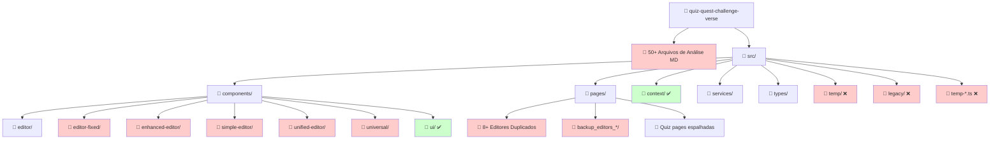
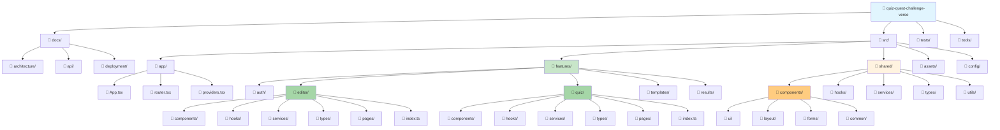
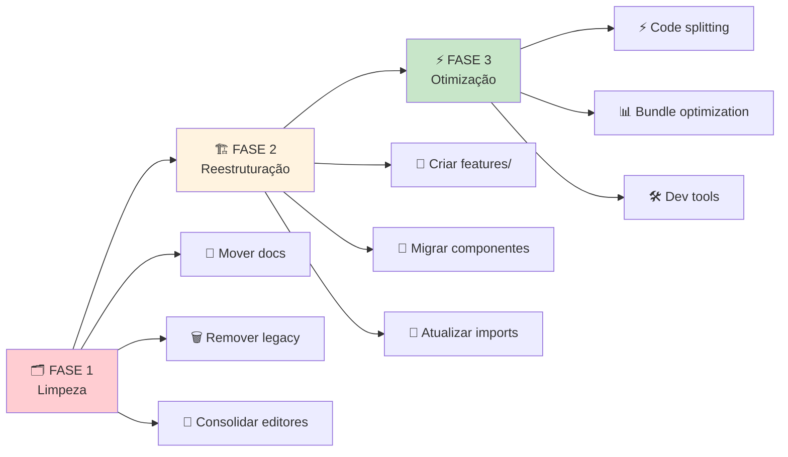
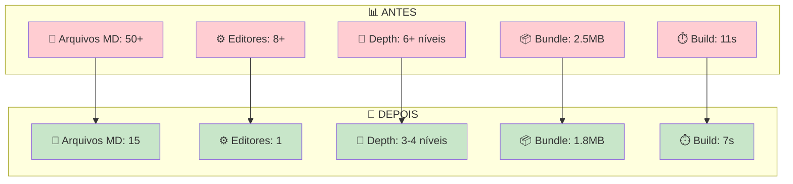
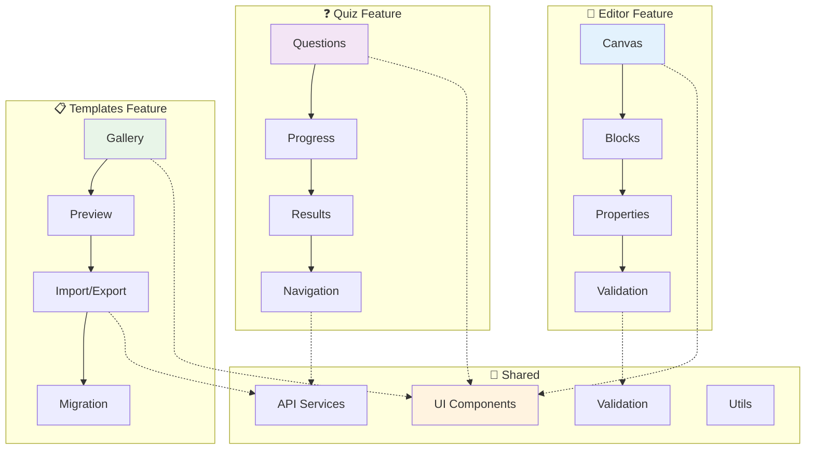
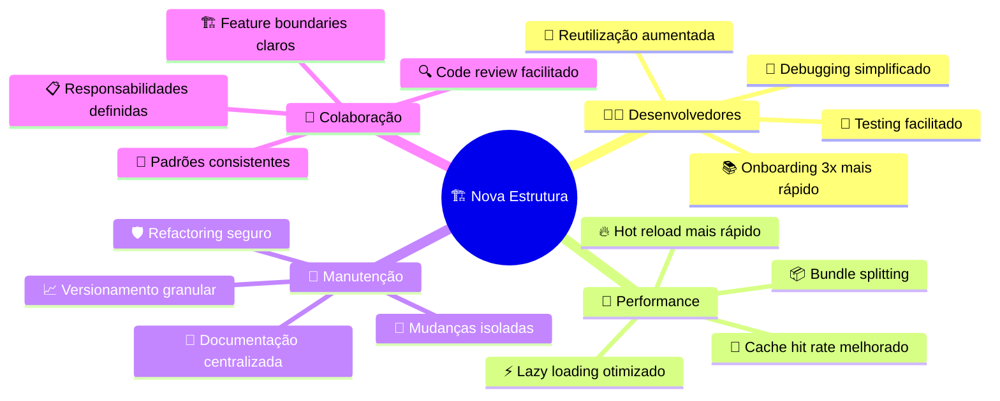

# 🏗️ Diagrama Visual: Estrutura Atual vs Ideal

## 📊 **ESTRUTURA ATUAL - Problemas Identificados**

## 🎯 **ESTRUTURA IDEAL - Feature-Based Architecture**

## 🔄 **Fluxo de Migração por Fases**

## 📈 **Comparação de Métricas**

## 🎯 **Feature Boundaries - Isolamento de Responsabilidades**

## 🚀 **Benefícios da Nova Estrutura**

