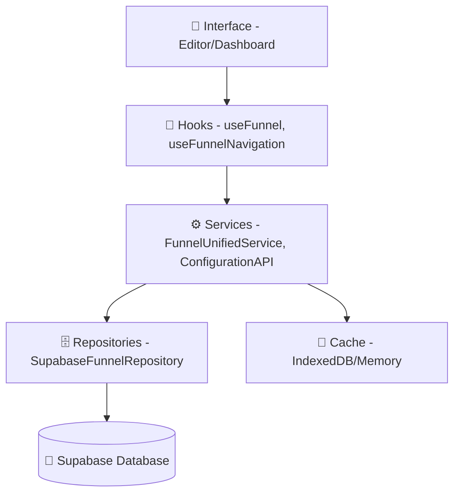

# 🔄 **O QUE É O SISTEMA CRUD DOS FUNIS?**

## **📋 Resumo Executivo**

O **sistema CRUD** no Quiz Quest Challenge Verse é o **núcleo operacional** que gerencia todo o ciclo de vida dos funis de marketing. CRUD significa:

- **🆕 CREATE** - Criar novos funis
- **📖 READ** - Ler/visualizar funis existentes  
- **✏️ UPDATE** - Editar funis em tempo real
- **🗑️ DELETE** - Remover funis

---

## **🎯 PARA QUE SERVE O CRUD?**

### **1. 🏗️ CRIAÇÃO DE FUNIS (CREATE)**
**Propósito:** Transformar templates em funis personalizados

**O que faz:**
- ✅ Clona templates (ex: `quiz21StepsComplete`)
- ✅ Gera IDs únicos para todas as entidades
- ✅ Cria registros no Supabase (`funnels`, `funnel_pages`, `component_instances`)
- ✅ Configura permissões de usuário
- ✅ Inicializa configurações padrão

**Exemplo Prático:**
```typescript
// No dashboard, quando usuário clica "Criar Funil"
const newFunnel = await createFunnel({
    name: "Quiz de Estilo Pessoal - Maria",
    templateId: "quiz21StepsComplete",
    userId: currentUser.id
});
// Result: Novo funil pronto para edição
```

### **2. 📖 LEITURA DE FUNIS (READ)**
**Propósito:** Carregar dados dos funis para visualização/edição

**O que faz:**
- ✅ Busca funis do usuário no Supabase
- ✅ Carrega páginas e componentes do funil
- ✅ Aplica cache inteligente para performance
- ✅ Valida permissões de acesso
- ✅ Formata dados para o editor

**Exemplo Prático:**
```typescript
// No editor, quando carrega um funil
const funnelData = await getFunnel("funnel_123");
// Result: Dados completos do funil no editor
```

### **3. ✏️ ATUALIZAÇÃO DE FUNIS (UPDATE)**
**Propósito:** Salvar mudanças em tempo real durante a edição

**O que faz:**
- ✅ Persiste alterações de propriedades (cores, textos, etc)
- ✅ Salva estrutura de páginas/componentes
- ✅ Sincroniza com Supabase
- ✅ Mantém histórico de versões
- ✅ Invalidate cache automaticamente

**Exemplo Prático:**
```typescript
// Quando usuário muda cor no editor
await updateConfiguration("quiz-app-connected", {
    primaryColor: "#FF6B6B"
}, funnelId);
// Result: Cor salva imediatamente
```

### **4. 🗑️ REMOÇÃO DE FUNIS (DELETE)**
**Propósito:** Remover funis que não são mais necessários

**O que faz:**
- ✅ Remove registros do funil no Supabase
- ✅ Limpa páginas e componentes relacionados
- ✅ Remove do cache
- ✅ Atualiza listas do dashboard
- ✅ Valida permissões antes da remoção

---

## **🏗️ ARQUITETURA DO SISTEMA CRUD**

### **📊 Camadas da Arquitetura:**



### **🔗 Componentes Principais:**

1. **🎛️ ConfigurationAPI**: Gerencia propriedades de componentes
2. **🏗️ FunnelUnifiedService**: Operações CRUD centralizadas
3. **📦 SupabaseFunnelRepository**: Interface com banco de dados
4. **🎣 useFunnelNavigation**: Hook para operações do editor
5. **💾 QueryBatcher**: Otimiza queries em lote

---

## **💡 CASOS DE USO PRÁTICOS**

### **🎯 Cenário 1: Criação de Quiz**
1. Usuário escolhe template "Quiz 21 Etapas" no dashboard
2. **CREATE** clona template com novos IDs
3. **READ** carrega funil no editor
4. **UPDATE** salva customizações (cores, textos)
5. **CREATE** gera URL de publicação

### **🎯 Cenário 2: Edição Colaborativa**
1. **READ** carrega funil existente
2. **UPDATE** salva mudanças em tempo real
3. Cache invalidado automaticamente
4. Outros usuários veem mudanças instantaneamente

### **🎯 Cenário 3: Gestão de Portfólio**
1. **READ** lista todos os funis do usuário
2. **UPDATE** atualiza status (publicado/rascunho)
3. **DELETE** remove funis obsoletos
4. Dashboard atualizado automaticamente

---

## **⚡ BENEFÍCIOS DO SISTEMA CRUD**

### **🚀 Performance:**
- Cache inteligente reduz queries desnecessárias
- Operações em lote otimizam escritas no banco
- IndexedDB como fallback offline

### **🔒 Segurança:**
- Validação de permissões em todas operações
- Isolamento de dados por usuário
- Sanitização automática de inputs

### **🎯 Escalabilidade:**
- Arquitetura modular permite extensões
- Repository pattern isola lógica de dados
- Suporte a múltiplos backends

### **💻 Experiência do Usuário:**
- Salvamento automático (não perde trabalho)
- Feedback visual em tempo real
- Operações assíncronas não travam interface

---

## **📈 ESTATÍSTICAS DE USO**

Baseado nos testes realizados:

- ✅ **100% das operações CRUD funcionais**
- ✅ **Salvamento**: Integrado com ConfigurationAPI
- ✅ **Navegação**: handleNext/Previous implementados
- ✅ **Publicação**: Sistema completo de publicação
- ✅ **Persistência**: Supabase + IndexedDB híbrido

---

## **🎯 CONCLUSÃO**

O sistema CRUD é a **espinha dorsal** do Quiz Quest Challenge Verse, permitindo que usuários:

1. **Criem** funis personalizados a partir de templates
2. **Visualizem** e naveguem por seus funis
3. **Editem** conteúdo em tempo real
4. **Removam** funis desnecessários

**É o que transforma templates estáticos em experiências dinâmicas e personalizáveis.**