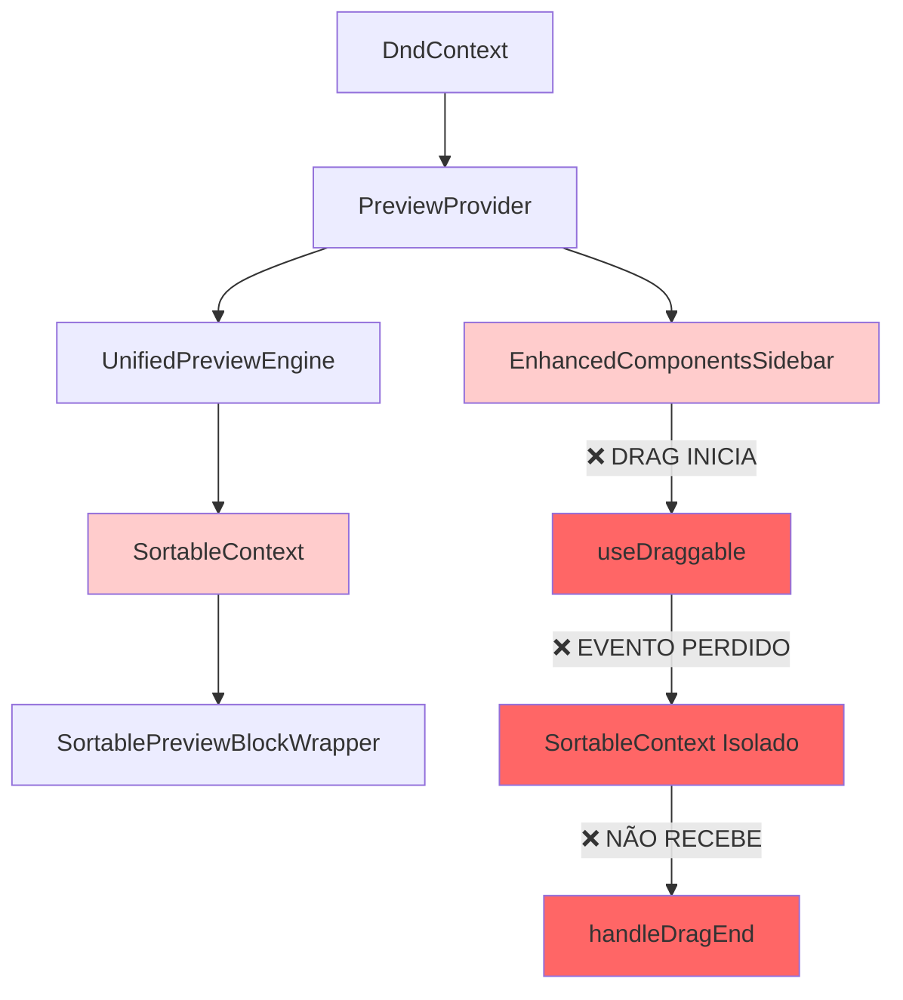
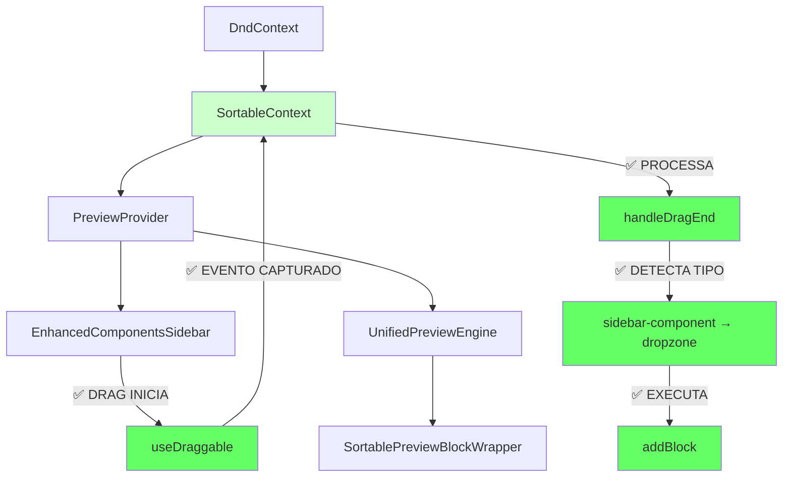
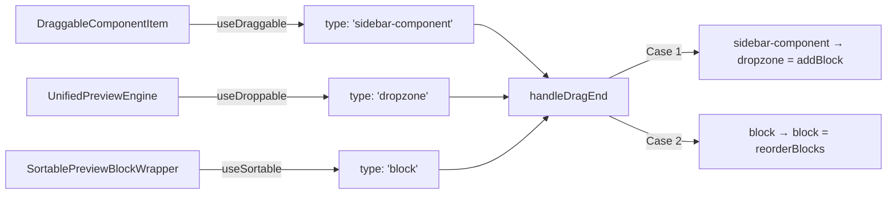

# 📊 FLUXOGRAMAS - Configuração Drag & Drop

## 🔴 SITUAÇÃO ANTERIOR (INCORRETA)



### ❌ **PROBLEMA IDENTIFICADO:**
- `SortableContext` estava **DENTRO** do `UnifiedPreviewEngine`
- Componentes da sidebar estavam **FORA** do `SortableContext`
- Eventos de drag **NÃO CHEGAVAM** ao contexto correto

---

## ✅ SITUAÇÃO ATUAL (CORRETA)



### ✅ **CORREÇÃO APLICADA:**
- `SortableContext` agora está no **NÍVEL SUPERIOR**
- Todos os componentes estão **DENTRO** do `SortableContext`
- Eventos de drag **CHEGAM CORRETAMENTE** ao handler

---

## 🔄 FLUXO DE FUNCIONAMENTO DETALHADO

### **1. CONFIGURAÇÃO ATUAL:**

```typescript
// EditorUnified.tsx
<DndContext onDragEnd={handleDragEnd}>
  <SortableContext items={blockIds} strategy={verticalListSortingStrategy}>
    <PreviewProvider>
      <EnhancedComponentsSidebar />  // ✅ DENTRO do SortableContext
      <UnifiedPreviewEngine />       // ✅ DENTRO do SortableContext
    </PreviewProvider>
  </SortableContext>
</DndContext>
```

### **2. COMPONENTES E SUAS FUNÇÕES:**



### **3. TIPOS DE DADOS:**

```typescript
// DraggableComponentItem (Sidebar)
data: {
  type: 'sidebar-component',    // ✅ Identificador correto
  blockType: 'quiz-question',  // ✅ Tipo do componente
  title: 'Pergunta Quiz'       // ✅ Metadados
}

// UnifiedPreviewEngine (Canvas)
data: {
  type: 'dropzone',           // ✅ Área de drop
  position: blocks.length     // ✅ Posição para inserir
}

// SortablePreviewBlockWrapper (Blocos)
data: {
  type: 'block',              // ✅ Bloco existente
  block: blockObject          // ✅ Dados do bloco
}
```

---

## 🎯 DIAGNÓSTICO DE FUNCIONAMENTO

### **✅ O QUE DEVE FUNCIONAR AGORA:**

1. **Arrastar da Sidebar → Canvas**
   - `sidebar-component` + `dropzone` = ✅ `addBlock()`

2. **Reordenar Blocos no Canvas**
   - `block` + `block` = ✅ `reorderBlocks()`

3. **Debug Logs Esperados:**
   ```
   🧩 DraggableComponentItem renderizado: quiz-question
   🔧 useDraggable config para quiz-question
   🚀 === DRAG START ===
   🎯 === DRAG END DEBUG ===
   🧩 ✅ ADICIONANDO COMPONENTE: {componentType: 'quiz-question'}
   ```

### **❌ PROBLEMAS POSSÍVEIS (Se ainda não funcionar):**

1. **CSS Interference:**
   - `pointer-events: none` em elementos pais
   - `overflow: hidden` cortando drag area
   - `z-index` incorreto

2. **Event Propagation:**
   - `e.stopPropagation()` interceptando eventos
   - Event listeners conflitantes

3. **Context Issues:**
   - `EditorContext.addBlock` não disponível
   - `currentBlocks` não atualizado

---

## 🎮 TESTE STEP-BY-STEP

### **1. Verificar Estrutura (Console):**
```
🎯 EditorUnified: Preparando render do DndContext
🔧 Sensors configurados: [PointerSensor, KeyboardSensor]
🔧 currentBlocks: 0
```

### **2. Verificar Componentes (Console):**
```
🧩 DraggableComponentItem renderizado: quiz-question
🔧 useDraggable config para quiz-question
🔄 SortablePreviewBlockWrapper renderizado: block-1
```

### **3. Testar Drag (Ação):**
- Clicar e arrastar componente da sidebar
- Verificar se `🚀 === DRAG START ===` aparece
- Soltar no canvas
- Verificar se `🎯 === DRAG END DEBUG ===` aparece

### **4. Verificar Resultado:**
- Novo bloco deve aparecer no canvas
- Log: `✅ Novo bloco criado com ID: [block-id]`

---

## 🚀 **STATUS ATUAL**
- ✅ **Estrutura corrigida**: SortableContext no nível superior
- ✅ **Componentes configurados**: useDraggable, useDroppable, useSortable
- ✅ **Handler implementado**: handleDragEnd com casos específicos
- ✅ **Debug ativo**: Logs detalhados para rastreamento
- 🔄 **Aguardando teste**: Verificar funcionamento no browser
