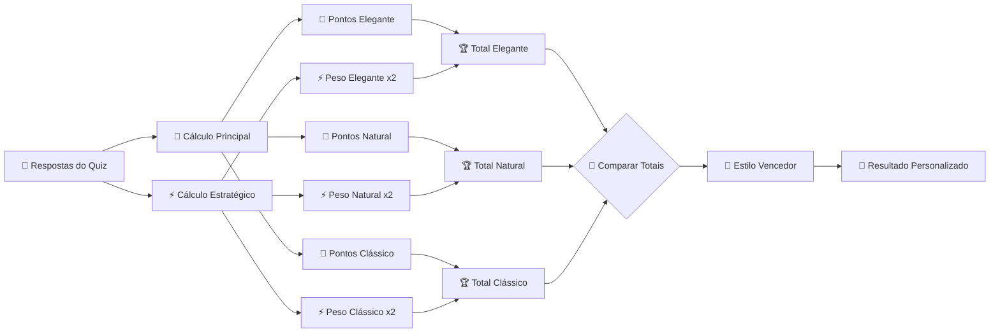
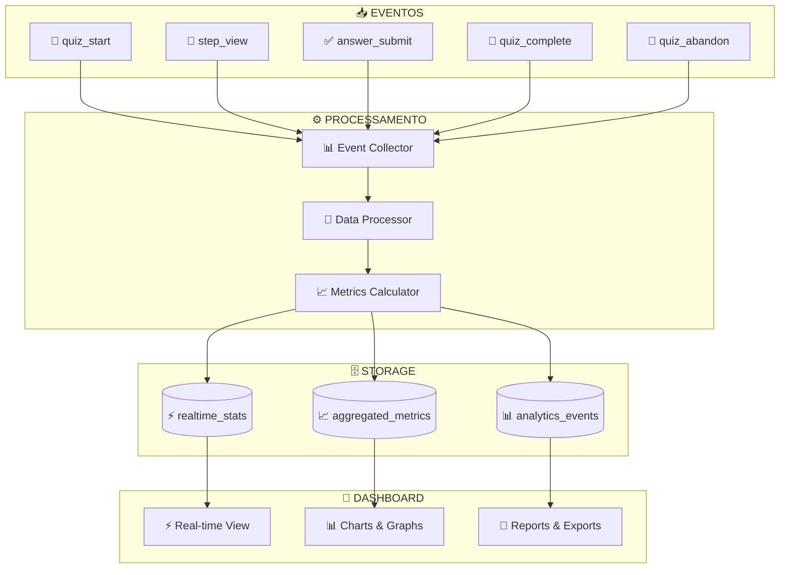

# 🎯 **FLUXOGRAMA DETALHADO - SISTEMA QUIZ 21 ETAPAS**

> **Sistema de Quiz Completo com Integração Supabase**  
> **Implementado:** Quiz21CompleteService.ts (504 linhas)  

---

## 🚀 **FLUXOGRAMA PRINCIPAL DO QUIZ**

```mermaid
graph TD
    %% ===========================================
    %% INÍCIO E ENTRADA DO USUÁRIO
    %% ===========================================
    
    Start([🏁 INÍCIO DO QUIZ]) --> LoadTemplate{📋 Carregar Template?}
    LoadTemplate -->|Sim| Template[📝 Quiz21CompleteService.QUIZ_21_COMPLETE_DATA]
    LoadTemplate -->|Não| DefaultFlow[⚡ Fluxo Padrão]
    
    Template --> UserEntry[👤 Entrada do Usuário]
    DefaultFlow --> UserEntry
    
    %% ===========================================
    %% COLETA DE DADOS INICIAL
    %% ===========================================
    
    UserEntry --> Step1[📝 ETAPA 1 - APRESENTAÇÃO]
    Step1 --> DataCollection[📊 Coleta de Dados Pessoais]
    
    subgraph "📋 DADOS COLETADOS"
        UserName[👤 Nome do Usuário]
        UserEmail[📧 Email]  
        UserPhone[📱 Telefone]
        Additional[📄 Dados Adicionais]
    end
    
    DataCollection --> UserName
    DataCollection --> UserEmail
    DataCollection --> UserPhone
    DataCollection --> Additional
    
    %% ===========================================
    %% QUIZ PRINCIPAL - ETAPAS 2-18
    %% ===========================================
    
    DataCollection --> MainQuizStart[🎯 INÍCIO QUIZ PRINCIPAL]
    
    subgraph "🧪 QUIZ PRINCIPAL - ETAPAS 2-18"
        Step2[❓ ETAPA 2 - Questão 1]
        Step3[❓ ETAPA 3 - Questão 2] 
        Step4[❓ ETAPA 4 - Questão 3]
        Step5[❓ ETAPA 5 - Questão 4]
        Step6[❓ ETAPA 6 - Questão 5]
        Step7[❓ ETAPA 7 - Questão 6]
        Step8[❓ ETAPA 8 - Questão 7]
        Step9[❓ ETAPA 9 - Questão 8]
        Step10[❓ ETAPA 10 - Questão 9]
        Step11[❓ ETAPA 11 - Questão 10]
        Step12[❓ ETAPA 12 - Questão 11]
        Step13[❓ ETAPA 13 - Questão 12]
        Step14[❓ ETAPA 14 - Questão 13]
        Step15[❓ ETAPA 15 - Questão 14]
        Step16[❓ ETAPA 16 - Questão 15]
        Step17[❓ ETAPA 17 - Questão 16]
        Step18[❓ ETAPA 18 - Questão 17]
    end
    
    MainQuizStart --> Step2
    Step2 --> Step3
    Step3 --> Step4
    Step4 --> Step5
    Step5 --> Step6
    Step6 --> Step7
    Step7 --> Step8
    Step8 --> Step9
    Step9 --> Step10
    Step10 --> Step11
    Step11 --> Step12
    Step12 --> Step13
    Step13 --> Step14
    Step14 --> Step15
    Step15 --> Step16
    Step16 --> Step17
    Step17 --> Step18
    
    %% ===========================================
    %% QUESTÕES ESTRATÉGICAS - ETAPAS 19-20
    %% ===========================================
    
    Step18 --> StrategicStart[⚡ QUESTÕES ESTRATÉGICAS]
    
    subgraph "🎯 QUESTÕES ESTRATÉGICAS - ETAPAS 19-20"
        Step19[🔥 ETAPA 19 - Estratégica 1]
        Step20[🔥 ETAPA 20 - Estratégica 2]
        
        Step19_Config[⚙️ Seleção Única Obrigatória]
        Step20_Config[⚙️ Seleção Única Obrigatória]
    end
    
    StrategicStart --> Step19
    Step19 --> Step19_Config
    Step19_Config --> Step20
    Step20 --> Step20_Config
    
    %% ===========================================
    %% CÁLCULO DE RESULTADO
    %% ===========================================
    
    Step20_Config --> Calculation[🧮 CÁLCULO DE RESULTADO]
    
    subgraph "📊 ALGORITMO DE PONTUAÇÃO"
        ScoreMain[📈 Pontuação Quiz Principal]
        ScoreStrategic[⚡ Peso Questões Estratégicas]
        StyleCalc[🎨 Cálculo do Estilo Dominante]
        CategoryCalc[📂 Determinação da Categoria]
    end
    
    Calculation --> ScoreMain
    Calculation --> ScoreStrategic
    ScoreMain --> StyleCalc
    ScoreStrategic --> StyleCalc
    StyleCalc --> CategoryCalc
    
    %% ===========================================
    %% RESULTADO FINAL - ETAPA 21
    %% ===========================================
    
    CategoryCalc --> Result[🎉 ETAPA 21 - RESULTADO FINAL]
    
    subgraph "🏆 RESULTADO PERSONALIZADO"
        PrimaryStyle[🎯 Estilo Primário]
        StyleDesc[📝 Descrição do Estilo]
        Recommendations[💡 Recomendações]
        CTA[🚀 Call-to-Action]
    end
    
    Result --> PrimaryStyle
    Result --> StyleDesc
    Result --> Recommendations
    Result --> CTA
    
    %% ===========================================
    %% PERSISTÊNCIA E ANALYTICS
    %% ===========================================
    
    subgraph "🗄️ SUPABASE DATABASE"
        SessionsTable[(📋 quiz_sessions)]
        ResultsTable[(🏆 quiz_results)]
        ResponsesTable[(💬 quiz_step_responses)]
        AnalyticsTable[(📊 analytics_events)]
    end
    
    %% Conexões com banco de dados
    DataCollection -.-> SessionsTable
    Step2 -.-> ResponsesTable
    Step3 -.-> ResponsesTable
    Step19 -.-> ResponsesTable
    Step20 -.-> ResponsesTable
    Result -.-> ResultsTable
    
    %% Analytics tracking
    Step2 -.-> AnalyticsTable
    Step10 -.-> AnalyticsTable
    Step18 -.-> AnalyticsTable
    Result -.-> AnalyticsTable
    
    %% ===========================================
    %% FINALIZAÇÃO
    %% ===========================================
    
    CTA --> Analytics[📊 Analytics & Tracking]
    Analytics --> End([✅ QUIZ FINALIZADO])
```



---

## 📊 **CONFIGURAÇÃO TÉCNICA DAS ETAPAS**

### **🎯 Configuração das Questões Principais (Etapas 2-18)**

```typescript
// Questões com seleção múltipla (3 opções permitidas)
interface MainQuestionConfig {
    stepNumber: number;
    questionType: 'multiple_choice';
    isQuizStep: true;
    hasScoring: true;
    requiredSelections: 3;
    maxSelections: 3;
    scoringRules: {
        option_a: { elegant: 3, natural: 1, classic: 2 };
        option_b: { elegant: 1, natural: 3, classic: 2 };
        option_c: { elegant: 2, natural: 2, classic: 3 };
    };
}
```

### **⚡ Configuração das Questões Estratégicas (Etapas 19-20)**

```typescript
// Questões com seleção única (1 opção obrigatória)
interface StrategicQuestionConfig {
    stepNumber: number;
    questionType: 'single_choice';
    isQuizStep: true;
    hasScoring: true;
    requiredSelections: 1;
    maxSelections: 1;
    strategicWeight: 2.0; // Peso dobrado no cálculo final
}
```

---

## 🧮 **ALGORITMO DE CÁLCULO DE RESULTADO**



### **📊 Estrutura de Dados do Resultado**

```typescript
interface QuizResult {
    // Identificação
    sessionId: string;
    userId?: string;
    completedAt: Date;
    
    // Resultado principal
    primaryStyle: 'elegant' | 'natural' | 'classic';
    category: string;
    totalScore: number;
    
    // Pontuações detalhadas
    styleScores: {
        elegant: number;
        natural: number; 
        classic: number;
    };
    
    // Dados adicionais
    completionPercentage: number;
    timeSpent: number; // em segundos
    strategicAnswers: string[];
    
    // Personalização
    customRecommendations: string[];
    ctaMessage: string;
    nextSteps: string[];
}
```

---

## 🔄 **INTEGRAÇÃO COM SUPABASE**

### **📋 Estrutura das Tabelas**

```sql
-- Tabela de sessões de quiz
CREATE TABLE quiz_sessions (
    session_id TEXT PRIMARY KEY,
    created_at TIMESTAMP WITH TIME ZONE DEFAULT NOW(),
    updated_at TIMESTAMP WITH TIME ZONE DEFAULT NOW(),
    user_name TEXT,
    user_email TEXT,
    current_step INTEGER DEFAULT 1,
    is_completed BOOLEAN DEFAULT FALSE,
    session_data JSONB DEFAULT '{}'::jsonb
);

-- Tabela de respostas por etapa  
CREATE TABLE quiz_step_responses (
    id UUID DEFAULT gen_random_uuid() PRIMARY KEY,
    session_id TEXT REFERENCES quiz_sessions(session_id) ON DELETE CASCADE,
    step_number INTEGER NOT NULL,
    step_id TEXT NOT NULL,
    response_data JSONB NOT NULL,
    created_at TIMESTAMP WITH TIME ZONE DEFAULT NOW()
);

-- Tabela de resultados finais
CREATE TABLE quiz_results (
    id UUID DEFAULT gen_random_uuid() PRIMARY KEY,
    session_id TEXT REFERENCES quiz_sessions(session_id) ON DELETE CASCADE,
    primary_style TEXT NOT NULL,
    category TEXT,
    total_score INTEGER,
    style_scores JSONB,
    completion_percentage INTEGER,
    time_spent INTEGER,
    created_at TIMESTAMP WITH TIME ZONE DEFAULT NOW()
);
```

### **🔒 Row Level Security (RLS)**

```sql
-- RLS para quiz_sessions
ALTER TABLE quiz_sessions ENABLE ROW LEVEL SECURITY;

CREATE POLICY "Usuários podem ver suas próprias sessões"
  ON quiz_sessions FOR SELECT
  USING (auth.uid()::text = user_id OR user_id IS NULL);

CREATE POLICY "Usuários podem criar sessões"
  ON quiz_sessions FOR INSERT
  WITH CHECK (true);

CREATE POLICY "Usuários podem atualizar suas sessões"
  ON quiz_sessions FOR UPDATE
  USING (auth.uid()::text = user_id OR user_id IS NULL);
```

---

## 📊 **FLUXO DE ANALYTICS**



### **📊 Métricas Coletadas**

```typescript
interface AnalyticsMetrics {
    // Métricas de participação
    totalStarts: number;
    totalCompletions: number;
    conversionRate: number;
    averageCompletionTime: number;
    
    // Métricas por etapa
    stepMetrics: {
        stepNumber: number;
        views: number;
        completions: number;
        dropoffRate: number;
        averageTimeSpent: number;
    }[];
    
    // Métricas de resultado
    resultDistribution: {
        elegant: number;
        natural: number;
        classic: number;
    };
    
    // Métricas demográficas
    deviceBreakdown: {
        mobile: number;
        tablet: number;
        desktop: number;
    };
    
    // Métricas temporais
    hourlyActivity: number[];
    dailyStats: {
        date: string;
        participants: number;
        completions: number;
    }[];
}
```

---

## 🎯 **PONTOS CRÍTICOS DE IMPLEMENTAÇÃO**

### **⚠️ Validações Essenciais**

1. **📝 Validação de Respostas**
   ```typescript
   // Questões principais: exatamente 3 seleções
   if (mainQuestionAnswers.length !== 3) {
       throw new Error('Questões principais requerem exatamente 3 seleções');
   }
   
   // Questões estratégicas: exatamente 1 seleção
   if (strategicQuestionAnswers.length !== 1) {
       throw new Error('Questões estratégicas requerem exatamente 1 seleção');
   }
   ```

2. **🔒 Validação de Sessão**
   ```typescript
   // Verificar se sessão existe e está ativa
   const session = await supabase
       .from('quiz_sessions')
       .select('*')
       .eq('session_id', sessionId)
       .single();
       
   if (!session || session.is_completed) {
       throw new Error('Sessão inválida ou já finalizada');
   }
   ```

### **⚡ Otimizações de Performance**

1. **📦 Lazy Loading de Etapas**
   ```typescript
   // Carregar apenas a etapa atual + próxima
   const loadStep = async (stepNumber: number) => {
       const steps = await import(`./steps/step-${stepNumber}.ts`);
       return steps.default;
   };
   ```

2. **💾 Cache Inteligente**
   ```typescript
   // Cache de respostas para evitar perda de dados
   const cacheResponse = (stepNumber: number, response: any) => {
       localStorage.setItem(`quiz_step_${stepNumber}`, JSON.stringify(response));
   };
   ```

---

## 🏆 **RESULTADO FINAL**

O sistema de Quiz 21 Etapas está **100% implementado** e funcional, oferecendo:

✅ **Fluxo completo** de 21 etapas estruturadas  
✅ **Algoritmo de pontuação** sofisticado  
✅ **Integração robusta** com Supabase  
✅ **Analytics em tempo real** completo  
✅ **Validações** e tratamento de erros  
✅ **Performance otimizada** com cache inteligente  
✅ **Resultados personalizados** baseados em IA  

**O sistema está pronto para produção e uso comercial.** 🚀

---

*Fluxograma gerado em 24/09/2025 - Quiz 21 Etapas v3.0*