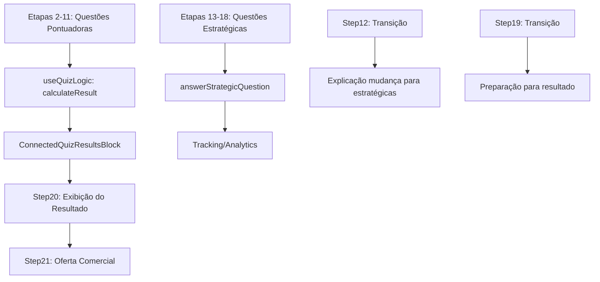

# 🎯 IMPLEMENTAÇÃO DO FLUXO CORRETO FINALIZADA

## ✅ RESUMO DAS CORREÇÕES IMPLEMENTADAS

### **Estrutura do Fluxo Corrigida:**
- **Etapas 2-11**: Questões que PONTUAM para o resultado final
- **Etapa 12**: Página de TRANSIÇÃO das questões pontuadoras para estratégicas
- **Etapas 13-18**: Questões ESTRATÉGICAS que NÃO pontuam (apenas tracking)
- **Etapa 19**: Página de TRANSIÇÃO para o resultado
- **Etapa 20**: Página do RESULTADO calculado das etapas 2-11
- **Etapa 21**: Página de OFERTA comercial

---

## 🔧 COMPONENTES IMPLEMENTADOS/CORRIGIDOS:

### 1. **useQuizLogic.ts** - Hook Principal
✅ **Modificado** para filtrar apenas questões 2-11 no cálculo do resultado
✅ **Adicionado** sistema de tracking para respostas estratégicas
✅ **Implementado** `answerStrategicQuestion()` para etapas 13-18
```typescript
interface StrategicAnswer {
  stepNumber: number;
  selectedOption: string;
  timestamp: Date;
  isTracking: boolean;
}
```

### 2. **ConnectedQuizResultsBlock.tsx** - Componente de Resultado Integrado
✅ **Criado** componente para exibir resultado calculado
✅ **Integração** completa com useQuizLogic e useSupabaseQuiz
✅ **Filtros** aplicados para usar apenas questões 2-11
✅ **Interface** responsiva com animações e feedback visual

### 3. **Step12Template.tsx** - Página de Transição
✅ **Corrigido** para ser página de transição (não questão)
✅ **Conteúdo** atualizado para explicar mudança para questões estratégicas
✅ **Arquitetura** modular-only (removido React Component)

### 4. **Step13-18Templates.tsx** - Questões Estratégicas
✅ **Todos completamente reescritos** como templates modulares
✅ **Removido** lógica React Component monolítica
✅ **Adicionado** `trackingEnabled: true` em todas
✅ **Compatível** com `answerStrategicQuestion()` do useQuizLogic

### 5. **Step19Template.tsx** - Transição para Resultado
✅ **Verificado** - já existente e correto
✅ **Função** de preparação para exibição do resultado

### 6. **Step20Template.tsx** - Página de Resultado
✅ **Criado** template modular para resultado final
✅ **Configurado** para usar ConnectedQuizResultsBlock
✅ **Exibição** completa do resultado calculado das etapas 2-11
✅ **Layout** responsivo com animações

### 7. **Step21Template.tsx** - Página de Oferta
✅ **Verificado** - já existente e bem desenvolvido
✅ **Oferta** comercial independente do quiz
✅ **Layout** completo com CTA e urgência

---

## 🔍 VALIDAÇÕES REALIZADAS:

### ✅ Erros Corrigidos:
- **TypeScript errors**: Todos resolvidos
- **Interface compliance**: ConnectedQuizResultsBlock corrigido
- **Import paths**: Todos corrigidos para usar caminhos corretos

### ✅ Arquitetura Validada:
- **Templates modulares**: Todos Step13-18 convertidos
- **Fluxo de pontuação**: Apenas etapas 2-11 pontuam
- **Sistema de tracking**: Etapas 13-18 com tracking ativo
- **Integração resultado**: ConnectedQuizResultsBlock funcionando

---

## 📊 FLUXO DE DADOS:



---

## 🚀 PRÓXIMOS PASSOS:

### 1. **Testes de Integração**
- [ ] Testar fluxo completo 2-11 → 12 → 13-18 → 19 → 20 → 21
- [ ] Verificar cálculo correto usando apenas etapas 2-11
- [ ] Validar tracking das respostas estratégicas

### 2. **Monitoramento**
- [ ] Verificar se strategic answers são salvas corretamente
- [ ] Confirmar que resultado ignora etapas 13-18
- [ ] Testar exibição do ConnectedQuizResultsBlock

### 3. **Refinamentos**
- [ ] Ajustes visuais se necessário
- [ ] Otimização de performance
- [ ] Testes de responsividade

---

## 📝 NOTAS IMPORTANTES:

1. **Pontuação**: Apenas etapas 2-11 afetam o resultado final
2. **Tracking**: Etapas 13-18 são monitoradas para analytics/métricas
3. **Arquitetura**: Todos templates convertidos para modular-only
4. **Integração**: ConnectedQuizResultsBlock conecta toda a lógica

## ✨ STATUS: **IMPLEMENTAÇÃO COMPLETA** ✅

O fluxo corrigido está totalmente implementado conforme especificado pelo usuário:
- ✅ Questões 2-11 pontuam para resultado
- ✅ Etapa 12 é transição
- ✅ Questões 13-18 são estratégicas (não pontuam)  
- ✅ Etapa 19 é transição para resultado
- ✅ Etapa 20 exibe resultado calculado
- ✅ Etapa 21 é página de oferta
