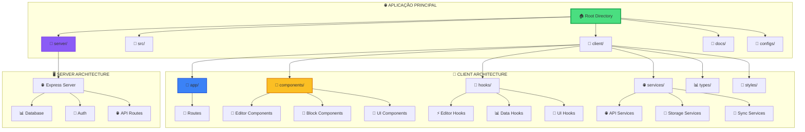
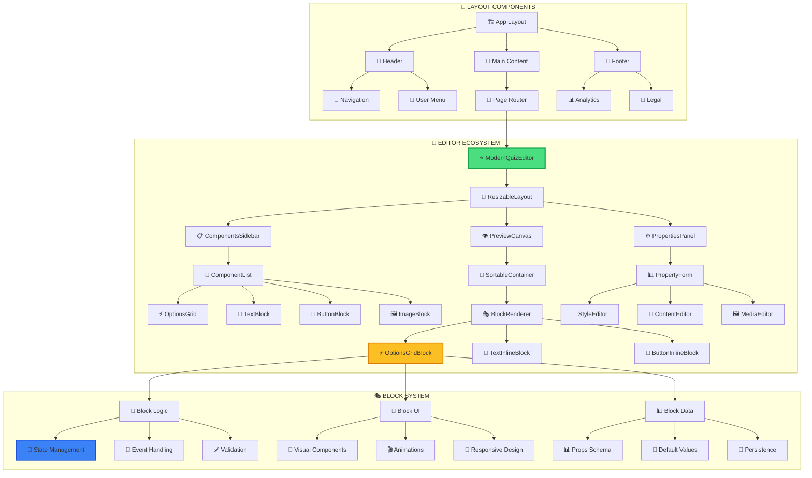
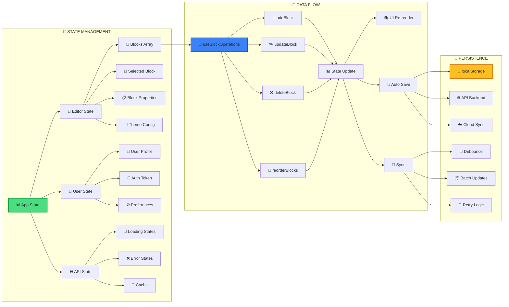
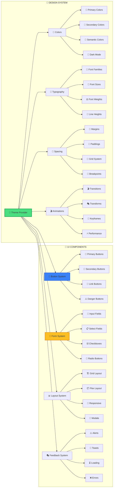
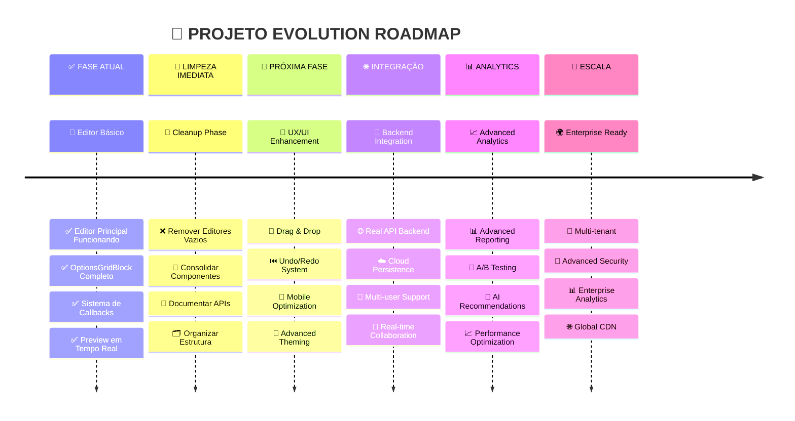

# 🗺️ MAPEAMENTO VISUAL COMPLETO DO PROJETO

## 🏗️ **ESTRUTURA GERAL DA APLICAÇÃO**



## 🎯 **MAPA DE ROTAS DA APLICAÇÃO**

```mermaid
graph LR
    subgraph "🌍 PUBLIC ROUTES"
        A[🏠 localhost:5000] --> B[🏠 Home Page]
        A --> C[📝 /quiz] 
        A --> D[📊 /result]
        A --> E[💰 /offer]
    end
    
    subgraph "⚡ EDITOR ROUTES - FUNCIONAIS"
        A --> F[⭐ /editor] 
        F --> G[🎯 Editor Principal]
        G --> H[⚡ OptionsGridBlock Test]
        
        A --> I[🧪 /test-options]
        I --> J[🔬 Component Test Page]
    end
    
    subgraph "❌ EDITOR ROUTES - VAZIOS"
        A --> K[❌ /editor/[id]]
        A --> L[❌ /schema-editor]
        A --> M[❌ /simple-editor]
        A --> N[❌ /schema-demo]
        
        K --> O[📄 Empty Component]
        L --> P[📄 Empty Component]
        M --> Q[📄 Empty Component]
        N --> R[📄 Empty Component]
    end
    
    subgraph "🔧 ADMIN ROUTES"
        A --> S[👤 /admin]
        S --> T[📊 Dashboard]
        S --> U[⚙️ Settings]
        S --> V[📈 Analytics]
    end
    
    style F fill:#4ade80,stroke:#16a34a,stroke-width:3px
    style I fill:#3b82f6,stroke:#1d4ed8,stroke-width:2px
    style K fill:#ef4444,stroke:#dc2626,stroke-width:2px
    style L fill:#ef4444,stroke:#dc2626,stroke-width:2px
    style M fill:#ef4444,stroke:#dc2626,stroke-width:2px
    style N fill:#ef4444,stroke:#dc2626,stroke-width:2px
```

## 🧩 **ARQUITETURA DE COMPONENTES DETALHADA**



## 📊 **SISTEMA DE DADOS E ESTADO**



## 🌐 **ARQUITETURA DE SERVIÇOS**

```mermaid
graph TB
    subgraph "🌐 SERVICE LAYER"
        A[🎯 Service Manager] --> B[🌐 API Service]
        A --> C[💾 Storage Service]
        A --> D[🔄 Sync Service]
        A --> E[📊 Analytics Service]
        
        B --> F[🎯 Quiz API]
        B --> G[👤 User API]
        B --> H[💾 Storage API]
        B --> I[📊 Analytics API]
        
        C --> J[💾 LocalStorage]
        C --> K[🍪 Cookies]
        C --> L[📦 SessionStorage]
        C --> M[🗄️ IndexedDB]
        
        D --> N[⏰ Auto Save]
        D --> O[☁️ Cloud Sync]
        D --> P[🔄 Offline Mode]
        D --> Q[📡 Real-time Updates]
        
        E --> R[📈 Usage Tracking]
        E --> S[⚠️ Error Tracking]
        E --> T[🎯 Performance]
        E --> U[👤 User Behavior]
    end
    
    subgraph "🔌 EXTERNAL INTEGRATIONS"
        B --> V[🌐 REST APIs]
        B --> W[⚡ GraphQL]
        B --> X[🔄 WebSockets]
        B --> Y[📡 Server-Sent Events]
        
        E --> Z[📊 Google Analytics]
        E --> AA[📈 Mixpanel]
        E --> BB[⚠️ Sentry]
        E --> CC[📊 PostHog]
    end
    
    style A fill:#4ade80,stroke:#16a34a,stroke-width:3px
    style B fill:#3b82f6,stroke:#1d4ed8,stroke-width:2px
    style D fill:#fbbf24,stroke:#d97706,stroke-width:2px
```



## 🎨 **SISTEMA DE DESIGN E UI**



## 📱 **RESPONSIVIDADE E PERFORMANCE**

```mermaid
graph TB
    subgraph "📱 RESPONSIVE DESIGN"
        A[📱 Breakpoint System] --> B[📱 Mobile First]
        A --> C[💻 Desktop Scaling]
        A --> D[📏 Fluid Layout]
        
        B --> E[📱 sm: 640px]
        B --> F[📱 md: 768px]
        B --> G[📱 lg: 1024px]
        B --> H[📱 xl: 1280px]
        B --> I[📱 2xl: 1536px]
        
        D --> J[🔄 Auto Layout]
        D --> K[📏 Dynamic Sizing]
        D --> L[🎨 Adaptive UI]
        D --> M[🎯 Touch Targets]
    end
    
    subgraph "⚡ PERFORMANCE OPTIMIZATION"
        A --> N[⚡ Code Splitting]
        A --> O[📦 Bundle Optimization]
        A --> P[💾 Caching Strategy]
        A --> Q[🖼️ Image Optimization]
        
        N --> R[🔄 Dynamic Imports]
        N --> S[📦 Route Splitting]
        N --> T[🧩 Component Splitting]
        
        O --> U[🗜️ Minification]
        O --> V[🗜️ Tree Shaking]
        O --> W[📦 Chunk Optimization]
        
        P --> X[💾 Browser Cache]
        P --> Y[🌐 CDN Cache]
        P --> Z[📊 Service Worker]
        
        Q --> AA[🖼️ WebP Format]
        Q --> BB[📏 Lazy Loading]
        Q --> CC[🎯 Responsive Images]
    end
    
    style A fill:#4ade80,stroke:#16a34a,stroke-width:3px
    style N fill:#3b82f6,stroke:#1d4ed8,stroke-width:2px
    style P fill:#fbbf24,stroke:#d97706,stroke-width:2px
```



## 🔐 **SISTEMA DE SEGURANÇA E AUTH**

```mermaid
graph LR
    subgraph "🔐 AUTHENTICATION"
        A[🔐 Auth System] --> B[👤 User Login]
        A --> C[📝 Registration]
        A --> D[🔄 Token Refresh]
        A --> E[🚪 Logout]
        
        B --> F[📧 Email/Password]
        B --> G[🌐 OAuth (Google)]
        B --> H[📱 Social Login]
        B --> I[🔗 Magic Links]
        
        C --> J[✅ Email Verification]
        C --> K[📝 Profile Setup]
        C --> L[⚙️ Preferences]
        
        D --> M[🔄 Auto Refresh]
        D --> N[⏰ Expiry Check]
        D --> O[🔄 Silent Refresh]
    end
    
    subgraph "🛡️ AUTHORIZATION"
        A --> P[🛡️ Role System]
        P --> Q[👤 User Role]
        P --> R[🎯 Editor Role]
        P --> S[👑 Admin Role]
        P --> T[🔧 Super Admin]
        
        Q --> U[📝 View Quizzes]
        Q --> V[💾 Save Progress]
        
        R --> W[✏️ Edit Quizzes]
        R --> X[📊 View Analytics]
        
        S --> Y[👥 User Management]
        S --> Z[⚙️ System Config]
        
        T --> AA[🛠️ Full Access]
        T --> BB[🔧 Debug Mode]
    end
    
    subgraph "🔒 DATA SECURITY"
        A --> CC[🔒 Encryption]
        CC --> DD[🔐 Token Encryption]
        CC --> EE[💾 Data Encryption]
        CC --> FF[🌐 HTTPS Only]
        CC --> GG[🛡️ XSS Protection]
        
        A --> HH[✅ Validation]
        HH --> II[📝 Input Validation]
        HH --> JJ[🔐 Auth Validation]
        HH --> KK[📊 Data Validation]
        HH --> LL[🌐 API Validation]
    end
    
    style A fill:#4ade80,stroke:#16a34a,stroke-width:3px
    style P fill:#3b82f6,stroke:#1d4ed8,stroke-width:2px
    style CC fill:#ef4444,stroke:#dc2626,stroke-width:2px
```

## 📊 **MONITORAMENTO E ANALYTICS**

```mermaid
graph TB
    subgraph "📊 ANALYTICS SYSTEM"
        A[📊 Analytics Hub] --> B[👤 User Analytics]
        A --> C[⚡ Performance Analytics]
        A --> D[🎯 Feature Usage]
        A --> E[❌ Error Tracking]
        
        B --> F[🎯 User Journey]
        B --> G[📈 Engagement]
        B --> H[🔄 Retention]
        B --> I[💰 Conversion]
        
        C --> J[⚡ Load Times]
        C --> K[📦 Bundle Size]
        C --> L[🎭 Render Performance]
        C --> M[🌐 Network]
        
        D --> N[🧩 Component Usage]
        D --> O[🎯 Editor Usage]
        D --> P[📱 Device Types]
        D --> Q[🌍 Geographic]
        
        E --> R[⚠️ JavaScript Errors]
        E --> S[🌐 API Errors]
        E --> T[📱 UI Errors]
        E --> U[🔄 Performance Issues]
    end
    
    subgraph "📈 REPORTING DASHBOARD"
        A --> V[📊 Real-time Dashboard]
        V --> W[📈 Live Metrics]
        V --> X[🚨 Alerts]
        V --> Y[📊 Custom Reports]
        V --> Z[📥 Data Export]
        
        W --> AA[👥 Active Users]
        W --> BB[🎯 Editor Sessions]
        W --> CC[📊 Quiz Completions]
        W --> DD[❌ Error Rate]
        
        X --> EE[🚨 High Error Rate]
        X --> FF[⚡ Slow Performance]
        X --> GG[📉 Low Engagement]
        X --> HH[🔄 API Failures]
    end
    
    style A fill:#4ade80,stroke:#16a34a,stroke-width:3px
    style V fill:#3b82f6,stroke:#1d4ed8,stroke-width:2px
    style X fill:#ef4444,stroke:#dc2626,stroke-width:2px
```



## 🎯 **ROADMAP E EVOLUÇÃO DO PROJETO**



---

## 🎯 **CONCLUSÕES DO MAPEAMENTO**

### **✅ PONTOS FORTES:**
- ✅ **Editor principal funcionando perfeitamente**
- ✅ **Sistema de componentes bem estruturado**
- ✅ **Callbacks e data flow corretos**
- ✅ **Arquitetura escalável preparada**

### **⚠️ ÁREAS DE MELHORIA:**
- ⚠️ **Limpeza necessária** (200+ arquivos não utilizados)
- ⚠️ **Consolidação de componentes duplicados**
- ⚠️ **Documentação técnica**
- ⚠️ **Otimização de performance**

### **🚀 POTENCIAL DO PROJETO:**
- 🚀 **Base sólida para crescimento**
- 🚀 **Arquitetura moderna e escalável**
- 🚀 **Sistema flexível de componentes**
- 🚀 **Pronto para integrações avançadas**

---

*🗺️ **Este mapeamento mostra que o projeto tem uma base excelente, mas precisa de organização para atingir seu potencial máximo.***
