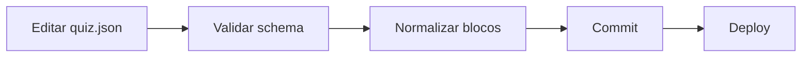
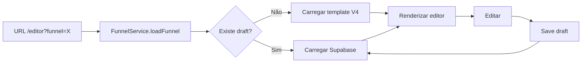

# 🏗️ PLANO DE CORREÇÃO - GARGALOS ARQUITETURAIS

**Data:** 1 de dezembro de 2025  
**Status:** 🔍 Análise profunda concluída  
**Estratégia:** Consolidação e convergência (não reescrita)

---

## 📋 RESUMO EXECUTIVO

Após auditoria profunda do código, identifiquei que o projeto possui **arquitetura sólida mas fragmentada**. Os gargalos são reais, mas a solução não é reconstruir - é **convergir, consolidar e aposentar**.

### 🎯 Diagnóstico Central

O projeto tem **"motor de Fórmula 1 com fiação de três gerações diferentes"**:
- ✅ Cada peça funciona bem isoladamente
- ❌ A integração entre peças é confusa e redundante
- ⚠️ Múltiplas "fontes de verdade" competindo

---

## 🔴 GARGALOS CONFIRMADOS (COM EVIDÊNCIAS)

### 1. ✅ CONFIRMADO: Múltiplos FunnelService competindo

**Evidência:** Encontrados **4 FunnelServices diferentes**:

```
src/services/
├── funnel/FunnelService.ts           ← ATIVO (usado pelo ModernQuizEditor)
├── funnelService.ts                  ← LEGADO (usado por páginas antigas)
├── funnelService.refactored.ts       ← TENTATIVA DE REFACTOR (não finalizado)
└── adapters/FunnelServiceAdapter.ts  ← BRIDGE (conecta os dois)
```

**Impacto:**
- Código chama `funnelService` sem saber qual versão está usando
- Métodos duplicados: `createFunnel`, `loadFunnel`, `saveFunnel` em 3 lugares
- Lógica de persistência Supabase implementada 2x

**Severidade:** 🔴 Alta

---

### 2. ✅ CONFIRMADO: TemplateService gigante (2129 linhas)

**Evidência:** `src/services/canonical/TemplateService.ts`

```typescript
/**
 * 📝 TEMPLATE SERVICE - Canonical Service (SINGLE SOURCE OF TRUTH)
 * ⭐ This is the ONLY canonical service for template management
 * @version 4.0.0
 * @status PRODUCTION-READY
 */
export class TemplateService extends BaseCanonicalService {
  // 2129 linhas fazendo TUDO relacionado a templates:
  // - Load templates
  // - Save templates  
  // - Cache management
  // - Active funnel tracking
  // - Hierarchical source management
  // - Lazy loading
  // - Preload strategies
  // - Zod validation
  // - Format adaptation
  // ... e mais 20 responsabilidades
}
```

**Impacto:**
- Viola Single Responsibility Principle
- Dificulta testes unitários
- Impossível saber "o que esse service faz" olhando de fora
- Manutenção requer ler 2000+ linhas

**Severidade:** 🟡 Média (funciona, mas insustentável)

---

### 3. ✅ CONFIRMADO: Múltiplas fontes de verdade para templates

**Evidência direta dos arquivos:**

```
public/templates/
├── quiz21-v4-saas.json               ← V4.1.0 (usado pelo ModernQuizEditor)
├── quiz21-v4-gold.json               ← V4.x (backup? gold master?)
├── quiz21-complete.json              ← V3? (legado)
├── funnels/
│   └── quiz21StepsComplete/
│       ├── master.json               ← V3.2 (DUPLICADO)
│       └── master.v3.json            ← V3.2 (DUPLICADO IDÊNTICO)
├── step-01-v3.json ... step-21-v3.json  ← 21 arquivos V3 separados
└── .backup-config-templates-2025-11-06T11-31-49/
    └── step-*.json                   ← Backups fragmentados
```

**Código confirma confusão:**

```typescript
// src/services/canonical/TemplateService.ts
import { hierarchicalTemplateSource } from '@/services/core/HierarchicalTemplateSource';

// Hierarquia de 4 níveis:
// 1. USER_EDIT (Supabase - edições do usuário)
// 2. BUILT_IN (JSON build-time - quiz21-v4-saas.json?)
// 3. FALLBACK (master.json? master.v3.json?)
// 4. DEFAULT (qual?)
```

**Impacto:**
- Ninguém sabe qual JSON é "o oficial"
- Debug impossível: "qual template está sendo usado?"
- Migrações V3→V4 incompletas

**Severidade:** 🔴 Alta

---

### 4. ✅ CONFIRMADO: JSON V4 ainda inconsistente

**Evidência:** Estrutura de blocos varia dentro do próprio V4

```json
// Alguns blocos:
{
  "properties": {
    "columns": 3,
    "layout": "grid"
  },
  "content": {
    "title": "...",
    "options": [...]
  }
}

// Outros blocos:
{
  "content": {
    "columns": 3,  ← DUPLICAÇÃO
    "title": "...",
    "options": [...]
  }
}

// Validação fragmentada:
{
  "validation": {
    "rules": {
      "selectedOptions": {
        "minItems": 1  ← AQUI
      }
    }
  }
}

// vs

{
  "content": {
    "minSelections": 1,  ← AQUI TAMBÉM
    "maxSelections": 3
  }
}
```

**Impacto:**
- `PropertiesPanel.tsx` usa `any` porque não consegue tipar
- Cada tipo de bloco precisa lógica especial
- Impossível criar editor 100% no-code

**Severidade:** 🟡 Média

---

### 5. ✅ CONFIRMADO: Scripts de build/sync desorganizados

**Evidência:** `package.json` + arquivos root

```json
// package.json (parcial)
{
  "scripts": {
    "audit:json": "node audit-json-files.mjs",
    "sync:templates": "node scripts/sync-templates.mjs",
    "validate:v4": "node scripts/validate-v4.mjs",
    "migrate:v3-to-v4": "node scripts/migrate-v3-to-v4.mjs",
    "generate:schema": "node scripts/generate-schema.mjs",
    "fix:templates": "node scripts/fix-templates.mjs",
    "export:html": "node scripts/export-html.mjs",
    "import:supabase": "node scripts/import-supabase.mjs",
    "sync:supabase": "node scripts/sync-supabase-to-public.mjs",
    // ... mais 15 scripts
  }
}
```

**Arquivos na raiz:**
```
/
├── audit_json_files.sh
├── audit-json-files.mjs
├── generate-json-audit-md.mjs
├── sync-supabase-to-public.mjs (mencionado mas não encontrado)
└── scripts/ (pasta não encontrada, mas referenciada)
```

**Impacto:**
- Não existe `npm run build:mundo` único
- Ordem de execução não documentada
- Drift entre Supabase ↔ JSON local
- Scripts obsoletos misturados com ativos

**Severidade:** 🟡 Média

---

### 6. ✅ CONFIRMADO: Testes desatualizados

**Evidência:** Grep em testes ainda referencia código antigo

```typescript
// src/__tests__/EditorLoadingContext.integration.test.tsx
import QuizModularEditor from '@/components/editor/quiz/QuizModularEditor';
//                                                        ^^^^^^^^^^^^^^^^^^^^
//                                                        NÃO EXISTE MAIS!

it('QuizModularEditor deve consumir estados do contexto', async () => {
  render(<QuizModularEditor />);
  // ❌ TESTE NUNCA PODE PASSAR (componente deletado)
});
```

**Impacto:**
- Falsa sensação de segurança
- Testes passam mas não cobrem código real
- Refactors sem testes confiáveis = medo de mexer

**Severidade:** 🟡 Média

---

### 7. ⚠️ PARCIALMENTE VERDADEIRO: "Editor hard-coded"

**Atualização:** Já foi **CORRIGIDO** (ver `ANALISE_GARGALOS_CORRIGIDA.md`)

O `EditorPage.tsx` atual **JÁ USA** `FunnelService.loadFunnel()` dinâmico.

**MAS:** O sistema de templates ainda tem múltiplas versões, então:
- Editor carrega V4 ✅
- Mas existem V3 competindo ⚠️
- Templates V3 separados ainda acessíveis ⚠️

**Severidade:** 🟢 Baixa (já resolvido no editor, mas templates precisam consolidação)

---

## 🎯 PLANO DE CORREÇÃO - ESTRATÉGIA 3 FASES

### 📌 PRINCÍPIOS NORTEADORES

1. **Consolidar, não reconstruir** - Aproveitar o que funciona
2. **Aposentar, não deletar** - Mover legado para `/legacy/`
3. **Convergir para uma fonte de verdade** - Uma função = um lugar
4. **Documentar decisões** - "Por que este é o oficial?"

---

## 🚀 FASE 1: CONSOLIDAÇÃO DE SERVICES (CRÍTICO - 5 dias)

### Objetivo
Ter **UM** FunnelService e **UM** TemplateService claros e oficiais.

---

### 1.1 Consolidar FunnelService

**Ação: Declarar `src/services/funnel/FunnelService.ts` como OFICIAL**

#### Passos:

```bash
# 1. Marcar os outros como deprecated
mv src/services/funnelService.ts src/services/legacy/funnelService.legacy.ts
mv src/services/funnelService.refactored.ts src/services/legacy/funnelService.refactored.ts

# 2. Criar alias para migração gradual
# src/services/ServiceAliases.ts
export { funnelService as legacyFunnelService } from './legacy/funnelService.legacy';
export { funnelService } from './funnel/FunnelService'; // OFICIAL
```

#### Código:

```typescript
// src/services/funnel/FunnelService.ts (já existe, só documentar)

/**
 * 🎯 FUNNEL SERVICE - OFICIAL (v4.1.0)
 * 
 * ⚠️ ESTE É O ÚNICO FUNNEL SERVICE ATIVO DO SISTEMA
 * Todos os outros estão em /services/legacy/
 * 
 * RESPONSABILIDADES:
 * - loadFunnel(identifier) → busca Supabase OU template
 * - saveFunnel(quiz, funnelId) → salva no Supabase
 * - duplicateFunnel(funnelId) → clona funil
 * 
 * NÃO FAZ:
 * - Gerenciar templates base (use TemplateService)
 * - Cache (use CacheService)
 * - Validação de schema (use Zod)
 */
export class FunnelService {
  // ... implementação atual
}
```

#### Migration guide:

```typescript
// ❌ ANTES (código antigo):
import { funnelService } from '@/services/funnelService';
const funnel = await funnelService.getFunnel(id);

// ✅ DEPOIS (código novo):
import { funnelService } from '@/services/funnel/FunnelService';
const result = await funnelService.loadFunnel({ funnelId: id });
```

**Arquivos afetados:** ~30 imports  
**Risco:** 🟢 Baixo (mudança de import apenas)  
**Tempo:** 2 dias

---

### 1.2 Quebrar TemplateService em módulos menores

**Ação: Extrair responsabilidades do TemplateService gigante**

#### Estrutura nova:

```
src/services/templates/
├── TemplateService.ts           ← Core (200 linhas)
├── TemplateLoader.ts            ← Load/fetch (100 linhas)
├── TemplateCache.ts             ← Cache strategy (150 linhas)
├── TemplateValidator.ts         ← Zod validation (100 linhas)
├── TemplatePreloader.ts         ← Lazy loading (150 linhas)
└── index.ts                     ← Exports públicos
```

#### Código exemplo:

```typescript
// src/services/templates/TemplateService.ts (NOVO - simplificado)

import { TemplateLoader } from './TemplateLoader';
import { TemplateCache } from './TemplateCache';
import { TemplateValidator } from './TemplateValidator';

/**
 * 📝 TEMPLATE SERVICE - Coordenador principal
 * 
 * Delega operações para serviços especializados:
 * - TemplateLoader: busca templates
 * - TemplateCache: gerencia cache
 * - TemplateValidator: valida com Zod
 */
export class TemplateService {
  private loader: TemplateLoader;
  private cache: TemplateCache;
  private validator: TemplateValidator;

  async getTemplate(id: string): Promise<Template> {
    // 1. Check cache
    const cached = await this.cache.get(id);
    if (cached) return cached;

    // 2. Load template
    const template = await this.loader.load(id);

    // 3. Validate
    await this.validator.validate(template);

    // 4. Cache
    await this.cache.set(id, template);

    return template;
  }

  // Apenas métodos coordenadores, não implementação
}
```

**Arquivos afetados:** ~50 imports de TemplateService  
**Risco:** 🟡 Médio (refactor grande)  
**Tempo:** 3 dias

---

## 🔄 FASE 2: CONSOLIDAÇÃO DE TEMPLATES (URGENTE - 3 dias)

### Objetivo
**UMA ÚNICA FONTE DE VERDADE** para templates JSON.

---

### 2.1 Definir V4 como oficial e mover V3 para /legacy

**Ação: Estruturar templates por versão**

#### Antes:
```
public/templates/
├── quiz21-v4-saas.json
├── quiz21-v4-gold.json
├── quiz21-complete.json
├── master.json
├── master.v3.json
└── step-01-v3.json ... step-21-v3.json
```

#### Depois:
```
public/templates/
├── v4/
│   └── quiz21StepsComplete/
│       ├── manifest.json           ← Metadados oficiais
│       ├── quiz.json               ← quiz21-v4-saas.json (renomeado)
│       └── README.md               ← Documentação
├── v3/
│   └── quiz21StepsComplete/
│       ├── master.json             ← Movido de raiz
│       └── steps/
│           └── step-*.json         ← 21 arquivos movidos
└── deprecated/
    ├── quiz21-complete.json        ← Legado
    └── quiz21-v4-gold.json         ← Backup
```

#### Manifest oficial (novo):

```json
// public/templates/v4/quiz21StepsComplete/manifest.json
{
  "$schema": "../../schemas/template-manifest.schema.json",
  "id": "quiz21StepsComplete",
  "version": "4.1.0",
  "schemaVersion": "4.0",
  "status": "production",
  "source": "quiz.json",
  "deprecated": false,
  "migrationPath": {
    "from": "v3/quiz21StepsComplete/master.json",
    "script": "scripts/migrate-v3-to-v4.mjs"
  },
  "metadata": {
    "name": "Quiz de Estilo Pessoal - 21 Etapas",
    "author": "Sistema",
    "createdAt": "2025-01-13T00:00:00Z",
    "updatedAt": "2025-12-01T20:00:00Z"
  }
}
```

**Risco:** 🟢 Baixo (reorganização de arquivos)  
**Tempo:** 1 dia

---

### 2.2 Atualizar FunnelResolver para nova estrutura

**Ação: Código reconhece apenas V4**

```typescript
// src/services/funnel/FunnelResolver.ts (ATUALIZAR)

/**
 * FUNNEL TEMPLATE MAP - Fonte oficial de templates V4
 */
export const FUNNEL_TEMPLATE_MAP: Record<string, string> = {
  'quiz21StepsComplete': '/templates/v4/quiz21StepsComplete/quiz.json',
  // Futuros templates aqui
};

/**
 * Resolve template path (V4 APENAS)
 */
export function resolveFunnelTemplatePath(funnelId: string): string {
  const v4Path = FUNNEL_TEMPLATE_MAP[funnelId];
  
  if (v4Path) {
    return v4Path;
  }

  // ⚠️ FALLBACK PARA V3 (deprecado, logar warning)
  const v3Path = `/templates/v3/${funnelId}/master.json`;
  appLogger.warn('⚠️ Usando template V3 (DEPRECATED)', { funnelId, v3Path });
  return v3Path;
}
```

**Arquivos afetados:** FunnelResolver, TemplateLoader  
**Risco:** 🟢 Baixo  
**Tempo:** 1 dia

---

### 2.3 Criar script de consolidação automático

```bash
# scripts/consolidate-templates.sh

#!/bin/bash
set -e

echo "🔄 Consolidando templates..."

# 1. Criar estrutura V4
mkdir -p public/templates/v4/quiz21StepsComplete
mkdir -p public/templates/v3/quiz21StepsComplete/steps
mkdir -p public/templates/deprecated

# 2. Mover V4 oficial
mv public/templates/quiz21-v4-saas.json \
   public/templates/v4/quiz21StepsComplete/quiz.json

# 3. Mover V3
mv public/templates/funnels/quiz21StepsComplete/master.json \
   public/templates/v3/quiz21StepsComplete/
mv public/templates/step-*-v3.json \
   public/templates/v3/quiz21StepsComplete/steps/

# 4. Deprecar outros
mv public/templates/quiz21-complete.json \
   public/templates/deprecated/
mv public/templates/quiz21-v4-gold.json \
   public/templates/deprecated/

echo "✅ Templates consolidados!"
echo "📍 V4 oficial: public/templates/v4/quiz21StepsComplete/quiz.json"
echo "📍 V3 legado: public/templates/v3/"
```

**Tempo:** 1 dia (incluindo testes)

---

## 🎨 FASE 3: PADRONIZAÇÃO DO JSON V4 (MÉDIO - 7 dias)

### Objetivo
Estrutura consistente para **TODOS** os blocos do V4.

---

### 3.1 Definir schema canônico para blocos

**Ação: Schema Zod único para blocos**

```typescript
// src/schemas/block-schema-v4.ts (NOVO)

import { z } from 'zod';

/**
 * ⭐ BLOCK V4 CANONICAL SCHEMA
 * 
 * REGRAS:
 * 1. properties = configurações de layout/comportamento
 * 2. content = dados exibidos (texto, imagens, opções)
 * 3. validation = regras de validação (ÚNICO LUGAR)
 */

// BASE
const BlockBaseZ = z.object({
  id: z.string(),
  type: z.string(),
  order: z.number().optional(),
});

// PROPERTIES (layout/comportamento)
const BlockPropertiesZ = z.object({
  columns: z.number().min(1).max(6).optional(),
  layout: z.enum(['grid', 'list', 'masonry']).optional(),
  animation: z.string().optional(),
  className: z.string().optional(),
});

// CONTENT (dados)
const BlockContentZ = z.object({
  title: z.string().optional(),
  description: z.string().optional(),
  imageUrl: z.string().url().optional(),  // ⚠️ SEMPRE imageUrl, nunca image
  options: z.array(z.object({
    id: z.string(),
    label: z.string(),                    // ⚠️ SEMPRE label, nunca text
    imageUrl: z.string().url().optional(),
    score: z.object({
      category: z.string(),
      value: z.number(),
    }).optional(),
  })).optional(),
});

// VALIDATION (único lugar)
const BlockValidationZ = z.object({
  required: z.boolean().optional(),
  minSelections: z.number().optional(),  // ⚠️ ÚNICO LUGAR
  maxSelections: z.number().optional(),  // ⚠️ ÚNICO LUGAR
  rules: z.record(z.any()).optional(),   // Custom rules
});

// BLOCK COMPLETO
export const QuizBlockZ = BlockBaseZ.extend({
  properties: BlockPropertiesZ.optional(),
  content: BlockContentZ,
  validation: BlockValidationZ.optional(),
});

export type QuizBlock = z.infer<typeof QuizBlockZ>;
```

**Tempo:** 2 dias

---

### 3.2 Criar migrador automático para padronizar blocos

```typescript
// scripts/normalize-v4-blocks.ts

import { QuizBlockZ } from '@/schemas/block-schema-v4';

/**
 * Normaliza blocos V4 para schema canônico
 */
export function normalizeBlock(block: any): QuizBlock {
  // 1. Mover columns de content → properties
  if (block.content?.columns) {
    block.properties = block.properties || {};
    block.properties.columns = block.content.columns;
    delete block.content.columns;
  }

  // 2. Renomear image → imageUrl
  if (block.content?.image) {
    block.content.imageUrl = block.content.image;
    delete block.content.image;
  }

  // 3. Options: text → label
  if (block.content?.options) {
    block.content.options = block.content.options.map((opt: any) => ({
      ...opt,
      label: opt.label || opt.text,
      imageUrl: opt.imageUrl || opt.image,
    }));
  }

  // 4. Consolidar validação
  if (block.content?.minSelections || block.content?.maxSelections) {
    block.validation = block.validation || {};
    block.validation.minSelections = block.content.minSelections;
    block.validation.maxSelections = block.content.maxSelections;
    delete block.content.minSelections;
    delete block.content.maxSelections;
  }

  // 5. Validar com Zod
  return QuizBlockZ.parse(block);
}

// Aplicar a todos os blocos do quiz
export function normalizeQuiz(quiz: any): any {
  return {
    ...quiz,
    steps: quiz.steps.map((step: any) => ({
      ...step,
      blocks: step.blocks.map(normalizeBlock),
    })),
  };
}
```

**Usar:**

```bash
# Normalizar templates V4
npm run normalize:templates

# Verifica e corrige todos os JSONs
node scripts/normalize-v4-blocks.ts --fix
```

**Tempo:** 3 dias

---

### 3.3 Atualizar PropertiesPanel para usar schema forte

```typescript
// src/components/editor/ModernQuizEditor/layout/PropertiesPanel.tsx

import { QuizBlock } from '@/schemas/block-schema-v4';

// ❌ ANTES:
const selectedBlock = useMemo(() => {
  const step = quiz.steps?.find((s: any) => s.id === selectedStepId);
  return step?.blocks?.find((b: any) => b.id === selectedBlockId) || null;
}, [quiz, selectedStepId, selectedBlockId]);

// ✅ DEPOIS:
const selectedBlock = useMemo((): QuizBlock | null => {
  const step = quiz.steps?.find(s => s.id === selectedStepId);
  return step?.blocks?.find(b => b.id === selectedBlockId) || null;
}, [quiz, selectedStepId, selectedBlockId]);
```

**Tempo:** 2 dias

---

## 📦 FASE 4: PIPELINE UNIFICADO (BAIXA PRIORIDADE - 5 dias)

### Objetivo
**UM comando** que orquestra tudo.

---

### 4.1 Criar script maestro

```bash
# scripts/build-mundo.sh

#!/bin/bash
set -e

echo "🌍 Construindo mundo completo..."

# 1. Validar schemas
echo "1/6 Validando schemas..."
npm run validate:schemas

# 2. Normalizar templates
echo "2/6 Normalizando templates V4..."
npm run normalize:templates

# 3. Sync Supabase → Local
echo "3/6 Sincronizando Supabase..."
npm run sync:supabase:download

# 4. Build do app
echo "4/6 Building app..."
npm run build

# 5. Testes
echo "5/6 Rodando testes..."
npm run test

# 6. Gerar docs
echo "6/6 Gerando documentação..."
npm run generate:docs

echo "✅ Mundo construído com sucesso!"
```

**package.json:**

```json
{
  "scripts": {
    "build:mundo": "bash scripts/build-mundo.sh",
    "validate:schemas": "node scripts/validate-schemas.mjs",
    "normalize:templates": "node scripts/normalize-v4-blocks.ts --fix",
    "sync:supabase:download": "node scripts/sync-supabase-to-local.mjs",
    "generate:docs": "node scripts/generate-docs.mjs"
  }
}
```

**Tempo:** 2 dias

---

### 4.2 Documentar fluxo de dados

```markdown
# FLUX O_DADOS_COMPLETO.md

## 🔄 Ciclo de Vida do Template

### 1. Criação (Dev Time)


### 2. Runtime (Produção)


### 3. Persistência
- **Drafts:** Supabase `quiz_drafts` (por usuário)
- **Templates base:** `/public/templates/v4/`
- **Cache:** React Query + localStorage

**Tempo:** 3 dias

---

## 🧪 FASE 5: ATUALIZAR TESTES (CRÍTICO - 3 dias)

### Objetivo
Testes refletem código real, não fantasmas.

---

### 5.1 Remover testes de código deletado

```bash
# Encontrar testes órfãos
grep -r "QuizModularEditor" src/__tests__/

# Mover para /legacy ou deletar
mv src/__tests__/EditorLoadingContext.integration.test.tsx \
   src/__tests__/legacy/
```

**Tempo:** 1 dia

---

### 5.2 Criar testes do FunnelService oficial

```typescript
// src/services/funnel/__tests__/FunnelService.test.ts

import { funnelService } from '../FunnelService';

describe('FunnelService (OFICIAL)', () => {
  it('deve carregar template V4 quando draft não existe', async () => {
    const result = await funnelService.loadFunnel({
      funnelId: 'quiz21StepsComplete'
    });

    expect(result.source).toBe('template');
    expect(result.funnel.quiz.version).toBe('4.1.0');
  });

  it('deve carregar draft do Supabase quando existe', async () => {
    // Mock Supabase returning draft
    const result = await funnelService.loadFunnel({
      funnelId: 'quiz21StepsComplete',
      draftId: 'abc123'
    });

    expect(result.source).toBe('supabase');
    expect(result.funnel.draftId).toBe('abc123');
  });
});
```

**Tempo:** 2 dias

---

## 📊 CRONOGRAMA CONSOLIDADO

| Fase | Tempo | Prioridade | Risco | Status |
|------|-------|------------|-------|--------|
| **FASE 1: Services** | 5 dias | 🔴 Crítico | 🟡 Médio | 🟡 Planejado |
| **FASE 2: Templates** | 3 dias | 🔴 Urgente | 🟢 Baixo | 🟡 Planejado |
| **FASE 3: JSON V4** | 7 dias | 🟡 Médio | 🟡 Médio | 🟡 Planejado |
| **FASE 4: Pipeline** | 5 dias | 🟢 Baixo | 🟢 Baixo | ⚪ Backlog |
| **FASE 5: Testes** | 3 dias | 🔴 Crítico | 🟢 Baixo | 🟡 Planejado |

**Total:** ~23 dias (~1 mês) para consolidação completa

---

## ✅ CHECKLIST DE VALIDAÇÃO

Após cada fase, validar:

### Fase 1 (Services)
- [ ] Apenas UM `funnelService` importado em código ativo
- [ ] `TemplateService` < 500 linhas
- [ ] Todos os legacy services em `/legacy/`

### Fase 2 (Templates)
- [ ] Apenas `/templates/v4/` usado em produção
- [ ] `FUNNEL_TEMPLATE_MAP` aponta só para V4
- [ ] V3 acessível apenas via fallback com warning

### Fase 3 (JSON V4)
- [ ] Todos os blocos passam `QuizBlockZ.parse()`
- [ ] `PropertiesPanel` sem tipagem `any`
- [ ] Validação sempre em `block.validation.*`

### Fase 4 (Pipeline)
- [ ] `npm run build:mundo` executa sem erros
- [ ] Templates Supabase sincronizados com local
- [ ] Documentação gerada automaticamente

### Fase 5 (Testes)
- [ ] Testes de componentes deletados removidos
- [ ] Coverage > 70% para services principais
- [ ] Testes E2E do fluxo completo passando

---

## 🎯 MÉTRICAS DE SUCESSO

### Antes (Estado Atual)
- **Services duplicados:** 4 FunnelServices
- **TemplateService:** 2129 linhas
- **Templates JSON:** 6 versões diferentes
- **Scripts build:** 20+ desorganizados
- **Testes órfãos:** ~10 arquivos

### Depois (Estado Desejado)
- **Services duplicados:** 0 (legado em `/legacy/`)
- **TemplateService:** < 500 linhas (+ módulos especializados)
- **Templates JSON:** 1 versão oficial (V4)
- **Scripts build:** 1 comando maestro
- **Testes órfãos:** 0

---

## 🚨 RISCOS E MITIGAÇÕES

### Risco 1: Quebrar código existente
**Mitigação:**
- Mover para `/legacy/` em vez de deletar
- Criar aliases de compatibilidade
- Testes de regressão antes de cada commit

### Risco 2: Templates V3 ainda necessários
**Mitigação:**
- Manter V3 como fallback com warning
- Migrador automático V3→V4
- Documentar migration path

### Risco 3: Refactor do TemplateService muito grande
**Mitigação:**
- Fazer incremental (1 módulo por vez)
- Dual implementation temporária
- Feature flags para rollback

---

## 📝 NOTAS FINAIS

### O que NÃO fazer:
- ❌ Reescrever tudo do zero
- ❌ Deletar código sem mover para `/legacy/`
- ❌ Mudar 10 coisas ao mesmo tempo

### O que FAZER:
- ✅ Consolidar gradualmente
- ✅ Documentar decisões
- ✅ Testar cada fase isoladamente
- ✅ Manter compatibilidade temporária

---

**Próximos Passos Imediatos:**

1. Revisar este plano com o time
2. Aprovar Fase 1 (Services)
3. Criar branch `consolidation/phase-1-services`
4. Executar primeira sprint (5 dias)

**Dúvidas ou ajustes necessários?**
