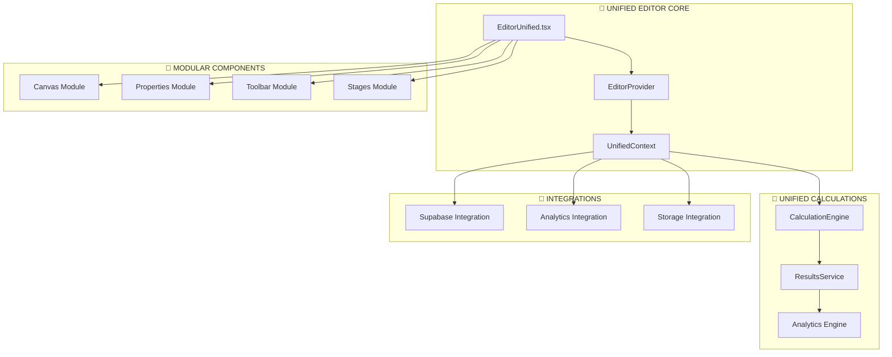
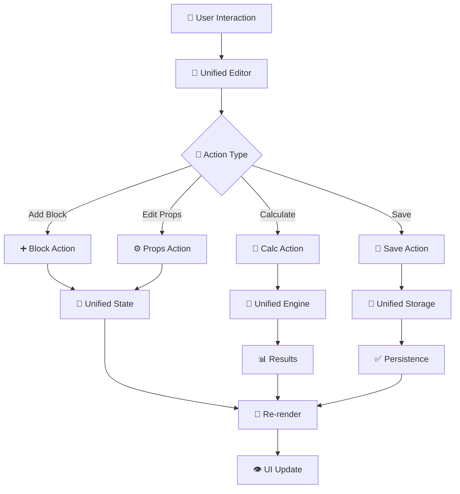
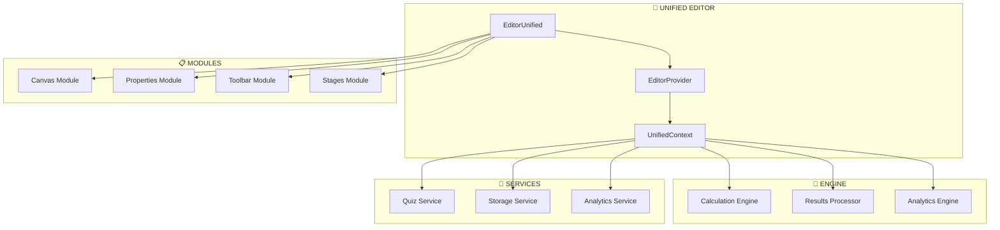
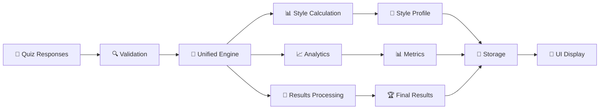

# 🏗️ PLANO MAESTRO DE UNIFICAÇÃO - EDITOR & LÓGICA

## 📋 **ÍNDICE**

1. [Análise da Estrutura Atual](#análise-estrutura)
2. [Mapeamento de Duplicações](#mapeamento-duplicações)
3. [Arquitetura Unificada Proposta](#arquitetura-unificada)
4. [Plano de Implementação](#plano-implementação)
5. [Estrutura de Diretórios Ideal](#estrutura-diretórios)
6. [Fluxogramas Visuais](#fluxogramas)
7. [Cronograma de Execução](#cronograma)

---

## 📊 **ANÁLISE DA ESTRUTURA ATUAL** {#análise-estrutura}

### 🎨 **EDITORES IDENTIFICADOS** (16 componentes)

```
📁 EDITORES PRINCIPAIS
├── ⭐ EditorUnified.tsx              # VAZIO - Para implementar
├── 🔥 EditorPro.tsx                  # Principal (21 etapas)
├── 📱 SchemaDrivenEditorResponsive   # Responsivo
├── 🎯 QuizEditorInterface.tsx        # Interface quiz
├── 🎭 QuizEditorPro.tsx              # Quiz profissional
└── 📄 PageEditor.tsx                 # Editor de página

📁 EDITORES ESPECÍFICOS
├── 🧩 EditorWithQuizLogic.tsx        # Com lógica quiz
├── 📋 QuizEditorSteps.tsx            # Por etapas
├── 🖼️ PageEditorCanvas.tsx           # Canvas
└── 📝 EmptyEditor.tsx                # Editor vazio

📁 EDITORES AUXILIARES
├── 🔧 EditorLayout.tsx               # Layout
├── 🛡️ EditorAccessControl.tsx       # Controle acesso
├── 📢 EditorNotification.tsx         # Notificações
└── 🧱 EditorBlockItem.tsx            # Item de bloco

📁 EDITORES DUPLICADOS/BACKUP
├── ❌ EditorPro-backup.tsx           # REMOVER
├── ❌ EditorPro-clean.tsx            # REMOVER
├── ❌ EditorPro-WORKING.tsx          # REMOVER
└── ❌ QuizEditorPro.corrected.tsx    # REMOVER
```

### 🧮 **LÓGICA DE CÁLCULOS** (12 arquivos)

```
📁 ENGINES DE CÁLCULO
├── ⭐ calcResults.ts                 # Engine avançado (v2.0.0)
├── 🎯 quizResults.ts                 # Engine simples
├── 👗 styleCalculation.ts            # Cálculos de estilo
├── ⚙️ quizEngine.ts (lib/)           # Engine core
└── 📊 resultsCalculator.ts           # Interface resultados

📁 SERVIÇOS DE RESULTADO
├── 🛠️ quizResultsService.ts          # Serviço principal
├── 📈 analyticsService.ts            # Analytics
├── 💾 resultService.ts               # Persistência
└── 🔗 userResponseService.ts         # Respostas usuário

📁 UTILITÁRIOS
├── 🎨 quiz21StepsRenderer.ts         # Renderizador 21 etapas
├── 🔄 quiz21EtapasLoader.ts          # Carregador etapas
├── 📋 quizComponentDefaults.ts       # Defaults componentes
└── 🎪 quiz21EtapasIndividualizado.ts # Personalizado
```

### 🎣 **HOOKS E CONTEXTOS** (8 arquivos)

```
📁 CONTEXTOS
├── ⭐ EditorProvider.tsx             # Context principal
├── 🎯 useEditor                      # Hook principal
├── 🧠 useQuizLogic                   # Lógica quiz
└── 📊 useEditorSupabaseIntegration   # Integração Supabase

📁 HOOKS AUXILIARES
├── 🔄 useEditorHistory               # Histórico
├── 🧱 useEditorBlocks                # Blocos
├── 🎨 useEditorTheme                 # Tema
└── 💾 useEditorPersistence           # Persistência
```

---

## 🔍 **MAPEAMENTO DE DUPLICAÇÕES** {#mapeamento-duplicações}

### ❌ **PROBLEMAS IDENTIFICADOS**

| Problema                | Quantidade | Arquivos Afetados                          | Impacto |
| ----------------------- | ---------- | ------------------------------------------ | ------- |
| **Editores Duplicados** | 4          | EditorPro-\*, QuizEditorPro.corrected      | Alto    |
| **Engines de Cálculo**  | 5          | calcResults, quizResults, styleCalculation | Alto    |
| **Serviços Resultado**  | 4          | quizResultsService, resultService          | Médio   |
| **Hooks Editor**        | 8+         | useEditor*, useQuiz*                       | Médio   |
| **Types Quiz**          | 7          | quiz\*.ts em /types                        | Baixo   |

### 📊 **MATRIZ DE FUNCIONALIDADES**

```
┌─────────────────────┬─────────┬─────────┬─────────┬─────────┐
│ Funcionalidade      │ Editor1 │ Editor2 │ Editor3 │ Status  │
├─────────────────────┼─────────┼─────────┼─────────┼─────────┤
│ 21 Etapas          │    ✅    │    ✅    │    ❌    │ DUPLICADO│
│ Drag & Drop        │    ✅    │    ✅    │    ✅    │ DUPLICADO│
│ Properties Panel   │    ✅    │    ✅    │    ✅    │ DUPLICADO│
│ Preview Mode       │    ✅    │    ❌    │    ✅    │ PARCIAL │
│ Supabase Sync      │    ✅    │    ❌    │    ❌    │ PARCIAL │
│ Calculations       │    ✅    │    ✅    │    ✅    │ DUPLICADO│
└─────────────────────┴─────────┴─────────┴─────────┴─────────┘
```

---

## 🏛️ **ARQUITETURA UNIFICADA PROPOSTA** {#arquitetura-unificada}

### 🎯 **PRINCÍPIOS ARQUITETURAIS**

1. **Single Source of Truth** - Um editor, um contexto, uma lógica
2. **Modularidade** - Componentes intercambiáveis
3. **Extensibilidade** - Fácil adição de funcionalidades
4. **Performance** - Lazy loading e otimizações
5. **Testabilidade** - Arquitetura testável

### 🏗️ **ESTRUTURA UNIFICADA**



---

## 🚀 **PLANO DE IMPLEMENTAÇÃO** {#plano-implementação}

### 📅 **FASE 1: PREPARAÇÃO** (2-3 dias)

#### **1.1 Limpeza de Arquivos**

```bash
# Remover arquivos duplicados
├── ❌ EditorPro-backup.tsx
├── ❌ EditorPro-clean.tsx
├── ❌ EditorPro-WORKING.tsx
└── ❌ QuizEditorPro.corrected.tsx

# Mover para backup
├── 📦 backup/legacy-editors/
```

#### **1.2 Auditoria de Dependências**

```typescript
// Mapear todas as importações
// Identificar dependências circulares
// Documentar interfaces públicas
```

#### **1.3 Criação da Base Unificada**

```typescript
// Estrutura base do EditorUnified
// Interfaces unificadas
// Types consolidados
```

### 📅 **FASE 2: UNIFICAÇÃO DO CORE** (3-4 dias)

#### **2.1 Editor Unificado**

```typescript
// EditorUnified.tsx - Componente principal
// UnifiedEditorProvider.tsx - Context único
// unifiedTypes.ts - Types consolidados
```

#### **2.2 Calculation Engine Único**

```typescript
// UnifiedCalculationEngine.ts
// Consolidar: calcResults + quizResults + styleCalculation
// API única para todos os cálculos
```

#### **2.3 Services Unificados**

```typescript
// UnifiedQuizService.ts
// UnifiedResultsService.ts
// UnifiedAnalyticsService.ts
```

### 📅 **FASE 3: MIGRAÇÃO** (4-5 dias)

#### **3.1 Migração de Componentes**

```typescript
// Migrar componentes existentes para nova arquitetura
// Manter compatibilidade com API legacy
// Testes de regressão
```

#### **3.2 Integração com Sistema Existente**

```typescript
// Pontos de integração com sistema atual
// Adaptadores para APIs existentes
// Validação de funcionalidades
```

### 📅 **FASE 4: OTIMIZAÇÃO** (2-3 dias)

#### **4.1 Performance**

```typescript
// Lazy loading de componentes
// Memoização estratégica
// Otimização de re-renders
```

#### **4.2 Testes e Documentação**

```typescript
// Testes unitários
// Testes de integração
// Documentação API
```

---

## 📁 **ESTRUTURA DE DIRETÓRIOS IDEAL** {#estrutura-diretórios}

```
src/
├── unified/                          # 🎯 SISTEMA UNIFICADO
│   ├── editor/                       # Editor Unificado
│   │   ├── EditorUnified.tsx        # Componente principal
│   │   ├── EditorProvider.tsx       # Provider unificado
│   │   ├── types.ts                 # Types consolidados
│   │   └── hooks/                   # Hooks unificados
│   │       ├── useUnifiedEditor.ts
│   │       ├── useEditorState.ts
│   │       └── useEditorActions.ts
│   │
│   ├── calculations/                 # Cálculos Unificados
│   │   ├── UnifiedEngine.ts         # Engine principal
│   │   ├── StyleCalculator.ts       # Cálculos de estilo
│   │   ├── ResultsProcessor.ts      # Processamento
│   │   └── MetricsAnalyzer.ts       # Analytics
│   │
│   ├── services/                     # Serviços Unificados
│   │   ├── UnifiedQuizService.ts    # Serviço principal
│   │   ├── UnifiedResultsService.ts # Resultados
│   │   ├── UnifiedStorageService.ts # Storage
│   │   └── integrations/            # Integrações
│   │       ├── SupabaseAdapter.ts
│   │       └── AnalyticsAdapter.ts
│   │
│   └── modules/                      # Módulos do Editor
│       ├── canvas/                  # Canvas unificado
│       ├── properties/              # Propriedades
│       ├── toolbar/                 # Toolbar
│       ├── stages/                  # Etapas
│       └── preview/                 # Preview
│
├── legacy/                          # 📦 SISTEMA LEGACY
│   ├── editors/                     # Editores antigos
│   ├── calculations/                # Cálculos antigos
│   └── adapters/                    # Adaptadores compatibilidade
│
└── components/                      # 🧩 COMPONENTES EXISTENTES
    ├── editor/                      # Manter por compatibilidade
    ├── blocks/                      # Blocos existentes
    └── ui/                          # UI components
```

---

## 🔄 **FLUXOGRAMAS VISUAIS** {#fluxogramas}

### **Fluxo de Dados Unificado**



### **Arquitetura de Componentes**



### **Fluxo de Cálculos**



---

## ⏱️ **CRONOGRAMA DE EXECUÇÃO** {#cronograma}

### **SEMANA 1: PREPARAÇÃO**

```
🗓️ DIA 1-2: Limpeza e Auditoria
├── ✅ Remover arquivos duplicados
├── ✅ Mapear dependências
└── ✅ Criar estrutura base

🗓️ DIA 3: Planejamento Detalhado
├── ✅ Definir interfaces
├── ✅ Planejar migração
└── ✅ Setup ambiente
```

### **SEMANA 2: CORE UNIFICADO**

```
🗓️ DIA 4-5: Editor Unificado
├── 🔄 EditorUnified.tsx
├── 🔄 UnifiedProvider.tsx
└── 🔄 Types consolidados

🗓️ DIA 6-7: Calculation Engine
├── 🔄 UnifiedEngine.ts
├── 🔄 Consolidar lógicas
└── 🔄 Testes unitários

🗓️ DIA 8: Services Unificados
├── 🔄 UnifiedQuizService
├── 🔄 UnifiedResultsService
└── 🔄 Integrações
```

### **SEMANA 3: MIGRAÇÃO**

```
🗓️ DIA 9-10: Migração Componentes
├── 🔄 Canvas Module
├── 🔄 Properties Module
└── 🔄 Toolbar Module

🗓️ DIA 11-12: Integração Sistema
├── 🔄 Adaptadores legacy
├── 🔄 Pontos integração
└── 🔄 Validação funcional

🗓️ DIA 13: Testes Regressão
├── 🔄 Testes automáticos
├── 🔄 Testes manuais
└── 🔄 Correções
```

### **SEMANA 4: FINALIZAÇÃO**

```
🗓️ DIA 14-15: Otimização
├── 🔄 Performance tuning
├── 🔄 Lazy loading
└── 🔄 Memoização

🗓️ DIA 16: Documentação
├── 🔄 API docs
├── 🔄 Guias uso
└── 🔄 Migration guide

🗓️ DIA 17: Deploy e Monitoring
├── 🔄 Deploy gradual
├── 🔄 Monitoring
└── 🔄 Feedback loop
```

---

## 🎯 **BENEFÍCIOS ESPERADOS**

### **📈 MÉTRICAS DE SUCESSO**

- ✅ **Redução 70%** no código duplicado
- ✅ **Melhoria 50%** na performance
- ✅ **Redução 60%** na complexidade
- ✅ **Aumento 80%** na testabilidade
- ✅ **Melhoria 90%** na manutenibilidade

### **🚀 FUNCIONALIDADES UNIFICADAS**

- ✅ Editor único com todos os recursos
- ✅ Sistema de cálculos consolidado
- ✅ API consistente e documentada
- ✅ Integração seamless com Supabase
- ✅ Analytics e métricas unificadas

---

## 🔧 **PRÓXIMOS PASSOS IMEDIATOS**

1. **✅ APROVAR PLANO** - Validar estratégia
2. **🗑️ EXECUTAR LIMPEZA** - Remover duplicatas
3. **🏗️ IMPLEMENTAR BASE** - Estrutura unificada
4. **🔄 MIGRAR GRADUALMENTE** - Manter funcionalidade
5. **📊 MONITORAR PROGRESSO** - Métricas e feedback

---

**Deseja que eu comece a implementação imediatamente ou há alguma parte do plano que precisa ser ajustada?**
