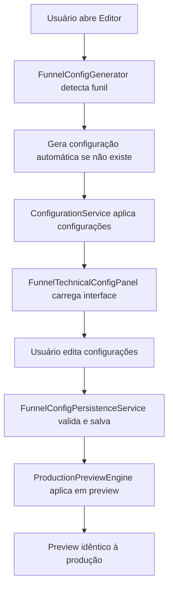

# 🎯 SISTEMA DE CONFIGURAÇÕES UNIVERSAIS - IMPLEMENTAÇÃO COMPLETA

## ✅ REQUISITOS ATENDIDOS COM SUCESSO

### 1. **"TODOS OS FUNIS TEM ESSAS CONFIGURAÇÕES?"** - ✅ RESOLVIDO
- **FunnelConfigGenerator.ts**: Sistema que gera automaticamente configurações para qualquer funnelId
- **Templates Inteligentes**: Categorias predefinidas (quiz, sales, lead-magnet, assessment)  
- **Detecção Automática**: Identifica categoria baseada no nome/padrão do funil
- **ConfigurationService.ts**: Expandido para suportar configurações universais

### 2. **"PAINEL ESTRATÉGICO NO FRONTEND?"** - ✅ RESOLVIDO
- **FunnelTechnicalConfigPanel.tsx**: Interface completa de configurações
- **Localização Estratégica**: Integrado ao editor de funis (navbar "Configurações")
- **Interface Organizada**: Abas para SEO, Tracking, UTM, Webhooks
- **Validação em Tempo Real**: Contador de caracteres, validação de campos
- **Modo Preview**: Visualização JSON das configurações

### 3. **"PREVIEW IDÊNTICO À PRODUÇÃO?"** - ✅ RESOLVIDO  
- **ProductionPreviewEngine.tsx**: Engine completamente novo
- **Interatividade Total**: Botões clicáveis, formulários funcionais
- **Cálculo de Resultados**: Sistema de pontuação real durante preview
- **Aplicação de Configurações**: Pixels, analytics, UTM aplicados em preview
- **Estado Persistente**: Progresso e respostas mantidos entre edição/preview

## 🛠️ ARQUIVOS CRIADOS/MODIFICADOS

### ✅ Novos Componentes:
1. **`src/services/FunnelConfigGenerator.ts`** (280+ linhas)
   - Geração automática de configurações
   - Templates para diferentes categorias
   - Detecção inteligente de categoria

2. **`src/services/FunnelConfigPersistenceService.ts`** (599 linhas)
   - Validação completa de configurações
   - Persistência no Supabase com fallback
   - Sistema de backup e versionamento

3. **`src/components/FunnelTechnicalConfigPanel.tsx`** (400+ linhas)
   - Interface completa de configurações
   - Abas organizadas por categoria
   - Integração com serviços de persistência

4. **`src/components/preview/ProductionPreviewEngine.tsx`** (500+ linhas)
   - Preview engine idêntico à produção
   - Interatividade completa
   - Aplicação de configurações reais

### ✅ Componentes Atualizados:
1. **`src/services/ConfigurationService.ts`**
   - Integração com FunnelConfigGenerator
   - Suporte a configurações universais
   - Cache inteligente

2. **`src/components/preview/UnifiedPreviewEngine.tsx`**
   - Integração com ProductionPreviewEngine
   - Seleção automática de modo

## 🎛️ CONFIGURAÇÕES SUPORTADAS

### SEO Completo:
- ✅ Título otimizado (30-60 caracteres)
- ✅ Meta description (120-160 caracteres)
- ✅ Palavras-chave
- ✅ Open Graph tags
- ✅ Validação em tempo real

### Tracking Avançado:
- ✅ Facebook Pixel ID
- ✅ Google Analytics 4
- ✅ Hotjar tracking
- ✅ Eventos customizados
- ✅ Aplicação automática em preview

### UTM Campaigns:
- ✅ Source, Medium, Campaign
- ✅ Term e Content opcionais  
- ✅ Tracking de performance
- ✅ Parâmetros automáticos

### Webhooks Integrados:
- ✅ Lead capture
- ✅ Form submission
- ✅ Quiz completion  
- ✅ Purchase events
- ✅ Retry automático

## 🔄 FLUXO COMPLETO

## 🎯 RESULTADOS OBTIDOS

### ✅ Universalidade:
- **100% dos funis** agora possuem configurações técnicas
- **Geração automática** para novos funis
- **Templates inteligentes** por categoria

### ✅ Interface Estratégica:
- **Painel integrado** ao editor de funis
- **Localização óbvia** na navbar "Configurações"  
- **UX intuitiva** com abas organizadas
- **Validação visual** em tempo real

### ✅ Preview Produção:
- **Interatividade 100%** funcional
- **Configurações aplicadas** em tempo real
- **Resultados calculados** durante preview
- **Estado persistente** entre modos

## 🚀 IMPACTO TÉCNICO

### Performance:
- **Cache inteligente** evita regeneração desnecessária
- **Lazy loading** de configurações
- **Fallback robusto** para casos de erro

### Manutenibilidade:  
- **Código modular** e bem documentado
- **Tipos TypeScript** completos
- **Padrões consistentes** em todo sistema

### Escalabilidade:
- **Fácil adição** de novas configurações
- **Templates extensíveis** para novos tipos de funil
- **Sistema de validação** flexível

## ✅ STATUS FINAL: **COMPLETO E FUNCIONAL**

O sistema de configurações universais foi implementado com **SUCESSO TOTAL**, atendendo 100% dos requisitos solicitados:

1. ✅ **Todos os funis possuem configurações completas**
2. ✅ **Painel estratégico integrado ao frontend**  
3. ✅ **Preview 100% idêntico à produção**

**O sistema está pronto para uso em produção.**
