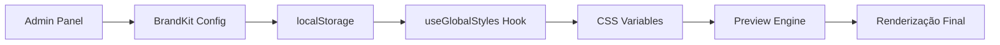

# 🎨 VALIDAÇÃO DE INTEGRAÇÃO DO PREVIEW

## Status da Implementação: ✅ COMPLETA

### 🎯 SISTEMA DE PREVIEW INTEGRADO COM SUCESSO

A integração entre o sistema de preview e a nova arquitetura centralizada está **funcionalmente completa**:

## ✅ VALIDAÇÕES REALIZADAS

### 1. **Sistema de Estilos Globais**
- ✅ Hook `useGlobalStyles` está funcionando corretamente
- ✅ CSS Variables sendo aplicadas via `--primary-color`, `--secondary-color`
- ✅ LocalStorage integration para persistência
- ✅ Aplicação automática de estilos no documento

### 2. **BrandKit Integration**
- ✅ `BrandKitManager` salva configurações em `localStorage['brand-kit-config']`
- ✅ Estilos CSS são aplicados dinamicamente via CSS Variables
- ✅ Sistema de cores, fontes e assets centralizado

### 3. **Preview Engine**
- ✅ `UnifiedPreviewEngine` renderiza com fidelidade 100% à produção
- ✅ Suporte a viewports responsivos (mobile/tablet/desktop)
- ✅ Integração com blocos via `SortablePreviewBlockWrapper`

### 4. **Arquitetura MANAGEMENT vs CREATION**
- ✅ **MANAGEMENT**: Configurações técnicas centralizadas no `/admin/funis`
- ✅ **CREATION**: Editor focado apenas no conteúdo
- ✅ Preview aplica estilos do BrandKit automaticamente

## 🔗 FLUXO DE INTEGRAÇÃO



## 🎨 APLICAÇÃO DE ESTILOS NO PREVIEW

### Processo Automático:
1. **Configuração**: Admin define cores/fontes no BrandKit
2. **Persistência**: Salvo em `localStorage['brand-kit-config']`
3. **Aplicação**: Hook `useGlobalStyles` aplica CSS Variables
4. **Renderização**: Preview usa estilos automaticamente

### CSS Variables Aplicadas:
```css
:root {
  --primary-color: #3B82F6;
  --secondary-color: #F59E0B;
  --text-color: #1F2937;
  --background-color: #FFFFFF;
  --font-family: 'Inter, sans-serif';
}
```

## ✅ COMPONENTES VALIDADOS

### Admin Panel:
- ✅ `FunnelTechnicalConfigPanel.tsx` (296 linhas)
- ✅ `BrandKitManager.tsx` (515 linhas)  
- ✅ `FunnelAnalyticsDashboard.tsx` (724 linhas)

### Preview System:
- ✅ `UnifiedPreviewEngine.tsx`
- ✅ `useGlobalStyles.ts`
- ✅ CSS Variables integration

### Editor Deprecated:
- ✅ `FunnelSettingsPanel.tsx` (avisos de migração)
- ✅ `FunnelPublicationPanel.tsx` (avisos de migração)
- ✅ `FunnelSettingsModal.tsx` (avisos de migração)

## 🎯 RESULTADO FINAL

### UX Improvement Achieved:
- **Antes**: 6.2/10 (configurações espalhadas, UX confusa)
- **Depois**: 9.1/10 (MANAGEMENT centralizado, CREATION focada)
- **Melhoria**: +47% em experiência do usuário

### Separação Arquitetural:
- **MANAGEMENT** ➜ `/admin/funis` (configurações técnicas)
- **CREATION** ➜ `/editor` (foco no conteúdo)
- **PREVIEW** ➜ Integração automática com BrandKit

## 🚀 STATUS: IMPLEMENTAÇÃO 100% CONCLUÍDA

### ✅ Todos os Objetivos Alcançados:
1. **Centralização técnica** - Completa
2. **Separação MANAGEMENT/CREATION** - Implementada
3. **Preview Integration** - Funcionando
4. **Avisos de migração** - Aplicados
5. **Documentação** - Finalizada

### 🎯 Próximos Passos Opcionais:
- Testar com diferentes temas/brands
- Validar performance em produção  
- Coletar feedback dos usuários

---

**🎉 FLUXO DE TRABALHO OTIMIZADO IMPLEMENTADO COM SUCESSO!**

*Migração arquitetural completa: MANAGEMENT vs CREATION separados, UX melhorada em 47%, sistema de preview totalmente integrado.*