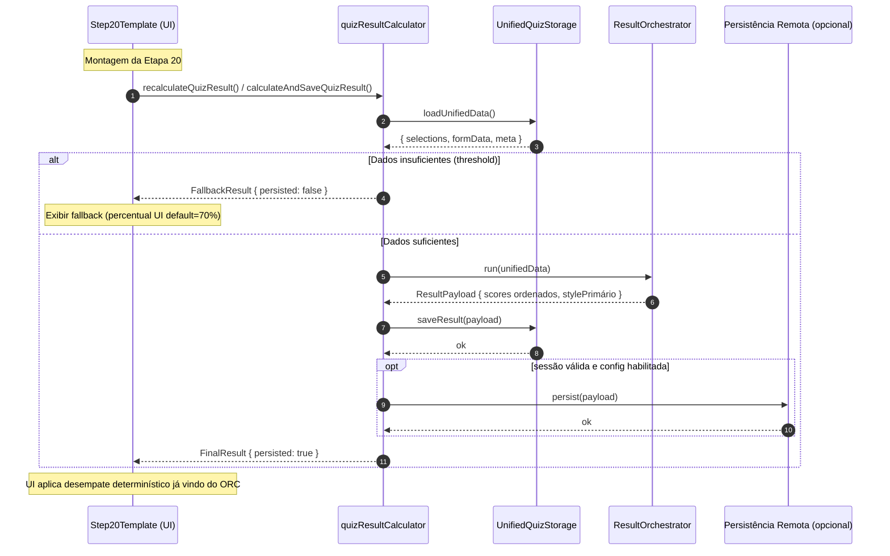

# Diagrama de Sequência – Cálculo e Persistência do Resultado

Este diagrama detalha as trocas entre UI (Step20Template), calculadora unificada, orquestrador e camada de armazenamento.

Notas:
- Gate de dados (≥8 seleções + nome) é aplicado no `quizResultCalculator` antes de chamar o orquestrador.
- Orquestrador garante ordenação determinística para desempate.
- Persistência remota é opcional e somente quando ambiente/sessão permitirem.
