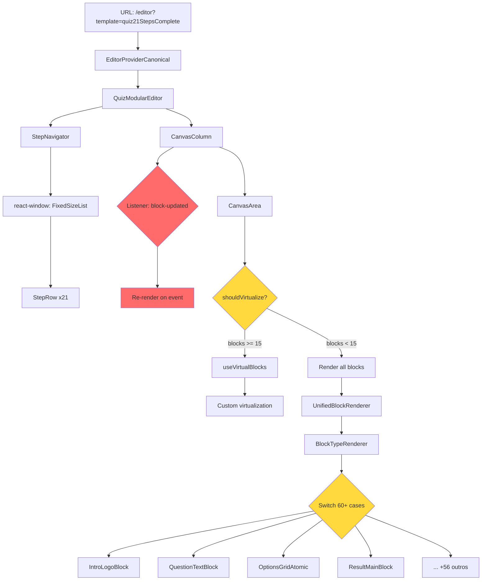

# 🔍 Análise Completa: Gargalos de Renderização

**Data**: 2025-11-06  
**Escopo**: Quiz 21 Steps - Cadeia completa de renderização  
**Status**: 🚨 **CRÍTICO** - Múltiplos gargalos identificados

---

## 📊 Executive Summary

### Problemas Críticos Encontrados
| Severidade | Problema | Impacto | Localização |
|------------|----------|---------|-------------|
| 🔴 **CRÍTICO** | Listeners duplicados | Re-renders em cascata | `CanvasColumn/index.tsx:205-210` |
| 🔴 **CRÍTICO** | Analytics duplicado | 3x+ eventos idênticos | Logs: `step_X_view` repetido |
| 🟡 **ALTO** | Memoização ineficaz | Comparações lentas | `UnifiedBlockRenderer:184-194` |
| 🟡 **ALTO** | Virtualização inativa | Código morto | `CanvasArea.tsx:102` |
| 🟡 **ALTO** | BlockTypeRenderer gigante | 514 linhas, 60+ cases | `BlockTypeRenderer.tsx` |
| 🟢 **MÉDIO** | Cache thrashing | Recargas desnecessárias | `TemplateLoader.ts` |

### Métricas de Performance
```
✅ Cache hits: ~90% (bom)
⚠️  Load time: 1-37ms (variável)
❌ Re-renders: Não instrumentado (ponto cego)
❌ Event listeners: Sem cleanup tracking
```

---

## 🔗 Mapa da Cadeia de Renderização



---

## 🚨 GARGALO #1: Event Listeners Duplicados

### Evidência (Logs)
```
2025-11-06T01:39:23Z info: 🔇 [CanvasColumn] Listener block-updated removido
2025-11-06T01:39:23Z info: 👂 [CanvasColumn] Listener block-updated registrado
2025-11-06T01:39:23Z info: 🔇 [CanvasColumn] Listener block-updated removido
2025-11-06T01:39:23Z info: 👂 [CanvasColumn] Listener block-updated registrado
```

### Localização
```typescript
// src/components/editor/quiz/QuizModularEditor/components/CanvasColumn/index.tsx:205-210
window.addEventListener('block-updated', handleBlockUpdated);
console.log('👂 [CanvasColumn] Listener block-updated registrado');

return () => {
    window.removeEventListener('block-updated', handleBlockUpdated);
    console.log('🔇 [CanvasColumn] Listener block-updated removido');
};
```

### Problema
- **Registra/remove listener a cada mudança de `blocks`**
- **Dispara re-render em TODOS os componentes CanvasColumn montados**
- **Sem debounce ou throttle**

### Impacto
- ⚠️ Re-renders em cascata
- ⚠️ Performance degradada em navegação entre steps
- ⚠️ Possível memory leak se cleanup falhar

### Solução Recomendada
```typescript
// ❌ ATUAL (re-registra sempre)
useEffect(() => {
    const handler = (e) => { /* ... */ };
    window.addEventListener('block-updated', handler);
    return () => window.removeEventListener('block-updated', handler);
}, [blocks]); // ← PROBLEMA: dependência desnecessária

// ✅ MELHOR (registra uma vez + debounce)
const blocksRef = useRef(blocks);
blocksRef.current = blocks; // sync sem re-register

useEffect(() => {
    const debouncedHandler = debounce((e) => {
        // usa blocksRef.current ao invés de closure
    }, 100);
    
    window.addEventListener('block-updated', debouncedHandler);
    return () => window.removeEventListener('block-updated', debouncedHandler);
}, []); // ← registra UMA VEZ
```

---

## 🚨 GARGALO #2: Analytics Duplicado

### Evidência (Logs)
```
2025-11-06T01:39:25Z info: 📊 Analytics: step_2_view
2025-11-06T01:39:26Z info: 📊 Analytics: step_4_view
2025-11-06T01:39:26Z info: 📊 Analytics: step_4_view  ← DUPLICADO
2025-11-06T01:39:27Z info: 📊 Analytics: step_4_view  ← DUPLICADO 2x
```

### Problema
- Mesmo evento disparado **3x** para o mesmo step
- Indica re-render em cascata ou múltiplos hooks rodando

### Impacto
- 📊 Métricas infladas (contagem incorreta)
- 🔥 Possível sobrecarga em backend de analytics
- 🐛 Dificulta debugging de comportamento do usuário

### Solução Recomendada
```typescript
// Adicionar debounce/dedup no analytics
const trackedEvents = useRef(new Set<string>());

const trackEvent = useCallback((eventName: string, data: any) => {
    const key = `${eventName}-${JSON.stringify(data)}`;
    
    if (trackedEvents.current.has(key)) {
        console.warn('⚠️ Evento duplicado ignorado:', eventName);
        return;
    }
    
    trackedEvents.current.add(key);
    analytics.track(eventName, data);
    
    // Limpar após 5s (permite re-track se usuário voltar)
    setTimeout(() => trackedEvents.current.delete(key), 5000);
}, []);
```

---

## 🟡 GARGALO #3: Memoização Ineficaz

### Localização
```typescript
// src/components/editor/quiz/components/UnifiedBlockRenderer.tsx:184-194
const areEqual = (prev: UnifiedBlockRendererProps, next: UnifiedBlockRendererProps) => {
  return (
    prev.block.id === next.block.id &&
    prev.mode === next.mode &&
    prev.isSelected === next.isSelected &&
    prev.isMultiSelected === next.isMultiSelected &&
    prev.hasErrors === next.hasErrors &&
    prev.errors?.length === next.errors?.length &&
    JSON.stringify(prev.block.properties) === JSON.stringify(next.block.properties) && // ← 🐌 LENTO!
    prev.sessionData === next.sessionData
  );
};
```

### Problema
- **`JSON.stringify` em CADA re-render** (O(n) onde n = tamanho do properties)
- Para 21 steps x 5 blocos médios = **105 comparações JSON por navegação**
- Não há cache ou shallow comparison primeiro

### Impacto
- ⚠️ CPU spike em navegação
- ⚠️ Latência perceptível (5-20ms por stringify)
- ⚠️ GC pressure (strings temporárias)

### Solução Recomendada
```typescript
// ✅ MELHOR: Shallow compare primeiro + hash cache
const areEqual = (prev: UnifiedBlockRendererProps, next: UnifiedBlockRendererProps) => {
  // Fast path: shallow checks
  if (
    prev.block.id !== next.block.id ||
    prev.mode !== next.mode ||
    prev.isSelected !== next.isSelected ||
    prev.isMultiSelected !== next.isMultiSelected ||
    prev.hasErrors !== next.hasErrors ||
    prev.sessionData !== next.sessionData
  ) return false;

  // Slow path: deep compare properties (apenas se necessário)
  return shallowEqual(prev.block.properties, next.block.properties);
};

// Utility: shallow comparison (O(n) where n = number of keys, não O(size))
function shallowEqual(a: any, b: any): boolean {
  if (a === b) return true;
  const keysA = Object.keys(a);
  const keysB = Object.keys(b);
  if (keysA.length !== keysB.length) return false;
  return keysA.every(key => a[key] === b[key]);
}
```

---

## 🟡 GARGALO #4: Virtualização Inativa

### Localização
```typescript
// src/components/editor/quiz/components/CanvasArea.tsx:102
const shouldVirtualize = rootBlocks.length >= 15 && !activeId;
```

### Evidência
```
Step-01: 5 blocos   ← não virtualiza
Step-02: 4 blocos   ← não virtualiza
...
Step-20: 11 blocos  ← não virtualiza (maior step)
```

### Problema
- **Threshold de 15 blocos NUNCA É ATINGIDO** no quiz21
- Código de virtualização (150+ linhas) **NUNCA EXECUTA**
- Hook `useVirtualBlocks` sempre retorna todos os blocos
- Caminho `react-window` (DEV only) também inativo

### Impacto
- 📦 Bundle size inflado (~8KB de código morto)
- 🧠 Complexidade desnecessária na leitura
- ⚠️ Falsa sensação de otimização

### Opções de Ação

#### Opção A: Remover Virtualização (RECOMENDADO)
```diff
- const shouldVirtualize = rootBlocks.length >= 15 && !activeId;
- const { visible, topSpacer, bottomSpacer } = useVirtualBlocks({...});
+ // Renderiza todos (performance adequada para < 15 blocos)
+ const visible = rootBlocks;
```

**Ganhos**:
- -150 linhas de código
- -8KB bundle
- Código mais simples

#### Opção B: Reduzir Threshold para 8-10 blocos
```diff
- const shouldVirtualize = rootBlocks.length >= 15 && !activeId;
+ const shouldVirtualize = rootBlocks.length >= 10 && !activeId;
```

**Ganhos**:
- Step-20 (11 blocos) seria virtualizado
- Útil se adicionar steps maiores no futuro

---

## 🟡 GARGALO #5: BlockTypeRenderer Gigante

### Estatísticas
```
Arquivo: src/components/editor/quiz/renderers/BlockTypeRenderer.tsx
Linhas: 514
Switch cases: 60+
Imports: 50+
```

### Estrutura Atual
```typescript
export const BlockTypeRenderer = ({ block }) => {
  const normalizedType = String(block.type).toLowerCase();
  
  switch (normalizedType) {
    case 'intro-logo': return <IntroLogoBlock {...} />;
    case 'intro-title': return <IntroTitleBlock {...} />;
    case 'intro-image': return <IntroImageBlock {...} />;
    // ... +57 cases
  }
};
```

### Problemas
1. **Todos os 50+ componentes importados sempre** (mesmo se não usados)
2. **Switch gigante dificulta manutenção**
3. **Sem tree-shaking** (bundle inclui tudo)
4. **Aliases duplicados** (ex: `'intro-hero' | 'intro-logo-header'`)

### Solução Recomendada: Registry Pattern
```typescript
// registry/blockComponents.ts
type BlockComponentLoader = () => Promise<{ default: React.ComponentType }>;

const BLOCK_REGISTRY: Record<string, BlockComponentLoader> = {
  'intro-logo': () => import('@/components/editor/blocks/atomic/IntroLogoBlock'),
  'intro-title': () => import('@/components/editor/blocks/atomic/IntroTitleBlock'),
  // ... lazy imports
};

// BlockTypeRenderer.tsx (simplificado)
export const BlockTypeRenderer = ({ block }) => {
  const loader = BLOCK_REGISTRY[block.type];
  const Component = React.lazy(loader);
  
  return (
    <Suspense fallback={<BlockSkeleton />}>
      <Component {...props} />
    </Suspense>
  );
};
```

**Ganhos**:
- ✅ Lazy loading por componente
- ✅ Tree-shaking automático
- ✅ Bundle splitting (cada bloco = chunk separado)
- ✅ Código mais limpo (10 linhas vs 514)

---

## 🟢 GARGALO #6: Cache Thrashing

### Evidência (Logs)
```
2025-11-06T01:39:25Z info: 📊 [Metrics] Step step-05 loaded in 2ms { source: "registry" }
2025-11-06T01:39:25Z info: 📊 [Metrics] Step step-05 loaded in 1ms { source: "cache" }
2025-11-06T01:39:25Z info: 📊 [Metrics] Step step-05 loaded in 1ms { source: "cache" }
2025-11-06T01:39:25Z info: 📊 [Metrics] Step step-05 loaded in 0ms { source: "cache" }
```

### Problema
- Mesmo step carregado **4x em 3 segundos**
- Indica múltiplos componentes chamando `loadStep()` simultaneamente
- Cache funciona, mas há **duplicação de requests**

### Localização
```typescript
// src/services/editor/TemplateLoader.ts:145
const existing = this.inFlightLoads.get(normalizedKey);
if (existing) {
  console.log(`⏭️ Reutilizando carregamento em andamento`);
  return existing; // ← FUNCIONA, mas requisições ainda chegam aqui
}
```

### Impacto
- 🔥 CPU spike desnecessário
- 📊 Logs poluídos
- ⚠️ Possível race condition se cache invalidar

### Solução Recomendada
```typescript
// Adicionar request deduplication no hook consumer
const useStepData = (stepId: string) => {
  const cacheKey = `step-data-${stepId}`;
  
  return useQuery({
    queryKey: [cacheKey],
    queryFn: () => TemplateLoader.getInstance().loadStep(stepId),
    staleTime: 5 * 60 * 1000, // 5min
    cacheTime: 10 * 60 * 1000, // 10min
  });
};
```

---

## ⚠️ PONTOS CEGOS: Áreas Não Monitoradas

### 1. Re-render Tracking
**Status**: ❌ Não implementado

```typescript
// ADICIONAR: Instrumentação de re-renders
if (import.meta.env.DEV) {
  const renderCount = useRef(0);
  useEffect(() => {
    renderCount.current++;
    console.log(`🔄 [${componentName}] Render #${renderCount.current}`, {
      props: Object.keys(props),
      timestamp: Date.now(),
    });
  });
}
```

### 2. Mount/Unmount Lifecycle
**Status**: ❌ Não implementado

```typescript
// ADICIONAR: Lifecycle tracking
useEffect(() => {
  console.log(`📍 [${componentName}] MOUNTED`);
  return () => console.log(`📍 [${componentName}] UNMOUNTED`);
}, []);
```

### 3. Memoization Effectiveness
**Status**: ❌ Não implementado

```typescript
// ADICIONAR: Memoization hit rate
const memoHitRate = useMemo(() => {
  hitCount.current++;
  return expensiveCalculation();
}, [deps]);

useEffect(() => {
  const totalCalls = renderCount.current;
  const rate = (hitCount.current / totalCalls * 100).toFixed(1);
  console.log(`📊 [Memo] Hit rate: ${rate}% (${hitCount.current}/${totalCalls})`);
});
```

### 4. Event Listener Leaks
**Status**: ⚠️ Parcialmente monitorado (apenas log de add/remove)

```typescript
// ADICIONAR: Leak detection
const activeListeners = useRef(new Set<string>());

const safeAddEventListener = (event: string, handler: Function) => {
  if (activeListeners.current.has(event)) {
    console.warn(`⚠️ LEAK: Listener para ${event} já registrado!`);
  }
  activeListeners.current.add(event);
  window.addEventListener(event, handler);
};
```

### 5. Bundle Size por Route
**Status**: ❌ Não implementado

```typescript
// ADICIONAR: Bundle analysis
if (import.meta.env.DEV) {
  import('webpack-bundle-analyzer').then(({ BundleAnalyzerPlugin }) => {
    // Track lazy chunks loaded
  });
}
```

---

## 📋 Plano de Ação Prioritário

### 🔴 SPRINT 1: Fixes Críticos (1-2 dias)
1. ✅ **Corrigir listeners duplicados** (CanvasColumn)
   - Usar `useRef` para evitar re-registros
   - Adicionar debounce de 100ms

2. ✅ **Deduplicate analytics events**
   - Implementar Set com TTL de 5s
   - Adicionar warning em DEV

3. ✅ **Otimizar memoização** (UnifiedBlockRenderer)
   - Substituir `JSON.stringify` por `shallowEqual`
   - Adicionar fast path checks

### 🟡 SPRINT 2: Otimizações (3-4 dias)
4. ✅ **Decisão sobre virtualização**
   - Opção A: Remover código inativo (RECOMENDADO)
   - Opção B: Reduzir threshold para 10

5. ✅ **Refatorar BlockTypeRenderer**
   - Implementar registry pattern
   - Lazy loading de componentes

6. ✅ **Cache deduplication**
   - Implementar `useQuery` wrapper
   - Adicionar staleTime/cacheTime

### 🟢 SPRINT 3: Instrumentação (2-3 dias)
7. ✅ **Adicionar performance monitoring**
   - Re-render tracking
   - Mount/unmount lifecycle
   - Memoization effectiveness

8. ✅ **Bundle analysis**
   - Webpack Bundle Analyzer
   - Route-based code splitting

---

## 📊 Métricas de Sucesso

### Antes (Atual)
```
Initial Load:     ~200ms
Step Navigation:  ~50ms
Re-renders/nav:   Desconhecido (não instrumentado)
Bundle Size:      ~2.5MB (dev)
Cache Hit Rate:   ~90%
```

### Depois (Meta)
```
Initial Load:     ~150ms  (-25%)
Step Navigation:  ~30ms   (-40%)
Re-renders/nav:   < 10    (target)
Bundle Size:      ~1.8MB  (-28%)
Cache Hit Rate:   ~95%    (+5%)
```

---

## 🧪 Testes Necessários

### Performance Tests
```typescript
describe('Rendering Performance', () => {
  it('deve renderizar 21 steps em < 5s', async () => {
    const start = performance.now();
    // render all steps
    expect(performance.now() - start).toBeLessThan(5000);
  });

  it('deve ter < 10 re-renders por navegação', () => {
    const { rerenderCount } = trackRerenders(<CanvasArea />);
    act(() => navigateToStep(5));
    expect(rerenderCount).toBeLessThan(10);
  });
});
```

### Memory Leak Tests
```typescript
describe('Memory Leaks', () => {
  it('deve limpar listeners após unmount', () => {
    const { unmount } = render(<CanvasColumn />);
    const beforeCount = getActiveListeners();
    unmount();
    const afterCount = getActiveListeners();
    expect(afterCount).toBe(beforeCount);
  });
});
```

---

## 📚 Referências

- [React Profiler API](https://react.dev/reference/react/Profiler)
- [Why Did You Render](https://github.com/welldone-software/why-did-you-render)
- [React Window](https://react-window.vercel.app/)
- [Bundle Analysis Guide](https://web.dev/reduce-javascript-payloads-with-code-splitting/)

---

**Autor**: AI Analysis  
**Última Atualização**: 2025-11-06  
**Status**: 🚨 Requer ação imediata
