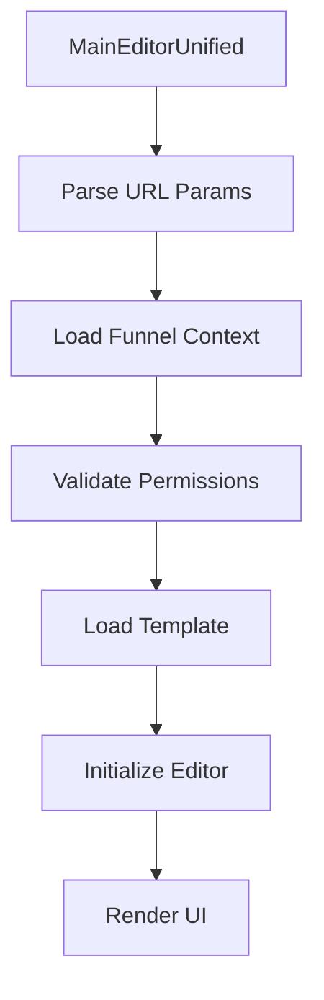

# 🏗️ Arquitetura do Editor - Quiz Quest Challenge Verse

## 📋 Índice
1. [Visão Geral da Arquitetura](#visão-geral-da-arquitetura)
2. [Hierarquia de Componentes](#hierarquia-de-componentes)
3. [Fluxo de Dados](#fluxo-de-dados)
4. [Sistema de Contextos](#sistema-de-contextos)
5. [Variáveis de Ambiente](#variáveis-de-ambiente)
6. [Fluxos de Fallback e Recovery](#fluxos-de-fallback-e-recovery)
7. [Exemplos Práticos de Uso](#exemplos-práticos-de-uso)
8. [Guia de Onboarding](#guia-de-onboarding)

---

## 🎯 Visão Geral da Arquitetura

### Editor Principal
O **MainEditorUnified** é o editor principal do sistema, localizado em `/src/pages/MainEditorUnified.tsx`. Ele serve como ponto de entrada para toda a funcionalidade de edição de funis.

```typescript
// Arquitetura de Alto Nível
MainEditorUnified
├── ErrorBoundary (captura de erros)
├── UnifiedFunnelProvider (contexto global de funis)
├── FunnelsProvider (compatibilidade legacy)
├── EditorProvider (estado do editor)
├── EditorQuizProvider (integração com quiz)
├── Quiz21StepsProvider (navegação das etapas)
└── QuizFlowProvider (fluxo do quiz)
```

### Estratégia de Loading
O sistema utiliza uma estratégia de **fallback em cascata** para garantir disponibilidade:

1. **UnifiedEditor** (preferido) - Editor moderno com todas as funcionalidades
2. **EditorPro** (fallback) - Editor estável com funcionalidades essenciais  
3. **MainEditor** (último recurso) - Editor básico para situações críticas

---

## 🏗️ Hierarquia de Componentes

### 1. Estrutura Principal

```
📁 src/pages/
├── MainEditorUnified.tsx        # 🎯 Editor principal
├── MainEditorUnified.new.tsx    # 🧪 Versão experimental
└── editor/                      # 📂 Páginas legacy

📁 src/components/editor/
├── UnifiedEditor.tsx            # 🥇 Editor principal moderno
├── EditorPro.tsx               # 🥈 Editor estável (fallback)
├── MainEditor.tsx              # 🥉 Editor básico (último recurso)
├── ErrorBoundary.tsx           # 🛡️ Captura de erros
├── EditorFallback.tsx          # 🔄 Sistema de fallback
└── SchemaDrivenEditorResponsive.tsx # 📱 Editor responsivo
```

### 2. Componentes de Layout

```
📁 src/components/editor/layouts/
├── FourColumnLayout.tsx         # 🏗️ Layout de 4 colunas
├── EditorLayout.tsx            # 📐 Layout unificado
└── EditorToolbar.tsx           # 🛠️ Barra de ferramentas

📁 src/components/editor/sidebars/
├── FunnelStagesPanel.tsx       # 📋 Painel das 21 etapas
├── ComponentsSidebar.tsx       # 🧩 Biblioteca de componentes
└── CombinedComponentsPanel.tsx # 🎨 Painel combinado
```

### 3. Sistema de Canvas

```
📁 src/components/editor/canvas/
├── CanvasDropZone.tsx          # 🎨 Área de edição principal
├── SortableBlockWrapper.tsx    # 🔄 Wrapper drag & drop
└── preview/                    # 📱 Sistema de preview
    ├── PreviewNavigation.tsx   # 🧭 Navegação do preview
    └── PreviewToggleButton.tsx # 🔄 Alternador de modo
```

### 4. Painel de Propriedades

```
📁 src/components/editor/properties/
├── PropertiesPanel.tsx         # ⚙️ Painel principal
├── EnhancedUniversalPropertiesPanel.tsx # 🚀 Painel avançado
└── editors/                    # 📝 Editores específicos
    ├── QuizQuestionEditor.tsx  # ❓ Editor de perguntas
    ├── HeaderEditor.tsx        # 📄 Editor de cabeçalho
    ├── TextEditor.tsx         # 📝 Editor de texto
    └── ButtonEditor.tsx       # 🔘 Editor de botões
```

---

## 🔄 Fluxo de Dados

### 1. Inicialização do Editor



### 2. Estados do Editor

```typescript
interface EditorState {
  // Estado do funil
  funnel: UnifiedFunnel | null;
  activeStageId: string | null;       // Etapa atual (1-21)
  
  // Estado dos blocos
  selectedBlockId: string | null;     // Bloco selecionado
  selectedBlock: UnifiedBlock | null; // Dados do bloco
  
  // Estados de controle
  isLoading: boolean;                 // Carregando
  isSaving: boolean;                  // Salvando
  isDirty: boolean;                   // Tem alterações
  isPreviewing: boolean;              // Modo preview
  
  // Metadados
  lastSaved: Date | null;             // Último salvamento
  error: string | null;               // Erro atual
}
```

### 3. Ciclo de Vida dos Blocos

```typescript
// 1. Adição de Bloco
const addBlock = async (type: string) => {
  const block = createBlock(type);
  await editorActions.addBlock(block);
  setSelectedBlockId(block.id);
};

// 2. Edição de Propriedades
const updateBlock = async (id: string, updates: any) => {
  await editorActions.updateBlock(id, updates);
  setIsDirty(true);
  triggerAutoSave();
};

// 3. Remoção de Bloco
const deleteBlock = async (id: string) => {
  await editorActions.deleteBlock(id);
  setSelectedBlockId(null);
};
```

---

## 🔗 Sistema de Contextos

### 1. Hierarquia de Contextos

```typescript
// Ordem de aninhamento (de fora para dentro)
<UnifiedFunnelProvider>        // 🌍 Contexto global
  <FunnelsProvider>            // 🔄 Compatibilidade legacy
    <EditorProvider>           // ✏️ Estado do editor
      <EditorQuizProvider>     // 🎯 Integração quiz
        <Quiz21StepsProvider>  // 📋 Navegação das etapas
          <QuizFlowProvider>   // 🌊 Fluxo do quiz
            {/* Componentes */}
          </QuizFlowProvider>
        </Quiz21StepsProvider>
      </EditorQuizProvider>
    </EditorProvider>
  </FunnelsProvider>
</UnifiedFunnelProvider>
```

### 2. Principais Contextos

#### **EditorProvider**
```typescript
interface EditorContextValue {
  // Estado
  stepBlocks: Record<string, Block[]>;
  selectedBlockId: string | null;
  activeStageId: string;
  
  // Ações
  addBlock: (type: string) => void;
  updateBlock: (id: string, updates: any) => void;
  deleteBlock: (id: string) => void;
  setActiveStage: (id: string) => void;
  
  // Utilitários
  exportProject: () => Project;
  importProject: (project: Project) => void;
}
```

#### **UnifiedFunnelProvider**
```typescript
interface UnifiedFunnelContextValue {
  // Estado do funil
  funnel: UnifiedFunnel | null;
  isLoading: boolean;
  error: string | null;
  
  // Metadados
  canEdit: boolean;
  owner: User | null;
  lastModified: Date | null;
  
  // Ações
  saveFunnel: () => Promise<void>;
  publishFunnel: () => Promise<void>;
  deleteFunnel: () => Promise<void>;
}
```

### 3. Hooks Personalizados

```typescript
// Hook principal do editor
export const useEditor = () => {
  const context = useContext(EditorContext);
  if (!context) {
    throw new Error('useEditor deve ser usado dentro de EditorProvider');
  }
  return context;
};

// Hook do funil unificado
export const useUnifiedFunnel = () => {
  const context = useContext(UnifiedFunnelContext);
  return context; // Pode ser null
};

// Hook das 21 etapas
export const useQuiz21Steps = () => {
  const context = useContext(Quiz21StepsContext);
  return context;
};
```

---

## 🔧 Variáveis de Ambiente

### Arquivo: `.env.local`

```bash
# ===== SUPABASE - BANCO DE DADOS =====
VITE_SUPABASE_URL=https://pwtjuuhchtbzttrzoutw.supabase.co
VITE_SUPABASE_ANON_KEY=eyJhbGciOiJIUzI1NiIs...

# ===== EDITOR DE FUNIL =====
# ✅ Habilita persistência no Supabase
VITE_EDITOR_SUPABASE_ENABLED=true

# 🎯 Funil padrão para desenvolvimento
VITE_DEFAULT_FUNNEL_ID=funnel-1753409877331

# 📊 Modo debug (logs detalhados)
VITE_EDITOR_DEBUG_MODE=false

# ===== API E CDN =====
VITE_API_URL=http://localhost:3000
VITE_CDN_URL=https://cdn.example.com

# ===== FACEBOOK PIXEL =====
FACEBOOK_PIXEL_ID=123456789012345
FACEBOOK_ACCESS_TOKEN=your_token_here
FACEBOOK_TEST_EVENT_CODE=TEST12345

# ===== HOTMART WEBHOOK =====
HOTMART_WEBHOOK_SECRET=your_secret_here

# ===== DESENVOLVIMENTO =====
NODE_ENV=development
VITEST=false
```

### Como as Variáveis são Usadas

```typescript
// 1. Configuração do Supabase
const supabaseConfig = {
  enabled: import.meta.env.VITE_ENABLE_SUPABASE === 'true',
  funnelId: import.meta.env.VITE_SUPABASE_FUNNEL_ID,
  quizId: import.meta.env.VITE_SUPABASE_QUIZ_ID || 'local-funnel',
};

// 2. API URLs
const apiConfig = {
  apiUrl: import.meta.env.VITE_API_URL || 'http://localhost:3000',
  cdnUrl: import.meta.env.VITE_CDN_URL || '',
};

// 3. Debug mode
const debugMode = import.meta.env.VITE_EDITOR_DEBUG_MODE === 'true';

// 4. Build optimization
const isDev = process.env.NODE_ENV === 'development';
```

---

## 🛡️ Fluxos de Fallback e Recovery

### 1. Sistema de Error Boundaries

```typescript
// ErrorBoundary.tsx - Captura todos os erros de renderização
<ErrorBoundary 
  fallback={<EditorErrorFallback />}
  onError={(error, errorInfo) => {
    console.error('Editor Error:', error);
    // Opcional: enviar para sistema de monitoring
  }}
>
  <Editor />
</ErrorBoundary>
```

### 2. Fallback de Loading do Editor

```typescript
// EditorFallback.tsx - Sistema de fallback em cascata
const EditorFallback = ({ templateId, funnelId }) => {
  const [attempts, setAttempts] = useState(0);
  const [EditorComponent, setEditorComponent] = useState(null);
  
  // Tenta carregar editores em ordem de prioridade
  const editorPaths = [
    '../editor/UnifiedEditor',    // 🥇 Primeiro
    '../editor/EditorPro',        // 🥈 Segundo  
    '../editor/MainEditor'        // 🥉 Último recurso
  ];
  
  // Implementa retry automático com timeout
};
```

### 3. Recovery de Estados

```typescript
// MainEditorUnified.tsx - Sistema de recovery
const MainEditorUnified = () => {
  const [loadingTimeout, setLoadingTimeout] = useState(false);
  const [fallbackMode, setFallbackMode] = useState(false);
  
  // Timeout de loading (10 segundos)
  useEffect(() => {
    const timer = setTimeout(() => {
      setLoadingTimeout(true);
      // Força fallback após timeout
    }, 10000);
    
    return () => clearTimeout(timer);
  }, []);
  
  // Recovery strategies
  const handleRetry = () => {
    window.location.reload();
  };
  
  const handleResetStorage = () => {
    localStorage.clear();
    window.location.reload();
  };
};
```

### 4. Estados de Fallback Visuais

```typescript
// Loading states com timeout visual
if (isLoading) {
  const timeElapsed = Math.round((Date.now() - startTime) / 1000);
  
  return (
    <div className="loading-state">
      <LoadingSpinner />
      <p>Carregando editor...</p>
      
      {timeElapsed > 5 && (
        <p>Carregando há {timeElapsed}s...</p>
      )}
      
      {timeElapsed > 8 && (
        <div className="warning">
          ⏰ Carregamento mais lento que o normal
        </div>
      )}
    </div>
  );
}
```

### 5. Fluxo de Recuperação de Dados

```typescript
// Sistema de backup e recovery automático
const useDataRecovery = () => {
  // 1. Auto-save periódico
  useInterval(() => {
    if (isDirty) {
      saveToLocalStorage(editorState);
    }
  }, 5000);
  
  // 2. Recovery ao carregar
  useEffect(() => {
    const recoveredData = loadFromLocalStorage();
    if (recoveredData && !currentData) {
      setEditorState(recoveredData);
      showRecoveryToast();
    }
  }, []);
  
  // 3. Backup antes de operações críticas
  const performCriticalOperation = async () => {
    const backup = createBackup(editorState);
    
    try {
      await criticalOperation();
    } catch (error) {
      restoreFromBackup(backup);
      throw error;
    }
  };
};
```

---

## 💡 Exemplos Práticos de Uso

### 1. Adicionando um Novo Tipo de Bloco

```typescript
// 1. Definir o tipo do bloco
interface CustomBlock extends UnifiedBlock {
  type: 'custom-block';
  properties: {
    title: string;
    color: string;
    action: 'redirect' | 'submit';
  };
}

// 2. Criar o componente do bloco
const CustomBlockComponent: React.FC<{ block: CustomBlock }> = ({ block }) => {
  const { updateBlock } = useEditor();
  
  return (
    <div style={{ backgroundColor: block.properties.color }}>
      <h3>{block.properties.title}</h3>
      <button onClick={() => updateBlock(block.id, { /* updates */ })}>
        Editar
      </button>
    </div>
  );
};

// 3. Registrar na biblioteca de componentes
const ComponentsLibrary = {
  'custom-block': {
    name: 'Bloco Personalizado',
    icon: '🎨',
    component: CustomBlockComponent,
    defaultProperties: {
      title: 'Novo Bloco',
      color: '#f0f0f0',
      action: 'submit'
    }
  }
};
```

### 2. Criando um Hook de Navegação de Etapas

```typescript
// useStageNavigation.ts
export const useStageNavigation = () => {
  const { activeStageId, setActiveStage } = useEditor();
  const { currentStep, goToStep } = useQuiz21Steps();
  
  const navigateToStage = (stageId: string) => {
    // Validar se pode navegar
    if (canNavigateToStage(stageId)) {
      setActiveStage(stageId);
      goToStep(parseInt(stageId));
      
      // Analytics
      trackStageNavigation(stageId);
    }
  };
  
  const getStageInfo = (stageId: string) => {
    return {
      isActive: activeStageId === stageId,
      isCompleted: isStageCompleted(stageId),
      hasBlocks: getStageBlocks(stageId).length > 0,
      canNavigate: canNavigateToStage(stageId)
    };
  };
  
  return {
    activeStageId,
    navigateToStage,
    getStageInfo,
    allStages: STAGE_DEFINITIONS
  };
};

// Uso no componente
const StageSelector = () => {
  const { navigateToStage, getStageInfo } = useStageNavigation();
  
  return (
    <div>
      {STAGES.map(stage => {
        const info = getStageInfo(stage.id);
        
        return (
          <button
            key={stage.id}
            className={`stage-button ${info.isActive ? 'active' : ''}`}
            onClick={() => navigateToStage(stage.id)}
            disabled={!info.canNavigate}
          >
            {info.isCompleted && '✅'} {stage.name}
          </button>
        );
      })}
    </div>
  );
};
```

### 3. Sistema de Propriedades Dinâmicas

```typescript
// PropertyEditor.tsx
const PropertyEditor: React.FC<{ block: UnifiedBlock }> = ({ block }) => {
  const { updateBlock } = useEditor();
  
  // Sistema de propriedades baseado no tipo do bloco
  const getPropertyFields = (blockType: string) => {
    switch (blockType) {
      case 'quiz-question':
        return [
          { name: 'question', type: 'text', label: 'Pergunta' },
          { name: 'options', type: 'array', label: 'Opções' },
          { name: 'correctAnswer', type: 'number', label: 'Resposta Correta' }
        ];
      
      case 'text':
        return [
          { name: 'content', type: 'richtext', label: 'Conteúdo' },
          { name: 'fontSize', type: 'number', label: 'Tamanho da Fonte' },
          { name: 'color', type: 'color', label: 'Cor do Texto' }
        ];
      
      case 'button':
        return [
          { name: 'text', type: 'text', label: 'Texto do Botão' },
          { name: 'action', type: 'select', label: 'Ação', options: ['submit', 'next', 'redirect'] },
          { name: 'style', type: 'select', label: 'Estilo', options: ['primary', 'secondary', 'outline'] }
        ];
      
      default:
        return [];
    }
  };
  
  const fields = getPropertyFields(block.type);
  
  const handlePropertyChange = (propertyName: string, value: any) => {
    updateBlock(block.id, {
      properties: {
        ...block.properties,
        [propertyName]: value
      }
    });
  };
  
  return (
    <div className="property-editor">
      <h3>Propriedades - {block.type}</h3>
      
      {fields.map(field => (
        <PropertyField
          key={field.name}
          field={field}
          value={block.properties[field.name]}
          onChange={(value) => handlePropertyChange(field.name, value)}
        />
      ))}
    </div>
  );
};
```

### 4. Sistema de Templates

```typescript
// templateManager.ts
export const TemplateManager = {
  // Carregar template
  loadTemplate: async (templateId: string): Promise<FunnelTemplate> => {
    try {
      // 1. Tentar cache local
      const cached = loadFromCache(templateId);
      if (cached && !isExpired(cached)) {
        return cached;
      }
      
      // 2. Carregar do servidor
      const template = await fetchTemplate(templateId);
      
      // 3. Salvar no cache
      saveToCache(templateId, template);
      
      return template;
    } catch (error) {
      // Fallback para template padrão
      console.warn(`Falha ao carregar template ${templateId}, usando padrão:`, error);
      return getDefaultTemplate();
    }
  },
  
  // Aplicar template ao editor
  applyTemplate: (template: FunnelTemplate) => {
    const { setFunnel, resetEditor } = useEditor();
    
    // Reset do estado atual
    resetEditor();
    
    // Aplicar estrutura do template
    setFunnel({
      id: generateId(),
      name: template.name,
      stages: template.stages.map(stage => ({
        ...stage,
        blocks: stage.blocks.map(block => ({
          ...block,
          id: generateId()
        }))
      }))
    });
    
    // Navegar para primeira etapa
    setActiveStage(template.stages[0].id);
  }
};

// Uso no componente
const TemplateSelector = () => {
  const [templates, setTemplates] = useState<FunnelTemplate[]>([]);
  const [loading, setLoading] = useState(true);
  
  useEffect(() => {
    const loadTemplates = async () => {
      try {
        const templateList = await TemplateManager.getAvailableTemplates();
        setTemplates(templateList);
      } catch (error) {
        console.error('Erro ao carregar templates:', error);
      } finally {
        setLoading(false);
      }
    };
    
    loadTemplates();
  }, []);
  
  const handleSelectTemplate = async (templateId: string) => {
    setLoading(true);
    
    try {
      const template = await TemplateManager.loadTemplate(templateId);
      TemplateManager.applyTemplate(template);
      
      // Fechar modal ou navegar
      onTemplateSelected();
    } catch (error) {
      showError('Falha ao aplicar template');
    } finally {
      setLoading(false);
    }
  };
  
  return (
    <div className="template-selector">
      {loading ? (
        <LoadingSpinner />
      ) : (
        <div className="templates-grid">
          {templates.map(template => (
            <TemplateCard
              key={template.id}
              template={template}
              onSelect={() => handleSelectTemplate(template.id)}
            />
          ))}
        </div>
      )}
    </div>
  );
};
```

---

## 🚀 Guia de Onboarding

### Para Novos Desenvolvedores

#### 1. **Configuração Inicial**

```bash
# 1. Clonar o repositório
git clone https://github.com/giselegal/quiz-quest-challenge-verse.git
cd quiz-quest-challenge-verse

# 2. Instalar dependências
npm install

# 3. Configurar variáveis de ambiente
cp .env.example .env.local

# 4. Editar .env.local com suas configurações
# VITE_SUPABASE_URL=sua_url
# VITE_SUPABASE_ANON_KEY=sua_key

# 5. Executar o projeto
npm run dev
```

#### 2. **Estrutura de Pastas Essenciais**

```
📁 Foque nestes diretórios inicialmente:

src/
├── pages/MainEditorUnified.tsx     # 🎯 Editor principal
├── components/editor/              # 🧩 Componentes do editor
├── context/                        # 🔗 Contextos globais
├── hooks/                         # 🪝 Hooks personalizados
└── types/                         # 📝 Definições TypeScript
```

#### 3. **Primeiros Passos**

1. **Entenda o fluxo principal:**
   - Abra `/editor` no navegador
   - Veja como o `MainEditorUnified` carrega
   - Observe a hierarquia de contextos

2. **Explore os componentes:**
   - `FunnelStagesPanel` - Navegação das 21 etapas
   - `CanvasDropZone` - Área de edição
   - `PropertiesPanel` - Painel de propriedades

3. **Teste o sistema de fallback:**
   - Simule erros nos componentes
   - Veja como o `ErrorBoundary` funciona
   - Teste o recovery automático

#### 4. **Tarefas Práticas**

```typescript
// Tarefa 1: Criar um novo tipo de bloco
// 📁 src/components/blocks/MyFirstBlock.tsx
const MyFirstBlock: React.FC<{ block: Block }> = ({ block }) => {
  return (
    <div className="my-first-block">
      <h3>{block.properties.title || 'Meu Primeiro Bloco'}</h3>
    </div>
  );
};

// Tarefa 2: Adicionar um hook personalizado
// 📁 src/hooks/useMyFirstHook.ts
export const useMyFirstHook = () => {
  const { selectedBlock } = useEditor();
  
  const myFunction = () => {
    console.log('Bloco selecionado:', selectedBlock);
  };
  
  return { myFunction };
};

// Tarefa 3: Criar um painel personalizado
// 📁 src/components/panels/MyFirstPanel.tsx
const MyFirstPanel = () => {
  const { activeStageId } = useEditor();
  const { myFunction } = useMyFirstHook();
  
  return (
    <div className="my-panel">
      <p>Etapa ativa: {activeStageId}</p>
      <button onClick={myFunction}>
        Testar Hook
      </button>
    </div>
  );
};
```

#### 5. **Debug e Desenvolvimento**

```typescript
// Ativar modo debug
localStorage.setItem('editor-debug', 'true');

// Verificar contextos no console
window.editorDebug = {
  getEditorState: () => useEditor(),
  getFunnelState: () => useUnifiedFunnel(),
  logCurrentBlocks: () => console.log(useEditor().stepBlocks)
};

// URLs úteis para debug
// /editor?debug=true              - Debug mode
// /editor?template=quiz-completo  - Template específico
// /editor?funnel=test&step=5      - Funil e etapa específicos
```

#### 6. **Recursos de Aprendizado**

- **📚 Documentação:** `/docs/` - Toda a documentação técnica
- **🧪 Testes:** `/src/**/*.test.tsx` - Exemplos de testes
- **📋 Exemplos:** `/examples/` - Exemplos práticos de uso
- **🐛 Debug:** Console do navegador com `window.editorDebug`

#### 7. **Comandos Úteis**

```bash
# Desenvolvimento
npm run dev                    # Servidor de desenvolvimento
npm run dev:debug             # Servidor com debug habilitado

# Build e Deploy
npm run build                 # Build para produção
npm run preview              # Preview do build

# Testes
npm test                      # Executar testes
npm run test:watch           # Testes em modo watch
npm run test:coverage        # Coverage dos testes

# Linting
npm run lint                  # Verificar código
npm run lint:fix             # Corrigir problemas automáticos
```

---

## 🔍 Troubleshooting Comum

### Problemas Frequentes

1. **Editor não carrega:**
   ```typescript
   // Verificar no console:
   // 1. Erros de importação
   // 2. Contextos não encontrados
   // 3. Variáveis de ambiente
   
   // Soluções:
   - Limpar cache: Ctrl+Shift+R
   - Verificar .env.local
   - Checar network tab
   ```

2. **Estados não sincronizam:**
   ```typescript
   // Verificar hierarquia de contextos
   // Confirmar que componente está dentro dos Providers
   
   // Debug:
   const { activeStageId } = useEditor(); // undefined = fora do contexto
   ```

3. **Performance lenta:**
   ```typescript
   // Ativar profiling
   localStorage.setItem('performance-debug', 'true');
   
   // Verificar re-renders desnecessários
   // Usar React DevTools Profiler
   ```

### Recursos de Suporte

- **🐛 Issues:** GitHub Issues para bugs
- **💬 Discussões:** GitHub Discussions para dúvidas
- **📖 Wiki:** Documentação detalhada no `/docs/`
- **🧪 Testes:** Exemplos em `__tests__/`

---

Bem-vindo ao Quiz Quest Challenge Verse! 🎉
