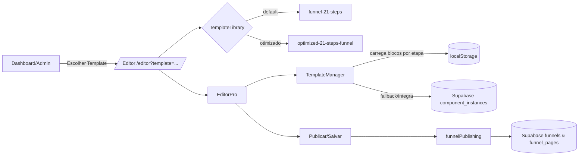
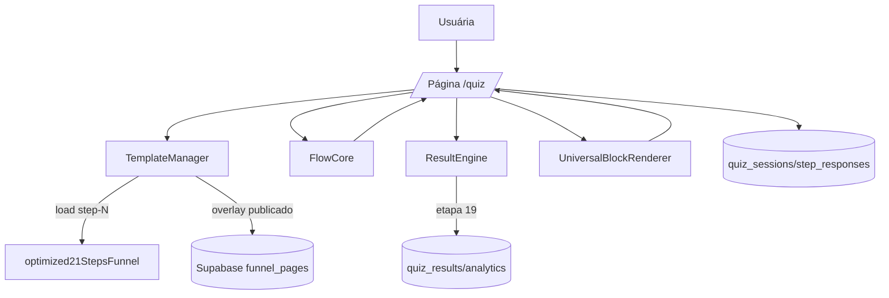
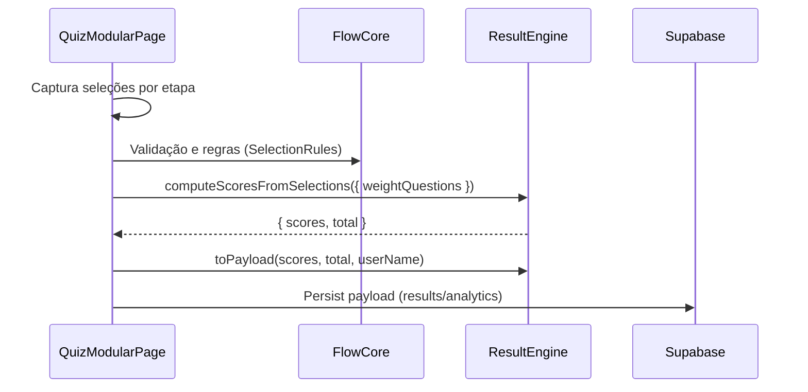

# Arquitetura do Funil de Quiz (21 Etapas)

Este documento descreve a estrutura, fluxo, responsabilidades e integrações do funil de quiz (modelo default e otimizado), incluindo fluxogramas, gargalos e pontos cegos.

## Visão geral

- UI/Editor: EditorPro carrega templates e permite configurar blocos e etapas no modo NoCode.
- Produção: Página `/quiz` renderiza as mesmas etapas com `UniversalBlockRenderer`.
- Dados: Templates locais e publicados (Supabase), sessões/respostas/resultados no Supabase.
- Lógica: FlowCore (regras de navegação/validação), ResultEngine (cálculo e payload de resultado).

## Mapa por requisitos (1–19)

1) Identificação do Funil
- IDs e metadados:
  - Default: `templates/models/funnel-21-steps.ts` (id: `default-quiz-funnel-21-steps`).
  - Otimizado: `templates/models/optimized-funnel-21-steps.ts` (id: `optimized-21-steps-funnel`) gerado de `config/optimized21StepsFunnel.ts`.
  - Biblioteca de templates: `services/templateLibraryService.ts` (lista builtins).

2) Roteamento e Entrada
- Rotas principais: `src/App.tsx`
  - `/editor` (EditorPro), `/quiz` (produção), `/admin/*` (dashboard), redireções legadas.
- Ponto de entrada: `src/main.tsx`.

3) Banco de Dados (Supabase)
- Tabelas usadas: `funnels`, `funnel_pages`, `component_instances`, `quiz_sessions`, `quiz_step_responses`, `quiz_results`, `quiz_analytics`, `profiles`.
- Tipos unificados: `types/unified-schema.ts`.

4) Ganchos
- Fluxo do quiz: `hooks/core/useQuizFlow`.
- Carregamento/etapas: `hooks/useQuizStepsWithTemplates.ts`, `hooks/useAutoLoadTemplates.ts`.
- Validação: `hooks/useStep01Validation.ts`, `hooks/useFormValidation.ts`.

5) Serviços
- Templates e conversões: `services/templateService.ts`, `utils/TemplateManager.ts`, `services/funnelTemplateService.ts`.
- Persistência editor/instâncias: `services/ComponentsService.ts`, `services/editorSupabaseService.ts`.
- Sessão/analytics: `services/quizSupabaseService.ts`, `hooks/useOptimizedQuizData.ts`.
- Publicação: `services/funnelPublishing.ts`.

6) Configurações de Resultados
- Pesos e outras regras: `config/optimized21StepsFunnel.ts` em `calculations.scoreWeights`.
- Engine: `services/core/ResultEngine.ts` (suporta `weightQuestions`).

7) Lógica de Resultados
- Cálculo: `ResultEngine.computeScoresFromSelections`.
- Payload/mensagem: `ResultEngine.toPayload` (usa nome do usuário persistido).

8) Gerenciador de Fluxo
- Core: `services/core/FlowCore.ts` (SelectionRules, mapear step→qId, auto-advance).
- Hook: `useQuizFlow` (navegação, estado, ações).

9) Configuração das Questões
- Fonte canônica: `templates/quiz21StepsComplete.ts`.
- Config efetivo: `config/optimized21StepsFunnel.ts` (sincronizado com a fonte; inclui `questionData` e blocos por etapa).

10) Conexão das Etapas (Modelos)
- Modelos: `templates/models/*` e config otimizado.
- Render: Editor/Produção via `TemplateManager` + `UniversalBlockRenderer`.

11) Componentes (UI)
- Blocos: `components/editor/blocks/*`.
- Renderer: `UniversalBlockRenderer`.
- Navegação da página de produção: `pages/QuizModularPage.tsx`.

12) Modelos (visuais/lógicos)
- Disponíveis no Editor via `templateLibraryService` (default + otimizado).

13) Painel NoCode
- Editor principal: `pages/MainEditor.tsx` (carrega `EditorPro`).
- Propriedades: componentes de propriedades no editor; blocos armazenam `properties`/`content`.

14) Renderização (produção)
- `pages/QuizModularPage.tsx`: carrega blocos por etapa via `TemplateManager`, renderiza com `UniversalBlockRenderer`, aplica regras do `FlowCore`.

15) Configurações “Core”
- Etapas, perguntas, respostas, pontuação: `optimized21StepsFunnel` + FlowCore + ResultEngine.
- Mensagens de resultado/telas: blocos e etapas no config.
- Variáveis dinâmicas: nome via `StorageService` e `useQuizFlow.saveName`.

16) Salvar Alterações
- Local: `TemplateManager` (localStorage + eventos `quiz-template-updated`).
- Supabase: `funnelPublishing`, `editorSupabaseService`, `ComponentsService`.

17) Local dos Modelos
- `src/templates/models/*`, `src/config/optimized21StepsFunnel.ts`.

18) Publicação
- Serviço de publicação: `services/funnelPublishing.ts` (gera/atualiza `funnels` e `funnel_pages`).
- UI: pode ser acionado por tela admin (botão pode ser adicionado em dashboard).

19) Página Publicada
- Rota `/quiz` usando o runtime modular. Cálculo na etapa 19 e persistência do resultado.

---

## Fluxogramas

### Fluxo de Edição (NoCode)

### Fluxo de Execução (Produção)

### Sequência de Cálculo de Resultado

---

## Gargalos potenciais

- Carregamento de blocos por etapa
  - `TemplateManager` consulta localStorage e pode recarregar frequentemente via eventos. Em etapas com muitos blocos, pode haver re-render redundante.
  - Mitigação: cache por etapa com invalidação pontual; debounces já são usados no `QuizModularPage`.

- Latência Supabase na publicação e leitura
  - Operações em `funnel_pages` e `component_instances` podem ter volume alto.
  - Mitigação: upserts batelados e leitura paginada; spinner/feedback já presentes.

- Dependência do “trigger” de cálculo na etapa 19
  - Se a estrutura de etapas mudar, o cálculo pode disparar cedo/tarde.
  - Mitigação: chavear por tipo de etapa (ex.: `result`/`transition`) ou flag de config ao invés de número fixo.

- Fallback de funnelId em alguns blocos
  - Ex.: `FormInputBlock.tsx` usa id default embutido.
  - Mitigação: ler funnelId de contexto (`EditorContext`) e URL; manter fallback apenas se ausente.

- Editor x Produção divergentes
  - Diferenças de propriedades podem causar render distinto entre Editor e Produção.
  - Mitigação: single renderer (`UniversalBlockRenderer`) já adotado; padronizar propriedades obrigatórias.

- i18n e Acessibilidade
  - Sem infraestrutura dedicada; textos embutidos.
  - Mitigação: introduzir camada i18n e checklist de A11y (semântica, foco, contrastes).

---

## Pontos cegos

- Publicação por UI
  - Há serviço (`funnelPublishing`), mas falta ação clara em dashboard para publicar o funil atual.

- Observabilidade
  - Analytics registra eventos principais, mas não há traços distribuídos/telemetria de performance de render.

- Versionamento de modelos
  - `version` no funil existe, porém sem estratégia de migração de blocos por versão.

- Testes automatizados de fluxo completo
  - Há testes pontuais; faltam e2e cobrindo 21 etapas e cálculo final em /quiz.

---

## Recomendações (curto prazo)

1) Botão “Publicar Funil” no painel admin que chama `funnelPublishing.publishFunnel` para o funil ativo.
2) Tornar o disparo do cálculo dirigido por tipo/flag de etapa, não por número fixo (19).
3) Ajustar blocos que usam `funnelId` hardcoded para ler de contexto/URL.
4) Cache leve no `TemplateManager` por step com TTL/etag local para reduzir IO em transições.
5) Adicionar smoke tests e2e: navegação 1→21, cálculo e persistência de resultado.

## Status atual

- Modelo otimizado exposto no dashboard e no Editor (`optimized-21-steps-funnel`).
- Perguntas sincronizadas e pesos aplicados no cálculo em produção.
- CRUD alinhado ao schema unificado (`funnels`/`funnel_pages`).
- Build e servidor de desenvolvimento OK.
