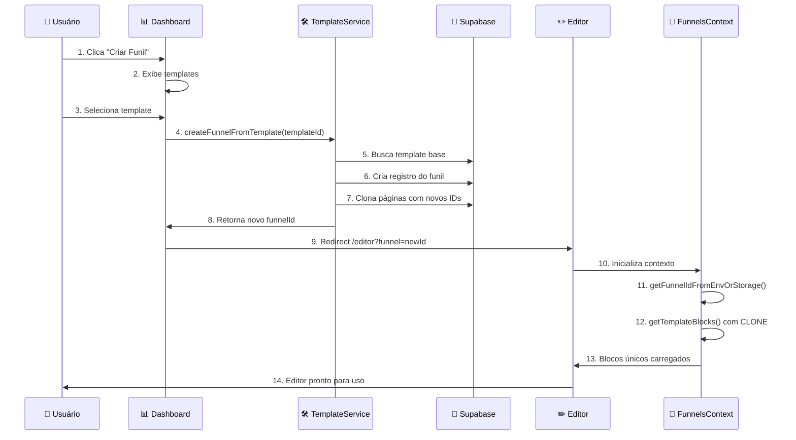
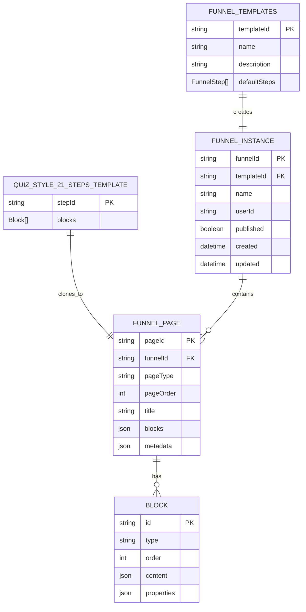

```mermaid
graph TB
    subgraph "🎯 SISTEMA DE FUNIS - ARQUITETURA COMPLETA"
        subgraph "📱 Frontend (React)"
            A[App.tsx] --> B[Router]
            B --> C[/admin - Dashboard]
            B --> D[/editor - MainEditor]
            B --> E[/quiz - Produção]
        end
        
        subgraph "🧠 Contextos"
            F[FunnelsProvider]
            G[EditorProvider]
            H[AuthProvider]
        end
        
        subgraph "📋 Templates Base"
            I[FUNNEL_TEMPLATES<br/>- quiz-estilo-completo<br/>- quiz-estilo<br/>- quiz-personalidade<br/>- funil-21-etapas]
            J[QUIZ_STYLE_21_STEPS_TEMPLATE<br/>step-1 → step-21<br/>Blocos detalhados]
        end
        
        subgraph "🆔 Sistema de IDs"
            K[URL Parameter<br/>?funnel=ID]
            L[LocalStorage<br/>editor:funnelId]
            M[Environment<br/>VITE_DEFAULT_FUNNEL_ID]
            N[Fallback<br/>default-funnel]
        end
        
        subgraph "🛠️ Services"
            O[templateService.ts<br/>Clonagem e conversão]
            P[funnelTemplateService.ts<br/>Criação de funis]
            Q[funnelService.ts<br/>CRUD operations]
        end
        
        subgraph "💾 Persistência"
            R[(Supabase)]
            S[LocalStorage Cache]
            T[Memory State]
        end
        
        subgraph "🎨 Components"
            U[AdminSidebar]
            V[QuizFlowPage]
            W[PropertiesPanel]
            X[QuizStepRenderer]
        end
    end
    
    %% Conexões principais
    D --> F
    F --> I
    F --> J
    F --> O
    
    K --> F
    L --> F
    M --> F
    N --> F
    
    O --> P
    P --> Q
    Q --> R
    
    F --> S
    F --> T
    
    D --> V
    V --> W
    V --> X
    C --> U
    
    %% Estilos
    classDef frontend fill:#e1f5fe
    classDef context fill:#f3e5f5
    classDef template fill:#e8f5e8
    classDef service fill:#fff3e0
    classDef storage fill:#fce4ec
    classDef component fill:#f1f8e9
    
    class A,B,C,D,E frontend
    class F,G,H context
    class I,J template
    class O,P,Q service
    class R,S,T storage
    class U,V,W,X component
```

## 🔄 FLUXO DE CRIAÇÃO DE FUNIL



## 🔧 PROCESSO DE CLONAGEM (CORREÇÃO DO PONTO CEGO)

```mermaid
graph LR
    subgraph "❌ ANTES (Problema)"
        A1[Template Original] --> B1[Funil 1]
        A1 --> C1[Funil 2]
        A1 --> D1[Funil 3]
        B1 -.-> E1[Mutação compartilhada]
        C1 -.-> E1
        D1 -.-> E1
    end
    
    subgraph "✅ DEPOIS (Solução)"
        A2[Template Original] --> F[cloneBlocks()]
        F --> G[Funil 1 - Clone único]
        F --> H[Funil 2 - Clone único] 
        F --> I[Funil 3 - Clone único]
        G --> J[Dados isolados]
        H --> K[Dados isolados]
        I --> L[Dados isolados]
    end
    
    classDef problema fill:#ffebee,stroke:#f44336
    classDef solucao fill:#e8f5e8,stroke:#4caf50
    
    class A1,B1,C1,D1,E1 problema
    class A2,F,G,H,I,J,K,L solucao
```

## 📊 ESTRUTURA DE DADOS


