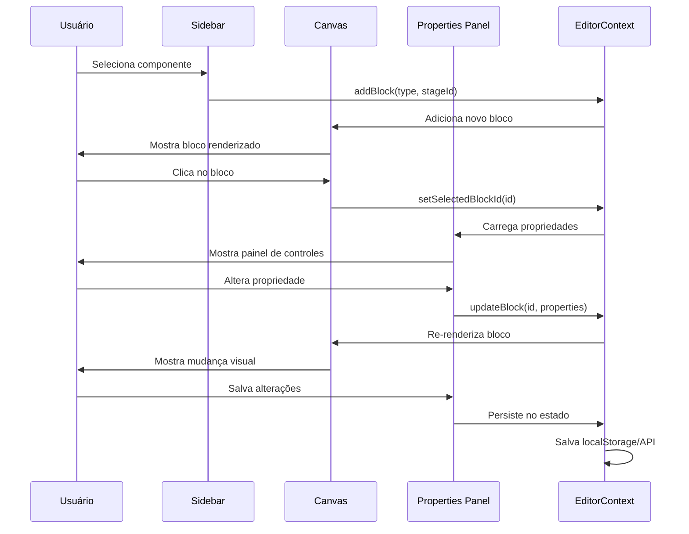

# 🎨 Diagrama Visual - Fluxo de Configuração de Componentes

## 📊 Mapa de Interações do Sistema

```
                    ╔══════════════════════════════════════════════════════════════╗
                    ║                    EDITOR FIXED LAYOUT                       ║
                    ╚══════════════════════════════════════════════════════════════╝

┏━━━━━━━━━━━━━┓    ┏━━━━━━━━━━━━━┓    ┏━━━━━━━━━━━━━━━━━━━━━━━┓    ┏━━━━━━━━━━━━━━━━━━━━┓
┃   ETAPAS    ┃    ┃ COMPONENTES ┃    ┃        CANVAS         ┃    ┃   PROPRIEDADES     ┃
┃  (Stages)   ┃    ┃  (Sidebar)  ┃    ┃    (Renderização)     ┃    ┃     (Panel)        ┃
┃             ┃    ┃             ┃    ┃                       ┃    ┃                    ┃
┃ ┌─────────┐ ┃    ┃ ┌─────────┐ ┃    ┃ ┌─────────────────┐   ┃    ┃ ┌────────────────┐ ┃
┃ │Step 01  │◄┼────┼►│ Basic   │ ┃    ┃ │                 │   ┃    ┃ │ 🎨 Cor         │ ┃
┃ │Step 02  │ ┃    ┃ │ • Text  │ ┃ ┌──┃►│  Selected Block │◄──┼────┃►│ 📏 Tamanho     │ ┃
┃ │Step 03  │ ┃    ┃ │ • Image │ ┃ │  ┃ │  (Highlighted)  │   ┃    ┃ │ 📝 Texto       │ ┃
┃ │Step 04  │ ┃    ┃ │ • Button│ ┃ │  ┃ │                 │   ┃    ┃ │ 🔘 Toggle      │ ┃
┃ │  ...    │ ┃    ┃ └─────────┘ ┃ │  ┃ └─────────────────┘   ┃    ┃ │ 🎛️ Slider      │ ┃
┃ │Step 21  │ ┃    ┃             ┃ │  ┃                       ┃    ┃ │ 📋 Dropdown    │ ┃
┃ └─────────┘ ┃    ┃ ┌─────────┐ ┃ │  ┃ ┌───┐ ┌───┐ ┌───┐   ┃    ┃ └────────────────┘ ┃
┃             ┃    ┃ │ Media   │ ┃ │  ┃ │ 1 │ │ 2 │ │ 3 │   ┃    ┃                    ┃
┃      ↓      ┃    ┃ │ • Video │ ┃ │  ┃ └───┘ └───┘ └───┘   ┃    ┃         ↓          ┃
┃  Carrega    ┃    ┃ │ • Audio │ ┃ │  ┃                       ┃    ┃    Auto-Apply      ┃
┃   Blocos    ┃    ┃ └─────────┘ ┃ │  ┃        ↑ ↓           ┃    ┃    Properties      ┃
┃     da      ┃    ┃             ┃ │  ┃    Reorder/Add        ┃    ┃                    ┃
┃   Etapa     ┃    ┃ ┌─────────┐ ┃ │  ┃                       ┃    ┃ ┌────────────────┐ ┃
┃    Ativa    ┃    ┃ │Interactive│◄┼─┘  ┃                       ┃    ┃ │ 💾 Save Changes│ ┃
┃             ┃    ┃ │ • Forms │ ┃    ┃                       ┃    ┃ └────────────────┘ ┃
┃             ┃    ┃ │ • Quiz  │ ┃    ┃                       ┃    ┃                    ┃
┗━━━━━━━━━━━━━┛    ┃ └─────────┘ ┃    ┗━━━━━━━━━━━━━━━━━━━━━━━┛    ┗━━━━━━━━━━━━━━━━━━━━┛
                  ┗━━━━━━━━━━━━━┛
                        ↓
                   Drag & Drop
```

## 🔄 Fluxo de Estados e Eventos

```
    ╭─────────────────╮
    │  EditorContext  │ ← Estado Central
    ╰─────────────────╯
           ↓ ↑
    ╔═══════════════════════════════════════════════════════════════════╗
    ║                        EVENT FLOW                                 ║
    ╚═══════════════════════════════════════════════════════════════════╝

1. SELEÇÃO DE ETAPA
   ┌─────────────┐    setActiveStage()    ┌──────────────┐
   │   Etapa     │ ─────────────────────► │ EditorContext│
   │  Clicada    │                        │   Updates    │
   └─────────────┘                        └──────────────┘
                                                 ↓
   ┌─────────────┐    getBlocksForStage() ┌──────────────┐
   │   Canvas    │ ◄───────────────────── │   Filter     │
   │ Re-renders  │                        │    Blocks    │
   └─────────────┘                        └──────────────┘

2. ADIÇÃO DE COMPONENTE
   ┌─────────────┐      Drag/Click       ┌──────────────┐
   │ Componente  │ ─────────────────────► │ addBlock()   │
   │   Sidebar   │                        │   Method     │
   └─────────────┘                        └──────────────┘
                                                 ↓
   ┌─────────────┐     Block Created      ┌──────────────┐
   │   Canvas    │ ◄───────────────────── │ New Block ID │
   │   Adds      │                        │  Generated   │
   └─────────────┘                        └──────────────┘

3. CONFIGURAÇÃO DE PROPRIEDADES
   ┌─────────────┐   setSelectedBlock()   ┌──────────────┐
   │    Bloco    │ ─────────────────────► │ Properties   │
   │  Selecionado│                        │    Panel     │
   └─────────────┘                        │   Opens      │
                                         └──────────────┘
                                                ↓
   ┌─────────────┐      onChange()        ┌──────────────┐
   │ updateBlock │ ◄───────────────────── │  Property    │
   │   Method    │                        │   Control    │
   └─────────────┘                        └──────────────┘
          ↓
   ┌─────────────┐     Re-render          ┌──────────────┐
   │   Canvas    │ ◄───────────────────── │    Block     │
   │   Updates   │                        │   Updated    │
   └─────────────┘                        └──────────────┘
```

## 🎛️ Sistema de Propriedades Detalhado

### 🔧 Tipos de Controles Disponíveis

```
┌─────────────────────────────────────────────────────────────────────────────┐
│                          PROPERTY CONTROLS                                   │
├─────────────────────────────────────────────────────────────────────────────┤
│                                                                             │
│  📝 STRING (Texto)           🎨 COLOR (Cor)              🔘 BOOLEAN (Toggle) │
│  ┌─────────────────────┐    ┌─────────────────────┐    ┌─────────────────┐ │
│  │ [Digite aqui...]    │    │ ⬜ #B89B7A          │    │ ●──○ ON/OFF    │ │
│  └─────────────────────┘    └─────────────────────┘    └─────────────────┘ │
│                                                                             │
│  📏 RANGE (Slider)          📋 SELECT (Dropdown)        🔢 NUMBER (Número)  │
│  ┌─────────────────────┐    ┌─────────────────────┐    ┌─────────────────┐ │
│  │ ●────────○ [24px]   │    │ Medium     ▼       │    │ [100] px        │ │
│  └─────────────────────┘    └─────────────────────┘    └─────────────────┘ │
│                                                                             │
│  📐 SPACING (Margem)        🖼️ IMAGE (URL)              📱 RESPONSIVE       │
│  ┌─────────────────────┐    ┌─────────────────────┐    ┌─────────────────┐ │
│  │ Top: ●──○ [16px]    │    │ https://...         │    │ 📱 sm md lg xl  │ │
│  │ Bottom: ●──○ [8px]  │    │ [Browse...]         │    │ ●  ○  ○  ○      │ │
│  └─────────────────────┘    └─────────────────────┘    └─────────────────┘ │
└─────────────────────────────────────────────────────────────────────────────┘
```

### 🔄 Configuração Automática de Propriedades

```typescript
// Exemplo: Como um componente se auto-configura

// 1. DEFINIÇÃO NO REGISTRY
{
  type: 'ButtonInlineFixed',
  properties: {
    // Texto simples
    text: {
      type: 'string',
      label: 'Texto do Botão',
      default: 'Clique aqui',
      validation: { maxLength: 50 }
    },

    // Cor com picker
    backgroundColor: {
      type: 'color',
      label: 'Cor de Fundo',
      default: '#B89B7A',
      category: 'appearance'
    },

    // Seleção com opções
    size: {
      type: 'select',
      label: 'Tamanho',
      options: [
        { value: 'sm', label: 'Pequeno' },
        { value: 'md', label: 'Médio' },
        { value: 'lg', label: 'Grande' }
      ],
      default: 'md'
    },

    // Slider numérico
    borderRadius: {
      type: 'range',
      label: 'Bordas Arredondadas',
      min: 0,
      max: 50,
      step: 1,
      default: 8,
      unit: 'px'
    },

    // Toggle simples
    disabled: {
      type: 'boolean',
      label: 'Desabilitado',
      default: false
    },

    // Configuração responsiva
    padding: {
      type: 'responsive',
      label: 'Espaçamento',
      breakpoints: {
        sm: '8px 16px',
        md: '12px 24px',
        lg: '16px 32px'
      }
    }
  }
}

// 2. PAINEL GERADO AUTOMATICAMENTE
const PropertyPanel = () => {
  return (
    <div className="properties-panel">
      <div className="property-group">
        <label>Texto do Botão</label>
        <input type="text" maxLength={50} />
      </div>

      <div className="property-group">
        <label>Cor de Fundo</label>
        <ColorPicker defaultValue="#B89B7A" />
      </div>

      <div className="property-group">
        <label>Tamanho</label>
        <select>
          <option value="sm">Pequeno</option>
          <option value="md">Médio</option>
          <option value="lg">Grande</option>
        </select>
      </div>

      <div className="property-group">
        <label>Bordas Arredondadas</label>
        <Slider min={0} max={50} step={1} unit="px" />
      </div>

      <div className="property-group">
        <label>Desabilitado</label>
        <Switch />
      </div>
    </div>
  );
};
```

## 🚀 Exemplo Prático: Configuração de Header

### 1. Usuário Arrasta Header para Canvas

```
┌─────────────┐     Drag     ┌─────────────────┐
│   Header    │ ────────────► │     Canvas      │
│ Component   │              │   ┌─────────┐   │
└─────────────┘              │   │ Header  │   │
                             │   │ Block   │   │
                             │   └─────────┘   │
                             └─────────────────┘
```

### 2. Sistema Cria Bloco com Propriedades Padrão

```javascript
{
  id: 'header-123',
  type: 'HeaderBlock',
  stageId: 'step-01',
  properties: {
    title: 'Título Principal',        // string
    subtitle: 'Subtítulo aqui',       // string
    titleColor: '#432818',            // color
    backgroundColor: '#FAF9F7',       // color
    textAlign: 'center',              // select
    fontSize: 32,                     // range
    fontWeight: 'bold',               // select
    padding: { top: 40, bottom: 20 }, // spacing
    showLogo: true,                   // boolean
    logoPosition: 'left'              // select
  }
}
```

### 3. Painel de Propriedades Carrega Controles

```
┌─────────────────────────────────┐
│        Header - Propriedades     │
├─────────────────────────────────┤
│ 📝 Título Principal             │
│ [Título Principal____________]   │
│                                 │
│ 📝 Subtítulo                    │
│ [Subtítulo aqui_____________]    │
│                                 │
│ 🎨 Cor do Título                │
│ ⬜ #432818                      │
│                                 │
│ 🎨 Cor de Fundo                 │
│ ⬜ #FAF9F7                      │
│                                 │
│ 📋 Alinhamento                  │
│ [Centro           ▼]            │
│                                 │
│ 📏 Tamanho da Fonte             │
│ ●────────────○ 32px             │
│                                 │
│ 🔘 Mostrar Logo                 │
│ ●──○ Ativado                    │
│                                 │
│ [ 💾 Aplicar Alterações ]       │
└─────────────────────────────────┘
```

### 4. Mudança em Tempo Real

```
Usuário muda "Título" → "Bem-vindos!"

┌─────────────────┐    onChange()    ┌─────────────────┐
│  Input Field    │ ────────────────► │ handleProperty  │
│   Changes       │                  │    Change       │
└─────────────────┘                  └─────────────────┘
                                              ↓
┌─────────────────┐     updateBlock()  ┌─────────────────┐
│     Canvas      │ ◄────────────────  │  EditorContext  │
│   Re-renders    │                   │    Updates      │
└─────────────────┘                   └─────────────────┘

Resultado: Header no canvas mostra "Bem-vindos!" instantaneamente
```

## 🎯 Diagrama de Fluxo Completo



Esta arquitetura garante que qualquer componente adicionado ao registry automaticamente ganha:

- ✅ **Painel de propriedades personalizado**
- ✅ **Controles visuais apropriados**
- ✅ **Validação automática**
- ✅ **Preview em tempo real**
- ✅ **Persistência de estado**
- ✅ **Responsividade**

**Resultado:** Sistema completamente extensível e fácil de usar! 🚀
