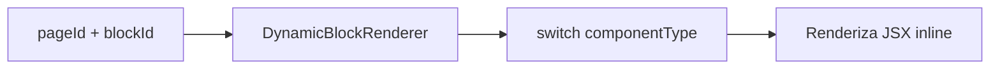
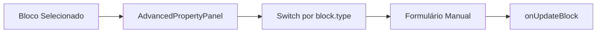
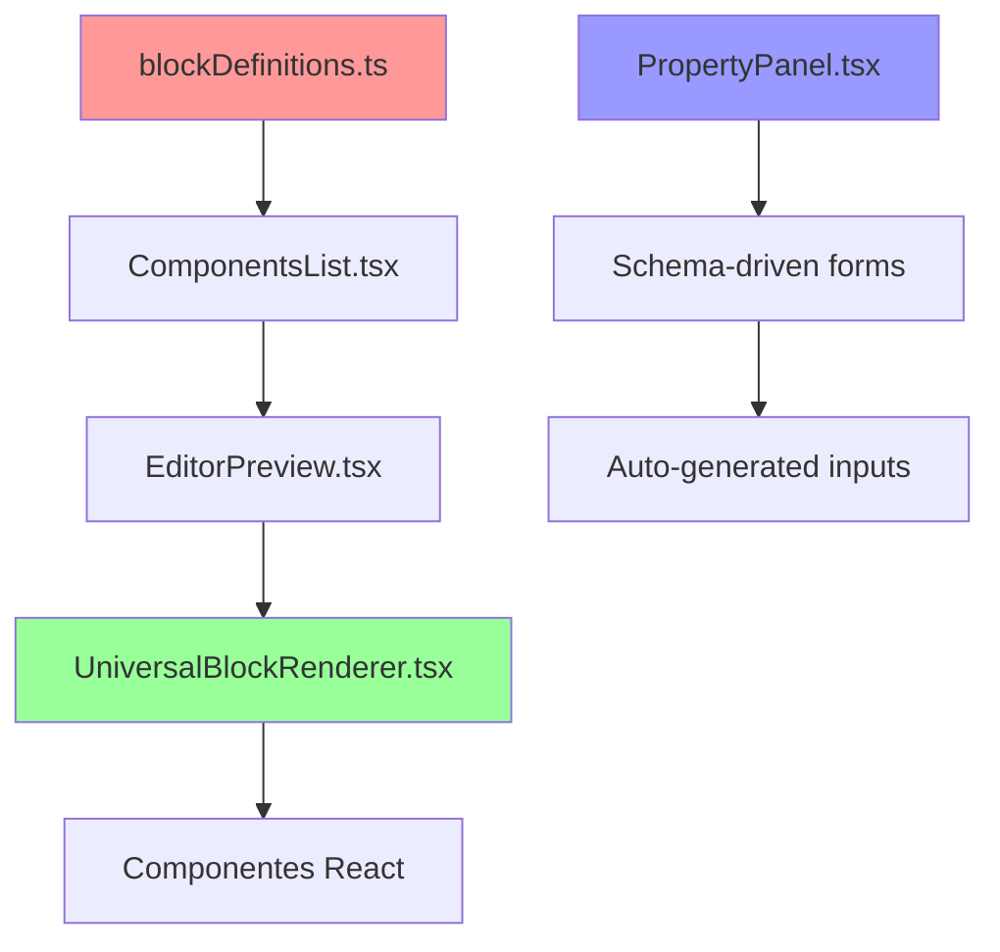
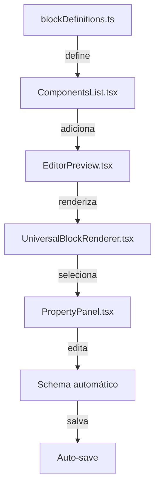
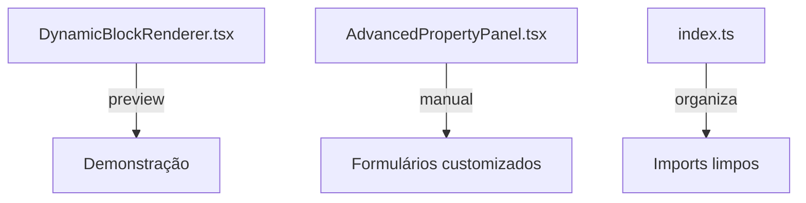

# 🔧 **EXPLICAÇÃO DOS ARQUIVOS DO EDITOR**

## 🎯 **PARA QUE SERVEM ESSES CÓDIGOS**

### **1. DynamicBlockRenderer.tsx**
**🎯 FUNÇÃO:** Renderizador de demonstração/preview para componentes

```typescript
// LOCALIZAÇÃO: src/components/DynamicBlockRenderer.tsx
// FUNÇÃO: Renderizar componentes baseado no blockId/pageId
// USO: Preview de componentes individuais fora do editor principal
```

**📋 O QUE FAZ:**
- **NÃO é o renderizador principal do editor**
- É um sistema de **demonstração/preview**
- Usado para mostrar componentes isoladamente
- Tem switch básico com estilos hardcoded
- Simula props para demonstração

**🔄 FLUXO:**


**⚠️ LIMITAÇÕES:**
- Props simuladas (não vem do blockDefinitions)
- Estilos hardcoded
- Não integra com sistema de propriedades
- É mais uma "galeria de componentes"

---

### **2. AdvancedPropertyPanel.tsx**
**🎯 FUNÇÃO:** Painel de propriedades manual/específico

```typescript
// LOCALIZAÇÃO: src/components/editor/AdvancedPropertyPanel.tsx
// FUNÇÃO: Editar propriedades de blocos selecionados
// USO: Alternativa ao PropertyPanel automático
```

**📋 O QUE FAZ:**
- Painel lateral para editar propriedades
- **Formulários manuais** para cada tipo de componente
- Não usa `blockDefinitions.propertiesSchema`
- Tem casos específicos hardcoded

**🔄 FLUXO:**


**📝 EXEMPLOS DE USO:**
```typescript
// Para cada tipo, formulário manual:
{selectedBlock.type === 'header' && (
  <div>
    <Label>Título</Label>
    <Input onChange={(e) => updateContent('title', e.target.value)} />
  </div>
)}

{selectedBlock.type === 'quiz-question' && (
  <div>
    <Label>Pergunta</Label>
    <Textarea onChange={(e) => updateContent('question', e.target.value)} />
  </div>
)}
```

---

### **3. Index Files (index.ts)**
**🎯 FUNÇÃO:** Centralizadores de importação/exportação

```typescript
// LOCALIZAÇÃO: src/components/blocks/quiz/index.ts
// FUNÇÃO: Exportar todos os componentes de uma pasta
// USO: Facilitar importações
```

**📋 O QUE FAZ:**
- **Barrel exports** - centraliza exportações
- Facilita importação de múltiplos componentes
- Organiza componentes por categoria

**🔄 EXEMPLO:**
```typescript
// Ao invés de:
import QuizQuestionBlock from './quiz/QuizQuestionBlock';
import QuizProgressBlock from './quiz/QuizProgressBlock';
import QuizResultBlock from './quiz/QuizResultBlock';

// Você pode:
import { 
  QuizQuestionBlock, 
  QuizProgressBlock, 
  QuizResultBlock 
} from './quiz';
```

---

## 🏗️ **ARQUITETURA COMPLETA DO EDITOR**

### **FLUXO PRINCIPAL (O QUE REALMENTE IMPORTA):**



### **COMPONENTES PRINCIPAIS:**

#### **1. blockDefinitions.ts** (🔥 CORAÇÃO)
```typescript
// Define TODOS os componentes disponíveis
// Gera automaticamente:
// - Lista no ComponentsList
// - Formulários no PropertyPanel
// - Propriedades padrão
```

#### **2. UniversalBlockRenderer.tsx** (🎯 RENDERIZADOR PRINCIPAL)
```typescript
// Switch gigante que mapeia block.type → Componente React
case 'quiz-question':
  return <QuizQuestionBlock {...props} />;
case 'heading':
  return <HeadingBlock {...props} />;
// etc...
```

#### **3. PropertyPanel.tsx** (⚙️ EDITOR DE PROPRIEDADES)
```typescript
// Gera formulários automaticamente baseado em:
const schema = getBlockPropertiesSchema(block.type);
// Usando blockDefinitions.propertiesSchema
```

---

## 🤔 **QUAL USAR?**

### **✅ PARA O EDITOR PRINCIPAL:**
- **UniversalBlockRenderer.tsx** (renderizador principal)
- **PropertyPanel.tsx** (painel automático)
- **blockDefinitions.ts** (definições centrais)

### **⚠️ PARA CASOS ESPECÍFICOS:**
- **DynamicBlockRenderer.tsx** (preview/demonstração)
- **AdvancedPropertyPanel.tsx** (formulários customizados)

### **📁 SEMPRE:**
- **index.ts** files (organização)

---

## 🚀 **EXEMPLO PRÁTICO: COMO TUDO SE CONECTA**

### **1. DEFINIÇÃO (blockDefinitions.ts)**
```typescript
{
  type: 'quiz-question',
  name: 'Pergunta de Quiz',
  propertiesSchema: [
    {
      key: 'question',
      label: 'Pergunta',
      type: 'textarea',
      defaultValue: 'Sua pergunta aqui'
    }
  ]
}
```

### **2. COMPONENTE REACT (QuizQuestionBlock.tsx)**
```typescript
const QuizQuestionBlock = ({ block, isSelected, onClick }) => {
  const { question } = block.properties;
  return <div onClick={onClick}>{question}</div>;
};
```

### **3. RENDERIZAÇÃO (UniversalBlockRenderer.tsx)**
```typescript
case 'quiz-question':
  return <QuizQuestionBlock {...props} />;
```

### **4. PROPRIEDADES (PropertyPanel.tsx)**
```typescript
// Busca schema automaticamente:
const schema = getBlockPropertiesSchema('quiz-question');
// Gera textarea automaticamente baseado no schema
```

### **5. RESULTADO FINAL:**
- ✅ Componente aparece na lista
- ✅ Pode ser arrastado para o canvas
- ✅ Quando selecionado, mostra propriedades editáveis
- ✅ Mudanças aplicadas em tempo real

---

## 💡 **RESUMO EXECUTIVO**

| Arquivo | Função | Quando Usar |
|---------|--------|-------------|
| **blockDefinitions.ts** | 🔥 Define todos os componentes | SEMPRE - É o coração |
| **UniversalBlockRenderer.tsx** | 🎯 Renderiza componentes no editor | SEMPRE - É o motor |
| **PropertyPanel.tsx** | ⚙️ Edita propriedades automaticamente | SEMPRE - É o painel |
| **DynamicBlockRenderer.tsx** | 📺 Preview/demonstração | Galeria, testes, demos |
| **AdvancedPropertyPanel.tsx** | 🔧 Formulários customizados | Casos muito específicos |
| **index.ts** | 📁 Organização de imports | SEMPRE - Boa prática |

**🎯 FOCO:** Para o editor funcionar, você precisa principalmente do **trio principal**: `blockDefinitions.ts` + `UniversalBlockRenderer.tsx` + `PropertyPanel.tsx`. O resto são **utilitários específicos**!

---

## 🔍 **ANÁLISE DETALHADA DOS CÓDIGOS MOSTRADOS**

### **1. DynamicBlockRenderer.tsx - SISTEMA DE DEMONSTRAÇÃO**

```typescript
// É um RENDERIZADOR DE PREVIEW/DEMONSTRAÇÃO
const DynamicBlockRenderer = ({
  pageId,        // ← Não usa blockDefinitions
  blockId,       // ← Simula componentType baseado no blockId
  fallback,
  className,
  enableSupabaseTracking
}) => {
  const componentType = blockId || 'default'; // ← SIMULA tipo
  
  // Props hardcoded para demonstração
  const props: any = {
    question: 'Qual dessas opções representa melhor seu estilo?',
    options: [
      { id: '1', text: 'Clássico e elegante' },
      { id: '2', text: 'Moderno e descolado' }
    ],
    showPercentages: true,
    // ... + 20 props hardcoded
  };

  // SWITCH GIGANTE com JSX inline
  switch (componentType) {
    case 'quiz-transition':
      return (
        <div className="min-h-[400px] bg-gradient-to-br from-[#432818]">
          {/* JSX hardcoded inline */}
        </div>
      );
    case 'heading':
      return (
        <h2 className="text-3xl font-bold">{props.text || 'Heading'}</h2>
      );
    // ... + 50 cases hardcoded
  }
};
```

**🎯 FUNÇÃO REAL:**
- ✅ **Preview/Galeria** de componentes
- ✅ **Demonstração** de layouts
- ✅ **Testes visuais** de componentes
- ❌ **NÃO é o renderizador do editor**
- ❌ **NÃO usa blockDefinitions**
- ❌ **NÃO integra com propriedades**

---

### **2. AdvancedPropertyPanel.tsx - PAINEL MANUAL**

```typescript
// É um PAINEL DE PROPRIEDADES ESPECÍFICO
const AdvancedPropertyPanel = ({
  selectedBlock,
  onUpdateBlock,
  onDeleteBlock
}) => {
  // SWITCH MANUAL para cada tipo
  {selectedBlock.type === 'header' && (
    <div>
      <Label>Título</Label>
      <Input 
        value={selectedBlock.content.title || ''}
        onChange={(e) => updateContent('title', e.target.value)}
      />
    </div>
  )}
  
  {selectedBlock.type === 'quiz-question' && (
    <div>
      <Label>Pergunta</Label>
      <Textarea 
        value={selectedBlock.content.question || ''}
        onChange={(e) => updateContent('question', e.target.value)}
      />
    </div>
  )}
  
  // ... formulários manuais para cada tipo
};
```

**🎯 FUNÇÃO REAL:**
- ✅ **Formulários customizados** para tipos específicos
- ✅ **UI avançada** com Cards e Labels
- ✅ **Botão de deletar** integrado
- ❌ **NÃO é automático** (não usa schema)
- ❌ **Precisa programar** cada tipo manualmente
- ⚠️ **Alternativa** ao PropertyPanel automático

---

### **3. Index Files - ORGANIZADORES**

```typescript
// src/components/blocks/quiz/index.ts
export { default as QuizQuestionBlock } from './QuizQuestionBlock';
export { default as QuizProgressBlock } from './QuizProgressBlock';
export { default as QuizResultBlock } from './QuizResultBlock';

// Facilita importações:
import { QuizQuestionBlock, QuizProgressBlock } from './quiz';
// Ao invés de:
import QuizQuestionBlock from './quiz/QuizQuestionBlock';
import QuizProgressBlock from './quiz/QuizProgressBlock';
```

**🎯 FUNÇÃO REAL:**
- ✅ **Organização** de imports/exports
- ✅ **Barrel pattern** para facilitar importações
- ✅ **Estrutura** de pastas limpa
- ✅ **SEMPRE** usar - boa prática

---

## 🏗️ **DIFERENÇA ENTRE OS RENDERIZADORES**

### **A. DynamicBlockRenderer (DEMO)**
```typescript
// Recebe: pageId + blockId
// Simula: props hardcoded
// Renderiza: JSX inline
// Uso: Preview/demonstração

<DynamicBlockRenderer 
  pageId="etapa-1"
  blockId="quiz-question"
  enableSupabaseTracking={true}
/>
```

### **B. UniversalBlockRenderer (EDITOR REAL)**
```typescript
// Recebe: block com type + properties
// Busca: blockDefinitions para schema
// Renderiza: Componentes React reais
// Uso: Editor principal

<UniversalBlockRenderer
  block={{
    id: 'block-123',
    type: 'quiz-question',
    properties: { question: 'Pergunta real', options: [...] }
  }}
  isSelected={true}
  onClick={handleSelect}
  onPropertyChange={handleUpdate}
/>
```

---

## 🔄 **FLUXO REAL DO EDITOR (O QUE IMPORTA)**

### **SISTEMA PRINCIPAL:**


### **SISTEMAS AUXILIARES:**


---

## 💡 **RESUMO EXECUTIVO FINAL**

### **🚀 PARA O EDITOR FUNCIONAR:**
1. **blockDefinitions.ts** - Define componentes e schemas
2. **UniversalBlockRenderer.tsx** - Renderiza no editor
3. **PropertyPanel.tsx** - Edita propriedades automaticamente
4. **index.ts** - Organiza imports

### **🛠️ PARA CASOS ESPECÍFICOS:**
1. **DynamicBlockRenderer.tsx** - Preview/demo de componentes
2. **AdvancedPropertyPanel.tsx** - Formulários manuais customizados

### **📊 PRIORIDADES:**
- **CRÍTICO:** blockDefinitions + UniversalBlockRenderer + PropertyPanel
- **ÚTIL:** DynamicBlockRenderer (para testes)
- **OPCIONAL:** AdvancedPropertyPanel (para UX avançada)
- **SEMPRE:** index.ts (boa prática)

**🎯 AGORA VOCÊ SABE:** Cada arquivo tem sua função específica na mecânica do editor. O **trio principal** faz tudo funcionar, o resto são **ferramentas auxiliares**!
