# 🛡️ Fluxos de Fallback e Recovery - Quiz Quest Challenge Verse

## 📋 Índice
1. [Visão Geral dos Fallbacks](#visão-geral-dos-fallbacks)
2. [Sistema de Error Boundaries](#sistema-de-error-boundaries)
3. [Fallback de Loading do Editor](#fallback-de-loading-do-editor)
4. [Recovery de Estados](#recovery-de-estados)
5. [Fallback de Dados](#fallback-de-dados)
6. [Monitoramento e Alertas](#monitoramento-e-alertas)
7. [Cenários de Teste](#cenários-de-teste)
8. [Implementação Prática](#implementação-prática)

---

## 🎯 Visão Geral dos Fallbacks

### Filosofia de Design
O sistema foi projetado com **resiliência em mente**, implementando múltiplas camadas de fallback para garantir que o editor sempre funcione, mesmo em condições adversas.

```mermaid
graph TD
    A[Usuário Acessa Editor] --> B{Sistema Principal OK?}
    B -->|Sim| C[Carrega UnifiedEditor]
    B -->|Não| D[Fallback Cascade]
    
    D --> E{EditorPro OK?}
    E -->|Sim| F[Carrega EditorPro]
    E -->|Não| G[Último Recurso]
    
    G --> H[MainEditor Básico]
    H --> I{Dados Disponíveis?}
    I -->|Sim| J[Editor Funcional]
    I -->|Não| K[Modo Offline]
    
    C --> L[Editor Completo]
    F --> M[Editor Estável]
    J --> N[Editor Básico]
    K --> O[Editor Offline]
```



### Níveis de Fallback

1. **🥇 Nível 1:** UnifiedEditor (Completo)
2. **🥈 Nível 2:** EditorPro (Estável) 
3. **🥉 Nível 3:** MainEditor (Básico)
4. **🚨 Nível 4:** Modo Offline/Recovery

---

## 🛡️ Sistema de Error Boundaries

### **1. ErrorBoundary Principal**

```typescript
// src/components/editor/ErrorBoundary.tsx
export class ErrorBoundary extends Component<ErrorBoundaryProps, ErrorBoundaryState> {
  constructor(props: ErrorBoundaryProps) {
    super(props);
    this.state = {
      hasError: false,
      error: null,
      errorInfo: null,
      retryCount: 0
    };
  }

  static getDerivedStateFromError(error: Error): Partial<ErrorBoundaryState> {
    // Atualizar estado para mostrar UI de fallback
    return {
      hasError: true,
      error,
    };
  }

  componentDidCatch(error: Error, errorInfo: React.ErrorInfo) {
    // 📊 Log estruturado do erro
    console.group('🚨 ErrorBoundary - Erro Capturado');
    console.error('Error:', error);
    console.error('Error Info:', errorInfo);
    console.error('Component Stack:', errorInfo.componentStack);
    console.error('Error Stack:', error.stack);
    console.groupEnd();

    // 🔄 Estado de recovery
    this.setState({
      error,
      errorInfo,
    });

    // 📡 Enviar para sistema de monitoramento (opcional)
    this.reportError(error, errorInfo);
  }

  // 📊 Sistema de reporting
  reportError = (error: Error, errorInfo: React.ErrorInfo) => {
    if (import.meta.env.PROD) {
      // Em produção, enviar para serviço de monitoramento
      this.sendToMonitoring({
        message: error.message,
        stack: error.stack,
        componentStack: errorInfo.componentStack,
        timestamp: new Date().toISOString(),
        userAgent: navigator.userAgent,
        url: window.location.href
      });
    }
  };

  // 🔄 Sistema de retry automático
  handleReset = () => {
    const newRetryCount = this.state.retryCount + 1;
    
    if (newRetryCount <= 3) {
      console.log(`🔄 Tentando recovery ${newRetryCount}/3`);
      
      this.setState({
        hasError: false,
        error: null,
        errorInfo: null,
        retryCount: newRetryCount
      });
    } else {
      // Máximo de tentativas atingido
      console.error('❌ Máximo de tentativas de recovery atingido');
      this.handleFallbackMode();
    }
  };

  // 🆘 Modo de fallback extremo
  handleFallbackMode = () => {
    console.warn('🆘 Ativando modo de fallback extremo');
    
    // Limpar estados problemáticos
    try {
      localStorage.removeItem('editor-state');
      localStorage.removeItem('funnel-cache');
    } catch (e) {
      console.warn('Falha ao limpar localStorage:', e);
    }

    // Redirecionar para versão básica
    window.location.href = '/editor-basic';
  };

  render() {
    if (this.state.hasError) {
      // 🎨 UI de fallback customizada
      return this.renderErrorUI();
    }

    return this.props.children;
  }

  renderErrorUI = () => {
    const { error, errorInfo, retryCount } = this.state;
    const canRetry = retryCount < 3;

    return (
      <Card className="border-destructive bg-destructive/5 max-w-2xl mx-auto mt-8">
        <CardHeader>
          <CardTitle className="flex items-center gap-2 text-destructive">
            <AlertTriangle size={20} />
            Ops! Algo deu errado
          </CardTitle>
        </CardHeader>
        <CardContent className="space-y-4">
          <p className="text-sm text-muted-foreground">
            Ocorreu um erro inesperado ao renderizar este componente.
          </p>

          {/* 🔄 Botões de ação */}
          <div className="flex gap-2">
            {canRetry && (
              <Button
                variant="outline"
                size="sm"
                onClick={this.handleReset}
                className="flex items-center gap-2"
              >
                <RefreshCw size={14} />
                Tentar Novamente ({retryCount}/3)
              </Button>
            )}

            <Button
              variant="outline"
              size="sm"
              onClick={() => window.location.reload()}
              className="flex items-center gap-2"
            >
              <RefreshCw size={14} />
              Recarregar Página
            </Button>

            <Button
              variant="outline"
              size="sm"
              onClick={this.handleFallbackMode}
              className="flex items-center gap-2"
            >
              <Home size={14} />
              Modo Básico
            </Button>
          </div>

          {/* 🐛 Detalhes de debug (apenas desenvolvimento) */}
          {import.meta.env.DEV && error && (
            <details className="bg-muted p-3 rounded-md text-xs">
              <summary className="cursor-pointer font-mono font-medium mb-2">
                🐛 Detalhes do erro (desenvolvimento)
              </summary>
              <div className="space-y-2">
                <div>
                  <strong>Erro:</strong>
                  <pre className="mt-1 overflow-auto text-xs">{error.message}</pre>
                </div>
                <div>
                  <strong>Stack:</strong>
                  <pre className="mt-1 overflow-auto text-xs">{error.stack}</pre>
                </div>
                {errorInfo?.componentStack && (
                  <div>
                    <strong>Component Stack:</strong>
                    <pre className="mt-1 overflow-auto text-xs">
                      {errorInfo.componentStack}
                    </pre>
                  </div>
                )}
              </div>
            </details>
          )}
        </CardContent>
      </Card>
    );
  };
}
```

### **2. Error Boundary Especializado para Editor**

```typescript
// src/components/error/EditorErrorBoundary.tsx
export class EditorErrorBoundary extends Component<Props, State> {
  private static readonly MAX_RETRIES = 2;
  private static readonly RECOVERY_DELAY = 1000;

  constructor(props: Props) {
    super(props);
    this.state = { 
      hasError: false,
      retryCount: 0,
      isRecovering: false
    };
  }

  componentDidCatch(error: Error, errorInfo: React.ErrorInfo) {
    console.error('🚨 EditorErrorBoundary:', error, errorInfo);
    
    // 🔍 Análise do tipo de erro
    const errorType = this.classifyError(error);
    
    // 🏥 Estratégia de recovery baseada no tipo
    this.handleRecoveryStrategy(errorType, error);
  }

  // 🔍 Classificação inteligente de erros
  classifyError = (error: Error): ErrorType => {
    const message = error.message.toLowerCase();
    
    if (message.includes('chunk') || message.includes('loading')) {
      return 'CHUNK_LOAD_ERROR';
    }
    
    if (message.includes('context') || message.includes('provider')) {
      return 'CONTEXT_ERROR';
    }
    
    if (message.includes('network') || message.includes('fetch')) {
      return 'NETWORK_ERROR';
    }
    
    if (message.includes('memory') || message.includes('heap')) {
      return 'MEMORY_ERROR';
    }
    
    return 'UNKNOWN_ERROR';
  };

  // 🏥 Estratégias de recovery por tipo de erro
  handleRecoveryStrategy = async (errorType: ErrorType, error: Error) => {
    this.setState({ isRecovering: true });

    try {
      switch (errorType) {
        case 'CHUNK_LOAD_ERROR':
          await this.handleChunkLoadError();
          break;
        
        case 'CONTEXT_ERROR':
          await this.handleContextError();
          break;
        
        case 'NETWORK_ERROR':
          await this.handleNetworkError();
          break;
        
        case 'MEMORY_ERROR':
          await this.handleMemoryError();
          break;
        
        default:
          await this.handleGenericError();
      }
    } catch (recoveryError) {
      console.error('❌ Falha na estratégia de recovery:', recoveryError);
    } finally {
      this.setState({ isRecovering: false });
    }
  };

  // 🔄 Recovery para erros de chunk loading
  handleChunkLoadError = async () => {
    console.log('🔄 Tentando recovery para chunk load error...');
    
    // Limpar cache de módulos
    if ('caches' in window) {
      const cacheNames = await caches.keys();
      await Promise.all(
        cacheNames.map(cacheName => caches.delete(cacheName))
      );
    }
    
    // Aguardar um pouco e recarregar
    setTimeout(() => {
      window.location.reload();
    }, this.RECOVERY_DELAY);
  };

  // 🔄 Recovery para erros de contexto
  handleContextError = async () => {
    console.log('🔄 Tentando recovery para context error...');
    
    // Limpar estados de contexto problemáticos
    try {
      localStorage.removeItem('editor-context');
      localStorage.removeItem('funnel-context');
      sessionStorage.clear();
    } catch (e) {
      console.warn('Falha ao limpar storage:', e);
    }
    
    // Tentar reinicializar contextos
    this.tryContextReset();
  };

  tryContextReset = () => {
    const { onContextReset } = this.props;
    
    if (typeof onContextReset === 'function') {
      onContextReset();
    } else {
      // Fallback: recarregar página
      setTimeout(() => window.location.reload(), this.RECOVERY_DELAY);
    }
  };

  render() {
    const { hasError, isRecovering, retryCount } = this.state;
    
    if (isRecovering) {
      return (
        <div className="flex items-center justify-center min-h-screen">
          <div className="text-center">
            <LoadingSpinner size="lg" className="mb-4" />
            <p className="text-gray-600">🔄 Tentando recuperar editor...</p>
          </div>
        </div>
      );
    }
    
    if (hasError) {
      return this.renderEditorErrorUI();
    }

    return this.props.children;
  }

  renderEditorErrorUI = () => (
    <div className="min-h-screen flex items-center justify-center bg-gray-50">
      <div className="max-w-md w-full bg-white rounded-lg shadow-lg p-6">
        <div className="text-center">
          <div className="text-red-500 text-6xl mb-4">⚠️</div>
          <h2 className="text-2xl font-bold text-gray-900 mb-2">Erro no Editor</h2>
          <p className="text-gray-600 mb-4">
            Ocorreu um erro inesperado no editor. Tentaremos recuperar automaticamente.
          </p>
          
          <div className="space-y-3">
            <button
              onClick={this.handleAutoRecovery}
              className="w-full bg-blue-600 text-white py-2 px-4 rounded-md hover:bg-blue-700 transition-colors"
            >
              🔄 Tentar Recuperar Automaticamente
            </button>
            
            <button
              onClick={() => window.location.reload()}
              className="w-full bg-gray-600 text-white py-2 px-4 rounded-md hover:bg-gray-700 transition-colors"
            >
              🔄 Recarregar Página
            </button>
            
            <button
              onClick={() => this.handleFallbackEditor()}
              className="w-full bg-green-600 text-white py-2 px-4 rounded-md hover:bg-green-700 transition-colors"
            >
              🆘 Usar Editor Básico
            </button>
          </div>
        </div>
      </div>
    </div>
  );
}
```

---

## 🔄 Fallback de Loading do Editor

### **1. Sistema de Fallback em Cascata**

```typescript
// src/components/editor/EditorFallback.tsx
const EditorFallback: React.FC<Props> = ({ templateId, funnelId }) => {
  const [EditorComponent, setEditorComponent] = useState<React.ComponentType | null>(null);
  const [isLoading, setIsLoading] = useState(true);
  const [error, setError] = useState<string | null>(null);
  const [attempts, setAttempts] = useState(0);

  // 🎯 Lista prioritária de editores
  const EDITOR_FALLBACK_CHAIN = [
    {
      name: 'UnifiedEditor',
      path: '../editor/UnifiedEditor',
      priority: 1,
      timeout: 5000,
      description: 'Editor completo com todas as funcionalidades'
    },
    {
      name: 'EditorPro', 
      path: '../editor/EditorPro',
      priority: 2,
      timeout: 3000,
      description: 'Editor estável com funcionalidades essenciais'
    },
    {
      name: 'MainEditor',
      path: '../editor/MainEditor', 
      priority: 3,
      timeout: 2000,
      description: 'Editor básico para situações críticas'
    }
  ];

  useEffect(() => {
    loadEditorWithFallback();
  }, []);

  const loadEditorWithFallback = async () => {
    console.log('🔄 Iniciando processo de fallback do editor...');
    
    for (let i = 0; i < EDITOR_FALLBACK_CHAIN.length; i++) {
      const editorConfig = EDITOR_FALLBACK_CHAIN[i];
      
      try {
        console.log(`🔄 [TENTATIVA ${i + 1}] Carregando: ${editorConfig.name}`);
        setAttempts(i + 1);
        
        // ⏰ Sistema de timeout por editor
        const editorPromise = import(editorConfig.path);
        const timeoutPromise = new Promise((_, reject) => 
          setTimeout(() => reject(new Error('Timeout')), editorConfig.timeout)
        );

        const mod = await Promise.race([editorPromise, timeoutPromise]) as any;
        const Component = mod.default || mod[editorConfig.name];

        if (Component) {
          console.log(`✅ [SUCESSO] ${editorConfig.name} carregado`);
          setEditorComponent(() => Component);
          setIsLoading(false);
          
          // 📊 Analytics de fallback
          trackEditorFallback(editorConfig.name, i + 1);
          return;
        } else {
          throw new Error(`Componente não encontrado em ${editorConfig.path}`);
        }

      } catch (editorError) {
        console.warn(`⚠️ [FALHA] ${editorConfig.name}:`, editorError);
        
        // Continua para próximo na cadeia
        if (i === EDITOR_FALLBACK_CHAIN.length - 1) {
          // Última tentativa falhou
          console.error('❌ Todos os editores falharam');
          setError('Nenhum editor disponível');
          setIsLoading(false);
          
          // 🆘 Último recurso: modo de recuperação
          handleEmergencyMode();
        }
      }
    }
  };

  // 🆘 Modo de emergência quando todos os editores falham
  const handleEmergencyMode = () => {
    console.error('🆘 Ativando modo de emergência');
    
    // Tentar limpar cache e recursos problemáticos
    clearProblematicResources();
    
    // Mostrar interface básica de recuperação
    setEditorComponent(() => EmergencyEditor);
  };

  const clearProblematicResources = async () => {
    try {
      // Limpar cache de service worker
      if ('serviceWorker' in navigator) {
        const registrations = await navigator.serviceWorker.getRegistrations();
        await Promise.all(registrations.map(reg => reg.unregister()));
      }

      // Limpar cache de módulos
      if ('caches' in window) {
        const cacheNames = await caches.keys();
        await Promise.all(cacheNames.map(name => caches.delete(name)));
      }

      // Limpar localStorage problemático
      const problematicKeys = [
        'editor-cache',
        'component-cache', 
        'template-cache'
      ];
      
      problematicKeys.forEach(key => {
        try {
          localStorage.removeItem(key);
        } catch (e) {
          console.warn(`Falha ao remover ${key}:`, e);
        }
      });

    } catch (cleanupError) {
      console.error('Falha na limpeza de emergência:', cleanupError);
    }
  };

  // 📊 Analytics de fallback
  const trackEditorFallback = (editorName: string, attemptNumber: number) => {
    if (import.meta.env.PROD) {
      // Enviar para sistema de analytics
      try {
        gtag('event', 'editor_fallback', {
          editor_name: editorName,
          attempt_number: attemptNumber,
          template_id: templateId,
          funnel_id: funnelId
        });
      } catch (e) {
        console.warn('Falha ao enviar analytics:', e);
      }
    }
  };

  // 🎨 Loading states otimizados
  if (isLoading) {
    const currentEditor = EDITOR_FALLBACK_CHAIN[attempts - 1];
    
    return (
      <EditorLoadingWrapper timeout={10000}>
        <div className="flex items-center justify-center min-h-screen bg-gray-50">
          <div className="text-center max-w-md">
            <LoadingSpinner size="lg" className="mb-4" />
            
            <h3 className="text-lg font-semibold text-gray-900 mb-2">
              Carregando Editor
            </h3>
            
            <p className="text-gray-600 mb-4">
              {currentEditor?.description || 'Carregando componentes...'}
            </p>
            
            {attempts > 0 && (
              <div className="bg-blue-50 border border-blue-200 rounded-lg p-3">
                <p className="text-sm text-blue-800">
                  📋 Tentativa {attempts} de {EDITOR_FALLBACK_CHAIN.length}
                </p>
                <p className="text-xs text-blue-600 mt-1">
                  {currentEditor?.name}
                </p>
              </div>
            )}
            
            {attempts > 1 && (
              <div className="mt-3 text-xs text-amber-600">
                ⏰ Usando fallback - alguns recursos podem estar limitados
              </div>
            )}
          </div>
        </div>
      </EditorLoadingWrapper>
    );
  }

  // 🚨 Error state com options de recovery
  if (error) {
    return (
      <div className="flex items-center justify-center min-h-screen bg-gray-50">
        <div className="text-center max-w-md mx-auto p-6">
          <div className="mb-6">
            <div className="w-16 h-16 mx-auto mb-4 bg-red-100 rounded-full flex items-center justify-center">
              <AlertTriangle className="w-8 h-8 text-red-600" />
            </div>
            <h3 className="text-lg font-semibold text-gray-900 mb-2">
              Falha ao Carregar Editor
            </h3>
            <p className="text-gray-600 mb-4">{error}</p>
          </div>
          
          <div className="space-y-3">
            <button
              onClick={() => window.location.reload()}
              className="w-full bg-blue-600 text-white py-2 px-4 rounded-md hover:bg-blue-700 transition-colors"
            >
              🔄 Recarregar Página
            </button>
            
            <button
              onClick={clearProblematicResources}
              className="w-full bg-amber-600 text-white py-2 px-4 rounded-md hover:bg-amber-700 transition-colors"
            >
              🧹 Limpar Cache e Tentar Novamente
            </button>
            
            <button
              onClick={() => window.location.href = '/'}
              className="w-full bg-gray-600 text-white py-2 px-4 rounded-md hover:bg-gray-700 transition-colors"
            >
              🏠 Voltar ao Início
            </button>
          </div>
        </div>
      </div>
    );
  }

  // ✅ Editor carregado com sucesso
  if (EditorComponent) {
    return (
      <ErrorBoundary
        fallback={<EditorCriticalError />}
        onError={(error) => {
          console.error('💥 Erro crítico no editor carregado:', error);
          // Tentar próximo na cadeia se ainda houver opções
        }}
      >
        <EditorComponent 
          templateId={templateId}
          funnelId={funnelId}
          fallbackMode={attempts > 1}
        />
      </ErrorBoundary>
    );
  }

  // Estado inesperado
  return (
    <div className="flex items-center justify-center min-h-screen">
      <p>Estado inesperado do carregador de editor</p>
    </div>
  );
};
```

### **2. Editor de Emergência**

```typescript
// src/components/editor/EmergencyEditor.tsx
const EmergencyEditor: React.FC = () => {
  const [data, setData] = useState<any>(null);
  const [isSaving, setIsSaving] = useState(false);

  // 💾 Recovery de dados do localStorage
  useEffect(() => {
    try {
      const savedData = localStorage.getItem('emergency-editor-backup');
      if (savedData) {
        setData(JSON.parse(savedData));
        console.log('📦 Dados recuperados do backup de emergência');
      }
    } catch (e) {
      console.error('Falha ao recuperar dados:', e);
    }
  }, []);

  // 💾 Auto-save de emergência
  const saveEmergencyBackup = (newData: any) => {
    try {
      localStorage.setItem('emergency-editor-backup', JSON.stringify(newData));
      console.log('💾 Backup de emergência salvo');
    } catch (e) {
      console.error('Falha ao salvar backup:', e);
    }
  };

  const handleSave = async () => {
    setIsSaving(true);
    
    try {
      saveEmergencyBackup(data);
      
      // Tentar salvar no servidor se possível
      if (data && typeof fetch !== 'undefined') {
        await fetch('/api/emergency-save', {
          method: 'POST',
          headers: { 'Content-Type': 'application/json' },
          body: JSON.stringify(data)
        });
      }
      
      alert('✅ Dados salvos com sucesso');
    } catch (e) {
      console.error('Falha ao salvar:', e);
      alert('⚠️ Dados salvos apenas localmente');
    } finally {
      setIsSaving(false);
    }
  };

  return (
    <div className="min-h-screen bg-gray-100">
      {/* 🚨 Banner de modo de emergência */}
      <div className="bg-amber-500 text-white p-4">
        <div className="max-w-4xl mx-auto flex items-center gap-3">
          <AlertTriangle size={20} />
          <div>
            <p className="font-semibold">Modo de Emergência Ativo</p>
            <p className="text-sm opacity-90">
              Editor básico carregado após falhas. Funcionalidade limitada.
            </p>
          </div>
        </div>
      </div>

      {/* 🛠️ Interface básica */}
      <div className="max-w-4xl mx-auto p-6">
        <div className="bg-white rounded-lg shadow p-6">
          <h2 className="text-xl font-bold mb-4">Editor de Emergência</h2>
          
          <div className="space-y-4">
            <div>
              <label className="block text-sm font-medium text-gray-700 mb-2">
                Dados do Projeto (JSON)
              </label>
              <textarea
                className="w-full h-64 p-3 border border-gray-300 rounded-md font-mono text-sm"
                value={data ? JSON.stringify(data, null, 2) : ''}
                onChange={(e) => {
                  try {
                    const parsed = JSON.parse(e.target.value);
                    setData(parsed);
                  } catch (err) {
                    // Manter texto inválido para edição
                  }
                }}
                placeholder="Cole aqui os dados do seu projeto..."
              />
            </div>
            
            <div className="flex gap-3">
              <button
                onClick={handleSave}
                disabled={isSaving || !data}
                className="bg-blue-600 text-white px-4 py-2 rounded hover:bg-blue-700 disabled:opacity-50"
              >
                {isSaving ? '💾 Salvando...' : '💾 Salvar'}
              </button>
              
              <button
                onClick={() => window.location.href = '/'}
                className="bg-gray-600 text-white px-4 py-2 rounded hover:bg-gray-700"
              >
                🏠 Voltar ao Início
              </button>
              
              <button
                onClick={() => window.location.reload()}
                className="bg-green-600 text-white px-4 py-2 rounded hover:bg-green-700"
              >
                🔄 Tentar Recarregar
              </button>
            </div>
          </div>
        </div>
        
        {/* 📋 Instruções de recovery */}
        <div className="mt-6 bg-blue-50 border border-blue-200 rounded-lg p-4">
          <h3 className="font-semibold text-blue-900 mb-2">
            💡 Como usar o modo de emergência:
          </h3>
          <ul className="text-sm text-blue-800 space-y-1">
            <li>• Seus dados foram salvos automaticamente no navegador</li>
            <li>• Você pode editar o JSON diretamente na área de texto</li>
            <li>• Use "Salvar" para fazer backup das alterações</li>
            <li>• Tente "Recarregar" para voltar ao editor normal</li>
          </ul>
        </div>
      </div>
    </div>
  );
};
```

---

## 🔄 Recovery de Estados

### **1. Sistema de Auto-Recovery**

```typescript
// src/hooks/useAutoRecovery.ts
export const useAutoRecovery = () => {
  const [isRecovering, setIsRecovering] = useState(false);
  const [recoveryData, setRecoveryData] = useState(null);
  const recoveryTimeoutRef = useRef<NodeJS.Timeout>();

  // 🕐 Auto-save com debounce
  const { save: saveWithDebounce } = useDebouncedCallback(
    (data: any) => {
      saveToRecoveryStorage(data);
    },
    2000 // 2 segundos de debounce
  );

  // 💾 Salvar no storage de recovery
  const saveToRecoveryStorage = (data: any) => {
    try {
      const recoveryEntry = {
        data,
        timestamp: Date.now(),
        version: '1.0',
        checksum: generateChecksum(data)
      };
      
      localStorage.setItem('recovery-data', JSON.stringify(recoveryEntry));
      console.log('💾 Dados salvos para recovery');
    } catch (error) {
      console.error('Falha ao salvar dados de recovery:', error);
    }
  };

  // 📦 Recuperar dados salvos
  const recoverFromStorage = (): any | null => {
    try {
      const stored = localStorage.getItem('recovery-data');
      if (!stored) return null;

      const recoveryEntry = JSON.parse(stored);
      
      // Verificar integridade dos dados
      if (generateChecksum(recoveryEntry.data) !== recoveryEntry.checksum) {
        console.warn('⚠️ Checksum de recovery inválido');
        return null;
      }

      // Verificar idade dos dados (máximo 1 hora)
      const age = Date.now() - recoveryEntry.timestamp;
      if (age > 3600000) { // 1 hora
        console.warn('⚠️ Dados de recovery muito antigos');
        return null;
      }

      return recoveryEntry.data;
    } catch (error) {
      console.error('Falha ao recuperar dados:', error);
      return null;
    }
  };

  // 🔄 Iniciar processo de recovery
  const startRecovery = async () => {
    setIsRecovering(true);
    
    try {
      const recovered = recoverFromStorage();
      
      if (recovered) {
        console.log('📦 Dados recuperados com sucesso');
        setRecoveryData(recovered);
        return recovered;
      } else {
        console.log('ℹ️ Nenhum dado de recovery encontrado');
        return null;
      }
    } catch (error) {
      console.error('❌ Falha no processo de recovery:', error);
      return null;
    } finally {
      setIsRecovering(false);
    }
  };

  // 🧹 Limpar dados de recovery
  const clearRecoveryData = () => {
    try {
      localStorage.removeItem('recovery-data');
      setRecoveryData(null);
      console.log('🧹 Dados de recovery limpos');
    } catch (error) {
      console.error('Falha ao limpar dados de recovery:', error);
    }
  };

  // 🔍 Verificar se há dados para recovery
  const hasRecoveryData = (): boolean => {
    try {
      const stored = localStorage.getItem('recovery-data');
      return !!stored;
    } catch {
      return false;
    }
  };

  // 📊 Gerar checksum simples
  const generateChecksum = (data: any): string => {
    const str = JSON.stringify(data);
    let hash = 0;
    
    for (let i = 0; i < str.length; i++) {
      const char = str.charCodeAt(i);
      hash = ((hash << 5) - hash) + char;
      hash = hash & hash; // Convert to 32-bit integer
    }
    
    return hash.toString();
  };

  // 🔄 Auto-recovery no mount
  useEffect(() => {
    if (hasRecoveryData()) {
      console.log('🔍 Dados de recovery detectados');
      
      // Aguardar um pouco para dar chance ao carregamento normal
      recoveryTimeoutRef.current = setTimeout(() => {
        startRecovery();
      }, 1000);
    }

    return () => {
      if (recoveryTimeoutRef.current) {
        clearTimeout(recoveryTimeoutRef.current);
      }
    };
  }, []);

  return {
    isRecovering,
    recoveryData,
    startRecovery,
    clearRecoveryData,
    hasRecoveryData: hasRecoveryData(),
    saveForRecovery: saveWithDebounce
  };
};
```

### **2. Recovery UI Component**

```typescript
// src/components/recovery/RecoveryPrompt.tsx
const RecoveryPrompt: React.FC<Props> = ({ 
  recoveryData, 
  onAccept, 
  onDecline, 
  onPreview 
}) => {
  const [showPreview, setShowPreview] = useState(false);

  return (
    <div className="fixed inset-0 bg-black bg-opacity-50 flex items-center justify-center z-50">
      <div className="bg-white rounded-lg shadow-xl max-w-md w-full mx-4">
        <div className="p-6">
          <div className="flex items-center gap-3 mb-4">
            <div className="w-10 h-10 bg-blue-100 rounded-full flex items-center justify-center">
              <RefreshCw className="w-5 h-5 text-blue-600" />
            </div>
            <div>
              <h3 className="text-lg font-semibold text-gray-900">
                Dados Recuperados
              </h3>
              <p className="text-sm text-gray-600">
                Encontramos dados não salvos
              </p>
            </div>
          </div>

          <div className="bg-blue-50 border border-blue-200 rounded-lg p-4 mb-4">
            <p className="text-sm text-blue-800">
              💾 Detectamos dados de uma sessão anterior que podem não ter sido salvos. 
              Deseja recuperá-los?
            </p>
            
            {recoveryData?.timestamp && (
              <p className="text-xs text-blue-600 mt-2">
                🕐 Última modificação: {' '}
                {new Date(recoveryData.timestamp).toLocaleString()}
              </p>
            )}
          </div>

          <div className="flex gap-3">
            <button
              onClick={onAccept}
              className="flex-1 bg-blue-600 text-white py-2 px-4 rounded-md hover:bg-blue-700 transition-colors"
            >
              ✅ Recuperar
            </button>
            
            <button
              onClick={() => setShowPreview(!showPreview)}
              className="px-4 py-2 border border-gray-300 rounded-md hover:bg-gray-50 transition-colors"
            >
              👁️ Preview
            </button>
            
            <button
              onClick={onDecline}
              className="px-4 py-2 border border-gray-300 rounded-md hover:bg-gray-50 transition-colors"
            >
              ❌ Descartar
            </button>
          </div>

          {showPreview && (
            <div className="mt-4 border-t pt-4">
              <p className="text-sm font-medium text-gray-700 mb-2">
                Preview dos dados:
              </p>
              <pre className="bg-gray-100 rounded p-2 text-xs overflow-auto max-h-32">
                {JSON.stringify(recoveryData?.data, null, 2)}
              </pre>
            </div>
          )}
        </div>
      </div>
    </div>
  );
};
```

---

## 💾 Fallback de Dados

### **1. Sistema de Cache em Camadas**

```typescript
// src/services/DataFallbackService.ts
class DataFallbackService {
  private static instance: DataFallbackService;
  private cacheStore: Map<string, CacheEntry> = new Map();
  private readonly CACHE_TTL = 5 * 60 * 1000; // 5 minutos

  static getInstance(): DataFallbackService {
    if (!this.instance) {
      this.instance = new DataFallbackService();
    }
    return this.instance;
  }

  // 🎯 Estratégia de fallback em cascata
  async getData<T>(key: string, fetchers: DataFetcher[]): Promise<T> {
    console.log(`🔍 Buscando dados: ${key}`);

    // 1️⃣ Tentar cache em memória primeiro
    const cached = this.getFromMemoryCache<T>(key);
    if (cached) {
      console.log(`💨 Cache hit (memória): ${key}`);
      return cached;
    }

    // 2️⃣ Tentar cada fetcher em ordem
    for (let i = 0; i < fetchers.length; i++) {
      const fetcher = fetchers[i];
      
      try {
        console.log(`🔄 Tentando fetcher ${i + 1}: ${fetcher.name}`);
        
        const data = await this.executeWithTimeout(
          fetcher.fetch(),
          fetcher.timeout || 5000
        );

        if (data) {
          // Salvar nos caches
          this.saveToMemoryCache(key, data);
          this.saveToLocalStorage(key, data);
          
          console.log(`✅ Dados obtidos via: ${fetcher.name}`);
          return data;
        }

      } catch (error) {
        console.warn(`⚠️ Falha em ${fetcher.name}:`, error);
        
        // Continua para próximo fetcher
        continue;
      }
    }

    // 3️⃣ Último recurso: localStorage
    const fromStorage = this.getFromLocalStorage<T>(key);
    if (fromStorage) {
      console.log(`📦 Usando dados do localStorage: ${key}`);
      return fromStorage;
    }

    // 4️⃣ Nenhum dado disponível
    throw new Error(`Não foi possível obter dados para: ${key}`);
  }

  // 💨 Cache em memória
  private getFromMemoryCache<T>(key: string): T | null {
    const entry = this.cacheStore.get(key);
    
    if (!entry) return null;
    
    // Verificar TTL
    if (Date.now() - entry.timestamp > this.CACHE_TTL) {
      this.cacheStore.delete(key);
      return null;
    }
    
    return entry.data as T;
  }

  private saveToMemoryCache<T>(key: string, data: T): void {
    this.cacheStore.set(key, {
      data,
      timestamp: Date.now()
    });
  }

  // 📦 Cache em localStorage
  private getFromLocalStorage<T>(key: string): T | null {
    try {
      const stored = localStorage.getItem(`fallback-${key}`);
      if (!stored) return null;

      const entry = JSON.parse(stored);
      
      // Verificar TTL
      if (Date.now() - entry.timestamp > this.CACHE_TTL) {
        localStorage.removeItem(`fallback-${key}`);
        return null;
      }
      
      return entry.data as T;
    } catch (error) {
      console.error('Erro ao ler localStorage:', error);
      return null;
    }
  }

  private saveToLocalStorage<T>(key: string, data: T): void {
    try {
      const entry = {
        data,
        timestamp: Date.now()
      };
      
      localStorage.setItem(`fallback-${key}`, JSON.stringify(entry));
    } catch (error) {
      console.error('Erro ao salvar localStorage:', error);
    }
  }

  // ⏰ Timeout wrapper
  private async executeWithTimeout<T>(
    promise: Promise<T>, 
    timeout: number
  ): Promise<T> {
    return Promise.race([
      promise,
      new Promise<never>((_, reject) =>
        setTimeout(() => reject(new Error('Timeout')), timeout)
      )
    ]);
  }

  // 🧹 Limpeza de cache
  clearCache(): void {
    this.cacheStore.clear();
    
    // Limpar localStorage relacionado
    Object.keys(localStorage).forEach(key => {
      if (key.startsWith('fallback-')) {
        localStorage.removeItem(key);
      }
    });
  }
}

// 📄 Tipos
interface CacheEntry {
  data: any;
  timestamp: number;
}

interface DataFetcher {
  name: string;
  fetch: () => Promise<any>;
  timeout?: number;
}

export const dataFallbackService = DataFallbackService.getInstance();
```

### **2. Hook para Dados com Fallback**

```typescript
// src/hooks/useDataWithFallback.ts
export const useDataWithFallback = <T>(
  key: string,
  fetchers: DataFetcher[]
) => {
  const [data, setData] = useState<T | null>(null);
  const [isLoading, setIsLoading] = useState(true);
  const [error, setError] = useState<string | null>(null);
  const [source, setSource] = useState<string | null>(null);

  const fetchData = useCallback(async () => {
    setIsLoading(true);
    setError(null);

    try {
      const result = await dataFallbackService.getData<T>(key, fetchers);
      setData(result);
      
      // Determinar fonte dos dados
      const fromCache = dataFallbackService.getFromMemoryCache(key);
      setSource(fromCache ? 'cache' : 'network');
      
    } catch (err) {
      const errorMessage = err instanceof Error ? err.message : 'Erro desconhecido';
      setError(errorMessage);
      console.error(`❌ Falha ao obter dados para ${key}:`, err);
    } finally {
      setIsLoading(false);
    }
  }, [key, fetchers]);

  // Buscar dados na montagem
  useEffect(() => {
    fetchData();
  }, [fetchData]);

  // Retry function
  const retry = useCallback(() => {
    dataFallbackService.clearCache();
    fetchData();
  }, [fetchData]);

  return {
    data,
    isLoading,
    error,
    source,
    retry
  };
};

// Exemplo de uso:
const MyComponent = () => {
  const { data, isLoading, error, source, retry } = useDataWithFallback(
    'funnel-templates',
    [
      {
        name: 'Supabase API',
        fetch: () => supabase.from('templates').select('*'),
        timeout: 3000
      },
      {
        name: 'REST API',
        fetch: () => fetch('/api/templates').then(r => r.json()),
        timeout: 2000
      },
      {
        name: 'CDN Cache',
        fetch: () => fetch('/cache/templates.json').then(r => r.json()),
        timeout: 1000
      }
    ]
  );

  if (isLoading) return <LoadingSpinner />;
  if (error) return <ErrorMessage error={error} onRetry={retry} />;

  return (
    <div>
      <div className="text-xs text-gray-500">
        Fonte: {source} 
      </div>
      {/* Renderizar dados */}
    </div>
  );
};
```

---

Este sistema de fallbacks garante que o editor sempre funcione, mesmo em condições adversas, proporcionando uma experiência robusta e confiável para os usuários! 🚀
