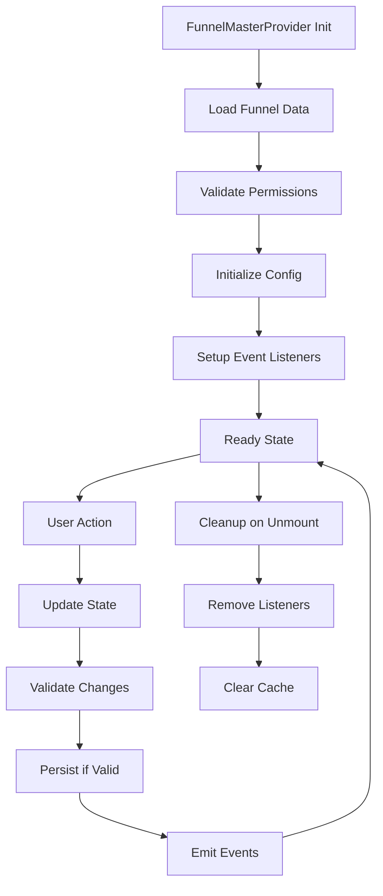

# 🔍 Análise de Contextos de Funil - Consolidação Arquitetural

## 📊 Estado Atual dos Contextos

### 1. FunnelsProvider (`/src/context/FunnelsContext.tsx`)
**Responsabilidades:**
- Gerenciamento legado de funis
- Operações CRUD básicas
- Template loading
- Persistência no Supabase
- Hook: `useFunnels()`

**Interface:**
```tsx
interface FunnelsContextType {
  currentFunnelId: string;
  steps: LegacyFunnelStep[];
  getTemplate: (templateId: string) => any;
  getTemplateBlocks: (templateId: string, stepId: string) => any[];
  updateFunnelStep: (stepId: string, updates: any) => void;
  addStepBlock: (stepId: string, blockData: any) => void;
  saveFunnelToDatabase: (funnelData: any) => Promise<void>;
  loading: boolean;
  error: string | null;
}
```

### 2. UnifiedFunnelProvider (`/src/context/UnifiedFunnelContext.tsx`)
**Responsabilidades:**
- Estado unificado usando `FunnelUnifiedService`
- Cache inteligente automático
- Deep clone para isolamento
- Validação automática
- Permissões integradas
- Event system para sincronização
- Hook: `useUnifiedFunnel()`, `useUnifiedFunnelSafe()`

**Interface:**
```tsx
interface UnifiedFunnelContextType {
  // Estado do funil
  funnelId: string | null;
  funnel: UnifiedFunnelData | null;
  isReady: boolean;
  isLoading: boolean;
  hasError: boolean;

  // Permissões
  canRead: boolean;
  canEdit: boolean;
  canDelete: boolean;
  isOwner: boolean;

  // Error handling
  errorMessage: string | null;
  errorType: string | null;
  suggestions: string[];

  // Ações CRUD
  createFunnel: (name: string, options?: any) => Promise<UnifiedFunnelData>;
}
```

### 3. FunnelConfigProvider (`/src/components/funnel-blocks/editor/FunnelConfigProvider.tsx`)
**Responsabilidades:**
- Configuração de funil específica para editor de blocos
- Gerenciamento de passos
- Estados de usuário e respostas
- Temas e configurações visuais
- Hook: `useFunnelConfig()`

**Interface:**
```tsx
interface FunnelConfigContextType {
  config: FunnelConfig;
  currentStepIndex: number;
  updateConfig: (newConfig: Partial<FunnelConfig>) => void;
  updateStep: (stepId: string, updates: Partial<FunnelStepConfig>) => void;
  userData: Record<string, any>;
  answers: Record<string, any>;
  result: Record<string, any> | null;
}
```

### 4. UnifiedContextProvider (`/src/core/contexts/UnifiedContextProvider.tsx`)
**Responsabilidades:**
- Provider central consolidando todos os contextos
- Template management unificado
- Persistência contextual
- Editor state unificado
- Hook: `useUnifiedContext()`, `useFunnelConfigLegacy()`

### 5. QuizFlowProvider (`/src/context/QuizFlowProvider.tsx`)
**Responsabilidades:**
- Controle de fluxo de quiz
- Navegação entre passos
- Controle de progresso
- Hook: `useQuizFlow()`

**Interface:**
```tsx
interface QuizFlowContextType {
  currentStep: number;
  totalSteps: number;
  progress: number;
  canProceed: boolean;
  next: () => void;
  previous: () => void;
  goTo: (step: number) => void;
}
```

## 🔍 Análise de Redundância

### Problemas Identificados:

1. **Sobreposição FunnelsProvider vs UnifiedFunnelProvider:**
   - Ambos gerenciam estado de funil
   - Ambos fazem persistência
   - Ambos carregam templates
   - **REDUNDÂNCIA CRÍTICA**

2. **FunnelConfigProvider vs UnifiedContextProvider:**
   - Ambos gerenciam configuração
   - Ambos lidam com template management
   - **REDUNDÂNCIA MODERADA**

3. **MainEditorUnified.tsx usa múltiplos providers simultaneamente:**
   ```tsx
   <UnifiedFunnelProvider>
     <FunnelsProvider debug={debugMode}>
       <UnifiedContextProvider>
         // Componentes
       </UnifiedContextProvider>
     </FunnelsProvider>
   </UnifiedFunnelProvider>
   ```

## 💡 Proposta de Consolidação

### 1. Unificação Primária: FunnelMasterProvider

```tsx
interface FunnelMasterContextType {
  // Estado unificado (do UnifiedFunnelProvider)
  funnelId: string | null;
  funnel: UnifiedFunnelData | null;
  isReady: boolean;
  isLoading: boolean;
  hasError: boolean;

  // Permissões (do UnifiedFunnelProvider)
  canRead: boolean;
  canEdit: boolean;
  isOwner: boolean;

  // Configuração (do FunnelConfigProvider)
  config: FunnelConfig;
  currentStepIndex: number;
  userData: Record<string, any>;
  answers: Record<string, any>;

  // Fluxo (do QuizFlowProvider)
  progress: number;
  canProceed: boolean;
  
  // Legacy compatibility (do FunnelsProvider)
  steps: LegacyFunnelStep[];
  getTemplate: (templateId: string) => any;

  // Ações consolidadas
  createFunnel: (name: string, options?: any) => Promise<UnifiedFunnelData>;
  updateConfig: (newConfig: Partial<FunnelConfig>) => void;
  updateStep: (stepId: string, updates: Partial<FunnelStepConfig>) => void;
  next: () => void;
  previous: () => void;
  goTo: (step: number) => void;
}
```

### 2. Estratégia de Migração

**Fase 1: Criar FunnelMasterProvider**
- Implementar provider consolidado
- Manter compatibilidade com hooks existentes
- Testes abrangentes

**Fase 2: Migração Gradual**
- Migrar MainEditorUnified primeiro
- Deprecar providers antigos gradualmente
- Manter bridges de compatibilidade

**Fase 3: Cleanup**
- Remover providers deprecados
- Consolidar hooks
- Documentação atualizada

## 🎯 Benefícios da Consolidação

### Performance:
- Redução de re-renders desnecessários
- Menos contextos aninhados
- Cache unificado

### Manutenibilidade:
- Lógica centralizada
- Menos pontos de falha
- API consistente

### Developer Experience:
- Hook único: `useFunnelMaster()`
- Menos imports
- Interface mais limpa

## 📋 Plano de Implementação

### 1. Análise de Dependências
- [ ] Mapear todos os componentes que usam cada provider
- [ ] Identificar breaking changes potenciais
- [ ] Planejar bridges de compatibilidade

### 2. Implementação
- [ ] Criar FunnelMasterProvider
- [ ] Implementar bridges para hooks legados
- [ ] Testes unitários e integração

### 3. Migração
- [ ] Migrar MainEditorUnified.tsx
- [ ] Migrar componentes críticos
- [ ] Validação funcional

### 4. Cleanup
- [ ] Remover providers deprecados
- [ ] Atualizar documentação
- [ ] Performance benchmarks

## 🔄 Ciclo de Vida Proposto



## 🚨 Riscos e Mitigações

### Riscos:
1. **Breaking changes em produção**
2. **Performance regression durante migração**  
3. **Complexity spike temporária**

### Mitigações:
1. **Feature flags para rollback**
2. **Performance monitoring contínuo**
3. **Documentação detalhada e treinamento**

## ✅ Próximos Passos

1. **Validar proposta com stakeholders**
2. **Implementar FunnelMasterProvider**
3. **Criar migration guide detalhado**
4. **Setup monitoring e alertas**
5. **Executar migração em fases**
