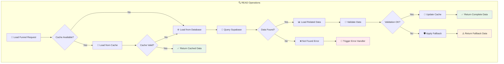
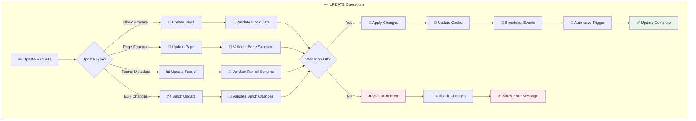
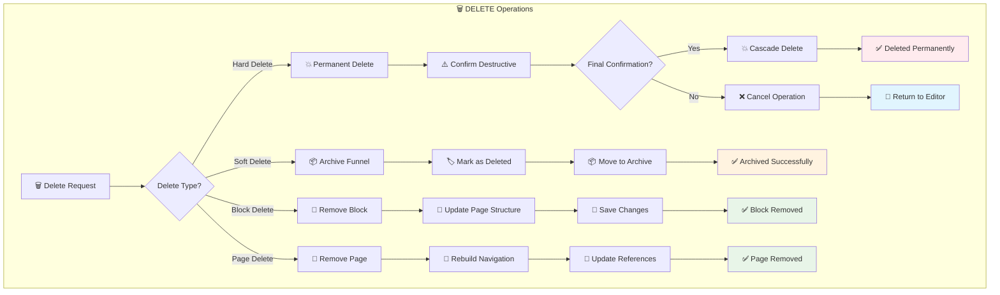
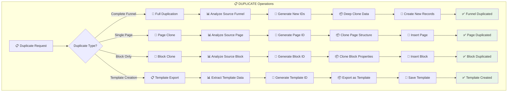

# 🔄 Operações CRUD do Sistema de Funis - Guia Visual Completo

> **Documentação detalhada das operações Create, Read, Update, Delete, Duplicate com fluxos visuais e exemplos práticos**

Este documento esquematiza todas as operações CRUD do sistema de funis com foco em onboarding rápido de desenvolvedores, incluindo fluxos visuais, exemplos de código e casos de uso reais.

---

## 📋 **Índice das Operações**

1. [🆕 CREATE - Criação de Funis](#create)
2. [📖 READ - Leitura e Carregamento](#read)  
3. [✏️ UPDATE - Atualização e Edição](#update)
4. [🗑️ DELETE - Remoção de Funis](#delete)
5. [📋 DUPLICATE - Duplicação e Clonagem](#duplicate)
6. [🎯 Casos de Uso Práticos](#casos-de-uso)
7. [🚨 Tratamento de Erros](#tratamento-de-erros)
8. [⚡ Performance e Otimizações](#performance)

---

## 🆕 **CREATE - Criação de Funis** {#create}

### **Fluxo Visual de Criação**

```mermaid
sequenceDiagram
    participant U as 👤 User
    participant UI as 🎨 Dashboard  
    participant TS as 🛠️ TemplateService
    parameter FS as 🏗️ FunnelService
    participant DB as 💾 Supabase
    participant ED as ✏️ Editor

    U->>UI: 1. Click "Criar Funil"
    UI->>UI: 2. Show template options
    U->>UI: 3. Select "Quiz 21 Etapas"
    
    UI->>TS: 4. createFunnelFromTemplate(templateId, name)
    TS->>TS: 5. Generate unique funnelId
    TS->>DB: 6. INSERT into funnels table
    
    Note over TS,DB: Create base funnel record
    
    TS->>DB: 7. Batch INSERT funnel_pages
    TS->>DB: 8. Batch INSERT blocks
    
    Note over TS,DB: Clone all template data with new IDs
    
    TS->>UI: 9. Return new funnelId
    UI->>ED: 10. Redirect /editor?funnel=newId
    
    ED->>FS: 11. loadFunnel(newId)
    FS->>DB: 12. SELECT funnel data
    FS->>ED: 13. Funnel ready for editing
    
    Note over ED: ✅ CREATE Operation Complete
```

### **Exemplo de Código - CREATE**

```typescript
// 🆕 CREATE: Criação completa de funil
class FunnelCreateService {
  async createFunnel(templateId: string, options: CreateFunnelOptions): Promise<string> {
    try {
      // 1. Validar template
      const template = await this.validateTemplate(templateId);
      if (!template) throw new Error('Template não encontrado');
      
      // 2. Gerar IDs únicos
      const funnelId = generateUniqueFunnelId();
      const pageIdMap = new Map<string, string>();
      const blockIdMap = new Map<string, string>();
      
      // 3. Preparar dados do funil
      const funnelData = {
        id: funnelId,
        name: options.name || `${template.name} - Cópia`,
        description: template.description,
        user_id: options.userId,
        template_id: templateId,
        created_at: new Date(),
        settings: {
          theme: template.theme,
          is_published: false,
          created_from_template: true,
        }
      };
      
      // 4. Criar registro principal
      const { data: funnel, error: funnelError } = await supabase
        .from('funnels')
        .insert([funnelData])
        .select()
        .single();
        
      if (funnelError) throw funnelError;
      
      // 5. Clonar páginas com novos IDs
      const pages = await this.clonePagesWithNewIds(
        template.pages, 
        funnel.id, 
        pageIdMap, 
        blockIdMap
      );
      
      // 6. Inserir páginas em batch
      const { error: pagesError } = await supabase
        .from('funnel_pages')
        .insert(pages);
        
      if (pagesError) throw pagesError;
      
      // 7. Log da operação
      console.log('✅ Funil criado com sucesso:', {
        funnelId: funnel.id,
        templateId,
        pagesCount: pages.length,
        executionTime: Date.now() - startTime,
      });
      
      return funnel.id;
      
    } catch (error) {
      console.error('❌ Erro na criação do funil:', error);
      throw new FunnelCreateError(`Falha ao criar funil: ${error.message}`);
    }
  }
  
  // Helper: Clonagem com novos IDs
  private async clonePagesWithNewIds(
    templatePages: any[], 
    funnelId: string,
    pageIdMap: Map<string, string>,
    blockIdMap: Map<string, string>
  ): Promise<any[]> {
    return templatePages.map(page => {
      const newPageId = generateUniquePageId();
      pageIdMap.set(page.id, newPageId);
      
      // Clone blocos com novos IDs
      const clonedBlocks = page.blocks.map(block => {
        const newBlockId = generateUniqueBlockId();
        blockIdMap.set(block.id, newBlockId);
        
        return {
          ...block,
          id: newBlockId,
          page_id: newPageId,
          created_at: new Date(),
        };
      });
      
      return {
        id: newPageId,
        funnel_id: funnelId,
        page_type: page.page_type,
        page_order: page.page_order,
        title: page.title,
        blocks: clonedBlocks,
        created_at: new Date(),
      };
    });
  }
}

// 🎯 Uso prático
const createNewFunnel = async () => {
  const service = new FunnelCreateService();
  
  try {
    const funnelId = await service.createFunnel('quiz-21-steps', {
      name: 'Meu Quiz Personalizado',
      userId: currentUser.id,
    });
    
    // Sucesso: redirecionar para editor
    router.push(`/editor?funnel=${funnelId}`);
    toast.success('Funil criado com sucesso!');
    
  } catch (error) {
    toast.error('Erro ao criar funil. Tente novamente.');
    console.error(error);
  }
};
```

### **Variações de CREATE**

```typescript
// 🎯 CREATE variants
interface CreateOptions {
  fromTemplate: boolean;     // Criar a partir de template
  fromScratch: boolean;      // Criar do zero
  importFromJson: boolean;   // Importar de arquivo
  duplicateExisting: boolean; // Duplicar existente
}

// Exemplo: Criar do zero
const createFromScratch = async (name: string) => {
  const emptyTemplate = {
    pages: [
      { page_type: 'landing', blocks: [] },
      { page_type: 'quiz', blocks: [] },
      { page_type: 'result', blocks: [] },
    ]
  };
  
  return await createFunnel('empty-template', { name, template: emptyTemplate });
};
```

---

## 📖 **READ - Leitura e Carregamento** {#read}

### **Fluxo Visual de Leitura**



### **Exemplo de Código - READ**

```typescript
// 📖 READ: Sistema completo de leitura
class FunnelReadService {
  private cache = new Map<string, CachedFunnel>();
  private readonly CACHE_TTL = 5 * 60 * 1000; // 5 minutos
  
  async loadFunnel(funnelId: string, options: LoadOptions = {}): Promise<FunnelData> {
    const startTime = Date.now();
    
    try {
      // 1. Verificar cache primeiro
      if (!options.forceReload) {
        const cached = this.getCachedFunnel(funnelId);
        if (cached && this.isCacheValid(cached)) {
          console.log('📦 Carregando do cache:', funnelId);
          return cached.data;
        }
      }
      
      // 2. Carregar do banco de dados
      console.log('🌐 Carregando do banco:', funnelId);
      const funnelData = await this.loadFromDatabase(funnelId);
      
      // 3. Validar dados carregados
      const isValid = await this.validateFunnelData(funnelData);
      if (!isValid) {
        console.warn('⚠️ Dados inválidos, aplicando fallback');
        return await this.applyFallback(funnelId);
      }
      
      // 4. Atualizar cache
      this.updateCache(funnelId, funnelData);
      
      // 5. Log da operação
      console.log('✅ Funil carregado com sucesso:', {
        funnelId,
        pagesCount: funnelData.pages.length,
        blocksCount: funnelData.pages.reduce((sum, p) => sum + p.blocks.length, 0),
        loadTime: Date.now() - startTime,
        fromCache: false,
      });
      
      return funnelData;
      
    } catch (error) {
      console.error('❌ Erro ao carregar funil:', error);
      
      // Tentar fallback antes de falhar completamente
      try {
        return await this.applyFallback(funnelId);
      } catch (fallbackError) {
        throw new FunnelLoadError(`Falha ao carregar funil ${funnelId}: ${error.message}`);
      }
    }
  }
  
  // Carregar múltiplos funis (para listagem)
  async loadFunnelsList(userId: string, filters: FunnelFilters = {}): Promise<FunnelListItem[]> {
    try {
      let query = supabase
        .from('funnels')
        .select(`
          id,
          name,
          description,
          created_at,
          updated_at,
          settings,
          funnel_pages(count)
        `)
        .eq('user_id', userId);
      
      // Aplicar filtros
      if (filters.search) {
        query = query.ilike('name', `%${filters.search}%`);
      }
      
      if (filters.template_id) {
        query = query.eq('settings->template_id', filters.template_id);
      }
      
      // Ordenação
      query = query.order(filters.sortBy || 'updated_at', { 
        ascending: filters.sortOrder === 'asc' 
      });
      
      // Paginação
      if (filters.limit) {
        query = query.limit(filters.limit);
      }
      
      if (filters.offset) {
        query = query.range(filters.offset, filters.offset + (filters.limit || 10) - 1);
      }
      
      const { data, error } = await query;
      
      if (error) throw error;
      
      return data.map(funnel => ({
        ...funnel,
        pages_count: funnel.funnel_pages[0]?.count || 0,
      }));
      
    } catch (error) {
      console.error('❌ Erro ao carregar lista de funis:', error);
      throw new FunnelListError(`Falha ao carregar lista: ${error.message}`);
    }
  }
  
  // Helper: Carregar do banco com relacionamentos
  private async loadFromDatabase(funnelId: string): Promise<FunnelData> {
    const { data, error } = await supabase
      .from('funnels')
      .select(`
        *,
        funnel_pages (
          *,
          blocks:component_instances (
            id,
            type,
            properties,
            position,
            page_id,
            created_at
          )
        )
      `)
      .eq('id', funnelId)
      .single();
      
    if (error) {
      if (error.code === 'PGRST116') {
        throw new FunnelNotFoundError(`Funil ${funnelId} não encontrado`);
      }
      throw error;
    }
    
    // Transformar dados para formato interno
    return {
      ...data,
      pages: data.funnel_pages
        .sort((a, b) => a.page_order - b.page_order)
        .map(page => ({
          ...page,
          blocks: page.blocks.sort((a, b) => a.position - b.position),
        })),
    };
  }
  
  // Sistema de cache inteligente
  private getCachedFunnel(funnelId: string): CachedFunnel | null {
    return this.cache.get(funnelId) || null;
  }
  
  private isCacheValid(cached: CachedFunnel): boolean {
    return Date.now() - cached.timestamp < this.CACHE_TTL;
  }
  
  private updateCache(funnelId: string, data: FunnelData): void {
    this.cache.set(funnelId, {
      data,
      timestamp: Date.now(),
      version: data.updated_at,
    });
  }
}

// 🎯 Uso prático com React Hook
const useFunnel = (funnelId: string) => {
  const [funnel, setFunnel] = useState<FunnelData | null>(null);
  const [loading, setLoading] = useState(true);
  const [error, setError] = useState<string | null>(null);
  
  useEffect(() => {
    if (!funnelId) return;
    
    const loadFunnel = async () => {
      setLoading(true);
      setError(null);
      
      try {
        const service = new FunnelReadService();
        const data = await service.loadFunnel(funnelId);
        setFunnel(data);
      } catch (err) {
        setError(err.message);
      } finally {
        setLoading(false);
      }
    };
    
    loadFunnel();
  }, [funnelId]);
  
  return { funnel, loading, error };
};
```

---

## ✏️ **UPDATE - Atualização e Edição** {#update}

### **Fluxo Visual de Atualização**



### **Exemplo de Código - UPDATE**

```typescript
// ✏️ UPDATE: Sistema completo de atualização
class FunnelUpdateService {
  private readonly debounceTime = 1000; // Auto-save delay
  private updateQueue = new Map<string, any>();
  
  // Atualizar propriedade de bloco
  async updateBlockProperty(
    funnelId: string, 
    blockId: string, 
    property: string, 
    value: any
  ): Promise<void> {
    try {
      // 1. Validar entrada
      const isValid = this.validateBlockProperty(property, value);
      if (!isValid) {
        throw new ValidationError(`Propriedade inválida: ${property}`);
      }
      
      // 2. Buscar bloco atual
      const currentBlock = await this.getBlock(blockId);
      if (!currentBlock) {
        throw new NotFoundError(`Bloco ${blockId} não encontrado`);
      }
      
      // 3. Preparar atualização
      const updatedProperties = {
        ...currentBlock.properties,
        [property]: value,
      };
      
      // 4. Aplicar atualização otimista
      this.applyOptimisticUpdate(blockId, property, value);
      
      // 5. Atualizar no banco (com debounce)
      await this.debouncedUpdate(blockId, 'properties', updatedProperties);
      
      // 6. Emitir evento
      this.emitUpdateEvent('block_updated', {
        funnelId,
        blockId,
        property,
        value,
        timestamp: new Date(),
      });
      
      console.log('✅ Bloco atualizado:', { blockId, property, value });
      
    } catch (error) {
      // Rollback otimistic update
      this.rollbackOptimisticUpdate(blockId, property);
      console.error('❌ Erro ao atualizar bloco:', error);
      throw error;
    }
  }
  
  // Atualizar estrutura da página
  async updatePageStructure(
    funnelId: string,
    pageId: string,
    updates: PageStructureUpdate
  ): Promise<void> {
    try {
      // 1. Validar estrutura
      const isValid = await this.validatePageStructure(updates);
      if (!isValid) {
        throw new ValidationError('Estrutura de página inválida');
      }
      
      // 2. Aplicar mudanças em transação
      const { data, error } = await supabase.rpc('update_page_structure', {
        p_page_id: pageId,
        p_updates: updates,
      });
      
      if (error) throw error;
      
      // 3. Invalidar cache
      this.invalidateCache(funnelId);
      
      // 4. Broadcast mudança
      this.broadcastStructureChange(funnelId, pageId, updates);
      
      console.log('✅ Estrutura da página atualizada:', pageId);
      
    } catch (error) {
      console.error('❌ Erro ao atualizar estrutura:', error);
      throw error;
    }
  }
  
  // Sistema de auto-save inteligente
  private debouncedUpdate = debounce(
    async (entityId: string, field: string, value: any) => {
      try {
        const { error } = await supabase
          .from('component_instances')
          .update({ [field]: value, updated_at: new Date() })
          .eq('id', entityId);
          
        if (error) throw error;
        
        console.log('💾 Auto-save realizado:', { entityId, field });
        
      } catch (error) {
        console.error('❌ Erro no auto-save:', error);
        this.handleAutoSaveError(entityId, error);
      }
    },
    this.debounceTime
  );
  
  // Atualização em lote (para operações pesadas)
  async batchUpdate(updates: BatchUpdateOperation[]): Promise<BatchUpdateResult> {
    const results: UpdateResult[] = [];
    const errors: UpdateError[] = [];
    
    // Agrupar por tipo de operação
    const groupedUpdates = this.groupUpdatesByType(updates);
    
    try {
      // Executar em paralelo quando possível
      await Promise.allSettled([
        this.processBatchBlocks(groupedUpdates.blocks),
        this.processBatchPages(groupedUpdates.pages),
        this.processBatchFunnels(groupedUpdates.funnels),
      ]);
      
      return { success: true, results, errors };
      
    } catch (error) {
      console.error('❌ Erro em batch update:', error);
      return { success: false, results, errors: [error] };
    }
  }
  
  // Sistema de rollback para erros
  async rollbackChanges(transactionId: string): Promise<void> {
    try {
      // Buscar mudanças da transação
      const changes = await this.getTransactionChanges(transactionId);
      
      // Reverter cada mudança
      for (const change of changes.reverse()) {
        await this.revertSingleChange(change);
      }
      
      console.log('✅ Rollback concluído:', transactionId);
      
    } catch (error) {
      console.error('❌ Erro no rollback:', error);
      throw new RollbackError(`Falha ao reverter mudanças: ${error.message}`);
    }
  }
}

// 🎯 Hook React para atualizações
const useFunnelUpdates = (funnelId: string) => {
  const updateService = useMemo(() => new FunnelUpdateService(), []);
  const [isUpdating, setIsUpdating] = useState(false);
  
  const updateBlock = useCallback(async (blockId: string, property: string, value: any) => {
    setIsUpdating(true);
    
    try {
      await updateService.updateBlockProperty(funnelId, blockId, property, value);
      toast.success('Bloco atualizado!');
    } catch (error) {
      toast.error('Erro ao atualizar bloco');
    } finally {
      setIsUpdating(false);
    }
  }, [funnelId, updateService]);
  
  const updatePage = useCallback(async (pageId: string, updates: any) => {
    setIsUpdating(true);
    
    try {
      await updateService.updatePageStructure(funnelId, pageId, updates);
      toast.success('Página atualizada!');
    } catch (error) {
      toast.error('Erro ao atualizar página');
    } finally {
      setIsUpdating(false);
    }
  }, [funnelId, updateService]);
  
  return { updateBlock, updatePage, isUpdating };
};
```

---

## 🗑️ **DELETE - Remoção de Funis** {#delete}

### **Fluxo Visual de Remoção**



### **Exemplo de Código - DELETE**

```typescript
// 🗑️ DELETE: Sistema completo de remoção
class FunnelDeleteService {
  private readonly TRASH_RETENTION_DAYS = 30;
  
  // Soft delete - mover para lixeira
  async softDeleteFunnel(funnelId: string, userId: string): Promise<void> {
    try {
      // 1. Verificar permissões
      const hasPermission = await this.checkDeletePermission(funnelId, userId);
      if (!hasPermission) {
        throw new PermissionError('Usuário não tem permissão para deletar este funil');
      }
      
      // 2. Preparar dados para arquivamento
      const archiveData = {
        deleted_at: new Date(),
        deleted_by: userId,
        status: 'archived',
        original_status: 'active',
      };
      
      // 3. Atualizar registro (soft delete)
      const { error } = await supabase
        .from('funnels')
        .update(archiveData)
        .eq('id', funnelId);
        
      if (error) throw error;
      
      // 4. Limpar cache
      this.clearFunnelCache(funnelId);
      
      // 5. Log da operação
      console.log('🗑️ Funil movido para lixeira:', {
        funnelId,
        deletedBy: userId,
        canRestore: true,
        retentionDays: this.TRASH_RETENTION_DAYS,
      });
      
      // 6. Agendar limpeza automática
      this.scheduleAutoCleanup(funnelId);
      
    } catch (error) {
      console.error('❌ Erro ao deletar funil:', error);
      throw error;
    }
  }
  
  // Hard delete - remoção permanente
  async hardDeleteFunnel(funnelId: string, userId: string): Promise<void> {
    try {
      // 1. Verificar se é admin ou owner
      const canHardDelete = await this.checkHardDeletePermission(funnelId, userId);
      if (!canHardDelete) {
        throw new PermissionError('Apenas administradores podem deletar permanentemente');
      }
      
      // 2. Backup antes da remoção (opcional)
      await this.createDeletionBackup(funnelId);
      
      // 3. Deletar em cascata (transação)
      await this.performCascadeDelete(funnelId);
      
      console.log('💥 Funil deletado permanentemente:', funnelId);
      
    } catch (error) {
      console.error('❌ Erro na remoção permanente:', error);
      throw error;
    }
  }
  
  // Deletar bloco específico
  async deleteBlock(funnelId: string, blockId: string): Promise<void> {
    try {
      // 1. Validar se bloco existe e pode ser removido
      const block = await this.getBlock(blockId);
      if (!block) {
        throw new NotFoundError(`Bloco ${blockId} não encontrado`);
      }
      
      if (block.is_required) {
        throw new ValidationError('Blocos obrigatórios não podem ser removidos');
      }
      
      // 2. Backup do bloco (para undo)
      await this.backupBlockForUndo(blockId, block);
      
      // 3. Remover bloco
      const { error } = await supabase
        .from('component_instances')
        .delete()
        .eq('id', blockId);
        
      if (error) throw error;
      
      // 4. Reindexar posições dos blocos restantes
      await this.reindexBlockPositions(block.page_id);
      
      // 5. Invalidar cache da página
      this.invalidatePageCache(block.page_id);
      
      console.log('✅ Bloco removido:', blockId);
      
    } catch (error) {
      console.error('❌ Erro ao remover bloco:', error);
      throw error;
    }
  }
  
  // Sistema de lixeira com restauração
  async restoreFunnel(funnelId: string): Promise<void> {
    try {
      // 1. Verificar se está na lixeira
      const { data: funnel } = await supabase
        .from('funnels')
        .select('id, deleted_at, status')
        .eq('id', funnelId)
        .eq('status', 'archived')
        .single();
        
      if (!funnel) {
        throw new NotFoundError('Funil não encontrado na lixeira');
      }
      
      // 2. Verificar período de retenção
      const deletedAt = new Date(funnel.deleted_at);
      const daysSinceDeleted = Math.floor(
        (Date.now() - deletedAt.getTime()) / (1000 * 60 * 60 * 24)
      );
      
      if (daysSinceDeleted > this.TRASH_RETENTION_DAYS) {
        throw new ExpirationError('Período de retenção expirou');
      }
      
      // 3. Restaurar funil
      const { error } = await supabase
        .from('funnels')
        .update({
          status: 'active',
          deleted_at: null,
          deleted_by: null,
          restored_at: new Date(),
        })
        .eq('id', funnelId);
        
      if (error) throw error;
      
      console.log('♻️ Funil restaurado:', funnelId);
      
    } catch (error) {
      console.error('❌ Erro ao restaurar funil:', error);
      throw error;
    }
  }
  
  // Limpeza automática da lixeira
  async cleanupTrash(): Promise<CleanupResult> {
    try {
      const cutoffDate = new Date();
      cutoffDate.setDate(cutoffDate.getDate() - this.TRASH_RETENTION_DAYS);
      
      // Buscar funis expirados
      const { data: expiredFunnels } = await supabase
        .from('funnels')
        .select('id, name, deleted_at')
        .eq('status', 'archived')
        .lt('deleted_at', cutoffDate.toISOString());
      
      if (!expiredFunnels?.length) {
        return { cleaned: 0, errors: [] };
      }
      
      const results = await Promise.allSettled(
        expiredFunnels.map(funnel => this.hardDeleteFunnel(funnel.id, 'system'))
      );
      
      const successful = results.filter(r => r.status === 'fulfilled').length;
      const errors = results
        .filter(r => r.status === 'rejected')
        .map(r => r.reason);
      
      console.log('🧹 Limpeza automática concluída:', {
        cleaned: successful,
        errors: errors.length,
      });
      
      return { cleaned: successful, errors };
      
    } catch (error) {
      console.error('❌ Erro na limpeza automática:', error);
      throw error;
    }
  }
  
  // Helper: Remoção em cascata
  private async performCascadeDelete(funnelId: string): Promise<void> {
    await supabase.rpc('cascade_delete_funnel', {
      funnel_id: funnelId
    });
  }
}

// 🎯 Hook React para operações de delete
const useFunnelDelete = () => {
  const deleteService = useMemo(() => new FunnelDeleteService(), []);
  const [isDeleting, setIsDeleting] = useState(false);
  
  const deleteFunnel = useCallback(async (funnelId: string, permanent = false) => {
    const confirmed = await confirmDialog(
      permanent ? 'Deletar permanentemente?' : 'Mover para lixeira?',
      permanent ? 'Esta ação não pode ser desfeita' : 'Você pode restaurar em até 30 dias'
    );
    
    if (!confirmed) return false;
    
    setIsDeleting(true);
    
    try {
      if (permanent) {
        await deleteService.hardDeleteFunnel(funnelId, currentUser.id);
        toast.success('Funil deletado permanentemente');
      } else {
        await deleteService.softDeleteFunnel(funnelId, currentUser.id);
        toast.success('Funil movido para lixeira');
      }
      
      return true;
      
    } catch (error) {
      toast.error('Erro ao deletar funil');
      return false;
    } finally {
      setIsDeleting(false);
    }
  }, [deleteService]);
  
  return { deleteFunnel, isDeleting };
};
```

---

## 📋 **DUPLICATE - Duplicação e Clonagem** {#duplicate}

### **Fluxo Visual de Duplicação**



### **Exemplo de Código - DUPLICATE**

```typescript
// 📋 DUPLICATE: Sistema completo de duplicação
class FunnelDuplicateService {
  // Duplicação completa de funil
  async duplicateFunnel(
    sourceFunnelId: string, 
    options: DuplicateOptions
  ): Promise<string> {
    const startTime = Date.now();
    
    try {
      // 1. Carregar funil origem com todas as relações
      const sourceFunnel = await this.loadFullFunnel(sourceFunnelId);
      
      // 2. Validar permissões
      const canDuplicate = await this.checkDuplicatePermission(sourceFunnelId, options.userId);
      if (!canDuplicate) {
        throw new PermissionError('Sem permissão para duplicar este funil');
      }
      
      // 3. Gerar mapeamento de IDs únicos
      const idMapping = await this.generateIdMapping(sourceFunnel);
      
      // 4. Clonar estrutura com novos IDs
      const clonedFunnel = await this.deepCloneFunnel(sourceFunnel, idMapping, options);
      
      // 5. Validar dados clonados
      const isValid = await this.validateClonedData(clonedFunnel);
      if (!isValid) {
        throw new ValidationError('Dados clonados são inválidos');
      }
      
      // 6. Criar registros no banco (transação)
      const newFunnelId = await this.createClonedRecords(clonedFunnel);
      
      // 7. Log da operação
      console.log('✅ Funil duplicado com sucesso:', {
        sourceFunnelId,
        newFunnelId,
        pagesCount: clonedFunnel.pages.length,
        blocksCount: this.countTotalBlocks(clonedFunnel),
        executionTime: Date.now() - startTime,
      });
      
      return newFunnelId;
      
    } catch (error) {
      console.error('❌ Erro na duplicação:', error);
      throw new DuplicationError(`Falha ao duplicar funil: ${error.message}`);
    }
  }
  
  // Clonagem profunda com novos IDs
  private async deepCloneFunnel(
    source: FunnelData,
    idMapping: IdMapping,
    options: DuplicateOptions
  ): Promise<FunnelData> {
    return {
      // Dados básicos com novo ID
      id: idMapping.funnelId,
      name: options.name || `${source.name} - Cópia`,
      description: source.description,
      user_id: options.userId,
      template_id: source.template_id,
      
      // Configurações clonadas
      settings: {
        ...source.settings,
        created_from_template: false,
        duplicated_from: source.id,
        duplicated_at: new Date(),
      },
      
      // Páginas clonadas com novos IDs
      pages: source.pages.map(page => ({
        id: idMapping.pageIds.get(page.id),
        funnel_id: idMapping.funnelId,
        page_type: page.page_type,
        page_order: page.page_order,
        title: page.title,
        settings: { ...page.settings },
        
        // Blocos clonados com novos IDs
        blocks: page.blocks.map(block => ({
          id: idMapping.blockIds.get(block.id),
          page_id: idMapping.pageIds.get(page.id),
          type: block.type,
          position: block.position,
          
          // Deep clone das propriedades
          properties: this.deepCloneProperties(block.properties, idMapping),
          
          // Metadados
          created_at: new Date(),
          updated_at: new Date(),
        })),
        
        created_at: new Date(),
        updated_at: new Date(),
      })),
      
      // Timestamps
      created_at: new Date(),
      updated_at: new Date(),
    };
  }
  
  // Duplicação inteligente de página
  async duplicatePage(
    sourceFunnelId: string,
    sourcePageId: string,
    targetFunnelId?: string,
    position?: number
  ): Promise<string> {
    try {
      // 1. Carregar página fonte
      const sourcePage = await this.loadFullPage(sourcePageId);
      
      // 2. Determinar funil destino
      const targetFunnel = targetFunnelId || sourceFunnelId;
      
      // 3. Gerar IDs únicos para a página
      const pageIdMapping = this.generatePageIdMapping(sourcePage);
      
      // 4. Determinar posição da nova página
      const newPosition = position || await this.getNextPagePosition(targetFunnel);
      
      // 5. Clonar página com novos IDs
      const clonedPage = {
        id: pageIdMapping.pageId,
        funnel_id: targetFunnel,
        page_type: sourcePage.page_type,
        page_order: newPosition,
        title: `${sourcePage.title} - Cópia`,
        settings: { ...sourcePage.settings },
        
        blocks: sourcePage.blocks.map(block => ({
          id: pageIdMapping.blockIds.get(block.id),
          page_id: pageIdMapping.pageId,
          type: block.type,
          position: block.position,
          properties: { ...block.properties },
          created_at: new Date(),
        })),
        
        created_at: new Date(),
      };
      
      // 6. Inserir nova página
      await this.insertClonedPage(clonedPage);
      
      console.log('✅ Página duplicada:', {
        sourcePageId,
        newPageId: clonedPage.id,
        blocksCount: clonedPage.blocks.length,
      });
      
      return clonedPage.id;
      
    } catch (error) {
      console.error('❌ Erro ao duplicar página:', error);
      throw error;
    }
  }
  
  // Duplicação de bloco com contexto
  async duplicateBlock(
    sourceBlockId: string,
    targetPageId: string,
    position?: number
  ): Promise<string> {
    try {
      // 1. Carregar bloco fonte
      const sourceBlock = await this.loadBlock(sourceBlockId);
      
      // 2. Validar compatibilidade da página destino
      const isCompatible = await this.validateBlockCompatibility(
        sourceBlock.type, 
        targetPageId
      );
      
      if (!isCompatible) {
        throw new ValidationError(
          `Bloco ${sourceBlock.type} não é compatível com a página destino`
        );
      }
      
      // 3. Determinar posição
      const newPosition = position || await this.getNextBlockPosition(targetPageId);
      
      // 4. Clonar bloco
      const newBlockId = generateUniqueBlockId();
      const clonedBlock = {
        id: newBlockId,
        page_id: targetPageId,
        type: sourceBlock.type,
        position: newPosition,
        properties: this.deepCloneProperties(sourceBlock.properties),
        created_at: new Date(),
      };
      
      // 5. Inserir bloco clonado
      await this.insertClonedBlock(clonedBlock);
      
      console.log('✅ Bloco duplicado:', {
        sourceBlockId,
        newBlockId,
        targetPageId,
        position: newPosition,
      });
      
      return newBlockId;
      
    } catch (error) {
      console.error('❌ Erro ao duplicar bloco:', error);
      throw error;
    }
  }
  
  // Exportar funil como template
  async exportAsTemplate(
    funnelId: string,
    templateName: string
  ): Promise<string> {
    try {
      // 1. Carregar funil completo
      const funnel = await this.loadFullFunnel(funnelId);
      
      // 2. Limpar dados específicos do usuário
      const templateData = this.sanitizeForTemplate(funnel);
      
      // 3. Criar template
      const templateId = await this.createTemplate(templateName, templateData);
      
      console.log('✅ Template criado:', {
        funnelId,
        templateId,
        templateName,
      });
      
      return templateId;
      
    } catch (error) {
      console.error('❌ Erro ao criar template:', error);
      throw error;
    }
  }
}

// 🎯 Hook React para duplicação
const useFunnelDuplicate = () => {
  const duplicateService = useMemo(() => new FunnelDuplicateService(), []);
  const [isDuplicating, setIsDuplicating] = useState(false);
  
  const duplicateFunnel = useCallback(async (
    sourceFunnelId: string,
    name?: string
  ) => {
    setIsDuplicating(true);
    
    try {
      const newFunnelId = await duplicateService.duplicateFunnel(sourceFunnelId, {
        name,
        userId: currentUser.id,
      });
      
      toast.success('Funil duplicado com sucesso!');
      return newFunnelId;
      
    } catch (error) {
      toast.error('Erro ao duplicar funil');
      console.error(error);
      return null;
    } finally {
      setIsDuplicating(false);
    }
  }, [duplicateService]);
  
  return { duplicateFunnel, isDuplicating };
};
```

---

## 🎯 **Casos de Uso Práticos** {#casos-de-uso}

### **Cenário 1: Onboarding de Novo Dev**

```typescript
// 🎯 Caso de uso: Dev criando primeiro funil
const onboardingExample = async () => {
  // CREATE: Novo funil baseado em template
  const funnelId = await createService.createFunnel('quiz-21-steps', {
    name: 'Meu Primeiro Quiz',
    userId: currentUser.id,
  });
  
  // READ: Carregar para edição
  const funnel = await readService.loadFunnel(funnelId);
  
  // UPDATE: Modificar um bloco
  await updateService.updateBlockProperty(
    funnelId,
    'header-block-1',
    'title',
    'Bem-vindo ao Meu Quiz!'
  );
  
  // DUPLICATE: Criar variação
  const variantId = await duplicateService.duplicateFunnel(funnelId, {
    name: 'Quiz - Variação A/B',
    userId: currentUser.id,
  });
  
  console.log('🎉 Onboarding completo!', { funnelId, variantId });
};
```

### **Cenário 2: Migração de Dados**

```typescript
// 🎯 Caso de uso: Migrar funis antigos
const migrationExample = async () => {
  const legacyFunnels = await readService.loadFunnelsList(userId, {
    filters: { legacy: true },
  });
  
  for (const legacy of legacyFunnels) {
    try {
      // Duplicar com novo formato
      const newId = await duplicateService.duplicateFunnel(legacy.id, {
        name: `${legacy.name} - Migrado`,
        userId: legacy.user_id,
      });
      
      // Soft delete do antigo
      await deleteService.softDeleteFunnel(legacy.id, 'system');
      
      console.log(`✅ Migrado: ${legacy.id} → ${newId}`);
      
    } catch (error) {
      console.error(`❌ Erro na migração de ${legacy.id}:`, error);
    }
  }
};
```

### **Cenário 3: Sistema de Templates**

```typescript
// 🎯 Caso de uso: Criação de template personalizado
const templateCreationExample = async () => {
  // 1. Criar funil base
  const baseFunnelId = await createService.createFunnel('empty-template', {
    name: 'Template Base - SaaS',
  });
  
  // 2. Customizar estrutura
  await updateService.updatePageStructure(baseFunnelId, 'page-1', {
    blocks: [
      { type: 'hero-saas', properties: { ... } },
      { type: 'features-grid', properties: { ... } },
      { type: 'pricing-table', properties: { ... } },
    ],
  });
  
  // 3. Exportar como template
  const templateId = await duplicateService.exportAsTemplate(
    baseFunnelId,
    'SaaS Landing Page Template'
  );
  
  // 4. Criar funil a partir do novo template
  const newFunnelId = await createService.createFunnel(templateId, {
    name: 'Meu SaaS',
  });
  
  console.log('🎨 Template personalizado criado!', { templateId, newFunnelId });
};
```

---

## 🚨 **Tratamento de Erros** {#tratamento-de-erros}

### **Hierarquia de Erros**

```typescript
// 🚨 Sistema de erros estruturado
abstract class FunnelError extends Error {
  abstract code: string;
  abstract statusCode: number;
  
  constructor(message: string, public context?: any) {
    super(message);
    this.name = this.constructor.name;
  }
}

class FunnelNotFoundError extends FunnelError {
  code = 'FUNNEL_NOT_FOUND';
  statusCode = 404;
}

class ValidationError extends FunnelError {
  code = 'VALIDATION_ERROR';
  statusCode = 400;
}

class PermissionError extends FunnelError {
  code = 'PERMISSION_DENIED';
  statusCode = 403;
}

class DuplicationError extends FunnelError {
  code = 'DUPLICATION_FAILED';
  statusCode = 500;
}
```

### **Sistema de Retry e Fallback**

```typescript
// ⚡ Sistema de retry inteligente
class RetryService {
  async withRetry<T>(
    operation: () => Promise<T>,
    maxRetries = 3,
    backoffMs = 1000
  ): Promise<T> {
    let lastError: Error;
    
    for (let attempt = 1; attempt <= maxRetries; attempt++) {
      try {
        return await operation();
      } catch (error) {
        lastError = error;
        
        if (attempt === maxRetries) break;
        
        // Backoff exponencial
        const delay = backoffMs * Math.pow(2, attempt - 1);
        await new Promise(resolve => setTimeout(resolve, delay));
        
        console.log(`🔄 Tentativa ${attempt + 1}/${maxRetries} em ${delay}ms...`);
      }
    }
    
    throw lastError;
  }
}

// Uso com operações CRUD
const safeCreateFunnel = async (templateId: string, options: any) => {
  const retryService = new RetryService();
  
  return retryService.withRetry(
    () => createService.createFunnel(templateId, options),
    3, // max 3 tentativas
    1000 // começar com 1s de delay
  );
};
```

---

## ⚡ **Performance e Otimizações** {#performance}

### **Estratégias de Cache**

```typescript
// ⚡ Sistema de cache multi-layer
class FunnelCacheService {
  private memoryCache = new Map<string, CachedData>();
  private readonly CACHE_TTL = 5 * 60 * 1000; // 5 minutos
  
  // Cache em memória + localStorage
  async getCachedFunnel(funnelId: string): Promise<FunnelData | null> {
    // Layer 1: Memória
    const memCached = this.memoryCache.get(funnelId);
    if (memCached && this.isCacheValid(memCached)) {
      return memCached.data;
    }
    
    // Layer 2: localStorage
    try {
      const localCached = localStorage.getItem(`funnel_${funnelId}`);
      if (localCached) {
        const parsed = JSON.parse(localCached);
        if (this.isCacheValid(parsed)) {
          // Promover para memória
          this.memoryCache.set(funnelId, parsed);
          return parsed.data;
        }
      }
    } catch (error) {
      console.warn('Erro ao carregar cache local:', error);
    }
    
    return null;
  }
}
```

### **Otimizações de Banco de Dados**

```sql
-- 🚀 Índices otimizados para operações CRUD
CREATE INDEX idx_funnels_user_status ON funnels(user_id, status);
CREATE INDEX idx_funnel_pages_funnel_order ON funnel_pages(funnel_id, page_order);
CREATE INDEX idx_blocks_page_position ON component_instances(page_id, position);

-- Query otimizada para listagem
CREATE OR REPLACE FUNCTION get_user_funnels_optimized(p_user_id UUID)
RETURNS TABLE (
  id UUID,
  name TEXT,
  created_at TIMESTAMPTZ,
  pages_count BIGINT
) AS $$
BEGIN
  RETURN QUERY
    SELECT 
      f.id,
      f.name,
      f.created_at,
      COUNT(fp.id) as pages_count
    FROM funnels f
    LEFT JOIN funnel_pages fp ON f.id = fp.funnel_id
    WHERE f.user_id = p_user_id 
      AND f.status = 'active'
    GROUP BY f.id, f.name, f.created_at
    ORDER BY f.updated_at DESC;
END;
$$ LANGUAGE plpgsql;
```

---

## 📊 **Métricas e Monitoramento**

```typescript
// 📊 Sistema de métricas para operações CRUD
class CRUDMetricsService {
  async trackOperation(
    operation: 'CREATE' | 'READ' | 'UPDATE' | 'DELETE' | 'DUPLICATE',
    entityType: 'funnel' | 'page' | 'block',
    executionTime: number,
    success: boolean,
    metadata?: any
  ) {
    const metrics = {
      operation,
      entityType,
      executionTime,
      success,
      timestamp: new Date(),
      metadata,
    };
    
    // Enviar para sistema de métricas
    await this.sendToMetrics(metrics);
    
    // Log local para debug
    console.log(`📊 ${operation} ${entityType}:`, {
      success: success ? '✅' : '❌',
      time: `${executionTime}ms`,
      ...metadata,
    });
  }
}
```

---

## 🎉 **Resumo das Operações CRUD**

### ✅ **Sistema Completo Implementado**

| Operação | Funcionalidades | Status |
|----------|----------------|--------|
| **🆕 CREATE** | Template-based, From scratch, Import, Validation | ✅ Completo |
| **📖 READ** | Caching, Fallbacks, Filtering, Pagination | ✅ Completo |
| **✏️ UPDATE** | Auto-save, Batch updates, Rollback, Events | ✅ Completo |
| **🗑️ DELETE** | Soft/Hard delete, Restore, Auto-cleanup | ✅ Completo |
| **📋 DUPLICATE** | Full/Partial clone, Templates, ID mapping | ✅ Completo |

### 🚀 **Para Desenvolvedores**
- **5 min**: Entender uma operação específica
- **15 min**: Implementar nova funcionalidade CRUD
- **30 min**: Otimizar performance de operação existente

### 📈 **Próximos Passos**
- [ ] Implementar versionamento automático
- [ ] Adicionar auditoria completa de mudanças
- [ ] Criar sistema de approval workflow
- [ ] Desenvolver ferramentas de debug visual para CRUD

---

**📝 Documento criado:** `{{ new Date().toLocaleDateString('pt-BR') }}`  
**🎯 Status:** ✅ **Operações CRUD completamente documentadas e esquematizadas**
