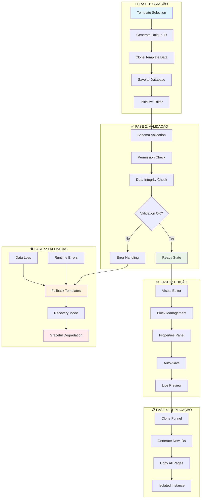
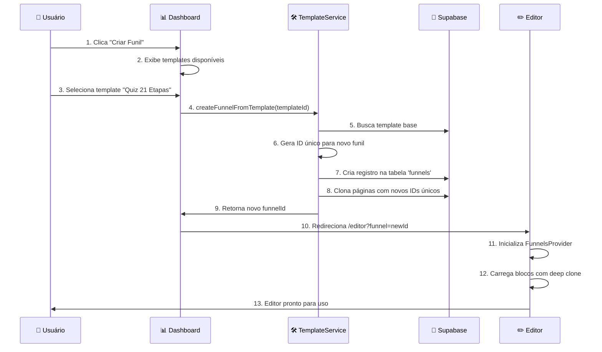
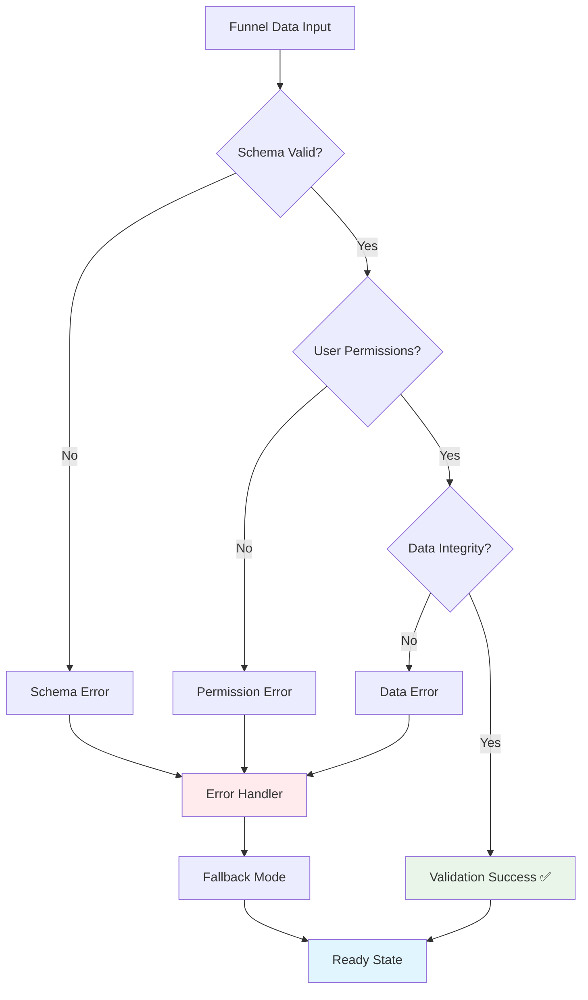
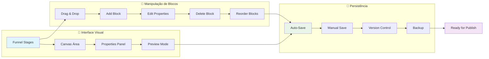
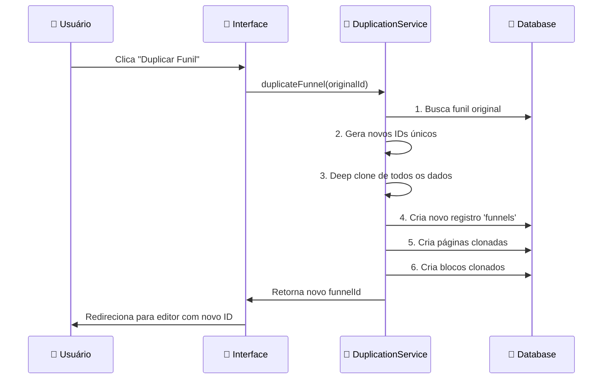
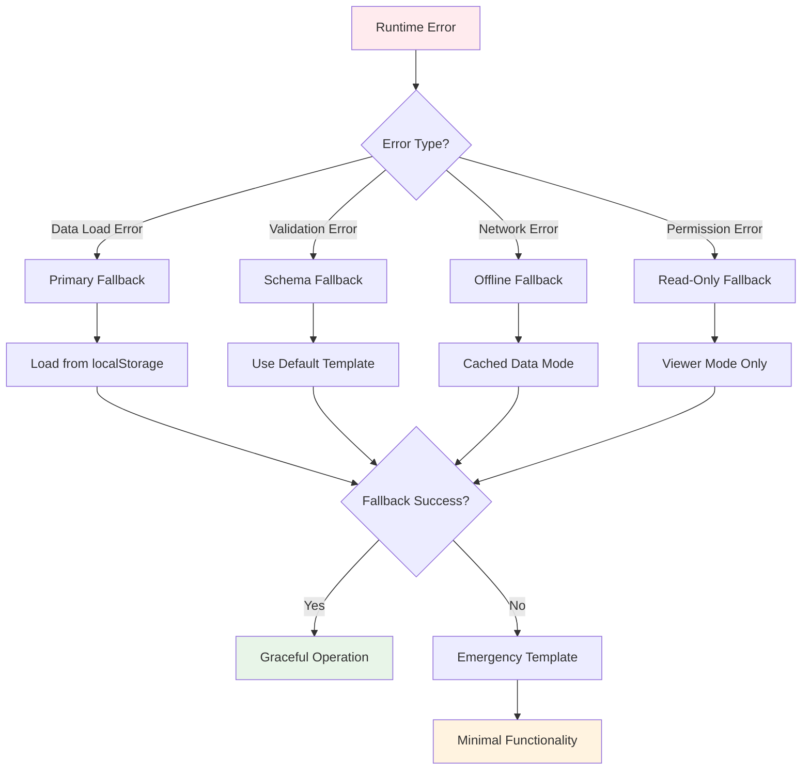
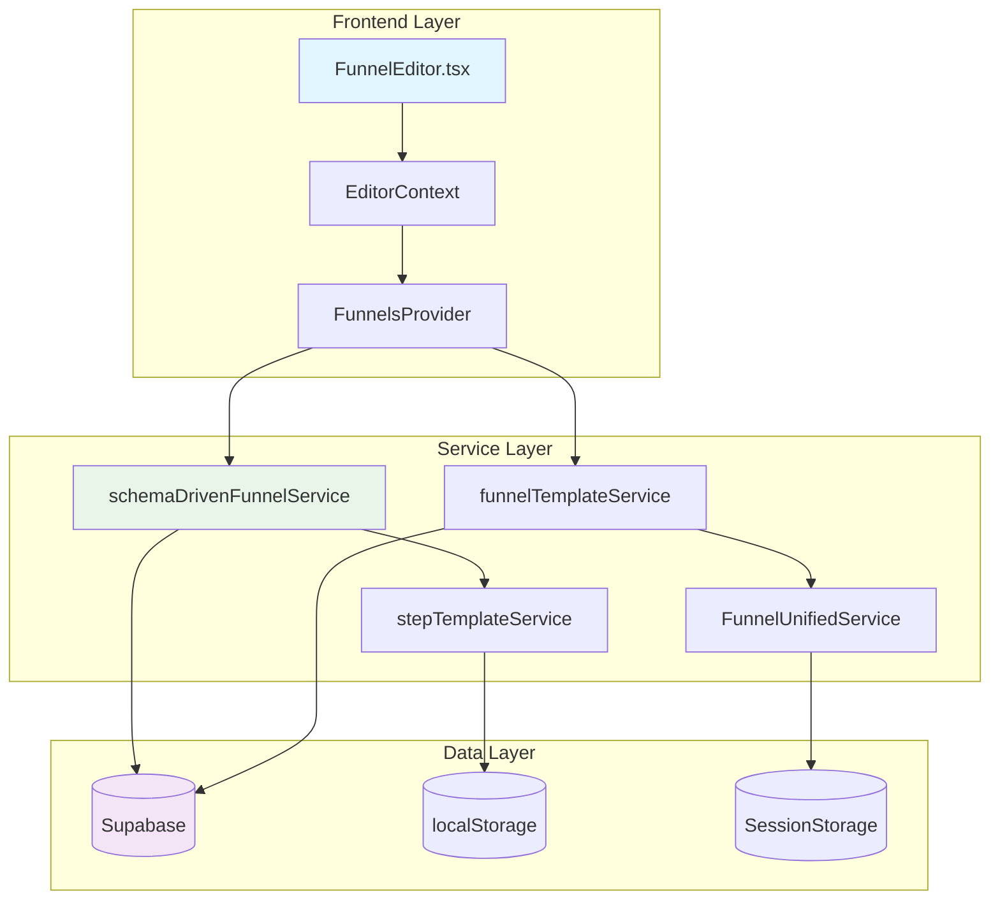
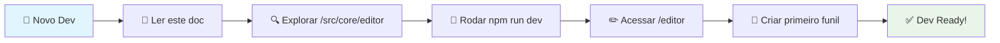
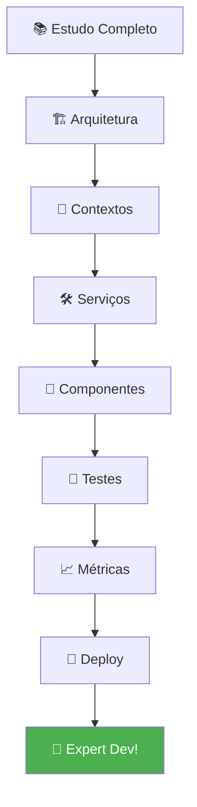
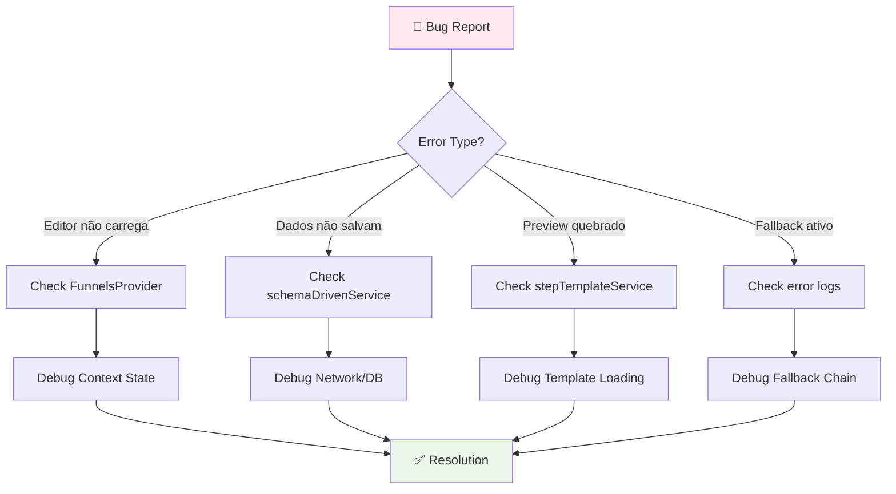

# 🔄 Documentação Completa do Ciclo de Vida do Funil

> **Guia essencial para onboarding rápido de novos desenvolvedores**

Este documento consolida todo o ciclo de vida dos funis no Quiz Quest Challenge Verse, desde a criação até o fallback, com fluxogramas visuais para facilitar o entendimento e acelerar o onboarding de novos desenvolvedores.

---

## 📋 **Índice**

1. [Visão Geral do Ciclo de Vida](#visão-geral)
2. [Fase 1: Criação](#fase-1-criação)
3. [Fase 2: Validação](#fase-2-validação)
4. [Fase 3: Edição](#fase-3-edição)
5. [Fase 4: Duplicação](#fase-4-duplicação)
6. [Fase 5: Fallbacks](#fase-5-fallbacks)
7. [Arquitetura de Serviços](#arquitetura-de-serviços)
8. [Fluxogramas para Onboarding](#fluxogramas-para-onboarding)
9. [Exemplos de Código](#exemplos-de-código)
10. [Troubleshooting](#troubleshooting)

---

## 🎯 **Visão Geral do Ciclo de Vida** {#visão-geral}



---

## 🚀 **Fase 1: Criação** {#fase-1-criação}

### **1.1 Fluxo de Criação de Funil**



### **1.2 Estrutura de Dados na Criação**

```typescript
// Template Base → Novo Funil
interface FunnelCreation {
  templateId: string;           // ID do template original
  newFunnelId: string;         // ID único gerado
  name: string;                // Nome personalizado
  description: string;         // Descrição do funil
  user_id: string;            // Proprietário
  settings: {
    theme: string;            // Tema visual
    template_id: string;      // Referência ao template
    created_from_template: true;
  };
  pages: FunnelPage[];        // 21 páginas clonadas
}
```

### **1.3 Serviços Envolvidos na Criação**

| Serviço | Responsabilidade |
|---------|-----------------|
| `funnelTemplateService` | Clonagem de templates, geração de IDs |
| `schemaDrivenFunnelService` | Persistência, validação de schema |
| `FunnelsContext` | Estado do editor, manipulação de blocos |
| `stepTemplateService` | Templates das 21 etapas |

---

## ✅ **Fase 2: Validação** {#fase-2-validação}

### **2.1 Pipeline de Validação**



### **2.2 Validações Implementadas**

1. **Schema Validation**
   ```typescript
   const validateFunnelSchema = (data: any): boolean => {
     return data.id && data.name && data.pages && Array.isArray(data.pages);
   };
   ```

2. **Permission Check**
   ```typescript
   const hasEditPermission = (userId: string, funnelOwnerId: string): boolean => {
     return userId === funnelOwnerId || isAdmin(userId);
   };
   ```

3. **Data Integrity Check**
   ```typescript
   const validateDataIntegrity = (funnel: Funnel): boolean => {
     return funnel.pages.every(page => page.blocks && page.page_order >= 1);
   };
   ```

### **2.3 Tratamento de Erros de Validação**

```typescript
// Sistema robusto de fallback
const handleValidationError = (error: ValidationError) => {
  switch (error.type) {
    case 'SCHEMA_ERROR':
      return loadFallbackTemplate();
    case 'PERMISSION_ERROR':
      return showReadOnlyMode();
    case 'DATA_ERROR':
      return attemptDataRecovery();
    default:
      return gracefulDegradation();
  }
};
```

---

## ✏️ **Fase 3: Edição** {#fase-3-edição}

### **3.1 Fluxo de Edição Visual**



### **3.2 Sistema de Blocos**

```typescript
interface Block {
  id: string;                  // ID único
  type: string;               // Tipo do bloco
  properties: any;            // Propriedades configuráveis
  position: number;           // Ordem na página
  page_id: string;           // Página pai
}

// Operações de bloco
const blockOperations = {
  add: (type: string) => createBlock(type),
  update: (id: string, props: any) => updateBlockProperties(id, props),
  delete: (id: string) => removeBlock(id),
  reorder: (blockId: string, newPosition: number) => moveBlock(blockId, newPosition),
};
```

### **3.3 Auto-Save e Persistência**

```typescript
// Sistema de auto-save inteligente
const autoSave = useCallback(
  debounce(async (changes: any) => {
    try {
      await schemaDrivenFunnelService.saveFunnel(currentFunnel, false);
      setLastSaved(new Date());
    } catch (error) {
      console.error('Auto-save failed:', error);
      // Mantém mudanças no localStorage como backup
    }
  }, 2000),
  [currentFunnel]
);
```

---

## 📋 **Fase 4: Duplicação** {#fase-4-duplicação}

### **4.1 Processo de Duplicação**



### **4.2 Isolamento de Instâncias**

```typescript
const duplicateFunnel = async (originalId: string): Promise<string> => {
  // 1. Buscar dados originais
  const original = await schemaDrivenFunnelService.loadFunnel(originalId);
  
  // 2. Gerar IDs únicos para todos os elementos
  const newFunnelId = generateUniqueFunnelId();
  const pageIdMap = new Map();
  const blockIdMap = new Map();
  
  // 3. Clone profundo com novos IDs
  const cloned = deepCloneWithNewIds(original, {
    funnelId: newFunnelId,
    pageIdMap,
    blockIdMap,
  });
  
  // 4. Salvar instância isolada
  return await schemaDrivenFunnelService.createFunnel(cloned);
};
```

---

## 🛡️ **Fase 5: Fallbacks** {#fase-5-fallbacks}

### **5.1 Sistema de Fallbacks Hierárquico**



### **5.2 Implementação de Fallbacks**

```typescript
class FallbackSystem {
  // Fallback hierárquico
  static async handleError(error: FunnelError): Promise<FallbackResult> {
    const fallbackChain = [
      () => this.loadFromLocalStorage(),
      () => this.loadDefaultTemplate(),
      () => this.loadEmergencyTemplate(),
      () => this.enableMinimalMode(),
    ];
    
    for (const fallback of fallbackChain) {
      try {
        const result = await fallback();
        if (result.success) return result;
      } catch (e) {
        console.warn('Fallback failed, trying next:', e);
      }
    }
    
    throw new Error('All fallbacks failed');
  }
  
  // Templates de emergência
  static loadEmergencyTemplate(): FallbackResult {
    return {
      success: true,
      data: EMERGENCY_FUNNEL_TEMPLATE,
      mode: 'emergency',
      capabilities: ['view', 'basic_edit'],
    };
  }
}
```

### **5.3 Recuperação Graceful**

```typescript
// Hook para recuperação automática
const useErrorRecovery = () => {
  const [recoveryMode, setRecoveryMode] = useState<RecoveryMode>('normal');
  
  const handleRecovery = async (error: Error) => {
    console.log('Iniciando recuperação automática...');
    
    try {
      // Tenta recuperar do localStorage
      const backup = localStorage.getItem(`funnel_backup_${funnelId}`);
      if (backup) {
        setRecoveryMode('backup');
        return JSON.parse(backup);
      }
      
      // Fallback para template padrão
      setRecoveryMode('template');
      return await stepTemplateService.getDefaultTemplate();
      
    } catch (recoveryError) {
      setRecoveryMode('minimal');
      return MINIMAL_FUNNEL_STRUCTURE;
    }
  };
  
  return { recoveryMode, handleRecovery };
};
```

---

## 🏗️ **Arquitetura de Serviços** {#arquitetura-de-serviços}

### **Diagrama de Serviços**



### **Responsabilidades dos Serviços**

| Serviço | Função Principal | Dados Gerenciados |
|---------|------------------|-------------------|
| **schemaDrivenFunnelService** | CRUD de funis, validação de schema | Funis completos, páginas, blocos |
| **funnelTemplateService** | Templates, clonagem, duplicação | Templates base, metadados |
| **stepTemplateService** | Templates das 21 etapas específicas | Estrutura de etapas, componentes |
| **FunnelUnifiedService** | Cache, eventos, sincronização | Estado unificado, eventos em tempo real |

---

## 🎯 **Fluxogramas para Onboarding** {#fluxogramas-para-onboarding}

### **Quick Start - 5 Minutos**



### **Deep Dive - 30 Minutos**



### **Debugging Flow**



---

## 💻 **Exemplos de Código** {#exemplos-de-código}

### **Criar Novo Funil**

```typescript
// Exemplo: Criação de funil do zero
const createNewFunnel = async () => {
  try {
    // 1. Selecionar template
    const template = await funnelTemplateService.getTemplate('quiz-21-steps');
    
    // 2. Criar funil
    const newFunnelId = await funnelTemplateService.createFunnelFromTemplate(
      template.id,
      'Meu Novo Quiz'
    );
    
    // 3. Navegar para editor
    router.push(`/editor?funnel=${newFunnelId}`);
    
    console.log('Funil criado com sucesso:', newFunnelId);
  } catch (error) {
    console.error('Erro na criação:', error);
    // Fallback para template padrão
  }
};
```

### **Editar Funil Existente**

```typescript
// Exemplo: Edição de funil com contexto
const EditFunnelComponent = () => {
  const { currentFunnel, updateBlock, isLoading } = useFunnelContext();
  
  const handleBlockUpdate = async (blockId: string, newProps: any) => {
    try {
      await updateBlock(blockId, newProps);
      toast.success('Bloco atualizado!');
    } catch (error) {
      toast.error('Erro ao atualizar bloco');
      // Revert automaticamente
    }
  };
  
  if (isLoading) return <LoadingSpinner />;
  
  return (
    <div>
      {currentFunnel.pages.map(page => (
        <PageEditor 
          key={page.id}
          page={page}
          onBlockUpdate={handleBlockUpdate}
        />
      ))}
    </div>
  );
};
```

### **Sistema de Fallback**

```typescript
// Exemplo: Implementação de fallback
const useFunnelWithFallback = (funnelId: string) => {
  const [funnel, setFunnel] = useState<Funnel | null>(null);
  const [fallbackMode, setFallbackMode] = useState<string>('normal');
  
  useEffect(() => {
    const loadFunnel = async () => {
      try {
        // Tentar carregar funil normal
        const data = await schemaDrivenFunnelService.loadFunnel(funnelId);
        setFunnel(data);
      } catch (error) {
        console.warn('Falha ao carregar funil, usando fallback:', error);
        
        try {
          // Fallback 1: localStorage
          const backup = localStorage.getItem(`funnel_${funnelId}`);
          if (backup) {
            setFunnel(JSON.parse(backup));
            setFallbackMode('local');
            return;
          }
          
          // Fallback 2: template padrão
          const defaultTemplate = await stepTemplateService.getDefaultTemplate();
          setFunnel(defaultTemplate);
          setFallbackMode('template');
          
        } catch (fallbackError) {
          console.error('Todos os fallbacks falharam:', fallbackError);
          setFallbackMode('error');
        }
      }
    };
    
    loadFunnel();
  }, [funnelId]);
  
  return { funnel, fallbackMode };
};
```

---

## 🔧 **Troubleshooting** {#troubleshooting}

### **Problemas Comuns**

| Problema | Causa Provável | Solução |
|----------|---------------|---------|
| Editor não carrega | FunnelsProvider não inicializado | Verificar hierarquia de contextos |
| Dados não persistem | Erro de validação ou rede | Checar logs do navegador |
| Preview quebrado | Template inválido | Verificar stepTemplateService |
| Fallback ativo | Erro nos dados principais | Análisar chain de fallbacks |

### **Debug Commands**

```bash
# Habilitar debug completo
export VITE_DEBUG_EDITOR=true
export VITE_LOG_LEVEL=debug

# Rodar com logs detalhados
npm run dev

# Limpar cache se necessário
rm -rf node_modules/.vite
npm run dev
```

### **Logs Importantes**

```typescript
// Logs de debug úteis
console.log('FunnelId atual:', funnelId);
console.log('Estado do contexto:', funnelContext);
console.log('Modo de fallback:', fallbackMode);
console.log('Última tentativa de save:', lastSaved);
```

---

## 📚 **Documentação Relacionada**

- [📊 Fluxograma das 21 Etapas](./21-steps-flowchart.md)
- [🎯 Mapeamento Completo](./MAPEAMENTO_ESTRUTURA_FUNIS_COMPLETO.md)
- [🚀 Guia de Onboarding](./ONBOARDING_GUIDE.md)
- [🏗️ Guia de Arquitetura](./ARCHITECTURE_GUIDE.md)
- [⚡ Workflow do Editor](./architecture/WORKFLOW_EDITOR.md)

---

## 🎯 **Resumo Executivo**

### ✅ **Sistema Completo Implementado**
- 🔄 Ciclo de vida completo documentado
- 🛡️ Sistema robusto de fallbacks
- 📊 Fluxogramas para onboarding rápido
- 🎯 Arquitetura de serviços clara
- 💻 Exemplos práticos de código

### 🚀 **Para Novos Desenvolvedores**
1. **5 min**: Leia a visão geral e rode o projeto
2. **15 min**: Explore um fluxo completo (criação → edição → fallback)
3. **30 min**: Entenda a arquitetura de serviços
4. **60 min**: Implemente sua primeira feature

### 📈 **Próximos Passos**
- [ ] Implementar métricas de performance por fase
- [ ] Adicionar testes automatizados para cada fluxo
- [ ] Criar dashboard de monitoramento de fallbacks
- [ ] Desenvolver ferramentas de debug visuais

---

**📝 Documento atualizado:** `{{ new Date().toLocaleDateString('pt-BR') }}`  
**🎯 Status:** ✅ **Documentação completa do ciclo de vida implementada**
