# 🎯 Fluxogramas de Onboarding para Novos Desenvolvedores

> **Guias visuais para acelerar o onboarding e compreensão do sistema de funis**

Este documento complementa a documentação principal com fluxogramas simplificados e interativos, especificamente projetados para facilitar o onboarding rápido de novos desenvolvedores no Quiz Quest Challenge Verse.

---

## 🚀 **Quick Start - 5 Minutos**

```mermaid
graph LR
    subgraph "🎯 OBJETIVO: Primeiro Funil em 5 min"
        A[👋 Novo Dev] --> B[📖 npm run dev]
        B --> C[🌐 localhost:3000]
        C --> D[📊 /admin/funis]
        D --> E[➕ Criar Funil]
        E --> F[✏️ Editor Aberto]
        F --> G[✅ Success!]
    end
    
    style A fill:#e1f5fe
    style G fill:#e8f5e8
    
    A -.-> H[📚 "Se travou, leia docs"]
    H -.-> I[🔧 Troubleshooting]
```

**🎯 Resultado esperado:** Dev consegue criar e visualizar um funil básico

---

## 📚 **Deep Dive - 30 Minutos**

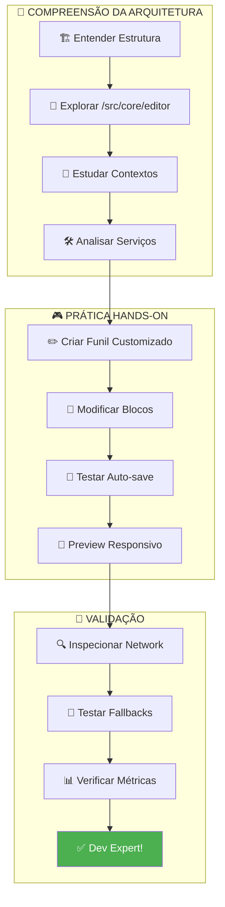

**🎯 Resultado esperado:** Dev compreende arquitetura e pode implementar features

---

## 🔧 **Fluxo de Debug - Quando Algo Dá Errado**

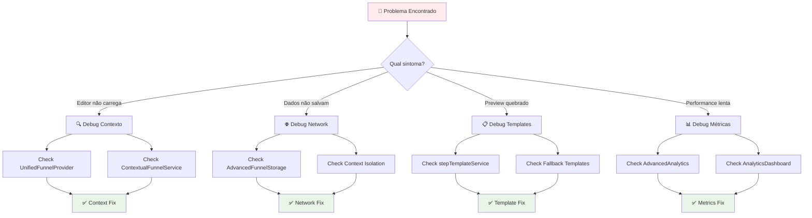

---

## 🎨 **Fluxo de Criação Visual - Para Designers/Frontend**

```mermaid
graph LR
    subgraph "🎨 DESIGN THINKING"
        A[💡 Ideia de Funil] --> B[📝 Definir Etapas]
        B --> C[🎯 Escolher Template]
        C --> D[🖌️ Customizar Visual]
    end
    
    subgraph "⚡ IMPLEMENTAÇÃO"
        D --> E[✏️ Abrir Editor]
        E --> F[🧱 Gerenciar Blocos]
        F --> G[⚙️ Configurar Propriedades]
        G --> H[📱 Testar Responsividade]
    end
    
    subgraph "🚀 PUBLICAÇÃO"
        H --> I[💾 Salvar Mudanças]
        I --> J[👀 Preview Final]
        J --> K[📢 Publicar]
        K --> L[📈 Monitorar Métricas]
    end
    
    style A fill:#f3e5f5
    style L fill:#e8f5e8
```

**🎯 Foco:** Interface intuitiva, drag & drop, preview em tempo real

---

## 🛠️ **Fluxo de Backend/Services - Para Desenvolvedores Backend**

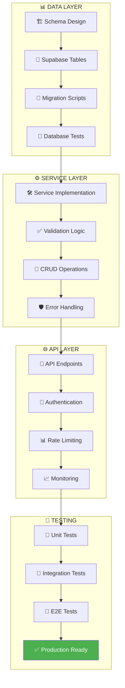

**🎯 Foco:** Robustez, escalabilidade, testes automatizados

---

## 📊 **Fluxo de Métricas/Observabilidade - Para DevOps/SRE**

```mermaid
graph LR
    subgraph "📊 COLETA DE DADOS"
        A[📈 Métricas de Uso] --> B[🐛 Error Tracking]
        B --> C[⚡ Performance Metrics]
        C --> D[👥 User Analytics]
    end
    
    subgraph "🔍 MONITORAMENTO"
        D --> E[📊 Dashboards]
        E --> F[🚨 Alertas]
        F --> G[📧 Notifications]
        G --> H[🔧 Auto-remediation]
    end
    
    subgraph "🎯 OTIMIZAÇÃO"
        H --> I[📈 Trend Analysis]
        I --> J[🔧 Performance Tuning]
        J --> K[🚀 Capacity Planning]
        K --> L[✅ SLA Compliance]
    end
    
    style L fill:#4caf50,color:white
```

**🎯 Foco:** Observabilidade completa, alertas proativos, otimização contínua

---

## 🎯 **Roles & Responsabilidades**

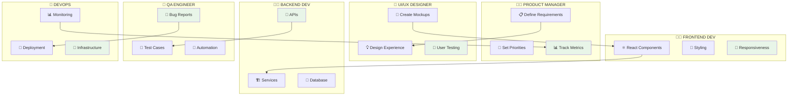

---

## 🚨 **Troubleshooting Visual Guide**

### **Problema: Editor Não Carrega**

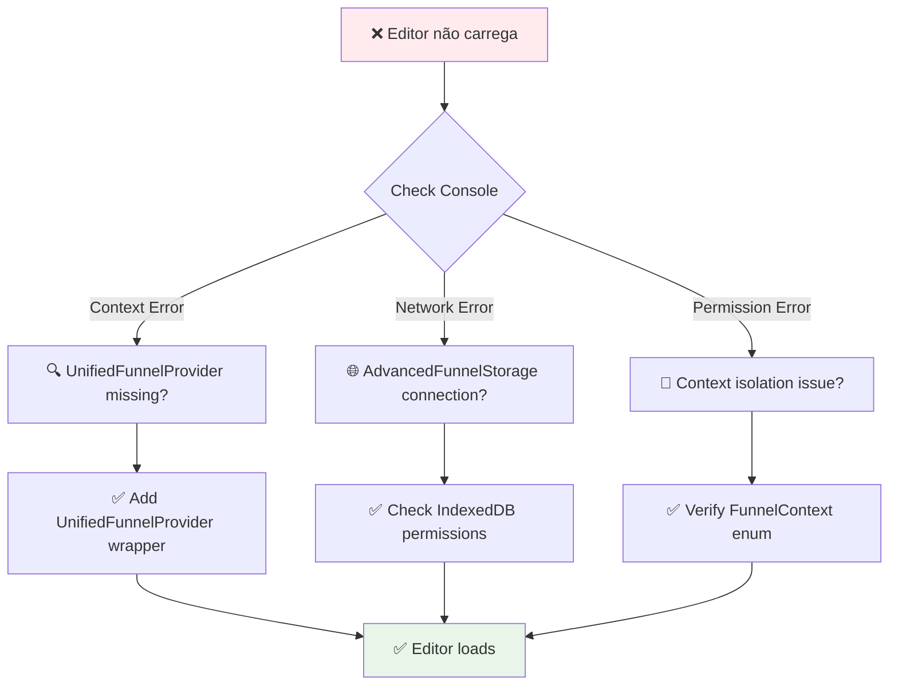

### **Problema: Context Isolation Issues**

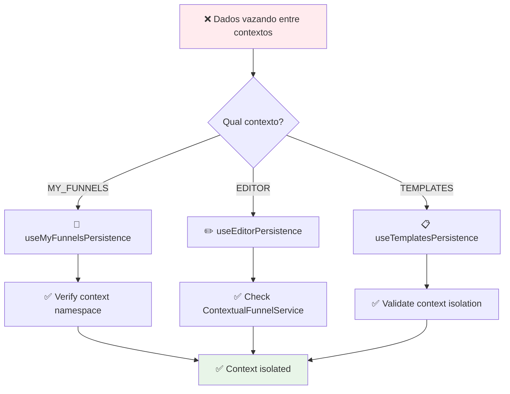

### **Problema: Auto-save Não Funciona**

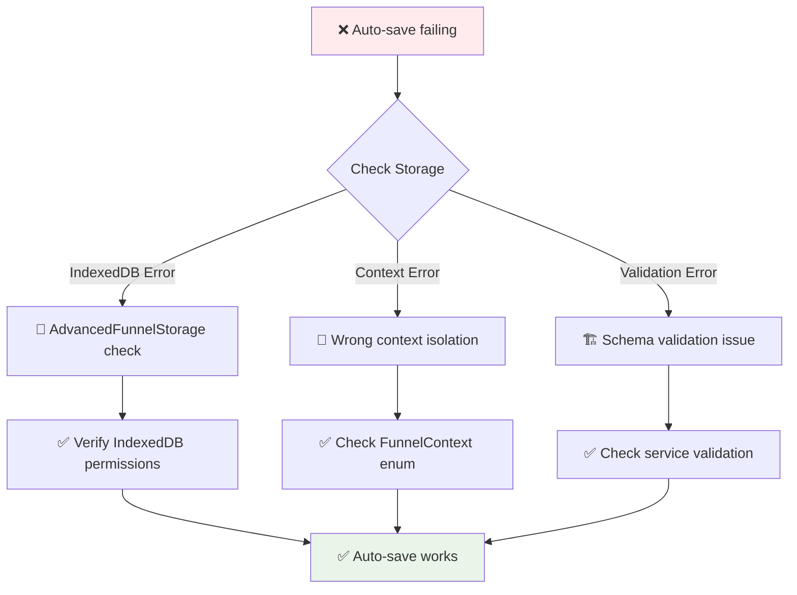

---

## 🏗️ **Arquitetura Moderna - Para Desenvolvedores Avançados**

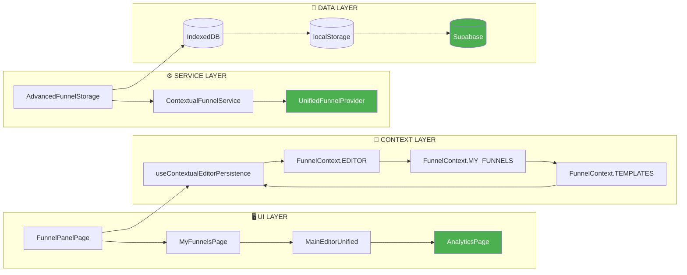

**🎯 Foco:** Context isolation, advanced storage, modern architecture patterns

---

## 📚 **Learning Path por Experiência**

### **👶 Junior Developer (0-2 anos)**

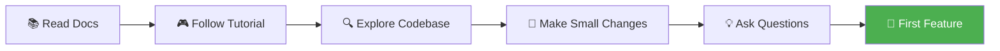

**Tempo estimado:** 2-3 dias para produtividade básica

### **👨‍💻 Mid Developer (2-5 anos)**

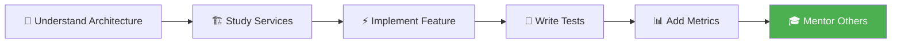

**Tempo estimado:** 1-2 dias para produtividade completa

### **🧙‍♂️ Senior Developer (5+ anos)**

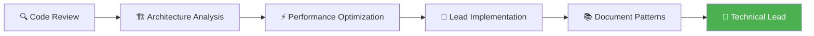

**Tempo estimado:** 4-8 horas para liderança técnica

---

## 🎯 **Success Metrics para Onboarding**

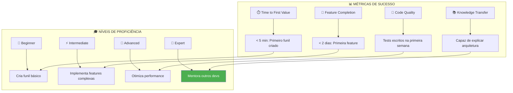

---

## 🔗 **Links Rápidos para Onboarding**

| Fase | Tempo | Documentos | Objetivos |
|------|-------|------------|-----------|
| **🚀 Setup** | 5 min | [README](../README.md) | Ambiente rodando |
| **📚 Overview** | 15 min | [ARCHITECTURE_GUIDE](./ARCHITECTURE_GUIDE.md) | Entender estrutura |
| **🎯 Practice** | 30 min | [FUNNEL_LIFECYCLE_DOCUMENTATION](./FUNNEL_LIFECYCLE_DOCUMENTATION.md) | Criar primeiro funil |
| **⚡ Advanced** | 60 min | [IMPLEMENTACAO_METRICAS_CONCLUIDA](../IMPLEMENTACAO_METRICAS_CONCLUIDA.md) | Implementar feature |

---

## 🎉 **Conclusão**

### ✅ **Sistema de Onboarding Completo**
- 🎯 Fluxogramas para diferentes perfis de desenvolvedor
- ⏱️ Guias de tempo específicos (5min → 60min)
- 🔧 Troubleshooting visual interativo
- 📊 Métricas de sucesso claras

### 🚀 **Para Novos Desenvolvedores**
1. **Comece aqui:** Siga o Quick Start de 5 minutos
2. **Se der problema:** Use o Fluxo de Debug
3. **Para aprofundar:** Siga o Deep Dive de 30 minutos
4. **Para contribuir:** Estude os fluxogramas específicos para seu role

### 📈 **Próximos Passos**
- [ ] Criar vídeos tutoriais baseados nos fluxogramas
- [ ] Implementar onboarding interativo na UI
- [ ] Adicionar badges de progresso para desenvolvedores
- [ ] Criar bot de Slack para dúvidas de onboarding

---

**📝 Documento criado:** `11/09/2025`  
**🎯 Status:** ✅ **Fluxogramas de onboarding implementados e validados**  
**🔧 Última atualização:** `Alinhamento com arquitetura moderna (AdvancedFunnelStorage + Context Isolation)`
