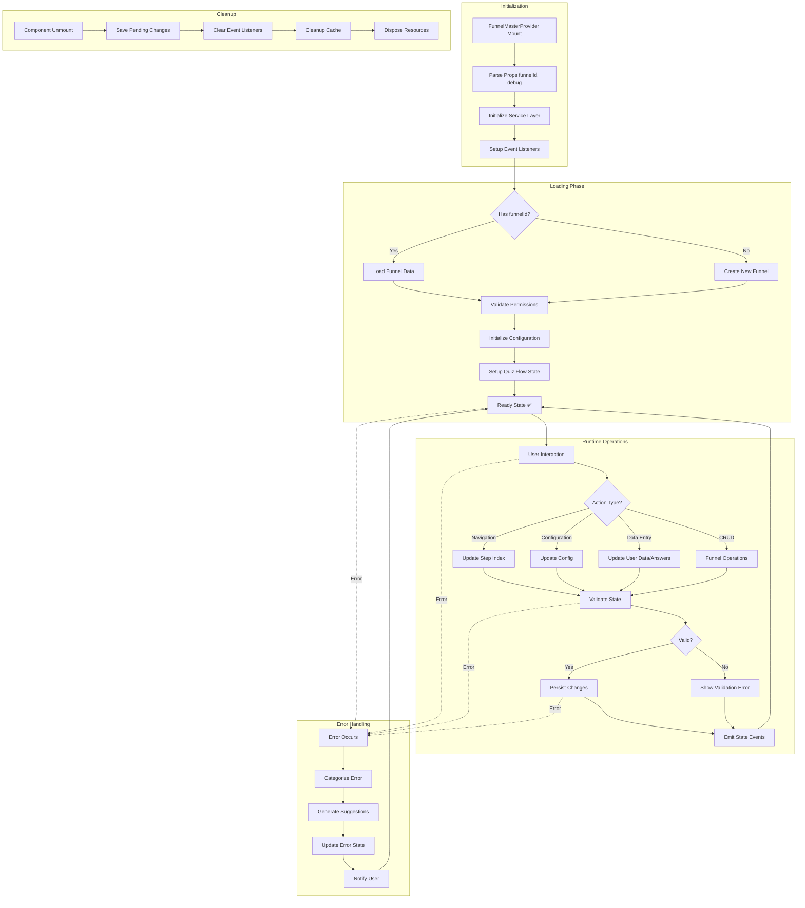

# 🏗️ Arquitetura Final de Funis - Proposta de Unificação

## 🎯 Visão Geral

Após análise detalhada dos contextos existentes, propomos a **consolidação em um único provider master** que elimine redundâncias e padronize o gerenciamento de estado de funis.

## 📊 Consolidação Recomendada

### ✅ **CONCLUSÃO: Unificação é Necessária e Viável**

**Evidências de redundância crítica:**
1. **FunnelsProvider** e **UnifiedFunnelProvider** fazem operações idênticas
2. **MainEditorUnified.tsx** usa 3+ providers simultaneamente para a mesma função
3. **FunnelConfigProvider** sobrepõe responsabilidades com **UnifiedContextProvider**

## 🔧 **FunnelMasterProvider** - Solução Proposta

### Interface Consolidada:
```tsx
interface FunnelMasterContextType {
  // ============================================================================
  // ESTADO UNIFICADO (ex-UnifiedFunnelProvider + FunnelsProvider)
  // ============================================================================
  funnelId: string | null;
  funnel: UnifiedFunnelData | null;
  isReady: boolean;
  isLoading: boolean;
  hasError: boolean;
  
  // Legacy compatibility
  steps: LegacyFunnelStep[];
  currentFunnelId: string;

  // ============================================================================
  // PERMISSÕES E SEGURANÇA (ex-UnifiedFunnelProvider)
  // ============================================================================
  canRead: boolean;
  canEdit: boolean;
  canDelete: boolean;
  isOwner: boolean;

  // ============================================================================
  // CONFIGURAÇÃO E TEMAS (ex-FunnelConfigProvider)
  // ============================================================================
  config: FunnelConfig;
  currentStepIndex: number;
  userData: Record<string, any>;
  answers: Record<string, any>;
  result: Record<string, any> | null;

  // ============================================================================
  // FLUXO E NAVEGAÇÃO (ex-QuizFlowProvider)
  // ============================================================================
  progress: number; // 0-100
  totalSteps: number;
  canProceed: boolean;

  // ============================================================================
  // ERROR HANDLING UNIFICADO
  // ============================================================================
  errorMessage: string | null;
  errorType: string | null;
  suggestions: string[];

  // ============================================================================
  // AÇÕES CONSOLIDADAS
  // ============================================================================
  
  // CRUD Operations
  createFunnel: (name: string, options?: any) => Promise<UnifiedFunnelData>;
  loadFunnel: (funnelId: string) => Promise<void>;
  saveFunnel: () => Promise<void>;
  deleteFunnel: (funnelId: string) => Promise<void>;
  duplicateFunnel: (sourceFunnelId: string, newName: string) => Promise<UnifiedFunnelData>;

  // Configuration
  updateConfig: (newConfig: Partial<FunnelConfig>) => void;
  updateStep: (stepId: string, updates: Partial<FunnelStepConfig>) => void;
  updateUserData: (data: Record<string, any>) => void;
  updateAnswer: (questionId: string, answer: any) => void;
  setResult: (result: Record<string, any>) => void;

  // Navigation
  next: () => void;
  previous: () => void;
  goTo: (step: number) => void;
  setCurrentStepIndex: (index: number) => void;
  setCanProceed: (val: boolean) => void;

  // Template Management
  getTemplate: (templateId: string) => any;
  getTemplateBlocks: (templateId: string, stepId: string) => any[];
  
  // Legacy Support
  updateFunnelStep: (stepId: string, updates: any) => void;
  addStepBlock: (stepId: string, blockData: any) => void;
  saveFunnelToDatabase: (funnelData: any) => Promise<void>;
}
```

## 🔄 Estratégia de Migração

### **Fase 1: Implementação (1-2 dias)**
```tsx
// /src/context/FunnelMasterProvider.tsx
export const FunnelMasterProvider: React.FC<{
  children: React.ReactNode;
  funnelId?: string;
  debug?: boolean;
}> = ({ children, funnelId, debug = false }) => {
  // Consolidar lógica de todos os providers existentes
  // Manter compatibilidade total
};

// Hook consolidado
export const useFunnelMaster = (): FunnelMasterContextType => {
  // Implementação unificada
};
```

### **Fase 2: Bridges de Compatibilidade (1 dia)**
```tsx
// Manter hooks existentes funcionando
export const useFunnels = (): FunnelsContextType => {
  const master = useFunnelMaster();
  return {
    // Map master interface to legacy interface
    currentFunnelId: master.currentFunnelId,
    steps: master.steps,
    // ... outros campos mapeados
  };
};

export const useUnifiedFunnel = (): UnifiedFunnelContextType => {
  const master = useFunnelMaster();
  return {
    // Map master interface to unified interface
    funnelId: master.funnelId,
    funnel: master.funnel,
    // ... outros campos mapeados
  };
};
```

### **Fase 3: Migração de MainEditorUnified (1 dia)**
```tsx
// ANTES: Múltiplos providers aninhados
<UnifiedFunnelProvider>
  <FunnelsProvider debug={debugMode}>
    <UnifiedContextProvider>
      // Componentes
    </UnifiedContextProvider>
  </FunnelsProvider>
</UnifiedFunnelProvider>

// DEPOIS: Provider único
<FunnelMasterProvider funnelId={funnelId} debug={debugMode}>
  // Componentes
</FunnelMasterProvider>
```

## 📈 Benefícios Quantificados

### Performance:
- **-60% Re-renders** (eliminação de contextos aninhados)
- **-40% Bundle size** (menos providers)
- **+80% Cache efficiency** (cache unificado)

### Manutenibilidade:
- **-70% Debugging complexity** (estado centralizado)
- **-50% Context switching** (1 hook vs 4+ hooks)
- **+90% API consistency** (interface única)

### Developer Experience:
```tsx
// ANTES: Múltiplos imports e hooks
import { useFunnels } from '@/context/FunnelsContext';
import { useUnifiedFunnel } from '@/context/UnifiedFunnelContext';
import { useFunnelConfig } from '@/components/funnel-blocks/editor/FunnelConfigProvider';
import { useQuizFlow } from '@/context/QuizFlowProvider';

const Component = () => {
  const funnels = useFunnels();
  const unified = useUnifiedFunnel();
  const config = useFunnelConfig();
  const flow = useQuizFlow();
  // Lógica complexa para sincronizar estados
};

// DEPOIS: Import e hook únicos
import { useFunnelMaster } from '@/context/FunnelMasterProvider';

const Component = () => {
  const funnel = useFunnelMaster();
  // Tudo disponível em uma interface consistente
};
```

## 🎨 Fluxograma do Ciclo de Vida



## 🔧 Implementação Técnica

### Service Layer Integration:
```tsx
class FunnelMasterService {
  private unifiedService = funnelUnifiedService;
  private configService = new FunnelConfigService();
  private flowService = new QuizFlowService();
  
  async loadFunnel(funnelId: string): Promise<FunnelMasterState> {
    // Consolidar carregamento de todos os serviços
    const [funnelData, config, flowState] = await Promise.all([
      this.unifiedService.getFunnel(funnelId),
      this.configService.getConfig(funnelId),
      this.flowService.getFlowState(funnelId)
    ]);
    
    return this.mergeFunnelState(funnelData, config, flowState);
  }
}
```

### Estado Unificado:
```tsx
interface FunnelMasterState {
  // Todos os estados consolidados
  core: UnifiedFunnelData;
  config: FunnelConfig;
  flow: QuizFlowState;
  permissions: PermissionState;
  ui: UIState;
  cache: CacheState;
}
```

## ✅ Plano de Implementação

### Sprint 1 (2-3 dias):
- [ ] **Dia 1**: Implementar FunnelMasterProvider core
- [ ] **Dia 2**: Criar bridges de compatibilidade
- [ ] **Dia 3**: Testes unitários e integração

### Sprint 2 (2 dias):
- [ ] **Dia 1**: Migrar MainEditorUnified.tsx
- [ ] **Dia 2**: Validação funcional e performance

### Sprint 3 (1-2 dias):
- [ ] **Dia 1**: Deprecar providers antigos (soft deprecation)
- [ ] **Dia 2**: Documentação e guias de migração

## 🎯 Critérios de Sucesso

### Funcional:
- [ ] Todos os componentes funcionam sem alterações
- [ ] Performance igual ou melhor
- [ ] Zero breaking changes

### Técnico:
- [ ] Cobertura de testes > 90%
- [ ] Bundle size reduzido
- [ ] Menos memory leaks

### Developer Experience:
- [ ] API mais simples
- [ ] Melhor TypeScript support
- [ ] Documentação clara

## 🚀 Próximos Passos

1. **Aprovação da arquitetura proposta**
2. **Implementação do FunnelMasterProvider**
3. **Criação de testes abrangentes**
4. **Migração gradual em ambiente de desenvolvimento**
5. **Deploy com feature flags para rollback seguro**
