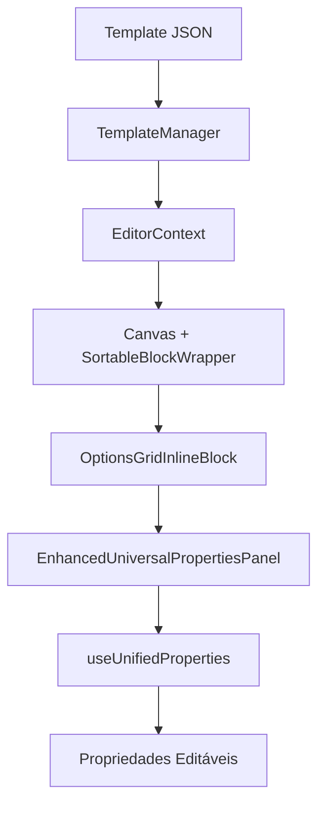

# 🎯 USO DE COMPONENTES COM SISTEMA JSON - GUIA PRÁTICO

## 📋 **COMO FUNCIONA O SISTEMA ATUALMENTE**

### **1️⃣ Fluxo Completo: JSON → Componente → Painel**



### **2️⃣ Exemplo Prático: Etapa 2 com Options Grid**

**📄 Template JSON** (`/templates/step-02-template.json`):

```json
{
  "blocks": [
    {
      "id": "step02-clothing-options",
      "type": "options-grid", // ← Tipo registrado no enhancedBlockRegistry
      "position": 3,
      "properties": {
        "options": [
          {
            "id": "1a",
            "text": "Conforto, leveza e praticidade no vestir.",
            "imageUrl": "https://res.cloudinary.com/example.webp",
            "value": "1a",
            "category": "Natural",
            "points": 1
          }
        ],
        "columns": 2,
        "imageSize": 256,
        "multipleSelection": true,
        "minSelections": 1,
        "maxSelections": 3
      }
    }
  ]
}
```

**⚙️ Registry Mapping** (`/src/config/enhancedBlockRegistry.ts`):

```typescript
export const ENHANCED_BLOCK_REGISTRY: Record<string, React.ComponentType<any>> = {
  "options-grid": OptionsGridInlineBlock, // ← JSON "type" → Componente React
  "text-inline": TextInlineBlock,
  "button-inline": ButtonInlineFixed,
  // ... outros componentes
};
```

**🎨 Componente React** (`/src/components/blocks/inline/OptionsGridInlineBlock.tsx`):

```tsx
const OptionsGridInlineBlock: React.FC<BlockComponentProps> = ({
  block, // ← Dados do JSON
  isSelected, // ← Estado do editor
  onClick, // ← Seleção no canvas
  onPropertyChange, // ← Callback para painel
}) => {
  // 📦 Propriedades vêm do JSON
  const {
    options = [],
    columns = 2,
    multipleSelection = true,
    // ...
  } = block.properties || {};

  // 🎯 Estado local do componente
  const [selectedOptions, setSelectedOptions] = useState<string[]>([]);

  // 🔄 Atualizar painel quando propriedades mudam
  const handleOptionClick = (optionId: string) => {
    // ... lógica de seleção

    if (onPropertyChange) {
      onPropertyChange("selectedOptions", newSelected);
    }
  };

  // 🎨 Renderização baseada nas propriedades JSON
  return (
    <div className="grid gap-4" style={{ gridTemplateColumns: `repeat(${columns}, 1fr)` }}>
      {options.map(option => (
        <div key={option.id} onClick={() => handleOptionClick(option.id)}>
          {option.text}
        </div>
      ))}
    </div>
  );
};
```

## 🎛️ **PAINEL DE PROPRIEDADES INTELIGENTE**

### **3️⃣ EnhancedUniversalPropertiesPanel**

O painel funciona automaticamente com qualquer componente JSON:

```tsx
// 📍 Como o painel recebe os dados
<EnhancedUniversalPropertiesPanel
  selectedBlock={{
    id: "step02-clothing-options",
    type: "options-grid",
    properties: {
      options: [...],      // ← Do JSON
      columns: 2,          // ← Do JSON
      multipleSelection: true // ← Do JSON
    }
  }}
  onUpdate={(blockId, updates) => {
    // 🔄 Atualiza o bloco no EditorContext
    updateBlock(blockId, updates);
  }}
/>
```

### **4️⃣ useUnifiedProperties - Geração Automática**

O hook `useUnifiedProperties` analisa o tipo do bloco e gera propriedades editáveis:

```tsx
const properties = useUnifiedProperties(selectedBlock, blockDefinition);

// 🎯 Para "options-grid", gera automaticamente:
// - columns: Slider (1-4)
// - multipleSelection: Checkbox
// - minSelections: Number input
// - maxSelections: Number input
// - imageSize: Slider (100-400)
// - borderColor: Color picker
// ... e muito mais!
```

## 🚀 **VANTAGENS DO SISTEMA JSON**

### **✅ Para Desenvolvimento:**

1. **Separação clara**: JSON (dados) vs TSX (comportamento)
2. **Componentização**: Cada bloco é independente
3. **Flexibilidade**: Mudanças no JSON = mudanças instantâneas
4. **Debugging**: Logs detalhados em cada etapa

### **✅ Para Edição de Conteúdo:**

1. **Edição sem código**: Modificar JSON diretamente
2. **Painel automático**: Propriedades geradas automaticamente
3. **Preview em tempo real**: Mudanças instantâneas no canvas
4. **Validação**: Tipos e limites automáticos

## 📊 **EXEMPLO DE USO COMPLETO**

### **Cenário: Personalizar Etapa 2**

**1. Editar Template JSON:**

```bash
# Abrir arquivo
vim /templates/step-02-template.json

# Modificar propriedades
{
  "properties": {
    "columns": 3,        // ← Era 2, agora 3 colunas
    "imageSize": 300,    // ← Era 256, agora maior
    "maxSelections": 5   // ← Era 3, agora até 5
  }
}
```

**2. Resultado Automático:**

- ✅ Layout muda para 3 colunas
- ✅ Imagens ficam maiores (300px)
- ✅ Usuário pode selecionar até 5 opções
- ✅ Painel mostra novas propriedades
- ✅ Validação ajustada automaticamente

**3. Painel de Propriedades Atualizado:**

- 🎛️ Slider "Colunas": 1-4 (valor atual: 3)
- 🎛️ Slider "Tamanho Imagem": 100-500 (valor atual: 300)
- 🎛️ Input "Max Seleções": 1-10 (valor atual: 5)

## 🔧 **COMO ADICIONAR NOVO TIPO DE BLOCO**

### **1. Criar Template JSON:**

```json
{
  "id": "meu-novo-bloco",
  "type": "custom-component",
  "properties": {
    "title": "Meu Título",
    "backgroundColor": "#FF0000",
    "animation": "fadeIn"
  }
}
```

### **2. Criar Componente React:**

```tsx
const CustomComponentBlock: React.FC<BlockComponentProps> = ({ block }) => {
  const { title, backgroundColor, animation } = block.properties;

  return (
    <div style={{ backgroundColor }} className={animation}>
      <h2>{title}</h2>
    </div>
  );
};
```

### **3. Registrar no Registry:**

```tsx
export const ENHANCED_BLOCK_REGISTRY = {
  "custom-component": CustomComponentBlock,
  // ... outros componentes
};
```

### **4. Resultado:**

- ✅ Componente aparece no canvas
- ✅ Painel gera propriedades automaticamente
- ✅ Edições funcionam em tempo real
- ✅ JSON editável externamente

## 🎯 **RESUMO: SISTEMA COMPLETAMENTE INTEGRADO**

```
📄 JSON Templates (21 arquivos)
    ↓
⚙️ TemplateManager (carregamento)
    ↓
🎨 React Components (renderização)
    ↓
🎛️ Properties Panel (edição)
    ↓
🔄 EditorContext (estado)
    ↓
💾 Persistência automática
```

**O sistema JSON não substitui os componentes React - ele os **alimenta com dados flexíveis**, permitindo edição sem código e personalização total!** 🚀

---

_Sistema ativo e funcionando em todas as 21 etapas do editor_ ✅
