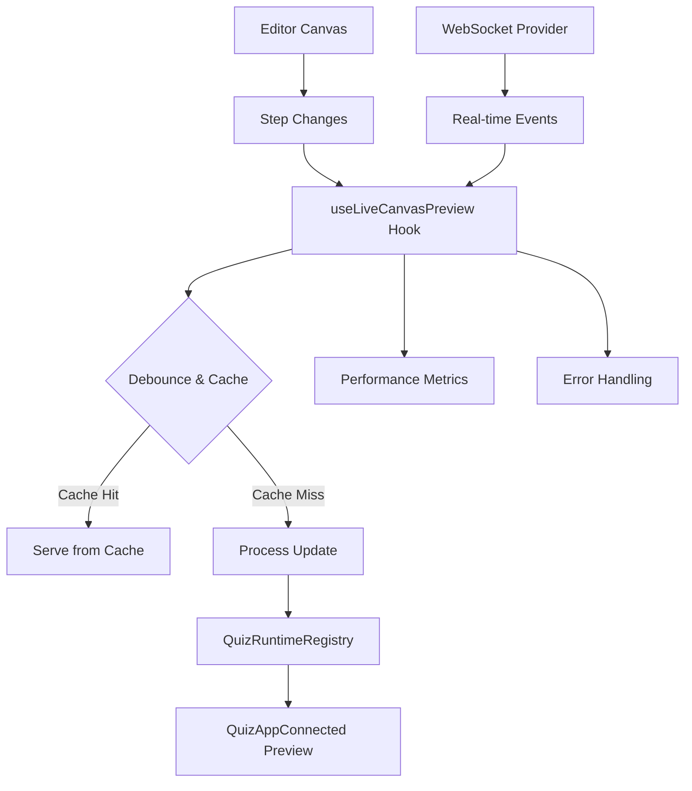

# 🎭 Sistema de Preview ao Vivo do Canvas - Documentação Completa

## 🎯 **Visão Geral**

O Sistema de Preview ao Vivo do Canvas é uma solução completa para sincronização em tempo real entre o editor visual e o preview do quiz, proporcionando uma experiência de edição fluida e responsiva.

## 🏗️ **Arquitetura do Sistema**

### **Componentes Principais**

```
┌─────────────────────────────────────────────────────────────────┐
│                    LIVE CANVAS PREVIEW SYSTEM                  │
├─────────────────────────────────────────────────────────────────┤
│                                                                 │
│  ┌─────────────────────┐    ┌─────────────────────────────────┐ │
│  │   LiveCanvasPreview │    │      useLiveCanvasPreview       │ │
│  │                     │    │                                 │ │
│  │ • UI Components     │◄───┤ • State Management              │ │
│  │ • Device Frames     │    │ • Debounce & Cache              │ │
│  │ • Status Indicators │    │ • Performance Metrics          │ │
│  │ • Debug Tools       │    │ • Error Handling               │ │
│  └─────────────────────┘    └─────────────────────────────────┘ │
│           │                                   │                 │
│           ▼                                   ▼                 │
│  ┌─────────────────────┐    ┌─────────────────────────────────┐ │
│  │  LivePreviewProvider│    │      EnhancedCanvasArea         │ │
│  │                     │    │                                 │ │
│  │ • WebSocket         │    │ • Canvas + Preview Tabs         │ │
│  │ • Real-time Sync    │    │ • Performance Optimizations    │ │
│  │ • Event Broadcasting│    │ • Advanced Preview Features     │ │
│  │ • Auto-reconnection │    │ • Virtualization Support       │ │
│  └─────────────────────┘    └─────────────────────────────────┘ │
│                                                                 │
└─────────────────────────────────────────────────────────────────┘
```

### **Fluxo de Dados**



## 🔧 **Configuração e Uso**

### **1. Configuração Básica**

```tsx
import { LivePreviewProvider } from '@/providers/LivePreviewProvider';
import { EnhancedCanvasArea } from '@/components/editor/quiz/components/EnhancedCanvasArea';

// Wrapar o editor com o provider
<LivePreviewProvider
  enableDebug={process.env.NODE_ENV === 'development'}
  autoReconnect={true}
  maxReconnectAttempts={5}
  enableHeartbeat={true}
>
  <EnhancedCanvasArea
    steps={steps}
    selectedStep={selectedStep}
    funnelId={funnelId}
    onStepChange={handleStepChange}
    // ... outras props
  />
</LivePreviewProvider>
```

### **2. Hook Personalizado**

```tsx
import { useLiveCanvasPreview } from '@/hooks/useLiveCanvasPreview';

const MyCustomPreview = ({ steps, selectedStepId }) => {
  const {
    state,
    metrics,
    activate,
    deactivate,
    forceUpdate,
    isActive,
    isUpdating,
    hasError
  } = useLiveCanvasPreview(steps, selectedStepId, {
    enableDebounce: true,
    debounceDelay: 300,
    enableCache: true,
    cacheTTL: 30000,
    maxUpdatesPerSecond: 10
  });

  return (
    <div>
      {/* Controles de preview */}
      <button onClick={activate}>Ativar Preview</button>
      <button onClick={forceUpdate}>Atualizar</button>
      
      {/* Status */}
      <div>Status: {isActive ? 'Ativo' : 'Inativo'}</div>
      <div>Updates: {state.updateCount}</div>
      <div>Cache Hits: {state.cacheHits}</div>
    </div>
  );
};
```

### **3. Componente Standalone**

```tsx
import { LiveCanvasPreview } from '@/components/editor/canvas/LiveCanvasPreview';

<LiveCanvasPreview
  steps={steps}
  funnelId="my-funnel"
  selectedStepId={currentStepId}
  onStepChange={handleStepChange}
  config={{
    autoRefresh: true,
    debounceDelay: 300,
    defaultDevice: 'desktop',
    showDebugInfo: true,
    highlightChanges: true,
    isolatePreviewState: true
  }}
  className="h-full"
/>
```

## ⚡ **Recursos e Funcionalidades**

### **🎯 Core Features**

- ✅ **Sincronização em Tempo Real**: Mudanças no canvas aparecem instantaneamente no preview
- ✅ **Debounce Inteligente**: Evita spam de updates durante edição rápida
- ✅ **Cache Multi-layer**: Cache em memória com TTL configurável
- ✅ **Rate Limiting**: Controle de frequência de updates para performance
- ✅ **Error Recovery**: Recuperação automática de erros de sincronização
- ✅ **Performance Metrics**: Métricas detalhadas de performance e uso
- ✅ **Device Simulation**: Preview em diferentes tamanhos de tela
- ✅ **Estado Isolado**: Isolamento entre estado do editor e preview

### **🌐 WebSocket Features**

- ✅ **Real-time Broadcasting**: Sincronização entre múltiplas instâncias
- ✅ **Auto-reconnection**: Reconexão automática em caso de queda
- ✅ **Heartbeat System**: Sistema de ping/pong para detectar conexões mortas
- ✅ **Event Broadcasting**: Broadcast de eventos entre editor e preview
- ✅ **Latency Monitoring**: Monitoramento de latência da conexão

### **🎨 UI/UX Features**

- ✅ **Status Indicators**: Indicadores visuais de status da conexão
- ✅ **Debug Panel**: Painel de debug com métricas detalhadas
- ✅ **Device Controls**: Controles para trocar entre dispositivos
- ✅ **Manual Refresh**: Botão para atualização manual
- ✅ **Advanced/Simple Mode**: Modo avançado com recursos extras
- ✅ **Error Feedback**: Feedback visual de erros com detalhes

## 🔧 **Configurações Avançadas**

### **LivePreviewOptions**

```typescript
interface LivePreviewOptions {
  enableDebounce?: boolean;      // Default: true
  debounceDelay?: number;        // Default: 300ms
  enableCache?: boolean;         // Default: true
  cacheTTL?: number;            // Default: 30000ms (30s)
  enableDebug?: boolean;        // Default: false
  maxUpdatesPerSecond?: number; // Default: 10
  isolatePreviewState?: boolean;// Default: true
}
```

### **LivePreviewConfig**

```typescript
interface LivePreviewConfig {
  autoRefresh?: boolean;        // Default: true
  debounceDelay?: number;       // Default: 300ms
  defaultDevice?: DeviceType;   // Default: 'desktop'
  showDebugInfo?: boolean;      // Default: false
  highlightChanges?: boolean;   // Default: true
  isolatePreviewState?: boolean;// Default: true
}
```

### **WebSocket Provider Options**

```typescript
interface LivePreviewProviderProps {
  websocketUrl?: string;         // Auto-generated se não fornecido
  autoReconnect?: boolean;       // Default: true
  reconnectInterval?: number;    // Default: 3000ms
  maxReconnectAttempts?: number; // Default: 5
  enableHeartbeat?: boolean;     // Default: true
  heartbeatInterval?: number;    // Default: 30000ms (30s)
  enableDebug?: boolean;         // Default: false
}
```

## 📊 **Monitoramento e Métricas**

### **Performance Metrics**

```typescript
interface LivePreviewMetrics {
  totalUpdates: number;          // Total de updates realizados
  averageUpdateTime: number;     // Tempo médio de update (ms)
  cacheEfficiency: number;       // Eficiência do cache (0-1)
  errorRate: number;             // Taxa de erro (0-1)
  updatesPerSecond: number;      // Updates por segundo
}
```

### **Connection State**

```typescript
interface LivePreviewConnectionState {
  isConnected: boolean;          // Status da conexão WebSocket
  isConnecting: boolean;         // Se está tentando conectar
  connectionId?: string;         // ID único da conexão
  lastMessage?: LivePreviewMessage; // Última mensagem recebida
  lastError?: string;            // Último erro ocorrido
  reconnectAttempts: number;     // Tentativas de reconexão
  latency: number;               // Latência da conexão (ms)
}
```

### **Debug Info**

O sistema fornece informações detalhadas de debug quando habilitado:

```typescript
// Console logs incluem:
// 🎭 Live preview activated/deactivated
// 🎭 Auto/Manual preview update completed in Xms
// 🎭 Preview update served from cache
// 🎭 Preview update rate limited
// 🌐 WebSocket connected/disconnected
// 🌐 Sent/Received message: {...}
```

## 🚀 **Otimizações de Performance**

### **1. Debouncing Inteligente**

- Updates são agrupados durante edição rápida
- Delay configurável (padrão: 300ms)
- Pode ser desabilitado para updates imediatos

### **2. Sistema de Cache**

- Cache em memória com TTL configurável
- Evita recálculos desnecessários
- Estatísticas de eficiência disponíveis

### **3. Rate Limiting**

- Limite máximo de updates por segundo
- Previne sobrecarga do sistema
- Configurável por uso específico

### **4. Virtualização de Lista**

- Suporte a virtualização para listas grandes de blocos
- Renderização apenas dos itens visíveis
- Melhora performance com muitos blocos

### **5. Estado Isolado**

- Preview não interfere no estado do editor
- Isolamento completo de dados
- Previne bugs de sincronização

## 🛠️ **Troubleshooting**

### **Problemas Comuns**

#### Preview não atualiza
```typescript
// Verificar se o hook está ativo
const { isActive, hasError, errorMessage } = useLiveCanvasPreview(...);

if (!isActive) {
  // Ativar o preview
  activate();
}

if (hasError) {
  console.error('Preview error:', errorMessage);
  // Tentar update manual
  forceUpdate();
}
```

#### Performance lenta
```typescript
// Verificar métricas
const { metrics } = useLiveCanvasPreview(...);

if (metrics.averageUpdateTime > 100) {
  // Aumentar debounce ou reduzir maxUpdatesPerSecond
  // Verificar cache efficiency
}
```

#### WebSocket não conecta
```typescript
// Verificar provider e URL
<LivePreviewProvider
  websocketUrl="ws://localhost:3001/ws/live-preview" // URL específica
  enableDebug={true} // Habilitar logs
  autoReconnect={true}
  maxReconnectAttempts={10} // Mais tentativas
>
```

### **Debug Guidelines**

1. **Habilitar Debug**: Sempre use `enableDebug: true` em desenvolvimento
2. **Monitorar Console**: Acompanhar logs do sistema para identificar problemas
3. **Verificar Métricas**: Usar métricas de performance para otimização
4. **Testar Conexão**: Verificar status da conexão WebSocket
5. **Cache Stats**: Monitorar eficiência do cache

## 🔮 **Roadmap e Melhorias Futuras**

### **v1.1 - Planned Features**

- [ ] **Collaborative Editing**: Múltiplos usuários editando simultaneamente
- [ ] **Undo/Redo**: Sistema de undo/redo sincronizado
- [ ] **Live Comments**: Comentários em tempo real no preview
- [ ] **Performance Profiler**: Profiler integrado de performance
- [ ] **Custom Themes**: Temas personalizáveis para o preview

### **v1.2 - Advanced Features**

- [ ] **A/B Testing**: Preview de múltiplas variações
- [ ] **Analytics Integration**: Métricas de uso integradas
- [ ] **Mobile App**: Preview via app móvel
- [ ] **Plugin System**: Sistema de plugins para extensões
- [ ] **Cloud Sync**: Sincronização via cloud storage

## 📚 **Exemplos Avançados**

### **Custom WebSocket Handler**

```typescript
import { useLivePreview } from '@/providers/LivePreviewProvider';

const MyCustomComponent = () => {
  const { onMessage, broadcast } = useLivePreview();

  useEffect(() => {
    const unsubscribe = onMessage((message) => {
      if (message.type === 'custom-event') {
        // Handle custom event
        handleCustomEvent(message.data);
      }
    });

    return unsubscribe;
  }, []);

  const handleCustomAction = () => {
    broadcast('custom-event', { 
      action: 'my-action', 
      data: { /* custom data */ } 
    });
  };
};
```

### **Performance Monitoring**

```typescript
const PerformanceMonitor = () => {
  const { metrics, state } = useLiveCanvasPreview(steps, selectedStep);

  return (
    <div className="performance-monitor">
      <h3>Performance Metrics</h3>
      <div>Average Update Time: {metrics.averageUpdateTime.toFixed(1)}ms</div>
      <div>Cache Efficiency: {(metrics.cacheEfficiency * 100).toFixed(1)}%</div>
      <div>Error Rate: {(metrics.errorRate * 100).toFixed(1)}%</div>
      <div>Updates/sec: {metrics.updatesPerSecond.toFixed(1)}</div>
      
      {metrics.averageUpdateTime > 100 && (
        <div className="warning">
          Performance degraded! Consider optimizing.
        </div>
      )}
    </div>
  );
};
```

---

**📝 Desenvolvido com ❤️ para uma experiência de edição de quiz excepcional**