# 📊 Sistema de Logging Centralizado - Quiz Quest Challenge Verse

## 🎯 Análise da Situação Atual

### **Estado dos Logs Detectado**

**Problemas Identificados:**
- **150+ console.log** espalhados pelo código sem padronização
- **Mistura de níveis:** debug, warn, error, info sem distinção clara
- **Logs em produção:** Alguns logs críticos podem vazar para produção
- **Performance:** Logs síncronos podem impactar performance
- **Rastreabilidade:** Ausência de contexto, timestamps e correlação
- **Debug inconsistente:** Habilitação por variáveis de ambiente fragmentada

### **Padrões Atuais Encontrados**
```typescript
// ❌ Padrões inconsistentes encontrados:
console.log('🎯 MainEditorUnified iniciado:', data);
console.warn('⚠️ [VALIDAÇÃO] templateId muito longo:', id);
console.error('❌ [EDITOR] Erro ao carregar:', error);
if (import.meta.env.DEV) { console.log('Debug info'); }
```

---

## 🏗️ Projeto do Sistema Centralizado

### **Arquitetura Proposta**

```mermaid
graph TB
    A[Aplicação] --> B[Logger Interface]
    B --> C[Logger Service]
    C --> D[Formatter]
    C --> E[Transport Manager]
    E --> F[Console Transport]
    E --> G[Storage Transport]
    E --> H[Remote Transport]
    C --> I[Filter Engine]
    I --> J[Level Filter]
    I --> K[Context Filter]
    I --> L[Performance Filter]
```



### **Características Core**
- **🎚️ Níveis configuráveis:** trace, debug, info, warn, error, fatal
- **🏷️ Contextos isolados:** editor, storage, performance, api, auth
- **⚡ Performance otimizada:** Lazy evaluation, batching, async transports
- **🔍 Rastreabilidade completa:** Session IDs, user context, stack traces
- **🌍 Multi-ambiente:** Development, staging, production, test

---

## 🛠️ Implementação

### **1. Core Logger Service**

```typescript
// src/utils/logging/LoggerService.ts
export interface LogLevel {
  TRACE: 0;
  DEBUG: 1;
  INFO: 2;
  WARN: 3;
  ERROR: 4;
  FATAL: 5;
}

export interface LogEntry {
  timestamp: string;
  level: keyof LogLevel;
  context: string;
  message: string;
  data?: any;
  sessionId?: string;
  userId?: string;
  stackTrace?: string;
  performance?: {
    duration?: number;
    memory?: number;
  };
}

export interface LogTransport {
  log(entry: LogEntry): Promise<void> | void;
  flush?(): Promise<void>;
  close?(): Promise<void>;
}

export interface LogFilter {
  shouldLog(entry: LogEntry): boolean;
}

class LoggerService {
  private transports: LogTransport[] = [];
  private filters: LogFilter[] = [];
  private config: LoggerConfig;
  private sessionId: string;
  private formatters: Map<string, LogFormatter> = new Map();

  constructor(config: LoggerConfig) {
    this.config = config;
    this.sessionId = this.generateSessionId();
    this.setupDefaultFormatters();
    this.setupDefaultTransports();
    this.setupDefaultFilters();
  }

  // Métodos principais de logging
  trace(context: string, message: string, data?: any): void {
    this.log('TRACE', context, message, data);
  }

  debug(context: string, message: string, data?: any): void {
    this.log('DEBUG', context, message, data);
  }

  info(context: string, message: string, data?: any): void {
    this.log('INFO', context, message, data);
  }

  warn(context: string, message: string, data?: any): void {
    this.log('WARN', context, message, data);
  }

  error(context: string, message: string, error?: Error | any): void {
    const logData = error instanceof Error ? {
      name: error.name,
      message: error.message,
      stack: error.stack,
      ...data
    } : error;
    
    this.log('ERROR', context, message, logData);
  }

  fatal(context: string, message: string, error?: Error | any): void {
    this.log('FATAL', context, message, error);
  }

  // Core logging method
  private async log(
    level: keyof LogLevel, 
    context: string, 
    message: string, 
    data?: any
  ): Promise<void> {
    const entry: LogEntry = {
      timestamp: new Date().toISOString(),
      level,
      context,
      message,
      data,
      sessionId: this.sessionId,
      userId: this.getCurrentUserId(),
      stackTrace: this.shouldIncludeStackTrace(level) ? this.getStackTrace() : undefined,
      performance: this.collectPerformanceData()
    };

    // Apply filters
    if (!this.shouldLog(entry)) {
      return;
    }

    // Send to all transports
    const promises = this.transports.map(transport => {
      try {
        return transport.log(entry);
      } catch (error) {
        console.error('Transport error:', error);
        return Promise.resolve();
      }
    });

    await Promise.allSettled(promises);
  }

  private shouldLog(entry: LogEntry): boolean {
    return this.filters.every(filter => {
      try {
        return filter.shouldLog(entry);
      } catch (error) {
        console.warn('Filter error:', error);
        return true; // Fail open
      }
    });
  }

  private generateSessionId(): string {
    return `session_${Date.now()}_${Math.random().toString(36).substr(2, 9)}`;
  }

  private getCurrentUserId(): string | undefined {
    try {
      // Integration with auth system
      return (window as any).currentUserId;
    } catch {
      return undefined;
    }
  }

  private getStackTrace(): string {
    return new Error().stack?.split('\n').slice(3, 8).join('\n') || '';
  }

  private shouldIncludeStackTrace(level: keyof LogLevel): boolean {
    const LogLevel = { TRACE: 0, DEBUG: 1, INFO: 2, WARN: 3, ERROR: 4, FATAL: 5 };
    return LogLevel[level] >= LogLevel.ERROR;
  }

  private collectPerformanceData(): { duration?: number; memory?: number } | undefined {
    if (!this.config.includePerformance) return undefined;

    try {
      return {
        memory: (performance as any).memory?.usedJSHeapSize,
        duration: performance.now()
      };
    } catch {
      return undefined;
    }
  }

  // Configuration methods
  addTransport(transport: LogTransport): void {
    this.transports.push(transport);
  }

  addFilter(filter: LogFilter): void {
    this.filters.push(filter);
  }

  setFormatter(context: string, formatter: LogFormatter): void {
    this.formatters.set(context, formatter);
  }

  // Setup methods
  private setupDefaultTransports(): void {
    // Console transport for development
    if (this.config.environment === 'development') {
      this.addTransport(new ConsoleTransport(this.config));
    }

    // Storage transport for persistence
    if (this.config.enableStorage) {
      this.addTransport(new StorageTransport(this.config));
    }

    // Remote transport for production monitoring
    if (this.config.remoteEndpoint) {
      this.addTransport(new RemoteTransport(this.config));
    }
  }

  private setupDefaultFilters(): void {
    // Level filter
    this.addFilter(new LevelFilter(this.config.minLevel));
    
    // Context filter
    if (this.config.allowedContexts?.length) {
      this.addFilter(new ContextFilter(this.config.allowedContexts));
    }

    // Performance filter
    if (this.config.performanceThreshold) {
      this.addFilter(new PerformanceFilter(this.config.performanceThreshold));
    }
  }

  private setupDefaultFormatters(): void {
    this.setFormatter('default', new DefaultFormatter());
    this.setFormatter('json', new JSONFormatter());
    this.setFormatter('dev', new DevelopmentFormatter());
  }

  // Lifecycle methods
  async flush(): Promise<void> {
    const flushPromises = this.transports
      .map(transport => transport.flush?.())
      .filter(Boolean);
    
    await Promise.allSettled(flushPromises);
  }

  async close(): Promise<void> {
    await this.flush();
    
    const closePromises = this.transports
      .map(transport => transport.close?.())
      .filter(Boolean);
    
    await Promise.allSettled(closePromises);
  }
}

export default LoggerService;
```

### **2. Configuration System**

```typescript
// src/utils/logging/LoggerConfig.ts
export interface LoggerConfig {
  // Environment settings
  environment: 'development' | 'staging' | 'production' | 'test';
  minLevel: keyof LogLevel;
  
  // Context settings
  allowedContexts?: string[];
  blockedContexts?: string[];
  
  // Performance settings
  includePerformance: boolean;
  performanceThreshold?: number;
  batchSize?: number;
  flushInterval?: number;
  
  // Storage settings
  enableStorage: boolean;
  maxStorageSize?: number;
  storageRetention?: number;
  
  // Remote settings
  remoteEndpoint?: string;
  remoteHeaders?: Record<string, string>;
  
  // Format settings
  defaultFormatter: string;
  timestampFormat?: string;
  
  // Debug settings
  includeStackTrace: boolean;
  includeSessionData: boolean;
}

export const createLoggerConfig = (
  overrides: Partial<LoggerConfig> = {}
): LoggerConfig => {
  const environment = (import.meta.env.NODE_ENV || 'development') as LoggerConfig['environment'];
  
  const baseConfig: LoggerConfig = {
    environment,
    minLevel: getMinLevelForEnvironment(environment),
    includePerformance: environment === 'development',
    enableStorage: environment !== 'test',
    defaultFormatter: environment === 'development' ? 'dev' : 'json',
    includeStackTrace: environment === 'development',
    includeSessionData: true,
    batchSize: environment === 'production' ? 10 : 1,
    flushInterval: environment === 'production' ? 5000 : 1000,
    maxStorageSize: 50 * 1024 * 1024, // 50MB
    storageRetention: 7 * 24 * 60 * 60 * 1000, // 7 days
    ...overrides
  };

  return baseConfig;
};

const getMinLevelForEnvironment = (env: string): keyof LogLevel => {
  switch (env) {
    case 'production': return 'WARN';
    case 'staging': return 'INFO';
    case 'test': return 'ERROR';
    case 'development': 
    default: return 'DEBUG';
  }
};

// Environment-specific configs
export const developmentConfig = createLoggerConfig({
  minLevel: 'DEBUG',
  includePerformance: true,
  includeStackTrace: true,
  defaultFormatter: 'dev',
  allowedContexts: undefined, // Log all contexts
});

export const productionConfig = createLoggerConfig({
  minLevel: 'WARN',
  includePerformance: false,
  includeStackTrace: false,
  defaultFormatter: 'json',
  batchSize: 50,
  flushInterval: 10000,
  remoteEndpoint: import.meta.env.VITE_LOGGING_ENDPOINT,
  remoteHeaders: {
    'Authorization': `Bearer ${import.meta.env.VITE_LOGGING_API_KEY}`,
    'Content-Type': 'application/json'
  }
});

export const testConfig = createLoggerConfig({
  minLevel: 'ERROR',
  enableStorage: false,
  includePerformance: false,
  defaultFormatter: 'json'
});
```

### **3. Transport Implementations**

```typescript
// src/utils/logging/transports/ConsoleTransport.ts
import { LogTransport, LogEntry, LoggerConfig } from '../types';

export class ConsoleTransport implements LogTransport {
  private formatter: LogFormatter;
  private config: LoggerConfig;

  constructor(config: LoggerConfig) {
    this.config = config;
    this.formatter = new DevelopmentFormatter();
  }

  log(entry: LogEntry): void {
    const formatted = this.formatter.format(entry);
    
    switch (entry.level) {
      case 'TRACE':
      case 'DEBUG':
        console.debug(formatted);
        break;
      case 'INFO':
        console.info(formatted);
        break;
      case 'WARN':
        console.warn(formatted);
        break;
      case 'ERROR':
      case 'FATAL':
        console.error(formatted);
        break;
    }
  }
}

// src/utils/logging/transports/StorageTransport.ts
export class StorageTransport implements LogTransport {
  private config: LoggerConfig;
  private buffer: LogEntry[] = [];
  private flushTimer?: number;

  constructor(config: LoggerConfig) {
    this.config = config;
    this.setupPeriodicFlush();
    this.cleanupOldEntries();
  }

  async log(entry: LogEntry): Promise<void> {
    this.buffer.push(entry);
    
    if (this.buffer.length >= (this.config.batchSize || 10)) {
      await this.flush();
    }
  }

  async flush(): Promise<void> {
    if (this.buffer.length === 0) return;

    try {
      const entries = [...this.buffer];
      this.buffer = [];
      
      const stored = this.getStoredEntries();
      const combined = [...stored, ...entries];
      
      // Keep only recent entries within size limit
      const filtered = this.filterEntries(combined);
      
      localStorage.setItem('app-logs', JSON.stringify(filtered));
    } catch (error) {
      console.warn('Failed to store logs:', error);
      // Try to store in session storage as fallback
      try {
        sessionStorage.setItem('app-logs-temp', JSON.stringify(this.buffer.slice(-100)));
      } catch {
        // Silent fallback failure
      }
    }
  }

  private getStoredEntries(): LogEntry[] {
    try {
      const stored = localStorage.getItem('app-logs');
      return stored ? JSON.parse(stored) : [];
    } catch {
      return [];
    }
  }

  private filterEntries(entries: LogEntry[]): LogEntry[] {
    const now = Date.now();
    const retention = this.config.storageRetention || (7 * 24 * 60 * 60 * 1000);
    
    // Filter by age
    const recent = entries.filter(entry => {
      const entryTime = new Date(entry.timestamp).getTime();
      return (now - entryTime) < retention;
    });

    // Filter by size
    const maxSize = this.config.maxStorageSize || (50 * 1024 * 1024);
    let currentSize = 0;
    const result: LogEntry[] = [];
    
    // Keep most recent entries first
    for (let i = recent.length - 1; i >= 0; i--) {
      const entry = recent[i];
      const entrySize = JSON.stringify(entry).length;
      
      if (currentSize + entrySize > maxSize) {
        break;
      }
      
      result.unshift(entry);
      currentSize += entrySize;
    }
    
    return result;
  }

  private setupPeriodicFlush(): void {
    const interval = this.config.flushInterval || 5000;
    this.flushTimer = window.setInterval(() => {
      this.flush().catch(console.warn);
    }, interval);
  }

  private cleanupOldEntries(): void {
    // Clean up immediately on init
    const stored = this.getStoredEntries();
    const filtered = this.filterEntries(stored);
    
    if (filtered.length !== stored.length) {
      try {
        localStorage.setItem('app-logs', JSON.stringify(filtered));
      } catch {
        // Silent cleanup failure
      }
    }
  }

  async close(): Promise<void> {
    if (this.flushTimer) {
      clearInterval(this.flushTimer);
    }
    await this.flush();
  }
}

// src/utils/logging/transports/RemoteTransport.ts
export class RemoteTransport implements LogTransport {
  private config: LoggerConfig;
  private buffer: LogEntry[] = [];
  private flushTimer?: number;
  private isOnline: boolean = navigator.onLine;

  constructor(config: LoggerConfig) {
    this.config = config;
    this.setupNetworkMonitoring();
    this.setupPeriodicFlush();
  }

  async log(entry: LogEntry): Promise<void> {
    this.buffer.push(entry);
    
    if (this.buffer.length >= (this.config.batchSize || 50)) {
      await this.flush();
    }
  }

  async flush(): Promise<void> {
    if (this.buffer.length === 0 || !this.isOnline) return;
    if (!this.config.remoteEndpoint) return;

    const entries = [...this.buffer];
    this.buffer = [];

    try {
      const response = await fetch(this.config.remoteEndpoint, {
        method: 'POST',
        headers: {
          'Content-Type': 'application/json',
          ...this.config.remoteHeaders
        },
        body: JSON.stringify({ logs: entries })
      });

      if (!response.ok) {
        throw new Error(`HTTP ${response.status}: ${response.statusText}`);
      }
    } catch (error) {
      console.warn('Failed to send logs to remote endpoint:', error);
      
      // Store failed entries back to buffer for retry
      this.buffer.unshift(...entries);
      
      // Limit buffer size to prevent memory issues
      if (this.buffer.length > 1000) {
        this.buffer = this.buffer.slice(-500);
      }
    }
  }

  private setupNetworkMonitoring(): void {
    window.addEventListener('online', () => {
      this.isOnline = true;
      // Try to flush buffered logs when coming back online
      setTimeout(() => this.flush().catch(console.warn), 1000);
    });

    window.addEventListener('offline', () => {
      this.isOnline = false;
    });
  }

  private setupPeriodicFlush(): void {
    const interval = this.config.flushInterval || 10000;
    this.flushTimer = window.setInterval(() => {
      this.flush().catch(console.warn);
    }, interval);
  }

  async close(): Promise<void> {
    if (this.flushTimer) {
      clearInterval(this.flushTimer);
    }
    await this.flush();
  }
}
```

### **4. Filters and Formatters**

```typescript
// src/utils/logging/filters/LevelFilter.ts
export class LevelFilter implements LogFilter {
  private minLevel: number;
  private levels = { TRACE: 0, DEBUG: 1, INFO: 2, WARN: 3, ERROR: 4, FATAL: 5 };

  constructor(minLevel: keyof LogLevel) {
    this.minLevel = this.levels[minLevel];
  }

  shouldLog(entry: LogEntry): boolean {
    return this.levels[entry.level] >= this.minLevel;
  }
}

// src/utils/logging/filters/ContextFilter.ts
export class ContextFilter implements LogFilter {
  constructor(private allowedContexts: string[]) {}

  shouldLog(entry: LogEntry): boolean {
    return this.allowedContexts.includes(entry.context);
  }
}

// src/utils/logging/filters/PerformanceFilter.ts
export class PerformanceFilter implements LogFilter {
  constructor(private threshold: number) {}

  shouldLog(entry: LogEntry): boolean {
    // Only apply performance filtering to trace/debug levels
    if (entry.level === 'TRACE' || entry.level === 'DEBUG') {
      const memory = entry.performance?.memory || 0;
      return memory < this.threshold;
    }
    return true;
  }
}

// src/utils/logging/formatters/DevelopmentFormatter.ts
export class DevelopmentFormatter implements LogFormatter {
  format(entry: LogEntry): string {
    const emoji = this.getLevelEmoji(entry.level);
    const timestamp = new Date(entry.timestamp).toLocaleTimeString();
    const context = entry.context.toUpperCase().padEnd(8);
    
    let message = `${emoji} [${timestamp}] ${context} ${entry.message}`;
    
    if (entry.data) {
      message += `\n   Data: ${JSON.stringify(entry.data, null, 2)}`;
    }
    
    if (entry.performance?.duration) {
      message += `\n   Performance: ${entry.performance.duration.toFixed(2)}ms`;
    }
    
    return message;
  }

  private getLevelEmoji(level: keyof LogLevel): string {
    const emojis = {
      TRACE: '🔍',
      DEBUG: '🐛',
      INFO: 'ℹ️',
      WARN: '⚠️',
      ERROR: '❌',
      FATAL: '💥'
    };
    return emojis[level];
  }
}

// src/utils/logging/formatters/JSONFormatter.ts
export class JSONFormatter implements LogFormatter {
  format(entry: LogEntry): string {
    return JSON.stringify(entry);
  }
}
```

### **5. Context-Specific Loggers**

```typescript
// src/utils/logging/contexts/EditorLogger.ts
export class EditorLogger {
  constructor(private logger: LoggerService) {}

  blockAdded(blockType: string, stageId: string, blockId: string): void {
    this.logger.info('editor', 'Block added', {
      blockType,
      stageId,
      blockId,
      action: 'add_block'
    });
  }

  blockUpdated(blockId: string, updates: any): void {
    this.logger.debug('editor', 'Block updated', {
      blockId,
      updateKeys: Object.keys(updates),
      action: 'update_block'
    });
  }

  templateLoaded(templateId: string, loadTime: number): void {
    this.logger.info('editor', 'Template loaded', {
      templateId,
      loadTime,
      action: 'load_template'
    });
  }

  savePerformed(funnelId: string, blockCount: number, saveTime: number): void {
    this.logger.info('editor', 'Project saved', {
      funnelId,
      blockCount,
      saveTime,
      action: 'save_project'
    });
  }

  errorOccurred(operation: string, error: Error): void {
    this.logger.error('editor', `Editor error during ${operation}`, error);
  }
}

// src/utils/logging/contexts/StorageLogger.ts
export class StorageLogger {
  constructor(private logger: LoggerService) {}

  migrationStarted(itemCount: number): void {
    this.logger.info('storage', 'Migration started', {
      itemCount,
      action: 'migration_start'
    });
  }

  migrationCompleted(migratedCount: number, duration: number): void {
    this.logger.info('storage', 'Migration completed', {
      migratedCount,
      duration,
      action: 'migration_complete'
    });
  }

  cacheHit(key: string, namespace: string): void {
    this.logger.trace('storage', 'Cache hit', {
      key,
      namespace,
      action: 'cache_hit'
    });
  }

  cacheMiss(key: string, namespace: string): void {
    this.logger.trace('storage', 'Cache miss', {
      key,
      namespace,
      action: 'cache_miss'
    });
  }

  fallbackUsed(operation: string, reason: string): void {
    this.logger.warn('storage', 'Fallback storage used', {
      operation,
      reason,
      action: 'fallback_used'
    });
  }
}

// src/utils/logging/contexts/PerformanceLogger.ts
export class PerformanceLogger {
  constructor(private logger: LoggerService) {}

  slowRender(componentName: string, renderTime: number): void {
    this.logger.warn('performance', 'Slow render detected', {
      componentName,
      renderTime,
      threshold: 16.67,
      action: 'slow_render'
    });
  }

  heavyComputation(operation: string, duration: number): void {
    this.logger.info('performance', 'Heavy computation completed', {
      operation,
      duration,
      action: 'heavy_computation'
    });
  }

  memoryUsage(component: string, heapUsed: number): void {
    this.logger.debug('performance', 'Memory usage recorded', {
      component,
      heapUsed,
      action: 'memory_usage'
    });
  }
}
```

---

Este é o início da implementação do sistema de logging centralizado. Continuo com a parte de integração e configuração por ambiente?
