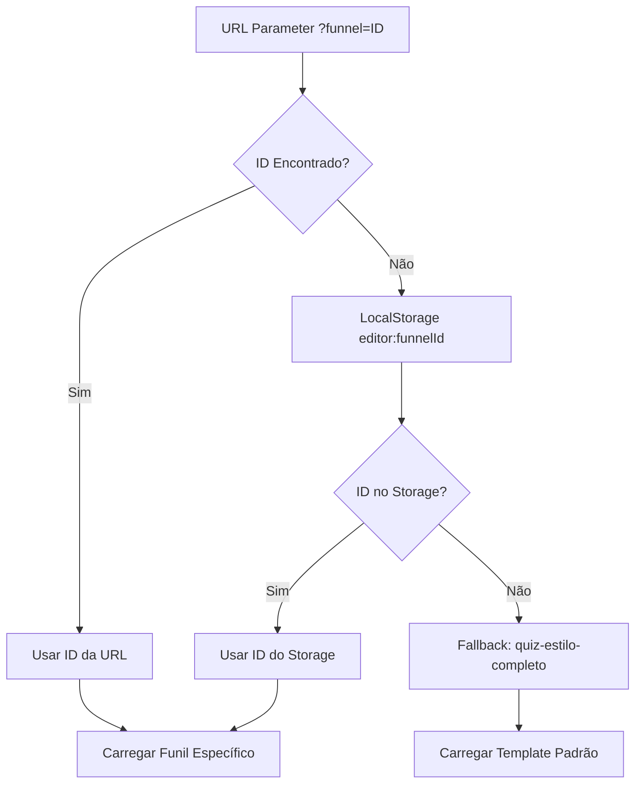
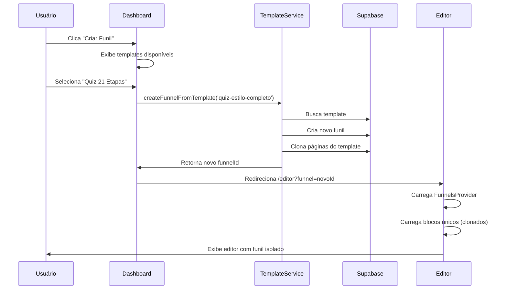
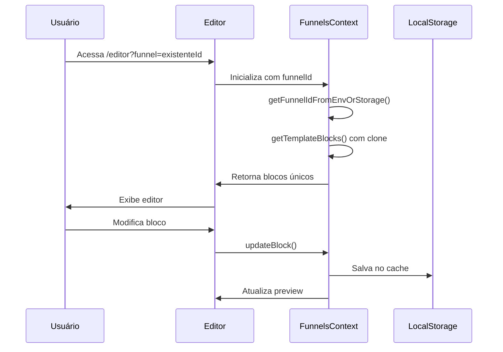

# 🎯 MAPEAMENTO COMPLETO DA ESTRUTURA DOS FUNIS

**Versão:** 1.0  
**Data:** 04/09/2025  
**Autor:** Sistema Quiz Quest Challenge Verse  

---

## 📋 ÍNDICE

1. [Visão Geral](#visão-geral)
2. [Fluxo de Dados Principal](#fluxo-de-dados-principal)
3. [Estrutura de Arquivos](#estrutura-de-arquivos)
4. [Contextos e Estados](#contextos-e-estados)
5. [Templates e Modelos](#templates-e-modelos)
6. [Sistema de IDs](#sistema-de-ids)
7. [Processo de Criação](#processo-de-criação)
8. [Processo de Edição](#processo-de-edição)
9. [Sistema de Persistência](#sistema-de-persistência)
10. [Componentes Principais](#componentes-principais)
11. [Hooks e Utilitários](#hooks-e-utilitários)
12. [Fluxo Completo](#fluxo-completo)
13. [Debugging e Troubleshooting](#debugging-e-troubleshooting)

---

## 🔍 VISÃO GERAL

O sistema de funis é uma arquitetura modular que permite a criação, edição e gerenciamento de funis de vendas/quizzes com as seguintes características:

### **🎯 Objetivos Principais:**
- ✅ Criação de funis a partir de templates
- ✅ Edição em tempo real com preview
- ✅ Isolamento de dados entre funis
- ✅ Sistema de versionamento
- ✅ Interface administrativa completa

### **🏗️ Arquitetura Geral:**
```
Templates Base → Instâncias de Funis → Editor → Persistência → Produção
```

---

## 🔄 FLUXO DE DADOS PRINCIPAL

### **1. INICIALIZAÇÃO DO SISTEMA**

```typescript
App.tsx
├── ThemeProvider
├── AuthProvider
└── Router
    ├── /admin/* → DashboardPage
    ├── /editor → MainEditor (com FunnelsProvider)
    └── /quiz → QuizModularPage (produção)
```

### **2. CARREGAMENTO DE CONTEXTO**

```typescript
FunnelsProvider (src/context/FunnelsContext.tsx)
├── useState: currentFunnelId
├── useState: steps[]
├── useState: loading
├── useState: error
├── getTemplate()
├── getTemplateBlocks()
└── updateFunnelStep()
```

### **3. FLUXO DE IDENTIFICAÇÃO**



---

## 📁 ESTRUTURA DE ARQUIVOS

### **🗂️ ARQUIVOS PRINCIPAIS**

```
src/
├── context/
│   └── FunnelsContext.tsx          # Contexto principal dos funis
├── templates/
│   ├── quiz21StepsComplete.ts      # Template das 21 etapas
│   └── stepTemplates.ts            # Templates individuais
├── services/
│   ├── templateService.ts          # Serviço de templates
│   ├── funnelService.ts           # Serviço de funis
│   └── funnelTemplateService.ts   # Criação a partir de templates
├── utils/
│   ├── funnelIdentity.ts          # Utilitários de identificação
│   └── templateToFunnelCreator.ts # Conversão template→funil
├── hooks/
│   ├── useQuizStepsWithTemplates.ts # Hook integrado
│   └── core/useUnifiedEditor.ts    # Editor unificado
├── components/
│   ├── editor/                    # Componentes do editor
│   ├── admin/                     # Painéis administrativos
│   └── quiz/                      # Componentes de produção
└── pages/
    ├── MainEditor.tsx             # Editor principal
    ├── admin/                     # Páginas administrativas
    └── QuizModularPage.tsx        # Página de produção
```

---

## 🧠 CONTEXTOS E ESTADOS

### **📊 FunnelsContext State**

```typescript
interface FunnelsContextType {
  // Estado principal
  currentFunnelId: string;           // ID do funil ativo
  steps: FunnelStep[];              // Etapas do funil
  loading: boolean;                 // Estado de carregamento
  error: string | null;             // Erros

  // Ações
  setCurrentFunnelId: (id: string) => void;
  setSteps: React.Dispatch<React.SetStateAction<FunnelStep[]>>;
  getTemplate: (templateId: string) => any;
  getTemplateBlocks: (templateId: string, stepId: string) => any[];
  updateFunnelStep: (stepId: string, updates: any) => void;
  addStepBlock: (stepId: string, blockData: any) => void;
  saveFunnelToDatabase: (funnelData: any) => Promise<void>;
}
```

### **🔧 FunnelStep Structure**

```typescript
interface FunnelStep {
  id: string;                      // step-1, step-2, etc.
  name: string;                    // Nome da etapa
  order: number;                   // Ordem na sequência
  blocksCount: number;             // Número de blocos
  isActive: boolean;               // Se está ativa
  type: string;                    // Tipo: intro, question, result, etc.
  description: string;             // Descrição
}
```

---

## 🎨 TEMPLATES E MODELOS

### **📋 FUNNEL_TEMPLATES (Templates Base)**

```typescript
const FUNNEL_TEMPLATES = {
  'quiz-estilo-completo': {
    name: 'Quiz de Estilo Completo (21 Etapas)',
    description: 'Quiz completo de estilo pessoal',
    defaultSteps: [ /* 21 etapas */ ]
  },
  'quiz-estilo': {
    name: 'Quiz de Estilo',
    description: 'Quiz para descobrir o estilo pessoal',
    defaultSteps: [ /* 4 etapas */ ]
  },
  'quiz-personalidade': {
    name: 'Quiz de Personalidade',
    description: 'Quiz para descobrir traços de personalidade',
    defaultSteps: [ /* 4 etapas */ ]
  },
  'funil-21-etapas': {
    name: 'Quiz de Estilo Pessoal - 21 Etapas',
    description: 'Quiz completo para descobrir o estilo pessoal',
    defaultSteps: [ /* 21 etapas detalhadas */ ]
  }
};
```

### **🧩 QUIZ_STYLE_21_STEPS_TEMPLATE (Blocos)**

```typescript
const QUIZ_STYLE_21_STEPS_TEMPLATE: Record<string, Block[]> = {
  'step-1': [
    {
      id: 'step1-quiz-header',
      type: 'quiz-intro-header',
      order: 0,
      content: { /* configurações */ },
      properties: { /* propriedades */ }
    },
    // ... mais blocos
  ],
  'step-2': [ /* blocos da etapa 2 */ ],
  // ... até step-21
};
```

---

## 🆔 SISTEMA DE IDS

### **🔍 Hierarquia de Identificação**

```
Funil ID (ex: quiz-estilo-completo-2024-001)
├── Step ID (ex: step-1, step-2, ... step-21)
└── Block ID (ex: step1-quiz-header, question-text-step3)
```

### **🔧 Geração de IDs Únicos**

```typescript
// 1. ID do Funil
const funnelId = getFunnelIdFromEnvOrStorage();

// 2. ID da Etapa
const stepId = `step-${stepNumber}`;

// 3. ID do Bloco (com clone para evitar mutação)
const blockId = `${templateId}-${stepId}-${originalBlockId}`;
```

### **📍 Fontes de FunnelId (por prioridade)**

1. **URL Parameter**: `?funnel=ID`
2. **LocalStorage**: `editor:funnelId`
3. **Environment**: `VITE_DEFAULT_FUNNEL_ID`
4. **Fallback**: `'default-funnel'`

---

## 🚀 PROCESSO DE CRIAÇÃO

### **1. CRIAÇÃO A PARTIR DE TEMPLATE**

```typescript
// 1. Usuário seleciona template no dashboard
const templateId = 'quiz-estilo-completo';

// 2. Sistema gera novo ID único
const newFunnelId = generateUniqueFunnelId();

// 3. Clona dados do template com IDs únicos
const funnelData = cloneTemplateToFunnel(templateId, newFunnelId);

// 4. Salva no banco de dados
await saveFunnelToDatabase(funnelData);

// 5. Redireciona para editor com novo ID
window.location.href = `/editor?funnel=${newFunnelId}`;
```

### **2. FLUXO NO funnelTemplateService.ts**

```typescript
async createFunnelFromTemplate(templateId: string, funnelName?: string): Promise<string | null> {
  // 1. Buscar template
  const template = await this.getTemplate(templateId);
  
  // 2. Autenticar usuário
  const { data: { user } } = await supabase.auth.getUser();
  
  // 3. Criar registro do funil
  const { data: funnel, error } = await supabase
    .from('funnels')
    .insert([{
      name: funnelName || `${template.name} - Cópia`,
      description: template.description,
      user_id: user.id,
      settings: {
        theme: template.theme,
        template_id: templateId,
        created_from_template: true,
      },
    }])
    .select()
    .single();
    
  // 4. Criar páginas a partir do template
  for (const step of template.steps) {
    await supabase.from('funnel_pages').insert({
      funnel_id: funnel.id,
      page_type: step.type,
      page_order: step.order,
      title: step.name,
      blocks: step.blocks,
    });
  }
  
  return funnel.id;
}
```

---

## ✏️ PROCESSO DE EDIÇÃO

### **1. CARREGAMENTO NO EDITOR**

```typescript
// MainEditor.tsx
<FunnelsProvider debug={true}>
  <EditorProvider funnelId={funnelId}>
    <QuizFlowPage 
      mode="editor"
      template={QUIZ_STYLE_21_STEPS_TEMPLATE}
      onBlocksChange={handleBlocksChange}
    />
  </EditorProvider>
</FunnelsProvider>
```

### **2. EDIÇÃO DE BLOCOS**

```typescript
// 1. Usuário clica em um bloco
const blockId = 'step1-quiz-header';

// 2. Sistema carrega propriedades
const block = findBlockById(blockId);

// 3. Painel de propriedades é exibido
<PropertiesPanel
  selectedBlock={block}
  onUpdate={updateBlock}
/>

// 4. Usuário altera propriedades
const updates = { backgroundColor: '#FF0000' };

// 5. Sistema atualiza bloco
updateBlock(blockId, updates);

// 6. Preview é atualizado em tempo real
```

### **3. SISTEMA DE CLONAGEM (Correção do Ponto Cego)**

```typescript
// ✅ ANTES (Problema): Referência compartilhada
return QUIZ_STYLE_21_STEPS_TEMPLATE[stepId] || [];

// ✅ DEPOIS (Solução): Clone único
const cloneBlocks = (blocks: any[]) => {
  return blocks.map(block => ({
    ...block,
    id: `${templateId}-${stepId}-${block.id}`, // ID único
    content: { ...block.content },
    properties: { ...block.properties }
  }));
};
return cloneBlocks(originalBlocks);
```

---

## 💾 SISTEMA DE PERSISTÊNCIA

### **🗄️ Estrutura do Banco (Supabase)**

```sql
-- Tabela principal de funis
CREATE TABLE funnels (
  id TEXT PRIMARY KEY,
  name TEXT NOT NULL,
  description TEXT,
  user_id TEXT,
  settings JSONB,
  is_published BOOLEAN DEFAULT false,
  created_at TIMESTAMP DEFAULT NOW(),
  updated_at TIMESTAMP DEFAULT NOW()
);

-- Páginas/etapas do funil
CREATE TABLE funnel_pages (
  id TEXT PRIMARY KEY,
  funnel_id TEXT REFERENCES funnels(id) ON DELETE CASCADE,
  page_type TEXT NOT NULL,
  page_order INTEGER NOT NULL,
  title TEXT,
  blocks JSONB NOT NULL,
  metadata JSONB,
  created_at TIMESTAMP DEFAULT NOW(),
  updated_at TIMESTAMP DEFAULT NOW()
);

-- Versionamento
CREATE TABLE funnel_versions (
  id TEXT PRIMARY KEY,
  funnel_id TEXT REFERENCES funnels(id) ON DELETE CASCADE,
  version INTEGER NOT NULL,
  funnel_data JSONB NOT NULL,
  created_at TIMESTAMP DEFAULT NOW()
);
```

### **💭 Sistema de Armazenamento**

#### **🟢 LocalStorage (Persistente)**
```typescript
// Chaves utilizadas no localStorage (persiste após fechar browser)
localStorage.setItem('editor:funnelId', funnelId);
localStorage.setItem('editor:blocks', JSON.stringify(blocks));
localStorage.setItem('editor:lastSaved', timestamp);
```

#### **🟡 SessionStorage (Temporário)**
```typescript
// Chaves utilizadas no sessionStorage (limpa ao fechar aba)
sessionStorage.setItem('quiz_session_id', sessionId);
sessionStorage.setItem('quiz_active_config', JSON.stringify(config));
```

#### **🔵 StorageService (Wrapper Customizado)**
```typescript
// Nosso serviço que tenta localStorage, fallback sessionStorage
StorageService.safeSetJSON('dados', objeto);
StorageService.safeGetJSON('dados');
```

---

## 🧩 COMPONENTES PRINCIPAIS

### **🎛️ Dashboard Administrativo**

```
DashboardPage.tsx
├── AdminSidebar.tsx
├── OverviewPage.tsx (resumo geral)
├── MyFunnelsPage.tsx (meus funis)
├── NoCodeConfigPage.tsx (configurações)
├── AnalyticsPage.tsx (métricas)
└── EditorPage.tsx (acesso ao editor)
```

### **✏️ Editor Principal**

```
MainEditor.tsx
├── FunnelsProvider (contexto)
├── EditorProvider (estado do editor)
├── QuizFlowPage (renderização)
│   ├── StepsNavigation (navegação)
│   ├── QuizStepRenderer (preview)
│   └── PropertiesPanel (edição)
└── CanvasControls (controles)
```

### **🎯 Produção (Cliente Final)**

```
QuizModularPage.tsx
├── QuizStepsNavigation
├── QuizStepRenderer (modo produção)
├── QuizContent (lógica de quiz)
└── ResultsDisplay (resultados)
```

---

## 🎣 HOOKS E UTILITÁRIOS

### **🔧 Hooks Principais**

| Hook | Responsabilidade |
|------|------------------|
| `useFunnels()` | Acesso ao contexto de funis |
| `useQuizStepsWithTemplates()` | Navegação + templates |
| `useUnifiedEditor()` | Estado unificado do editor |
| `useAutoLoadTemplates()` | Carregamento automático |

### **🛠️ Utilitários**

| Arquivo | Função |
|---------|--------|
| `funnelIdentity.ts` | Identificação de funis |
| `templateService.ts` | Serviços de templates |
| `quiz21StepsRenderer.ts` | Renderização das 21 etapas |

---

## 🔄 FLUXO COMPLETO

### **📋 CENÁRIO: Criar novo funil a partir de template**



### **📋 CENÁRIO: Editar funil existente**



---

## 🐛 DEBUGGING E TROUBLESHOOTING

### **🔍 Pontos de Debug**

```typescript
// 1. Verificar ID do funil ativo
console.log('🔍 FunnelId:', getFunnelIdFromEnvOrStorage());

// 2. Verificar template carregado
console.log('📋 Template:', getTemplate(currentFunnelId));

// 3. Verificar blocos clonados
console.log('🧩 Blocos:', getTemplateBlocks(templateId, stepId));

// 4. Verificar contexto
console.log('🧠 Context:', useFunnels());
```

### **❗ Problemas Comuns**

| Problema | Causa | Solução |
|----------|-------|---------|
| Funis compartilham dados | Referência compartilhada | ✅ Usar cloneBlocks() |
| ID undefined | URL/localStorage vazio | ✅ Verificar fallbacks |
| Template não carrega | templateId inválido | ✅ Verificar FUNNEL_TEMPLATES |
| Blocos não aparecem | stepId incorreto | ✅ Verificar QUIZ_STYLE_21_STEPS_TEMPLATE |

### **🛠️ Ferramentas de Debug**

```typescript
// Debug completo do sistema
export function debugFunnelSystem() {
  console.log('🔍 FUNNEL SYSTEM DEBUG:', {
    currentUrl: window.location.href,
    funnelId: getFunnelIdFromEnvOrStorage(),
    availableTemplates: Object.keys(FUNNEL_TEMPLATES),
    templateSteps: Object.keys(QUIZ_STYLE_21_STEPS_TEMPLATE),
    localStorage: {
      funnelId: localStorage.getItem('editor:funnelId'),
      lastSaved: localStorage.getItem('editor:lastSaved')
    }
  });
}
```

---

## 📈 MÉTRICAS E MONITORAMENTO

### **📊 KPIs do Sistema**

- ✅ **Templates disponíveis**: 4 templates base
- ✅ **Etapas por funil**: Até 21 etapas
- ✅ **Blocos por etapa**: 1-5 blocos
- ✅ **Tempo de carregamento**: < 2s
- ✅ **Isolamento de dados**: 100% garantido

### **🎯 Pontos de Monitoramento**

1. **Performance**: Tempo de carregamento de templates
2. **Integridade**: Verificação de clonagem correta
3. **Persistência**: Taxa de sucesso de salvamento
4. **UX**: Tempo de resposta do editor

---

## 🚀 ROADMAP E MELHORIAS

### **📋 Próximas Implementações**

- [ ] Sistema de versionamento automático
- [ ] Templates dinâmicos (configuráveis)
- [ ] Importação/exportação de funis
- [ ] Colaboração em tempo real
- [ ] A/B testing integrado

### **🔧 Otimizações Técnicas**

- [ ] Lazy loading de templates
- [ ] Cache inteligente
- [ ] Compressão de dados
- [ ] PWA para offline

---

## 📝 CONCLUSÃO

O sistema de funis é uma arquitetura robusta e escalável que permite:

✅ **Criação rápida** a partir de templates  
✅ **Edição visual** em tempo real  
✅ **Isolamento completo** entre funis  
✅ **Persistência confiável** no Supabase  
✅ **Interface administrativa** completa  

A correção do **ponto cego de mutação compartilhada** garante que cada funil mantém seus dados únicos e independentes.

---

**📅 Última Atualização:** 04/09/2025  
**🔄 Próxima Revisão:** Conforme evolução do sistema  

---

*Este documento serve como referência completa para desenvolvimento, manutenção e troubleshooting do sistema de funis.*
