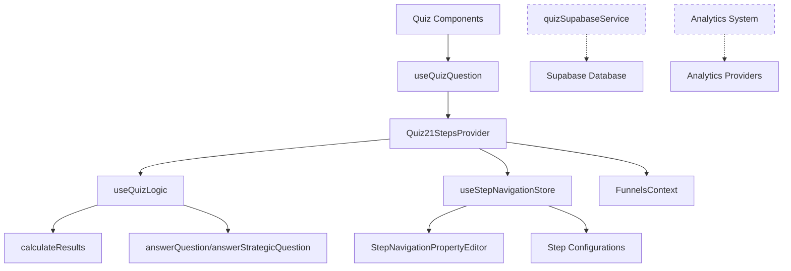

# 🗺️ MAPEAMENTO DETALHADO - SISTEMA DE NAVEGAÇÃO E CONFIGURAÇÕES QUIZ

## 📋 **STATUS ATUAL DA IMPLEMENTAÇÃO**

| Componente                 | Status          | Integração Supabase | Integração Analytics | Observações                           |
| -------------------------- | --------------- | ------------------- | -------------------- | ------------------------------------- |
| **Quiz21StepsProvider**    | ✅ Implementado | ⚠️ Parcial          | ⚠️ Parcial           | Provider central integrado com NoCode |
| **useQuizLogic**           | ✅ Implementado | ❌ Não integrado    | ❌ Não integrado     | Lógica de cálculo isolada             |
| **useStepNavigationStore** | ✅ Implementado | ❌ N/A              | ❌ N/A               | Store NoCode funcionando              |
| **useQuizQuestion**        | ✅ Implementado | ❌ Não integrado    | ❌ Não integrado     | Hook para questões                    |
| **quizSupabaseService**    | ✅ Implementado | ✅ Completo         | ✅ Tracking          | Serviço pronto, não usado             |
| **Analytics System**       | ✅ Implementado | ✅ Completo         | ✅ Completo          | Sistema robusto, não integrado        |

---

## 🏗️ **ARQUITETURA ATUAL DO SISTEMA**

### **1. FLUXO DE DADOS PRINCIPAL**



### **2. ESTRUTURA DAS 21 ETAPAS**

| Etapa     | Tipo                | Propósito      | Config Padrão          | Integração Atual         |
| --------- | ------------------- | -------------- | ---------------------- | ------------------------ |
| **1**     | Lead Collection     | Captura Nome   | `req: 1, auto: 1000ms` | ✅ NoCode + Provider     |
| **2-11**  | Scored Questions    | Quiz Principal | `req: 3, auto: 1500ms` | ✅ NoCode + useQuizLogic |
| **12**    | Transition          | Transição      | `req: 0, manual`       | ✅ NoCode                |
| **13-18** | Strategic Questions | Qualificação   | `req: 1, auto: 1200ms` | ✅ NoCode + useQuizLogic |
| **19**    | Transition          | Transição      | `req: 0, manual`       | ✅ NoCode                |
| **20**    | Result              | Apresentação   | `req: 0, manual`       | ⚠️ Parcial               |
| **21**    | Offer               | Conversão      | `req: 0, manual`       | ⚠️ Parcial               |

---

## 🧮 **SISTEMA DE CÁLCULOS E RESULTADOS**

### **3.1. Fluxo Atual de Cálculo (`useQuizLogic.ts`)**

```typescript
// ✅ IMPLEMENTADO: Lógica de cálculo
const calculateStyleScores = (answers: QuizAnswer[]) => {
  const styleScores: { [style: string]: number } = {};

  answers.forEach(answer => {
    const question = caktoquizQuestions.find(q => q.id === answer.questionId);
    const option = question?.options.find(opt => opt.id === answer.optionId);

    // ✅ FILTRO: Apenas questões q1-q10 (etapas 2-11) pontuam
    const isScorableQuestion = [
      'q1',
      'q2',
      'q3',
      'q4',
      'q5',
      'q6',
      'q7',
      'q8',
      'q9',
      'q10',
    ].includes(question?.id || '');

    if (option?.style && isScorableQuestion) {
      styleScores[option.style] = (styleScores[option.style] || 0) + (option.weight || 1);
    }
  });

  return styleScores;
};

// ✅ RESULTADO PERSONALIZADO
const calculateResults = (answers: QuizAnswer[]): QuizResult => {
  const styleScores = calculateStyleScores(answers);
  const sortedStyles = Object.entries(styleScores).sort(([, a], [, b]) => b - a);
  const topStyle = sortedStyles[0]?.[0] || 'estilo-neutro';

  return {
    primaryStyle: createStyleResult(topStyle, styleScores[topStyle] || 0),
    secondaryStyles: sortedStyles.slice(1, 4).map(([cat, score]) => createStyleResult(cat, score)),
    totalQuestions: answers.length,
    completedAt: new Date(),
    scores: styleScores,
    userData: {
      name: userName || localStorage.getItem('quizUserName') || '',
      completionTime: new Date(),
      strategicAnswersCount: strategicAnswers.length,
    },
  };
};
```

### **3.2. Questões Estratégicas (Etapas 13-18)**

```typescript
// ✅ IMPLEMENTADO: Tracking separado para estratégicas
const answerStrategicQuestion = (
  questionId: string,
  optionId: string,
  category: string,
  strategicType: string
) => {
  const strategicAnswer: StrategicAnswer = {
    questionId,
    optionId,
    category,
    strategicType,
    timestamp: new Date(),
  };

  setStrategicAnswers(prev => [...prev, strategicAnswer]);

  // ⚠️ MISSING: Integração com Supabase
  // TODO: await quizSupabaseService.saveQuizResponse(...)
};
```

---

## 💾 **INTEGRAÇÃO COM SUPABASE**

### **4.1. Estado do `quizSupabaseService.ts`**

| Funcionalidade        | Status          | Uso Atual    |
| --------------------- | --------------- | ------------ |
| **createQuizSession** | ✅ Implementado | ❌ Não usado |
| **saveQuizResponse**  | ✅ Implementado | ❌ Não usado |
| **saveQuizResult**    | ✅ Implementado | ❌ Não usado |
| **trackEvent**        | ✅ Implementado | ❌ Não usado |
| **recordConversion**  | ✅ Implementado | ❌ Não usado |

### **4.2. Schema Supabase Disponível**

```sql
-- ✅ TABELAS CRIADAS E PRONTAS
CREATE TABLE quiz_sessions (
  id UUID PRIMARY KEY,
  funnel_id TEXT,
  quiz_user_id TEXT,
  status TEXT,
  current_step INTEGER,
  score INTEGER,
  -- ... outros campos
);

CREATE TABLE quiz_step_responses (
  id UUID PRIMARY KEY,
  session_id UUID,
  step_number INTEGER,
  question_id TEXT,
  answer_value TEXT,
  score_earned INTEGER,
  -- ... outros campos
);

CREATE TABLE quiz_results (
  id UUID PRIMARY KEY,
  session_id UUID,
  result_type TEXT,
  result_data JSONB,
  -- ... outros campos
);
```

### **4.3. Gaps de Integração**

```typescript
// ❌ MISSING: Integração no Quiz21StepsProvider
export const Quiz21StepsProvider = ({ children, initialStep = 1, debug = false }) => {
  // ⚠️ PROBLEMA: Sem sessão Supabase
  // TODO: const [supabaseSession, setSupabaseSession] = useState(null);

  const saveAnswer = useCallback(
    (questionId: string, optionId: string, value?: any) => {
      // ✅ LOCAL: Salva no useQuizLogic
      if (currentStep >= 2 && currentStep <= 11) {
        answerQuestion(questionId, optionId);
      } else if (currentStep >= 13 && currentStep <= 18) {
        answerStrategicQuestion(questionId, optionId, 'strategic', 'tracking');
      }

      // ❌ MISSING: Salvar no Supabase
      // TODO: await quizSupabaseService.saveQuizResponse({
      //   sessionId: supabaseSession.id,
      //   stepNumber: currentStep,
      //   questionId, answerValue: optionId, ...
      // });
    },
    [currentStep, answerQuestion, answerStrategicQuestion]
  );
};
```

---

## 📊 **SISTEMA DE ANALYTICS**

### **5.1. Estado do Sistema Analytics**

| Componente              | Status          | Observações                |
| ----------------------- | --------------- | -------------------------- |
| **useQuizAnalytics.ts** | ✅ Implementado | Hook completo com tracking |
| **analytics.ts**        | ✅ Implementado | Utilitários GA4/Meta       |
| **Analytics Service**   | ✅ Implementado | Supabase analytics         |

### **5.2. Eventos Analytics Disponíveis**

```typescript
// ✅ IMPLEMENTADO: Sistema robusto de tracking
const { trackStepStart, trackStepComplete, trackQuizComplete, trackUserInteraction } =
  useQuizAnalytics(currentStep, `step-${currentStep}`);

// ⚠️ PROBLEMA: Não está sendo usado no Quiz21StepsProvider
```

### **5.3. Gaps de Analytics**

```typescript
// ❌ MISSING: Integração no Quiz21StepsProvider
const goToStep = useCallback(
  (step: number) => {
    if (step >= 1 && step <= totalSteps) {
      setCurrentStep(step);
      setActiveStageId(`step-${step}`);

      // ❌ MISSING: Analytics tracking
      // TODO: trackStepStart(step);
      // TODO: trackEvent({ type: 'step_navigation', step, timestamp: Date.now() });
    }
  },
  [setActiveStageId, totalSteps]
);

const saveAnswer = useCallback((questionId: string, optionId: string, value?: any) => {
  // ✅ LOCAL: Salva resposta
  // ... lógica atual ...
  // ❌ MISSING: Analytics tracking
  // TODO: trackUserInteraction('answer_selected', { questionId, optionId, step: currentStep });
}, []);
```

---

## 🔧 **HOOKS E INTEGRAÇÕES**

### **6.1. Estado dos Hooks**

| Hook                       | Status         | Integração Provider | Observações           |
| -------------------------- | -------------- | ------------------- | --------------------- |
| **useQuizQuestion**        | ✅ Funcionando | ✅ Integrado        | Hook para componentes |
| **useQuizLogic**           | ✅ Funcionando | ✅ Integrado        | Lógica de cálculo     |
| **useStepNavigationStore** | ✅ Funcionando | ✅ Integrado        | Configurações NoCode  |
| **useQuizAnalytics**       | ✅ Funcionando | ❌ Não integrado    | Analytics prontos     |
| **useSupabaseQuiz**        | ❌ Não existe  | ❌ N/A              | Precisa ser criado    |

### **6.2. Fluxo do `useQuizQuestion`**

```typescript
// ✅ IMPLEMENTADO: Integração perfeita com Quiz21StepsProvider
export const useQuizQuestion = ({ questionId, requiredSelections, maxSelections, autoAdvance }) => {
  const { currentStepSelections, updateStepSelections, saveAnswer, getStepRequirements } =
    useQuiz21Steps();

  // ✅ USA: Configurações NoCode do store
  const stepReqs = getStepRequirements();
  const effectiveRequiredSelections = requiredSelections ?? stepReqs.requiredSelections;

  // ✅ FUNCIONA: Auto-sync com sistema de navegação
  const addSelection = useCallback(
    (optionId: string, value?: any) => {
      // ✅ FIFO: Remove primeira se atingir máximo
      // ✅ SAVE: Chama saveAnswer do provider
      saveAnswer(questionId, optionId, value);
    },
    [questionId, saveAnswer]
  );
};
```

---

## 🚨 **PROBLEMAS IDENTIFICADOS**

### **7.1. Críticos**

1. **❌ Supabase Não Integrado**:
   - `quizSupabaseService` implementado mas não usado
   - Sem criação de sessão no início do quiz
   - Sem persistência de respostas e resultados

2. **❌ Analytics Não Integrado**:
   - `useQuizAnalytics` pronto mas não usado
   - Sem tracking de navegação entre etapas
   - Sem métricas de performance

3. **❌ Resultado Não Persistido**:
   - Cálculo funciona mas não salva no Supabase
   - Sem tracking de conversão
   - Dados perdidos ao recarregar página

### **7.2. Moderados**

1. **⚠️ Duplicação de Estados**:
   - `useQuizLogic` mantém estado próprio
   - `Quiz21StepsProvider` mantém estado separado
   - Possível dessincronia

2. **⚠️ Configurações NoCode Não Aplicadas**:
   - Store funciona mas alguns aspectos visuais não aplicados
   - Delay de auto-advance hardcoded em alguns lugares

### **7.3. Menores**

1. **⚠️ Debug/Logging Inconsistente**:
   - Alguns componentes logam, outros não
   - Sem sistema unificado de debug

2. **⚠️ Fallbacks de Erro**:
   - Sem tratamento robusto de falhas de rede
   - Sem modo offline

---

## 🎯 **PLANO DE CORREÇÃO PRIORIZADO**

### **FASE 1 - CRÍTICA: Integração Supabase (1-2 dias)**

1. **Criar hook `useSupabaseQuiz`**
2. **Integrar criação de sessão no Quiz21StepsProvider**
3. **Conectar saveAnswer com quizSupabaseService**
4. **Integrar cálculo de resultado com persistência**

### **FASE 2 - IMPORTANTE: Integração Analytics (1 dia)**

1. **Integrar useQuizAnalytics no Quiz21StepsProvider**
2. **Adicionar tracking de navegação**
3. **Implementar métricas de performance**

### **FASE 3 - MELHORIA: Otimizações (1 dia)**

1. **Unificar estados duplicados**
2. **Aplicar configurações NoCode visuais**
3. **Melhorar sistema de debug**

---

## 📈 **MÉTRICAS DE SUCESSO**

### **Integração Supabase**

- [ ] Sessão criada automaticamente no início
- [ ] Todas as respostas persistidas em tempo real
- [ ] Resultado salvo no final do quiz
- [ ] Analytics events enviados para Supabase

### **Analytics**

- [ ] Tracking de navegação entre etapas
- [ ] Métricas de tempo por etapa
- [ ] Taxa de conversão por etapa
- [ ] Heatmap de abandono

### **Performance**

- [ ] Tempo de resposta < 200ms para salvar resposta
- [ ] Sem perda de dados em reload
- [ ] Fallback para modo offline
- [ ] Debug logs estruturados

---

**🔗 Este mapeamento mostra que temos uma base sólida, mas faltam as integrações críticas com Supabase e Analytics para um sistema completo de produção.**
