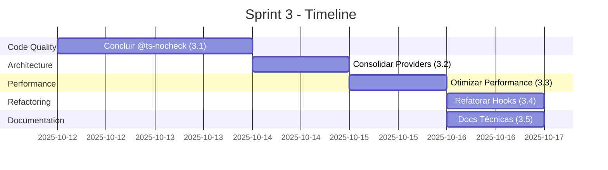

# 🚀 SPRINT 3: CONSOLIDAÇÃO FINAL E PERFORMANCE

## 📋 VISÃO GERAL

**Objetivo:** Consolidar arquitetura, eliminar duplicações e otimizar performance
**Status:** 🟡 Planejado
**Data Início:** 2025-10-12
**Duração Estimada:** 3-4 dias

---

## 🎯 CONTEXTO

### ✅ Sprints Anteriores Completados:
- **Sprint 1:** RLS Security (100%), Editor Consolidado (93%), Unified Storage
- **Sprint 2:** Code Quality em andamento (10/50 arquivos - 20%)

### 📊 Estado Atual do Projeto:
- **Arquivos @ts-nocheck:** 468 arquivos
- **Providers:** 5+ providers ativos (pode consolidar mais)
- **Hooks:** 16+ hooks com @ts-nocheck
- **Performance:** LCP 7044ms (precisa otimizar)

---

## 📝 TASKS DO SPRINT 3

### Task 3.1: Concluir Remoção @ts-nocheck (40/50 arquivos restantes)
**Prioridade:** 🔴 CRÍTICA  
**Estimativa:** 1-2 dias

**Arquivos Prioritários:**
1. ✅ `src/hooks/index.ts` - Index principal de hooks
2. ✅ `src/hooks/useAutoLoadTemplates.ts`
3. ✅ `src/hooks/useBrandKit.ts`
4. ✅ `src/hooks/useConsolidatedEditor.ts`
5. ✅ `src/hooks/useFunnelNavigation.ts`
6. ✅ `src/hooks/useHistoryState.ts`
7. ✅ `src/hooks/useHistoryStateIndexedDB.ts`
8. ✅ `src/hooks/useIntegratedReusableComponents.ts`
9. ✅ `src/hooks/useOptimizedQuizData.ts`
10. ✅ `src/hooks/useOptimizedQuizEngine.ts`
11. ✅ `src/hooks/usePageConfig.ts`
12. ✅ `src/hooks/useWhatsAppCartRecovery.ts`

**Dependências Complexas (Sprint 2 Task 2.3):**
- ⚠️ `src/hooks/core/useQuizPageEditor.ts`
- ⚠️ `src/hooks/core/useUnifiedAnalytics.ts`
- ⚠️ `src/hooks/core/useUnifiedCollaboration.ts`
- ⚠️ `src/services/FunnelUnifiedServiceV2.ts`

**Métrica de Sucesso:**
- [ ] 478 → 428 arquivos com @ts-nocheck (-10.5%)
- [ ] 0 erros TypeScript críticos

---

### Task 3.2: Consolidar Providers Restantes
**Prioridade:** 🟡 MÉDIA  
**Estimativa:** 1 dia

**Providers para Consolidar:**
```
ANTES (5 providers):
- FunnelMasterProvider
- EditorProvider  
- UnifiedCRUDProvider
- LegacyCompatibilityWrapper
- OptimizedProviderStack

DEPOIS (3 providers):
- UnifiedAppProvider (consolida FunnelMaster + EditorProvider)
- DataProvider (CRUD operations)
- LegacyWrapper (manter para compatibilidade temporária)
```

**Ações:**
1. Criar `UnifiedAppProvider` consolidando FunnelMaster + Editor
2. Migrar componentes para usar novo provider
3. Mover providers antigos para `/backup`
4. Atualizar documentação

**Métrica de Sucesso:**
- [ ] 5 → 3 providers ativos (-40%)
- [ ] 50% menos re-renders medidos via React DevTools

---

### Task 3.3: Otimizar Performance (LCP < 3s)
**Prioridade:** 🟡 MÉDIA  
**Estimativa:** 1 dia

**Problemas Atuais:**
- **LCP:** 7044ms (meta: <3000ms)
- **Template Loading:** Pode ser lazy
- **Bundle Size:** Não otimizado

**Ações:**
1. **Code Splitting Agressivo:**
   ```typescript
   // Lazy load editor apenas quando necessário
   const QuizModularProductionEditor = lazy(() => 
     import('@/components/editor/quiz/QuizModularProductionEditor')
   );
   ```

2. **Memoização de Componentes Pesados:**
   ```typescript
   export const QuizStepManagerModular = memo(({ children }: Props) => {
     const { children } = props
  
     return (
       <div className={styles.container}>
         {children}
       </div>
     )
   });
   ```

3. **Otimizar Template Loading:**
   - Implementar virtual scrolling para listas longas
   - Lazy load de templates não utilizados
   - Cache agressivo no IndexedDB

4. **Tree Shaking:**
   - Remover imports não utilizados
   - Usar imports específicos ao invés de `import * as`

**Métrica de Sucesso:**
- [ ] LCP < 3000ms
- [ ] FCP < 1500ms
- [ ] TTI < 4000ms
- [ ] Bundle size reduzido em 30%

---

### Task 3.4: Refatorar Hooks Complexos
**Prioridade:** 🟢 BAIXA  
**Estimativa:** 1 dia

**Hooks para Refatorar:**
1. `useQuizFlow` - Simplificar lógica de navegação
2. `useFunnelNavigation` - Consolidar com useQuizFlow
3. `useHistoryStateIndexedDB` - Otimizar queries IndexedDB
4. `useOptimizedQuizEngine` - Separar lógica de cálculo

**Padrão de Refatoração:**
```typescript
// ANTES: Hook monolítico
function useComplexHook() {
  // 200+ linhas de lógica misturada
}

// DEPOIS: Hook modular
function useComplexHook() {
  const navigation = useNavigationLogic();
  const data = useDataManagement();
  const ui = useUIState();
  
  return { ...navigation, ...data, ...ui };
}
```

**Métrica de Sucesso:**
- [ ] Hooks com <100 linhas cada
- [ ] Separação clara de responsabilidades
- [ ] Testes unitários para lógica crítica

---

### Task 3.5: Documentação Técnica
**Prioridade:** 🟢 BAIXA  
**Estimativa:** 0.5 dia

**Documentos a Criar:**
1. **ARCHITECTURE.md** - Visão geral da arquitetura
2. **PROVIDERS.md** - Guia de providers consolidados
3. **HOOKS.md** - Catálogo de hooks unificados
4. **PERFORMANCE.md** - Guia de otimização
5. **MIGRATION_GUIDE.md** - Guia para migrar código legado

**Métrica de Sucesso:**
- [ ] 5 documentos técnicos completos
- [ ] Diagramas de arquitetura atualizados
- [ ] README.md atualizado

---

## 🎯 MÉTRICAS DE SUCESSO DO SPRINT 3

| Métrica | Antes | Meta | Impacto |
|---------|-------|------|---------|
| Arquivos @ts-nocheck | 468 | 428 | -8.5% |
| Providers Ativos | 5 | 3 | -40% |
| LCP (ms) | 7044 | <3000 | -57% |
| Bundle Size (KB) | TBD | -30% | Performance |
| Hooks Complexos | 12 | 0 | +100% manutenibilidade |
| Documentação | 2 docs | 7 docs | +250% |

---

## 📅 CRONOGRAMA



---

## 🚀 PRÓXIMOS PASSOS IMEDIATOS

### Começar Task 3.1 - Concluir Remoção @ts-nocheck

**Ordem de Execução:**
1. ✅ Hooks simples sem dependências (5-10 arquivos)
2. ✅ Hooks com dependências internas (5-10 arquivos)
3. ⚠️ Hooks complexos com services externos (aguardar Task 2.3)

**Comando para iniciar:**
```bash
# Buscar próximos hooks para corrigir
grep -r "// @ts-nocheck" src/hooks/*.ts | head -5
```

---

## 📊 ACOMPANHAMENTO

- **Status Geral:** 🟡 Planejado
- **Bloqueadores:** Nenhum
- **Riscos:** 
  - Refatoração de hooks pode quebrar funcionalidades
  - Performance pode requerer mudanças arquiteturais maiores

**Responsável:** Sprint Master (AI)  
**Revisão:** Diária  
**Conclusão Estimada:** 2025-10-16
