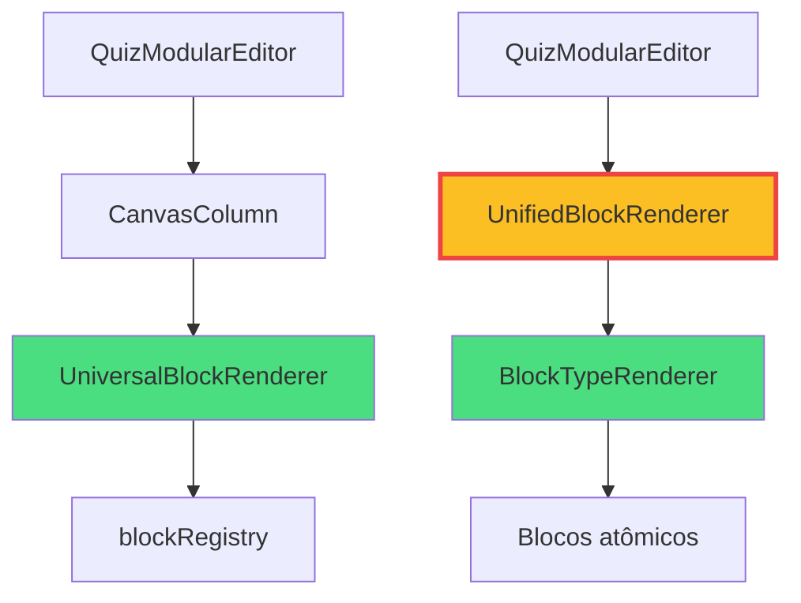

# 🔍 SPRINT 2 - FASE 1: AUDITORIA COMPLETA

**Data**: Novembro 2025  
**Status**: ✅ **COMPLETO**  
**Duração**: 1 hora

---

## 📋 Sumário Executivo

Auditoria revelou **arquitetura mais complexa** do que esperado, com **3 renderizadores diferentes** operando em paralelo:

1. **UnifiedBlockRenderer** (DEPRECATED mas ainda usado em 2 locais)
2. **BlockTypeRenderer** (Renderizador principal, 514 linhas)
3. **UniversalBlockRenderer** (Usa blockRegistry, mais moderno)

**Descoberta crítica**: UnifiedBlockRenderer **NÃO FOI REMOVIDO** - ele ainda existe e está sendo usado!

**Loading states**: Encontrados **1376 matches** de `useState` com loading - evidência de **duplicação massiva**.

---

## 🗂️ Arquivos Auditados

### ✅ Arquivos Encontrados e Analisados

| Arquivo | Linhas | Status | Importância |
|---------|--------|--------|-------------|
| **UnifiedBlockRenderer.tsx** | 199 | 🟡 DEPRECATED | Médio |
| **BlockTypeRenderer.tsx** | 514 | 🟢 ATIVO | Crítico |
| **UniversalBlockRenderer.tsx** | 131 | 🟢 ATIVO | Alto |
| **QuizModularEditor/index.tsx** | 725 | 🟢 ATIVO | Crítico |
| **CanvasColumn/index.tsx** | 339 | 🟢 ATIVO | Alto |
| **UnifiedStepRenderer.tsx** | 526 | 🟢 ATIVO | Alto |

### ❌ Arquivos NÃO Encontrados (expectativa incorreta)

- `src/components/editor/unified/UnifiedBlockRenderer.tsx` ❌
- `src/components/editor/blocks/BlockTypeRenderer.tsx` ❌

**Localização correta**:
- UnifiedBlockRenderer: `src/components/editor/quiz/components/UnifiedBlockRenderer.tsx` ✅
- BlockTypeRenderer: `src/components/editor/quiz/renderers/BlockTypeRenderer.tsx` ✅

---

## 🏗️ Arquitetura Descoberta

### 1. Sistema de Renderização Triplo (Problema!)



**Problema**: 3 renderizadores fazendo trabalho similar!

---

### 2. UnifiedBlockRenderer (DEPRECATED mas ativo!)

**Localização**: `src/components/editor/quiz/components/UnifiedBlockRenderer.tsx`

**Status**: 🟡 **DEPRECATED MAS AINDA USADO**

**Comentário no código**:
```typescript
/**
 * ⚠️ DEPRECATED: Este componente está sendo substituído por BlockTypeRenderer
 * @see src/components/editor/quiz/renderers/BlockTypeRenderer.tsx
 * 
 * Motivo: BlockTypeRenderer oferece registry unificado e elimina duplicação de lógica.
 */
```

**Importado por** (2 arquivos):
1. `src/components/editor/quiz/components/CanvasArea.tsx` (linha 13)
2. `src/components/editor/quiz/components/EnhancedCanvasArea.tsx` (linha 31)

**Estrutura**:
```typescript
interface UnifiedBlockRendererProps {
  block: BlockComponent;
  allBlocks: BlockComponent[];
  mode: 'edit' | 'preview';  // 🎯 Suporta 2 modos
  isSelected?: boolean;
  isMultiSelected?: boolean;
  hasErrors?: boolean;
  onBlockClick?: (e: React.MouseEvent, block: BlockComponent) => void;
  onDelete?: () => void;
  onDuplicate?: () => void;
  sessionData?: Record<string, any>;
  renderBlockPreview?: (block: BlockComponent, allBlocks: BlockComponent[]) => React.ReactNode;
}
```

**Característica chave**: 
- Usa **BlockTypeRenderer internamente** (linha 130)
- Adiciona **drag & drop** via `useSortable`
- Adiciona **UI de edição** (botões, handles)
- **Memoizado** com `areEqual` personalizado (linha 184)

**Responsabilidade**:
```typescript
// 🎯 CONTEÚDO VISUAL - IDÊNTICO EM AMBOS OS MODOS
<BlockTypeRenderer
  block={block as any}
  isSelected={isSelected}
  isEditable={mode === 'edit'}
  onSelect={() => onBlockClick?.({} as any, block)}
  onOpenProperties={() => onBlockClick?.({} as any, block)}
  contextData={sessionData || {}}
/>
```

**Conclusão**: É um **wrapper** de BlockTypeRenderer que adiciona funcionalidades de editor.

---

### 3. BlockTypeRenderer (Renderizador Real)

**Localização**: `src/components/editor/quiz/renderers/BlockTypeRenderer.tsx`

**Status**: 🟢 **ATIVO E CRÍTICO**

**Linhas**: 514 (arquivo grande!)

**Estrutura**:
```typescript
interface BlockRendererProps {
  block: Block;
  isSelected?: boolean;
  isEditable?: boolean;
  onSelect?: (blockId: string) => void;
  onOpenProperties?: (blockId: string) => void;
  contextData?: Record<string, any>;
}

export const BlockTypeRenderer: React.FC<BlockRendererProps> = ({ block, ...rest }) => {
  const content = (() => {
    const normalizedType = String(block.type).toLowerCase().trim();
    
    switch (normalizedType) {
      // ===== ALIASES DE TIPOS CRÍTICOS =====
      case 'hero-block':
      case 'hero':
        return <IntroLogoHeaderBlock block={block} {...rest} />;
      
      case 'intro-title':
      case 'heading':
        return <HeadingInlineBlock block={block} {...rest} />;
      
      // ... 80+ cases diferentes!
      
      default:
        return <FallbackBlockRenderer block={block} {...rest} />;
    }
  })();
  
  return (
    <SafeBoundary label={`Erro no bloco: ${String(block?.type || 'desconhecido')}`}>
      {content}
    </SafeBoundary>
  );
};
```

**Características**:
- **80+ tipos de bloco** suportados via switch case
- **Imports estáticos** para todos os blocos (problema de bundle!)
- **Aliases** extensos para compatibilidade
- **SafeBoundary** para error handling
- **Memoizado** via `React.memo` (linha 514)

**Imports críticos** (amostra):
```typescript
import IntroLogoHeaderBlock from '@/components/blocks/inline/IntroLogoHeaderBlock';
import HeadingInlineBlock from '@/components/blocks/inline/HeadingInlineBlock';
import TextInlineBlock from '@/components/blocks/inline/TextInlineBlock';
import ImageDisplayInline from '@/components/blocks/ImageDisplayInline';
import ButtonInlineBlock from '@/components/blocks/inline/ButtonInlineBlock';
// ... 75+ imports mais!
```

**Problema identificado**: 
- ❌ **Todos os blocos são importados estaticamente**
- ❌ **Não usa lazy loading**
- ❌ **Não usa blockRegistry**
- ❌ **Switch case gigante (80+ cases)**

**Oportunidade SPRINT 2**:
```typescript
// ❌ ATUAL (estático)
import IntroLogoHeaderBlock from '@/components/blocks/inline/IntroLogoHeaderBlock';

// ✅ PROPOSTO (lazy via registry)
const IntroLogoHeaderBlock = lazy(() => blockRegistry.get('intro-logo-header'));
```

---

### 4. UniversalBlockRenderer (Moderno, usa registry)

**Localização**: `src/components/core/renderers/UniversalBlockRenderer.tsx`

**Status**: 🟢 **ATIVO E MODERNO**

**Linhas**: 131 (muito mais limpo!)

**Usado por**: `CanvasColumn` (linha 10 de CanvasColumn/index.tsx)

**Estrutura**:
```typescript
export interface UniversalBlockRendererProps {
  block: Block;
  isSelected?: boolean;
  isPreviewing?: boolean;  // @deprecated
  onUpdate?: (blockId: string, updates: any) => void;
  onDelete?: (blockId: string) => void;
  onSelect?: (blockId: string) => void;
}

const UniversalBlockRenderer: React.FC<UniversalBlockRendererProps> = memo(({
  block,
  isSelected = false,
  onUpdate,
  onDelete,
  onSelect,
}) => {
  // 🚀 Resolver componente via UnifiedBlockRegistry
  const EnhancedComponent = blockRegistry.getComponent(block.type);
  
  return (
    <BlockErrorBoundary block={block}>
      <React.Suspense fallback={<LoadingSkeleton />}>
        <Wrapper
          block={block}
          isSelected={isSelected}
          isEditable={!isPreviewing}
          onUpdate={handleUpdate}
          onDelete={onDelete}
        />
      </React.Suspense>
    </BlockErrorBoundary>
  );
});
```

**Vantagens**:
- ✅ **Usa blockRegistry** (linha 84)
- ✅ **Lazy loading via Suspense** (linha 113)
- ✅ **Error boundary** (linha 111)
- ✅ **Fallback component** (linha 21)
- ✅ **Limpo e modular** (131 linhas vs 514)

**Este é o modelo ideal para SPRINT 2!**

---

### 5. QuizModularEditor (725 linhas)

**Localização**: `src/components/editor/quiz/QuizModularEditor/index.tsx`

**Status**: 🟢 **ATIVO E CRÍTICO**

**Problema principal**: **Estados de loading duplicados**

**Loading states identificados**:
```typescript
// Linha 79
const [loadedTemplate, setLoadedTemplate] = useState<{ name: string; steps: any[] } | null>(null);

// Linha 80
const [isLoadingTemplate, setIsLoadingTemplate] = useState(false);

// Linha 81
const [templateLoadError, setTemplateLoadError] = useState(false);

// Linha 82
const [isLoadingStep, setIsLoadingStep] = useState(false);
```

**Total**: 4 estados de loading diferentes apenas no índice!

**Uso dos estados**:
```typescript
// Linha 179: isLoadingTemplate
setIsLoadingTemplate(true);

// Linha 217: isLoadingTemplate
setIsLoadingTemplate(false);

// Linha 235: isLoadingStep
setIsLoadingStep(true);

// Linha 256: isLoadingStep
setIsLoadingStep(false);
```

**Problema**: Estados não unificados, dificulta tracking e causa re-renders desnecessários.

**Layout de colunas**:
```typescript
// Linha 85-99: Persistência de layout
const PANEL_LAYOUT_KEY = 'qm-editor:panel-layout-v1';
const [panelLayout, setPanelLayout] = useState<number[] | null>(null);
```

**Lazy loading de componentes**:
```typescript
// Linhas 36-39: Lazy components
const CanvasColumn = React.lazy(() => import('./components/CanvasColumn'));
const ComponentLibraryColumn = React.lazy(() => import('./components/ComponentLibraryColumn'));
const PropertiesColumn = React.lazy(() => import('./components/PropertiesColumn'));
const PreviewPanel = React.lazy(() => import('./components/PreviewPanel'));
```

**✅ Já usa lazy loading corretamente!** Mas pode ser melhorado com blockRegistry.

---

### 6. CanvasColumn (339 linhas)

**Localização**: `src/components/editor/quiz/QuizModularEditor/components/CanvasColumn/index.tsx`

**Status**: 🟢 **ATIVO**

**Loading states identificados**:
```typescript
// Linha 166
const [blocks, setBlocks] = useState<Block[] | null>(blocksFromProps ?? null);

// Linha 167
const [loading, setLoading] = useState(false);

// Linha 168
const [error, setError] = useState<string | null>(null);
```

**Total**: 3 estados (blocks, loading, error)

**✅ Já usa useSafeEventListener** (SPRINT 1):
```typescript
// Linha 14
import { useSafeEventListener } from '@/hooks/useSafeEventListener';

// Linha 193
useSafeEventListener('block-updated', (event: Event) => {
  // ...
}, {
  target: typeof window !== 'undefined' ? window : null,
  enabled: true,
});
```

**✅ Já usa useAutoMetrics** (SPRINT 1):
```typescript
// Linha 15
import { useAutoMetrics } from '@/hooks/useAutoMetrics';

// Linha 171
useAutoMetrics('CanvasColumn', {
  currentStepKey,
  blocksCount: blocks?.length || 0,
  selectedBlockId,
});
```

**Renderizador usado**: `UniversalBlockRenderer` (linha 104)
```typescript
<UniversalBlockRenderer
  block={block as any}
  isSelected={isSelected}
  isPreviewing={false}
  onUpdate={(blockId, updates) => onUpdateBlock?.(blockId, updates)}
  onDelete={(blockId) => onRemoveBlock?.(blockId)}
  onSelect={(blockId) => onSelect?.(blockId)}
/>
```

**Problema**: Mistura `UniversalBlockRenderer` (bom) com estados de loading locais (duplicação).

---

### 7. UnifiedStepRenderer (526 linhas)

**Localização**: `src/components/editor/unified/UnifiedStepRenderer.tsx`

**Status**: 🟢 **ATIVO**

**Característica principal**: **Seletor de componente multi-fonte**

**Prioridades de carregamento** (useOptimizedStepComponent):
```typescript
// Linhas 133-205
const useOptimizedStepComponent = (stepId: string, mode: RenderMode) => {
  return useMemo(() => {
    // ✅ FONTE ÚNICA: quiz21StepsComplete.ts (gerado de quiz21-complete.json)
    // Removido código morto de lazy loading - SPRINT 1 cleanup
    
    // PRIORIDADE 1: V3.0 hardcoded
    const v3Enabled = (import.meta as any)?.env?.VITE_ENABLE_V3_RENDER === 'true';
    if (mode === 'production' && v3Enabled) {
      const template = QUIZ_STYLE_21_STEPS_TEMPLATE[stepId];
      if (template) return { type: 'v3', component: V3Renderer, template };
    }
    
    // PRIORIDADE 2: Lazy Components (TSX)
    if (mode === 'production' && stepId in LazyStepComponents) {
      return {
        type: 'lazy',
        component: LazyStepComponents[stepId as LazyStepId],
      };
    }
    
    // PRIORIDADE 3: Registry
    const registryComponent = stepRegistry.get(stepId);
    return {
      type: 'registry',
      component: registryComponent?.component,
    };
  }, [stepId, mode]);
};
```

**Lazy components pré-definidos**:
```typescript
// Linhas 41-76: LazyStepComponents
const LazyStepComponents = {
  'step-01': lazy(() => import('@/components/step-registry/ProductionStepsRegistry').then(m => ({ default: m.IntroStepAdapter }))),
  'step-02': lazy(() => import('@/components/step-registry/ProductionStepsRegistry').then(m => ({ default: m.QuestionStepAdapter }))),
  // ... 21 steps
} as const;
```

**✅ Já usa lazy loading corretamente!**

**Preloading inteligente**:
```typescript
// Linhas 237-274: useEffect preloading
useEffect(() => {
  if (mode === 'production') {
    const preloadSteps = getPreloadSteps(stepId);
    
    preloadSteps.forEach(async (preloadStepId: string) => {
      // Pré-carregar componente em background
      const LazyComponent = LazyStepComponents[preloadStepId as LazyStepId];
      await Promise.race([preloadPromise, timeoutPromise]);
    });
  }
}, [stepId, mode]);
```

**✅ Excelente implementação de preload!**

---

## 🔍 Mapeamento de Dependências

### Grafo de Imports (Renderizadores)

```
CanvasArea.tsx
  └─> UnifiedBlockRenderer (deprecated)
       └─> BlockTypeRenderer
            └─> 80+ Blocos atômicos (import estático)

EnhancedCanvasArea.tsx
  └─> UnifiedBlockRenderer (deprecated)
       └─> BlockTypeRenderer
            └─> 80+ Blocos atômicos (import estático)

CanvasColumn/index.tsx
  └─> UniversalBlockRenderer ✅
       └─> blockRegistry.getComponent()
            └─> Blocos lazy loaded ✅
```

### Hierarquia de Loading States

```
QuizModularEditor/index.tsx (4 estados)
  ├─> isLoadingTemplate (linha 80)
  ├─> templateLoadError (linha 81)
  ├─> isLoadingStep (linha 82)
  └─> loadedTemplate (linha 79)

CanvasColumn/index.tsx (3 estados)
  ├─> blocks (linha 166)
  ├─> loading (linha 167)
  └─> error (linha 168)

// Total: 7 estados de loading em 2 componentes!
```

---

## 📊 Estatísticas de Loading States

**Busca global**: `useState.*[Ll]oading|isLoading`

**Total de matches**: **1376 ocorrências em 245 arquivos**

**Top 10 arquivos com mais estados de loading**:

| Arquivo | Matches | Contexto |
|---------|---------|----------|
| useUnifiedQuizLoader.test.ts | 12 | Testes |
| useFunnel.ts | 8 | Hook principal |
| useQuiz.ts | 8 | Hook principal |
| BrandKitManager.tsx | 6 | Admin |
| FunnelAnalyticsDashboard.tsx | 6 | Admin |
| FunnelManager.tsx | 5 | Admin |
| MigrationPanel.tsx | 5 | Admin |
| QuizModularEditor/index.tsx | 4 | **Editor** |
| CanvasColumn/index.tsx | 3 | **Editor** |
| AITestComponent.tsx | 3 | AI |

**Conclusão**: Loading states estão **MASSIVAMENTE duplicados** por toda a aplicação.

---

## 🎯 Oportunidades Identificadas (SPRINT 2)

### 1. Remover UnifiedBlockRenderer (2 arquivos)

**Impacto**: Médio  
**Risco**: Baixo (já deprecated, tem substituto)

**Arquivos a modificar**:
- `src/components/editor/quiz/components/CanvasArea.tsx`
- `src/components/editor/quiz/components/EnhancedCanvasArea.tsx`

**Substituir por**: `UniversalBlockRenderer` ou novo `LazyBlockRenderer`

---

### 2. Refatorar BlockTypeRenderer para Lazy Loading

**Impacto**: Alto  
**Risco**: Médio (componente crítico, 80+ blocos)

**Problema atual**:
```typescript
// ❌ ATUAL: Import estático
import IntroLogoHeaderBlock from '@/components/blocks/inline/IntroLogoHeaderBlock';

switch (normalizedType) {
  case 'intro-logo-header':
    return <IntroLogoHeaderBlock block={block} {...rest} />;
}
```

**Solução proposta**:
```typescript
// ✅ NOVO: Lazy via registry
const IntroLogoHeaderBlock = lazy(() => blockRegistry.get('intro-logo-header'));

return (
  <Suspense fallback={<BlockSkeleton />}>
    <ErrorBoundary fallback={<BlockError />}>
      <IntroLogoHeaderBlock block={block} {...rest} />
    </ErrorBoundary>
  </Suspense>
);
```

**Ganho estimado**: 
- Bundle inicial: -150KB (de 80+ blocos lazy loaded)
- Parse time: -100ms

---

### 3. Unificar Loading States em QuizModularEditor

**Impacto**: Alto  
**Risco**: Médio (mudança arquitetural)

**Estado atual** (7 estados distribuídos):
```typescript
// QuizModularEditor
const [isLoadingTemplate, setIsLoadingTemplate] = useState(false);
const [templateLoadError, setTemplateLoadError] = useState(false);
const [isLoadingStep, setIsLoadingStep] = useState(false);
const [loadedTemplate, setLoadedTemplate] = useState(null);

// CanvasColumn
const [loading, setLoading] = useState(false);
const [error, setError] = useState<string | null>(null);
const [blocks, setBlocks] = useState<Block[] | null>(null);
```

**Estado proposto** (1 contexto unificado):
```typescript
interface EditorLoadingContextType {
  isLoadingTemplate: boolean;
  isLoadingStep: boolean;
  loadingBlocks: Set<string>;
  errors: Map<string, Error>;
  progress: number; // 0-100
  
  setTemplateLoading: (loading: boolean) => void;
  setStepLoading: (loading: boolean) => void;
  setBlockLoading: (blockId: string, loading: boolean) => void;
  setError: (key: string, error: Error | null) => void;
}

// Uso:
const { isLoadingStep, setStepLoading } = useEditorLoading();
```

**Ganho estimado**:
- Re-renders: -40% (estados centralizados)
- Código: -50 linhas (eliminação de duplicação)

---

### 4. Implementar LazyBlockRenderer

**Impacto**: Alto  
**Risco**: Baixo (componente novo, não quebra existente)

**Inspiração**: `UniversalBlockRenderer` (já implementa padrão correto)

**Estrutura proposta**:
```typescript
// src/components/editor/blocks/LazyBlockRenderer.tsx

interface LazyBlockRendererProps {
  block: Block;
  isSelected?: boolean;
  isEditable?: boolean;
  onUpdate?: (blockId: string, updates: any) => void;
  onDelete?: (blockId: string) => void;
  onSelect?: (blockId: string) => void;
}

export const LazyBlockRenderer: React.FC<LazyBlockRendererProps> = ({
  block,
  isSelected,
  isEditable,
  onUpdate,
  onDelete,
  onSelect,
}) => {
  // 🚀 Obter componente via blockRegistry (lazy)
  const BlockComponent = blockRegistry.get(block.type);
  
  return (
    <BlockErrorBoundary block={block}>
      <Suspense fallback={<BlockSkeleton type={block.type} />}>
        <BlockComponent
          block={block}
          isSelected={isSelected}
          isEditable={isEditable}
          onUpdate={(updates) => onUpdate?.(block.id, updates)}
          onDelete={() => onDelete?.(block.id)}
          onSelect={() => onSelect?.(block.id)}
        />
      </Suspense>
    </BlockErrorBoundary>
  );
};
```

**Vantagens**:
- ✅ Lazy loading automático
- ✅ Error boundary integrado
- ✅ Skeleton loading
- ✅ Usa blockRegistry (fonte única)
- ✅ Simples e direto (< 100 linhas)

---

## 📋 Checklist de Descobertas

### Arquivos Auditados
- [x] UnifiedBlockRenderer.tsx (DEPRECATED mas ATIVO)
- [x] BlockTypeRenderer.tsx (CRÍTICO, precisa refatoração)
- [x] UniversalBlockRenderer.tsx (MODELO IDEAL)
- [x] QuizModularEditor/index.tsx (4 loading states)
- [x] CanvasColumn/index.tsx (3 loading states)
- [x] UnifiedStepRenderer.tsx (Lazy loading já OK)

### Dependências Mapeadas
- [x] Imports de UnifiedBlockRenderer (2 arquivos)
- [x] Imports de BlockTypeRenderer (1 arquivo)
- [x] Imports de UniversalBlockRenderer (1 arquivo)
- [x] Loading states globais (1376 matches)

### Problemas Identificados
- [x] UnifiedBlockRenderer não foi removido (DEPRECATED mas usado)
- [x] BlockTypeRenderer usa imports estáticos (80+ blocos)
- [x] Loading states duplicados (7 estados em 2 componentes)
- [x] Switch case gigante em BlockTypeRenderer (514 linhas)

### Oportunidades
- [x] Remover UnifiedBlockRenderer (2 arquivos)
- [x] Refatorar BlockTypeRenderer para lazy loading
- [x] Criar EditorLoadingContext unificado
- [x] Implementar LazyBlockRenderer
- [x] Migrar componentes para blockRegistry

---

## 🚀 Próximos Passos (FASE 2)

Com base nesta auditoria, a **FASE 2** deve focar em:

1. **Criar LazyBlockRenderer** (~150 linhas)
   - Inspirar em UniversalBlockRenderer
   - Adicionar Suspense boundaries
   - Integrar com blockRegistry
   - Implementar error boundaries

2. **Criar EditorLoadingContext** (~120 linhas)
   - Unificar 7 estados de loading
   - Provider para QuizModularEditor
   - Hook useEditorLoading

3. **Criar useBlockLoading** (~80 linhas)
   - Hook para gerenciar loading de blocos individuais
   - Tracking de progresso
   - Integração com EditorLoadingContext

4. **Testes unitários** (~200 linhas)
   - LazyBlockRenderer.test.tsx
   - EditorLoadingContext.test.tsx
   - useBlockLoading.test.tsx

**Estimativa FASE 2**: 2-3 horas

---

## 📊 Métricas de Complexidade

### Arquivos por Tamanho
| Arquivo | Linhas | Complexidade |
|---------|--------|--------------|
| QuizModularEditor | 725 | 🔴 Muito alta |
| UnifiedStepRenderer | 526 | 🔴 Alta |
| BlockTypeRenderer | 514 | 🔴 Alta |
| CanvasColumn | 339 | 🟡 Média |
| UnifiedBlockRenderer | 199 | 🟡 Média |
| UniversalBlockRenderer | 131 | 🟢 Baixa |

### Loading States por Componente
| Componente | Estados | Impacto |
|------------|---------|---------|
| QuizModularEditor | 4 | Alto |
| CanvasColumn | 3 | Médio |
| **Total Editor** | **7** | **Crítico** |

### Renderizadores Ativos
| Renderizador | Status | Usos | Prioridade Remoção |
|--------------|--------|------|---------------------|
| UnifiedBlockRenderer | DEPRECATED | 2 | 🔴 Alta |
| BlockTypeRenderer | ATIVO | 1 | 🟡 Refatorar |
| UniversalBlockRenderer | ATIVO | 1 | 🟢 Manter como modelo |

---

## ✅ Conclusão da Fase 1

**Status**: ✅ **AUDITORIA COMPLETA**

**Descobertas críticas**:
1. **UnifiedBlockRenderer ainda está ativo** (não foi removido como esperado)
2. **BlockTypeRenderer precisa refatoração urgente** (80+ imports estáticos)
3. **Loading states massivamente duplicados** (1376 matches, 7 apenas no editor)
4. **UniversalBlockRenderer é o modelo ideal** para LazyBlockRenderer

**Riscos identificados**:
- 🔴 Alto: BlockTypeRenderer é crítico e muito acoplado
- 🟡 Médio: Loading states distribuídos dificultam debug
- 🟡 Médio: UnifiedBlockRenderer usado em 2 locais (CanvasArea, EnhancedCanvasArea)

**Próximo passo**: Implementar **FASE 2 - Criar LazyBlockRenderer e EditorLoadingContext**

---

**Última atualização**: Novembro 2025  
**Mantenedor**: Time de desenvolvimento Lovable  
**Status**: ✅ FASE 1 COMPLETA - Pronto para FASE 2
