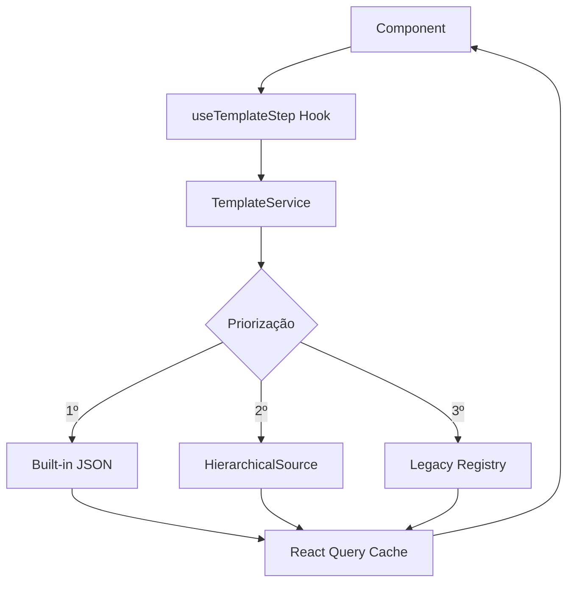

# Sistema de Templates - Documentação Completa

## 📋 Índice

1. [Visão Geral](#visão-geral)
2. [Arquitetura](#arquitetura)
3. [Formato de Templates v3.1](#formato-de-templates-v31)
4. [Priorização de Fontes](#priorização-de-fontes)
5. [React Query Hooks](#react-query-hooks)
6. [Validação Zod](#validação-zod)
7. [Importação e Exportação](#importação-e-exportação)
8. [Exemplos de Uso](#exemplos-de-uso)
9. [Troubleshooting](#troubleshooting)

---

## 🎯 Visão Geral

O sistema de templates v3.1 fornece uma arquitetura robusta para gerenciamento de templates de quiz com:

- **Templates JSON Built-in**: Carregados em build-time via `import.meta.glob`
- **Templates TypeScript**: Fallback para templates legados
- **Validação Zod**: Type-safe validation com mensagens de erro detalhadas
- **React Query Hooks**: Cache automático e AbortSignal support
- **Import/Export UI**: Interface para importar e exportar templates JSON

### Benefícios

- ✅ **Type-safe**: TypeScript + Zod garantem estruturas válidas
- ✅ **Performance**: Build-time loading e React Query cache
- ✅ **Cancelável**: AbortSignal em todas operações async
- ✅ **Extensível**: Sistema de priorização permite múltiplas fontes
- ✅ **User-friendly**: UI de import/export com validação visual

---

## 🏗️ Arquitetura

### Estrutura de Diretórios

```
src/
├── services/
│   ├── canonical/
│   │   ├── TemplateService.ts      # Service principal com 3-tier prioritization
│   │   └── types.ts                # ServiceOptions, ServiceResult, etc.
│   ├── templates/
│   │   └── builtInTemplates.ts     # Loader de JSON via import.meta.glob
│   └── hooks/
│       ├── templateKeys.ts         # Query key factory para React Query
│       ├── useTemplateStep.ts      # Hook para carregar steps
│       ├── usePrepareTemplate.ts   # Hook para preparar templates
│       └── usePreloadTemplate.ts   # Hook para preload
├── schemas/
│   └── templateSchema.ts           # Zod schemas e validation functions
├── templates/
│   ├── registry.ts                 # Registry com loadFullTemplate()
│   ├── quiz21StepsComplete.json    # Template JSON exportado
│   └── quiz21StepsComplete.ts      # Template TypeScript (legacy)
├── components/
│   └── editor/
│       └── quiz/
│           ├── dialogs/
│           │   └── ImportTemplateDialog.tsx  # UI de importação
│           └── QuizModularEditor/
│               └── index.tsx        # Editor com botão de import
└── scripts/
    └── exportTemplatesToJson.ts    # Script TS→JSON converter
```

### Fluxo de Dados



---

## 📄 Formato de Templates v3.1

### Estrutura Completa

```typescript
{
  "metadata": {
    "id": "quiz21StepsComplete",
    "name": "Quiz Completo 21 Steps",
    "description": "Template com 21 etapas",
    "version": "3.1",
    "totalSteps": 21,
    "category": "quiz",
    "tags": ["completo", "21-steps"],
    "author": "Sistema",
    "createdAt": "2025-11-07T00:00:00Z",
    "updatedAt": "2025-11-07T00:00:00Z"
  },
  "steps": {
    "step-01-intro": {
      "templateVersion": "3.1",
      "metadata": {
        "id": "step-01-intro",
        "name": "Introdução",
        "description": "Tela inicial do quiz",
        "category": "intro",
        "tags": ["intro", "welcome"],
        "order": 1
      },
      "blocks": [
        {
          "id": "intro-logo",
          "type": "IntroLogo",
          "order": 0,
          "config": {
            "imageUrl": "/logo.png",
            "altText": "Logo"
          }
        },
        {
          "id": "intro-title",
          "type": "IntroTitle",
          "order": 1,
          "config": {
            "text": "Bem-vindo ao Quiz",
            "fontSize": 32,
            "fontWeight": "bold"
          }
        }
      ]
    }
  }
}
```

### Campos Obrigatórios

#### Template Metadata
- `id` (string): Identificador único do template
- `name` (string): Nome legível do template

#### Step Metadata
- `id` (string): Identificador único da step
- `name` (string): Nome legível da step

#### Block
- `id` (string): Identificador único do bloco
- `type` (string): Tipo do bloco (IntroLogo, IntroTitle, etc.)

### Campos Opcionais

- `description`: Descrição textual
- `version`: Versão do template (default: "3.1")
- `totalSteps`: Número total de steps
- `category`: Categoria (quiz, survey, form)
- `tags`: Array de tags
- `order`: Ordem de exibição
- `config/properties/content`: Configurações específicas do bloco

---

## 🎯 Priorização de Fontes

O `TemplateService` usa um sistema de 3 níveis de priorização:

### 1️⃣ Built-in JSON (Prioridade 1)

**Quando usar:**
- Templates estáveis e prontos para produção
- Performance crítica (build-time loading)
- Distribuição com a aplicação

**Como funciona:**
```typescript
// src/services/templates/builtInTemplates.ts
const templates = import.meta.glob('/src/templates/*.json', { eager: true });

export function getBuiltInTemplateById(id: string): any | null {
  const key = `/src/templates/${id}.json`;
  return templates[key]?.default || null;
}
```

**Vantagens:**
- ⚡ Zero latência (bundle includes)
- 📦 Versionado com código
- 🔒 Imutável (só muda com deploy)

### 2️⃣ Hierarchical Source (Prioridade 2)

**Quando usar:**
- Templates dinâmicos vindos de API
- Templates personalizados por usuário
- A/B testing de templates

**Como funciona:**
```typescript
const result = await hierarchicalTemplateSource.getStepBlocks(stepId, templateId);
```

**Vantagens:**
- 🌐 Atualização sem redeploy
- 👤 Personalização por usuário
- 🔄 Sincronização com backend

### 3️⃣ Legacy Registry (Prioridade 3)

**Quando usar:**
- Fallback para templates antigos
- Desenvolvimento local
- Migração gradual

**Como funciona:**
```typescript
import { loadFullTemplate } from '@/templates/registry';
const template = await loadFullTemplate(templateId);
```

**Vantagens:**
- 🔧 Desenvolvimento rápido
- 🔄 Compatibilidade retroativa
- 📝 TypeScript type inference

---

## 🪝 React Query Hooks

### useTemplateStep

Carrega um step individual com cache automático.

```typescript
import { useTemplateStep } from '@/services/hooks';

function MyComponent() {
  const { data: blocks, isLoading, error } = useTemplateStep('step-01-intro', {
    templateId: 'quiz21StepsComplete',
    staleTime: 5 * 60 * 1000, // 5 minutos
    onSuccess: (blocks) => console.log('Loaded', blocks.length, 'blocks'),
  });

  if (isLoading) return <Loading />;
  if (error) return <Error message={error.message} />;
  
  return <StepRenderer blocks={blocks} />;
}
```

**Opções:**
- `templateId`: ID do template (opcional, usa default se omitido)
- `enabled`: Habilita/desabilita query (default: true)
- `staleTime`: Tempo antes de considerar stale (default: 5min)
- `cacheTime`: Tempo de garbage collection (default: 30min)
- `retry`: Número de tentativas em erro (default: 3)
- `onSuccess/onError`: Callbacks

### useTemplateSteps

Carrega múltiplos steps em paralelo.

```typescript
const { data: stepsData, isLoading, error } = useTemplateSteps(
  ['step-01-intro', 'step-02-question', 'step-03-result'],
  { templateId: 'quiz21StepsComplete' }
);

// stepsData é um array de { stepId, blocks, isLoading, error }
```

### usePrefetchTemplateStep

Prefetch em background para melhorar UX.

```typescript
const prefetchStep = usePrefetchTemplateStep();

// Prefetch próximo step ao montar componente
useEffect(() => {
  prefetchStep('step-02-question', { templateId: 'quiz21StepsComplete' });
}, []);
```

### usePrepareTemplate

Prepara template carregando metadata e opcionalmente todos os steps.

```typescript
const { mutate: prepareTemplate, isPending } = usePrepareTemplate({
  onSuccess: () => console.log('Template preparado!'),
  onError: (error) => console.error('Erro:', error),
});

// Preparar com preload de todos os steps
prepareTemplate({
  templateId: 'quiz21StepsComplete',
  options: { preloadAll: true }
});
```

### usePreloadTemplate

Preload completo de template em background.

```typescript
const { mutate: preloadTemplate } = usePreloadTemplate();

// Iniciar preload ao entrar na página
useEffect(() => {
  preloadTemplate({ templateId: 'quiz21StepsComplete' });
}, []);
```

### Query Keys

Para invalidação manual de cache:

```typescript
import { templateKeys } from '@/services/hooks';
import { useQueryClient } from '@tanstack/react-query';

const queryClient = useQueryClient();

// Invalidar todas queries de templates
queryClient.invalidateQueries({ queryKey: templateKeys.all });

// Invalidar steps de um template específico
queryClient.invalidateQueries({ queryKey: templateKeys.steps('quiz21StepsComplete') });

// Invalidar step específico
queryClient.invalidateQueries({ queryKey: templateKeys.step('quiz21StepsComplete', 'step-01-intro') });
```

---

## ✅ Validação Zod

### Validar Template Completo

```typescript
import { validateTemplate } from '@/schemas/templateSchema';

const jsonData = JSON.parse(fileContent);
const result = validateTemplate(jsonData);

if (result.success) {
  console.log('✅ Template válido:', result.data);
  
  // Warnings opcionais
  if (result.warnings) {
    console.warn('⚠️ Avisos:', result.warnings);
  }
} else {
  console.error('❌ Erros de validação:', result.errors);
  // ["metadata.id: String must contain at least 1 character(s)"]
}
```

### Validar Step Individual

```typescript
import { validateStep } from '@/schemas/templateSchema';

const stepData = {
  metadata: { id: 'step-01', name: 'Intro' },
  blocks: [{ id: 'block-1', type: 'IntroLogo' }]
};

const result = validateStep(stepData);
```

### Type Guards

```typescript
import { isValidTemplate, safeParseTemplate } from '@/schemas/templateSchema';

// Type guard
if (isValidTemplate(data)) {
  // TypeScript sabe que data é Template
  console.log(data.metadata.id);
}

// Safe parse (retorna null em erro)
const template = safeParseTemplate(data);
if (template) {
  console.log('Válido:', template.metadata.name);
}
```

### Normalização

```typescript
import { normalizeTemplate } from '@/schemas/templateSchema';

const template = normalizeTemplate(partialTemplate);
// Preenche campos opcionais com defaults:
// - version: "3.1"
// - totalSteps: calculado automaticamente
// - tags: []
```

---

## 📤 Importação e Exportação

### Exportar Template TS → JSON

**Via CLI:**

```bash
# Exportar template específico
npm run export-templates -- --template=quiz21StepsComplete

# Exportar todos os templates
npm run export-templates:all

# Modo verbose com logs detalhados
npm run export-templates:verbose -- --template=quiz21StepsComplete

# Custom output directory
npm run export-templates -- --template=quiz21StepsComplete --output=./custom-dir
```

**Programaticamente:**

```typescript
import { exportTemplateToJson } from './scripts/exportTemplatesToJson';

await exportTemplateToJson('quiz21StepsComplete', './src/templates');
```

### Importar Template JSON

**Via UI (QuizModularEditor):**

1. Clique no botão "Importar JSON" no header
2. Selecione arquivo JSON ou arraste para a área de drop
3. Preview do template aparece com validação
4. Clique "Importar Template Completo" ou "Importar Step Única"

**Programaticamente:**

```typescript
import { ImportTemplateDialog } from '@/components/editor/quiz/dialogs/ImportTemplateDialog';

<ImportTemplateDialog
  open={isDialogOpen}
  onClose={() => setIsDialogOpen(false)}
  onImport={(template, stepId) => {
    if (stepId) {
      // Importar apenas uma step
      const step = template.steps[stepId];
      setStepBlocks(step.blocks || step);
    } else {
      // Importar template completo
      // Lógica customizada aqui
    }
  }}
/>
```

---

## 💡 Exemplos de Uso

### Exemplo 1: Carregar Step ao Montar Componente

```typescript
import { useTemplateStep } from '@/services/hooks';

function StepEditor({ stepId }: { stepId: string }) {
  const { data: blocks, isLoading, error } = useTemplateStep(stepId, {
    templateId: 'quiz21StepsComplete',
  });

  if (isLoading) return <Skeleton />;
  if (error) return <ErrorBanner error={error} />;

  return <BlocksEditor blocks={blocks} />;
}
```

### Exemplo 2: Preload ao Navegar

```typescript
import { usePrefetchTemplateStep } from '@/services/hooks';

function QuizNavigation({ currentStep, steps }: Props) {
  const prefetchStep = usePrefetchTemplateStep();
  
  const handleNext = () => {
    const nextIndex = steps.indexOf(currentStep) + 1;
    
    if (nextIndex < steps.length) {
      // Prefetch próximo step antes de navegar
      prefetchStep(steps[nextIndex]);
      
      // Navegar após prefetch iniciar
      navigate(steps[nextIndex]);
    }
  };

  return <Button onClick={handleNext}>Próximo</Button>;
}
```

### Exemplo 3: Importar e Validar JSON

```typescript
import { validateTemplate } from '@/schemas/templateSchema';

async function handleFileUpload(file: File) {
  const text = await file.text();
  const json = JSON.parse(text);
  
  const result = validateTemplate(json);
  
  if (!result.success) {
    setErrors(result.errors);
    return;
  }
  
  if (result.warnings) {
    setWarnings(result.warnings);
  }
  
  // Template válido - importar
  await importTemplate(result.data);
}
```

### Exemplo 4: Carregar Template com Fallback

```typescript
import { templateService } from '@/services/canonical/TemplateService';

async function loadStepWithFallback(stepId: string) {
  // Tenta carregar de built-in JSON, depois API, depois registry
  const result = await templateService.getStep(stepId, 'quiz21StepsComplete');
  
  if (!result.success) {
    console.error('Erro ao carregar step:', result.error);
    return getDefaultBlocks(); // Fallback
  }
  
  return result.data;
}
```

---

## 🔧 Troubleshooting

### Problema: Template não carrega (404)

**Sintomas:**
```
Error loading step: step-01-intro not found
```

**Solução:**
1. Verificar se JSON existe em `src/templates/`
2. Rodar `npm run export-templates:all` para gerar JSONs
3. Verificar `metadata.id` no JSON corresponde ao templateId

### Problema: Validação falha com erros criptográficos

**Sintomas:**
```
metadata.id: String must contain at least 1 character(s)
```

**Solução:**
1. Verificar estrutura do JSON com template schema
2. Usar `validateTemplate()` para ver todos os erros
3. Comparar com exemplo em `quiz21StepsComplete.json`

### Problema: React Query não atualiza

**Sintomas:**
- Hook retorna dados antigos
- Edições não aparecem

**Solução:**
```typescript
import { useQueryClient } from '@tanstack/react-query';
import { templateKeys } from '@/services/hooks';

const queryClient = useQueryClient();

// Invalidar cache após edição
queryClient.invalidateQueries({ 
  queryKey: templateKeys.step(templateId, stepId) 
});
```

### Problema: AbortSignal não cancela operação

**Sintomas:**
- Requests continuam após unmount
- Memory leaks

**Solução:**
- React Query gerencia AbortSignal automaticamente
- Não passar `signal` manualmente aos hooks
- Para uso direto do service, criar AbortController:

```typescript
const controller = new AbortController();

templateService.getStep(stepId, templateId, { 
  signal: controller.signal 
});

// Cancelar
controller.abort();
```

### Problema: Import JSON não funciona no editor

**Sintomas:**
- Botão não aparece
- Dialog não abre

**Solução:**
1. Verificar se `ImportTemplateDialog` está importado
2. Verificar estados `isImportDialogOpen` e handlers
3. Verificar console para erros de validação

```typescript
// Adicionar log para debug
const handleImportTemplate = (template: Template, stepId?: string) => {
  console.log('Importing:', { template, stepId });
  
  // ... resto do código
};
```

---

## 📚 Recursos Adicionais

### Arquivos de Referência

- `src/services/canonical/TemplateService.ts` - Service principal
- `src/schemas/templateSchema.ts` - Schemas Zod
- `src/components/editor/quiz/dialogs/ImportTemplateDialog.tsx` - UI de import
- `scripts/exportTemplatesToJson.ts` - Script de export

### Tipos TypeScript

```typescript
import type {
  Template,
  Step,
  Block,
  TemplateMetadata,
  StepMetadata,
  ValidationResult,
} from '@/schemas/templateSchema';

import type {
  ServiceResult,
  ServiceOptions,
} from '@/services/canonical/types';
```

### NPM Scripts

```json
{
  "export-templates": "tsx scripts/exportTemplatesToJson.ts",
  "export-templates:all": "tsx scripts/exportTemplatesToJson.ts --all",
  "export-templates:verbose": "tsx scripts/exportTemplatesToJson.ts --verbose"
}
```

---

## 🎓 Conclusão

O sistema de templates v3.1 oferece uma solução completa e escalável para gerenciamento de templates com:

- **Type-safety** via TypeScript + Zod
- **Performance** via build-time loading e React Query cache
- **Flexibilidade** via sistema de priorização 3-tier
- **UX** via import/export UI com validação visual
- **Manutenibilidade** via código bem documentado e testado

Para dúvidas ou contribuições, consulte o README principal do projeto.

---

**Última atualização:** 2025-11-07  
**Versão do sistema:** 3.1  
**Autor:** Sistema QuizFlow Pro
