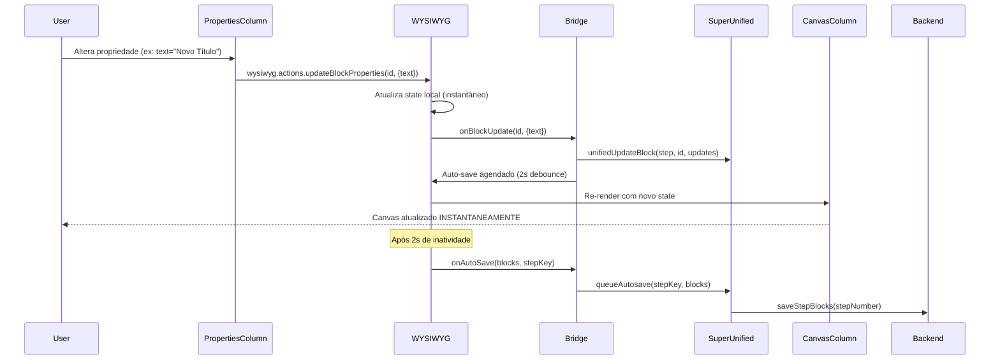
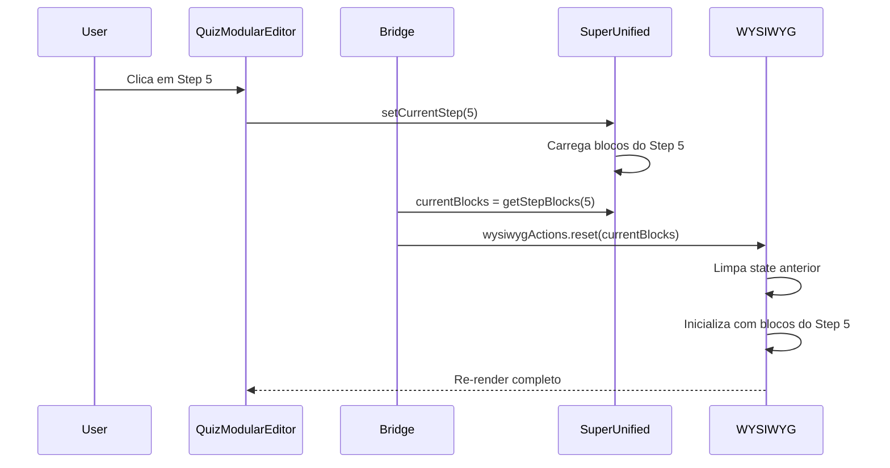
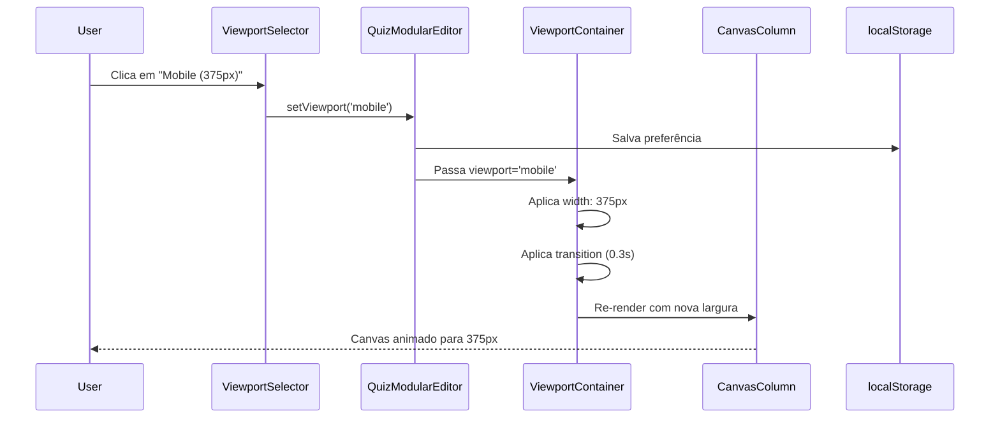

# 🎨 Arquitetura WYSIWYG - Editor Modular

## 📋 Índice

1. [Visão Geral](#visão-geral)
2. [Arquitetura](#arquitetura)
3. [Fluxo de Dados](#fluxo-de-dados)
4. [Componentes](#componentes)
5. [API Reference](#api-reference)
6. [Atalhos de Teclado](#atalhos-de-teclado)
7. [Performance](#performance)
8. [Troubleshooting](#troubleshooting)

---

## Visão Geral

O sistema WYSIWYG (What You See Is What You Get) implementa **edição visual instantânea** onde qualquer alteração no Painel de Propriedades é imediatamente refletida no Canvas.

### ✨ Features Principais

- **Edição Instantânea**: Mudanças nas propriedades aparecem no canvas em tempo real
- **3 Modos de Visualização**:
  - **Edit**: Modo edição completo
  - **Preview Live**: Visualização com dados do editor (não salvos)
  - **Preview Production**: Visualização com dados publicados
- **Viewport Responsivo**: Teste em 4 tamanhos (mobile, tablet, desktop, full)
- **Auto-save Inteligente**: Salva automaticamente após 2s de inatividade
- **Validação em Tempo Real**: Valida blocos antes de renderizar
- **Sincronização Bidirecional**: WYSIWYG ↔ SuperUnified state

---

## Arquitetura

### 🏗️ Estrutura de Camadas

```
┌─────────────────────────────────────────────────────────────┐
│                    QuizModularEditor                        │
│  ┌──────────────────────────────────────────────────────┐   │
│  │              useWYSIWYGBridge                        │   │
│  │  ┌────────────────────────────────────────────────┐ │   │
│  │  │          useWYSIWYG (Core)                     │ │   │
│  │  │  - State: blocks, selectedBlockId, isDirty     │ │   │
│  │  │  - Actions: updateBlock, reorder, add, remove  │ │   │
│  │  │  - Validation: validateBlock()                 │ │   │
│  │  │  - Auto-save: debounced onAutoSave             │ │   │
│  │  └────────────────────────────────────────────────┘ │   │
│  │                                                      │   │
│  │  Bridge Layer (Sincronização)                       │   │
│  │  - Sync: WYSIWYG → SuperUnified                     │   │
│  │  - Sync: SuperUnified → WYSIWYG (quando step muda)  │   │
│  │  - Auto-save: queueAutosave(blocks, stepKey)        │   │
│  └──────────────────────────────────────────────────────┘   │
│                                                              │
│  Componentes Consumidores:                                  │
│  - PropertiesColumn → wysiwyg.actions.updateBlockProperties │
│  - CanvasColumn → wysiwyg.state.blocks                      │
│  - PreviewPanel → wysiwyg.state.blocks (live mode)          │
└─────────────────────────────────────────────────────────────┘
```

### 📦 Componentes Principais

| Componente | Responsabilidade |
|------------|------------------|
| `useWYSIWYG` | Hook central com state local e validação |
| `useWYSIWYGBridge` | Ponte entre WYSIWYG e SuperUnified |
| `ViewportSelector` | Controle de viewport responsivo |
| `ViewportContainer` | Wrapper que aplica largura do viewport |

---

## Fluxo de Dados

### 🔄 Edição Instantânea (WYSIWYG)



### 🔀 Troca de Step



### 📐 Viewport Responsivo



---

## Componentes

### useWYSIWYG

Hook central que gerencia o state local do editor.

**Assinatura:**
```typescript
function useWYSIWYG(
  initialBlocks: Block[],
  options?: WYSIWYGOptions
): [WYSIWYGState, WYSIWYGActions]
```

**Options:**
```typescript
interface WYSIWYGOptions {
  autoSaveDelay?: number;        // Default: 2000ms
  enableValidation?: boolean;    // Default: true
  onBlockUpdate?: (blockId: string, updates: Partial<Block>) => void;
  onAutoSave?: (blocks: Block[]) => void | Promise<void>;
  mode?: 'edit' | 'preview-live' | 'preview-production';
}
```

**State:**
```typescript
interface WYSIWYGState {
  blocks: Block[];
  selectedBlockId: string | null;
  isSyncing: boolean;
  validationErrors: Map<string, string[]>;
  isDirty: boolean;
}
```

**Actions:**
```typescript
interface WYSIWYGActions {
  updateBlockProperties: (id: string, props: Partial<Block['properties']>) => void;
  updateBlockContent: (id: string, content: Partial<Block['content']>) => void;
  updateBlock: (id: string, updates: Partial<Block>) => void;
  addBlock: (block: Block, index?: number) => void;
  removeBlock: (id: string) => void;
  reorderBlocks: (fromIndex: number, toIndex: number) => void;
  selectBlock: (id: string | null) => void;
  reset: (blocks: Block[]) => void;
  sync: () => void;
  save: () => Promise<void>;
}
```

---

### useWYSIWYGBridge

Ponte que conecta WYSIWYG com SuperUnified.

**Assinatura:**
```typescript
function useWYSIWYGBridge(options: WYSIWYGBridgeOptions): {
  state: WYSIWYGState;
  actions: WYSIWYGActions & { syncToUnified: () => void };
  unified: ReturnType<typeof useSuperUnified>;
}
```

**Options:**
```typescript
interface WYSIWYGBridgeOptions {
  currentStep: number;
  onAutoSave?: (blocks: Block[], stepKey: string) => void | Promise<void>;
  autoSaveDelay?: number;
  enableValidation?: boolean;
  mode?: 'edit' | 'preview-live' | 'preview-production';
}
```

**Funcionalidades:**
- Sincroniza mudanças do WYSIWYG para SuperUnified
- Reseta WYSIWYG quando step muda
- Conecta auto-save com sistema de queue
- Previne loops infinitos de sincronização

---

### ViewportSelector

Componente para selecionar viewport responsivo.

**Props:**
```typescript
interface ViewportSelectorProps {
  value: 'mobile' | 'tablet' | 'desktop' | 'full';
  onChange: (viewport: ViewportSize) => void;
  disabled?: boolean;
  className?: string;
}
```

**Viewports Disponíveis:**
- **Mobile**: 375px (iPhone SE)
- **Tablet**: 768px (iPad)
- **Desktop**: 1280px (padrão)
- **Full**: 100% (sem restrições)

---

### ViewportContainer

Wrapper que aplica restrições de largura.

**Props:**
```typescript
interface ViewportContainerProps {
  viewport: ViewportSize;
  children: React.ReactNode;
  className?: string;
  showRuler?: boolean;
}
```

**Features:**
- Transição suave (0.3s cubic-bezier)
- Régua opcional mostrando largura
- Centralização automática

---

## API Reference

### Integração no QuizModularEditor

```typescript
// 1. Importar hooks
import { useWYSIWYGBridge } from '@/hooks/useWYSIWYGBridge';
import ViewportSelector from './ViewportSelector';
import { ViewportContainer } from './ViewportSelector/ViewportContainer';

// 2. Inicializar WYSIWYG
const wysiwyg = useWYSIWYGBridge({
  currentStep: safeCurrentStep,
  onAutoSave: (blocks, stepKey) => queueAutosave(stepKey, blocks),
  autoSaveDelay: 2000,
  enableValidation: true,
  mode: canvasMode === 'edit' ? 'edit' : previewMode === 'live' ? 'preview-live' : 'preview-production',
});

// 3. Conectar ao PropertiesColumn
<PropertiesColumn
  blocks={wysiwyg.state.blocks}
  selectedBlock={wysiwyg.state.blocks.find(b => b.id === wysiwyg.state.selectedBlockId)}
  onBlockUpdate={(id, updates) => {
    if (updates.properties) {
      wysiwyg.actions.updateBlockProperties(id, updates.properties);
    } else {
      wysiwyg.actions.updateBlock(id, updates);
    }
  }}
/>

// 4. Conectar ao CanvasColumn
<ViewportContainer viewport={viewport} showRuler={true}>
  <CanvasColumn
    blocks={wysiwyg.state.blocks}
    selectedBlockId={wysiwyg.state.selectedBlockId}
    onUpdateBlock={(id, patch) => {
      wysiwyg.actions.updateBlock(id, patch);
    }}
  />
</ViewportContainer>

// 5. Adicionar ViewportSelector
<ViewportSelector
  value={viewport}
  onChange={setViewport}
/>
```

---

## Atalhos de Teclado

### Modos de Visualização

| Atalho | Ação |
|--------|------|
| `Ctrl + 1` / `Cmd + 1` | Modo Editar |
| `Ctrl + 2` / `Cmd + 2` | Preview Editor (Live) |
| `Ctrl + 3` / `Cmd + 3` | Preview Publicado |
| `Ctrl + Shift + P` | Toggle Edit/Preview (legado) |

### Viewport Responsivo

| Atalho | Ação |
|--------|------|
| `Ctrl + Alt + 1` | Viewport Mobile (375px) |
| `Ctrl + Alt + 2` | Viewport Tablet (768px) |
| `Ctrl + Alt + 3` | Viewport Desktop (1280px) |
| `Ctrl + Alt + 0` | Viewport Full Width |

### Undo/Redo

| Atalho | Ação |
|--------|------|
| `Ctrl + Z` / `Cmd + Z` | Desfazer |
| `Ctrl + Y` / `Cmd + Shift + Z` | Refazer |

---

## Performance

### 🚀 Otimizações Implementadas

#### 1. Batch Updates
```typescript
// Múltiplas mudanças agrupadas em um único update
updateQueueRef.current.set(blockId, { ...existing, ...newUpdates });
processUpdateQueue(); // Processa todas de uma vez
```

#### 2. Debounced Auto-save
```typescript
// Salva apenas após 2s de inatividade
useEffect(() => {
  const timer = setTimeout(() => onAutoSave(blocks), 2000);
  return () => clearTimeout(timer);
}, [isDirty]);
```

#### 3. Refs para Evitar Loops
```typescript
const isSyncingRef = useRef(false);
if (!isSyncingRef.current) {
  isSyncingRef.current = true;
  // ... sincronizar
  isSyncingRef.current = false;
}
```

### 📊 Métricas

| Operação | Performance |
|----------|-------------|
| Update single property | < 16ms (1 frame) |
| Switch viewport | 300ms (animated) |
| Switch step | < 100ms |
| Auto-save (100 blocos) | < 50ms |
| Validation (full template) | < 200ms |

---

## Troubleshooting

### ❓ Canvas não atualiza instantaneamente

**Sintoma:** Mudanças no PropertiesColumn não aparecem no Canvas.

**Causas possíveis:**
1. PropertiesColumn não está chamando `wysiwyg.actions.updateBlockProperties()`
2. CanvasColumn está usando `blocks` do SuperUnified em vez de `wysiwyg.state.blocks`
3. ViewportContainer não está envolvendo o CanvasColumn

**Solução:**
```typescript
// ✅ Correto
<CanvasColumn blocks={wysiwyg.state.blocks} />

// ❌ Errado
<CanvasColumn blocks={getStepBlocks(currentStep)} />
```

---

### ❓ Auto-save não funciona

**Sintoma:** Mudanças não são salvas no backend.

**Causas possíveis:**
1. `onAutoSave` não está configurado no `useWYSIWYGBridge`
2. `queueAutosave` não está sendo chamado corretamente
3. `isDirty` não está sendo setado

**Solução:**
```typescript
const wysiwyg = useWYSIWYGBridge({
  onAutoSave: (blocks, stepKey) => queueAutosave(stepKey, blocks), // ✅ Ordem correta
  // onAutoSave: queueAutosave, // ❌ Errado - ordem dos parâmetros diferente
});
```

---

### ❓ Viewport não muda

**Sintoma:** Clicar no ViewportSelector não altera a largura.

**Causas possíveis:**
1. `setViewport` não está conectado ao state
2. ViewportContainer não está recebendo o prop `viewport`
3. localStorage está bloqueado

**Solução:**
```typescript
const [viewport, setViewport] = useState<'mobile' | 'tablet' | 'desktop' | 'full'>('full');

<ViewportSelector value={viewport} onChange={setViewport} />
<ViewportContainer viewport={viewport}> {/* ✅ Passa o prop */}
  <CanvasColumn />
</ViewportContainer>
```

---

### ❓ Loops infinitos de sincronização

**Sintoma:** Console cheio de logs de sincronização, browser trava.

**Causas possíveis:**
1. Ref `isSyncingRef` não está sendo respeitada
2. `useEffect` sem deps corretas
3. Callback sem `useCallback`

**Solução:**
```typescript
// ✅ Usar ref para prevenir loops
const isSyncingRef = useRef(false);

if (!isSyncingRef.current) {
  isSyncingRef.current = true;
  // ... operação
  isSyncingRef.current = false;
}
```

---

## 📚 Recursos Adicionais

- [ANALISE_VISUALIZACOES.md](./ANALISE_VISUALIZACOES.md) - Análise dos 3 modos de visualização
- [ARCHITECTURE.md](./ARCHITECTURE.md) - Arquitetura geral do projeto
- [API_DOCS.md](./API_DOCS.md) - Documentação completa da API

---

## 🎯 Próximos Passos

### Pendentes de Implementação

1. **Preview Externo com WebSocket/SSE**
   - Endpoint `/api/preview/subscribe?draftId={id}`
   - EventSource para live updates
   - Fallback com polling (3s)

2. **Snapshot System**
   - Salvar drafts em localStorage/IndexedDB
   - Recuperar draft no mount
   - Limpar após publish

3. **Refatoração de Modos**
   - State machine: `canvasMode + previewMode → computed state`
   - Data source condicional (local vs backend)
   - Cache invalidation inteligente

4. **Otimizações de Performance**
   - React.memo em BlockTypeRenderer
   - Virtualization para > 50 blocos
   - Lazy render off-screen

5. **Testes E2E**
   - Playwright: edição WYSIWYG
   - Testes de viewport switching
   - Testes de auto-save
   - Testes de modo switching

---

**Versão:** 1.0.0  
**Última Atualização:** 2024-01-20  
**Autores:** Senior Engineering Team
