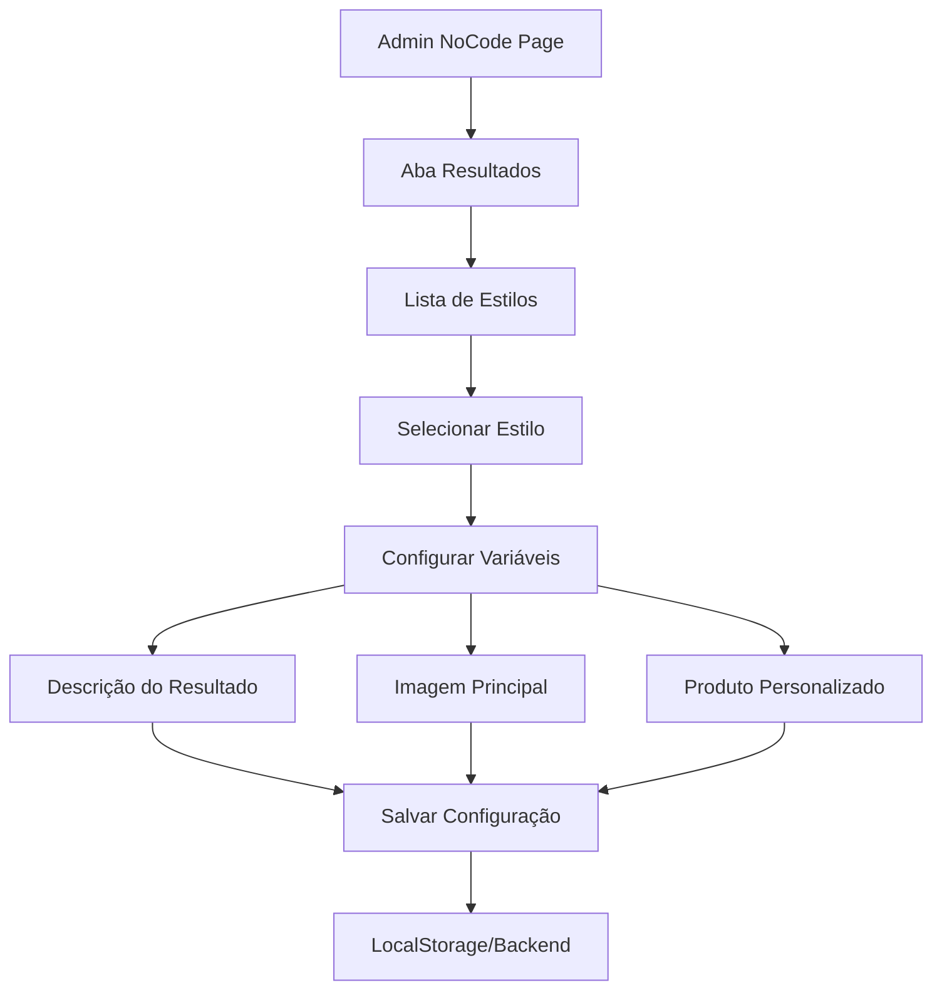

# 🎛️ **ANÁLISE: CONFIGURAÇÃO NO-CODE PARA RESULTADOS**

## 📊 **ESTRUTURA ATUAL DO SISTEMA NO-CODE**

### 🏗️ **1. ARQUITETURA IDENTIFICADA**

#### **A) Página Principal NoCode**: `/admin/no-code-config`
```typescript
// NoCodeConfigPage.tsx (1174 linhas)
interface NoCodeComponents {
  ✅ SEO Settings: title, description, keywords, ogImage
  ✅ Domain Settings: customDomain, subdomain, protocol
  ✅ Pixel Settings: Facebook, Google Analytics, GTM
  ✅ Publishing Settings: storage, CDN, backup
  ✅ Funnel Settings: theme, colors, fonts, logo
  ✅ Step20 Settings: página de resultados específica
}
```

#### **B) Painel de Configuração de Resultados**:
```typescript
// ResultConfigurationPanel.tsx (548 linhas)
interface ResultConfiguration {
  ✅ Seleção de Estilo: lista de todos os estilos disponíveis
  ✅ Configuração por Estilo: descrição, imagens, produtos
  ✅ Variáveis Personalizadas: 3 tipos principais
  ✅ Preview em Tempo Real: visualização das mudanças
  ✅ Salvamento Individual: por estilo configurado
}
```

### 🎯 **2. FLUXO DE CONFIGURAÇÃO DE RESULTADOS**



### 🔧 **3. COMPONENTES ESPECIALIZADOS**

#### **A) StepConfigurationPanel** - Configuração de Etapas
- Comportamento por etapa (auto-avanço, delay, validação)
- Fluxo condicional entre etapas  
- Validações específicas por tipo de input

#### **B) ResultConfigurationPanel** - Configuração de Resultados
- **PRINCIPAL**: Configuração NoCode de variáveis de resultado
- Lista de estilos disponíveis (Elegante, Moderno, etc.)
- 3 tipos de configuração por estilo:
  - **Descrição**: texto personalizado do resultado
  - **Imagem Principal**: foto do resultado/estilo
  - **Produto Personalizado**: guias específicos de estilo

#### **C) HeaderConfigurationPanel** - Configuração de Cabeçalho
- Logo, cores, tipografia
- Links de navegação
- Configurações visuais globais

### 💾 **4. ARMAZENAMENTO DE DADOS**

#### **LocalStorage Structure**:
```javascript
// Configuração geral NoCode
'quiz-nocode-config': {
  seo: { title, description, keywords },
  domain: { customDomain, subdomain },
  pixel: { facebookPixelId, googleAnalyticsId },
  publishing: { storage, backup, cdnUrl }
}

// Configurações específicas por estilo
'result_config_Elegante': {
  categoria: 'Elegante',
  descricao: 'Texto personalizado para estilo elegante...',
  imagemPrincipal: 'https://...',
  imagemProduto: 'https://...'
}

// Hook específico para Step 20
'step20-configuration': {
  pageTitle: 'Seu Resultado',
  resultMessage: 'Parabéns!',
  backgroundType: 'gradient',
  showResultIcon: true
}
```

### 🎯 **5. HOOKS E SERVIÇOS**

#### **A) useStep20NoCodeIntegration**
```typescript
export const useStep20NoCodeIntegration = () => {
  // Gerencia configurações específicas da página de resultado
  // Integra com ResultConfigurationPanel
  return {
    configuration: step20Config,
    updateConfiguration: (updates) => void,
    saveConfiguration: () => Promise<boolean>
  };
};
```

#### **B) useQuizResultConfig**
```typescript
export const useQuizResultConfig = (category: string) => {
  // Gerencia configuração de resultado por categoria
  return {
    config: ResultPageConfig,
    updateConfig: (section, data) => void,
    saveConfig: () => Promise<boolean>,
    resetConfig: () => void
  };
};
```

### 📋 **6. VARIÁVEIS CONFIGURÁVEIS**

#### **Por Estilo de Resultado**:
| **Variável** | **Tipo** | **Propósito** | **Exemplo** |
|-------------|----------|---------------|-------------|
| **Descrição** | `string` | Texto do resultado personalizado | "Seu estilo é elegante e sofisticado..." |
| **Imagem Principal** | `URL` | Foto representativa do estilo | "https://cdn.../elegante-main.jpg" |
| **Imagem Produto** | `URL` | Guia de estilo personalizado | "https://cdn.../guia-elegante.pdf" |

#### **Configurações Globais**:
| **Seção** | **Variáveis** | **Impacto** |
|-----------|---------------|-------------|
| **SEO** | title, description, keywords | Meta tags de cada resultado |
| **Visual** | cores, fontes, logo | Aparência de todas as páginas |
| **Domínio** | subdomain, customDomain | URLs finais dos resultados |

### 🔄 **7. INTEGRAÇÃO COM PAINEL DE PROPRIEDADES**

#### **Conexão Atual**:
```typescript
// Como os resultados são configurados no NoCode
const resultConfig = useQuizResultConfig(selectedStyle);

// Como aparecem no painel de propriedades
const selectedBlock = {
  type: 'result-header',
  properties: {
    title: resultConfig.config.header.content.title,
    description: resultConfig.config.mainContent.content.description,
    image: resultConfig.config.header.style.backgroundImage
  }
};
```

### 🎯 **8. PADRÃO DE FUNCIONAMENTO IDENTIFICADO**

#### **FLUXO NOCODE → PROPRIEDADES**:

1. **NoCode Configuration** (`/admin/no-code-config`)
   - Usuário configura variáveis por estilo
   - Dados salvos no localStorage/backend
   - Configurações globais aplicadas

2. **Properties Panel** (editor visual)
   - Le configurações do NoCode
   - Popula campos automaticamente
   - Permite override manual se necessário

3. **Runtime Rendering**
   - Componentes usam configuração final
   - Precedência: override manual > NoCode > padrão

## 🔍 **9. IDENTIFICAÇÃO DO PROBLEMA**

### **POSSÍVEL CAUSA DA DESCONEXÃO**:

O painel de propriedades pode estar **não acessando** as configurações NoCode corretamente:

```typescript
// ❌ PROBLEMA POTENCIAL
// Se o selectedBlock não está carregando as configurações NoCode
const selectedBlock = {
  type: 'result-header',
  properties: {} // ← Vazio! Deveria vir do NoCode
};

// ✅ SOLUÇÃO ESPERADA  
const selectedBlock = {
  type: 'result-header', 
  properties: {
    title: noCodeConfig.results[currentStyle].titulo,
    description: noCodeConfig.results[currentStyle].descricao,
    image: noCodeConfig.results[currentStyle].imagemPrincipal
  }
};
```

### **PONTOS DE VERIFICAÇÃO**:

1. **Hook de carregamento**: useOptimizedUnifiedProperties está acessando NoCode?
2. **Hidratação de dados**: selectedBlock está sendo populado com configurações?
3. **Timing**: configurações NoCode são carregadas antes do painel renderizar?
4. **Storage access**: localStorage está sendo acessado corretamente?

---

## 🎯 **PRÓXIMO PASSO**

**ANTES DE CORRIGIR O PAINEL**: Verificar se a desconexão é causada pela **não integração** entre:
- Configurações NoCode salvas no localStorage 
- Hook useOptimizedUnifiedProperties que popula o painel
- Processo de hidratação do selectedBlock

**Isso pode explicar por que o painel está "desconectado da fonte de verdade"** - a fonte de verdade inclui as configurações NoCode que podem não estar sendo carregadas!