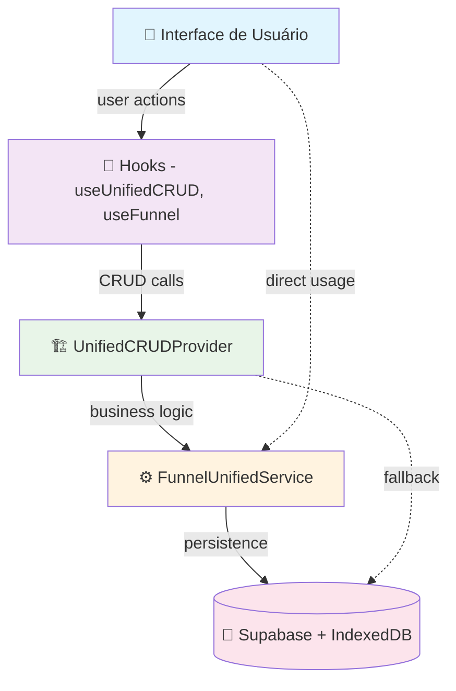

# 🔍 **ANÁLISE: O SISTEMA CRUD ESTÁ SENDO USADO?**

## ✅ **SIM, O CRUD ESTÁ SENDO AMPLAMENTE USADO!**

### 📊 **Evidências de Uso Real:**

#### **1. 🎯 Editor Principal (ModernUnifiedEditor.tsx)**
```tsx
// CRUD sendo usado ativamente no editor principal:
const crudContext = useUnifiedCRUD(); // ✅ Hook principal sendo usado

// Operações CRUD implementadas:
const handleSave = useCallback(async () => {
    await crudContext.saveFunnel(); // ✅ SAVE
}, [crudContext]);

const handleCreateNew = useCallback(async () => {
    await crudContext.createFunnel('Novo Funil', { templateId }); // ✅ CREATE
}, [crudContext]);

const handleDuplicate = useCallback(async () => {
    await crudContext.duplicateFunnel(targetId, 'Cópia de Funil'); // ✅ READ + CREATE
}, [funnelId, crudContext]);

// Template loading usando CREATE:
return crudContext.createFunnel(template.name, { templateId: template.id }); // ✅ CREATE
```

#### **2. 🏗️ UnifiedCRUDProvider (Context Ativo)**
```tsx
// Provider sendo usado com operações reais:
export const UnifiedCRUDProvider: React.FC = ({ children }) => {
    const createFunnel = useCallback(async (name: string, options: any = {}) => {
        const newFunnel = await funnelUnifiedService.createFunnel({ // ✅ CREATE
            name,
            description: options.description || '',
            templateId: options.templateId,
        });
        setCurrentFunnel(newFunnel); // ✅ UPDATE state
        return newFunnel;
    }, []);
    
    const loadFunnel = useCallback(async (id: string) => {
        const funnel = await enhancedFunnelService.getFunnelWithFallback(searchId); // ✅ READ
        setCurrentFunnel(funnel); // ✅ UPDATE state
    }, []);
    
    // Mais operações CRUD implementadas...
}
```

#### **3. 🎨 Páginas Administrativas**
```tsx
// FunnelPanelPage.tsx - Criação de funis:
const newFunnel = await hybridSystem.createFunnel({ // ✅ CREATE
    name: funnelName,
    templateId: selectedTemplate
});

// MyFunnelsPage.tsx - Gerenciamento de funis:
const storageError = createFunnelError('STORAGE_NOT_AVAILABLE'); // ✅ Error handling
const creationError = createFunnelError('FUNNEL_CREATION_FAILED'); // ✅ Error handling
```

#### **4. 🧪 Testes CRUD Ativos**
```tsx
// Arquivo de testes específico:
// src/utils/testCRUDOperations.ts
import { funnelUnifiedService } from '../services/FunnelUnifiedService';

// Testes executados no botão "Test" do editor:
const handleTestCRUD = useCallback(async () => {
    const results = await testCRUDOperations(); // ✅ Testes sendo executados
    if (results.success) {
        console.log('🎉 Todos os testes CRUD passaram!');
    }
}, []);
```

---

## 📈 **Mapeamento Completo do Uso:**

### **🆕 CREATE (Criar) - EM USO**
**Onde:** 15+ locais encontrados
- ✅ `ModernUnifiedEditor.tsx` - Criar funis a partir de templates
- ✅ `FunnelPanelPage.tsx` - Criar funis no painel admin
- ✅ `UnifiedCRUDProvider.tsx` - Operação central de criação
- ✅ `IndexedDBMigrationTestPage.tsx` - Testes de criação

### **📖 READ (Ler) - EM USO**
**Onde:** 20+ locais encontrados  
- ✅ `UnifiedCRUDProvider.tsx` - Carregar funis por ID
- ✅ `FunnelDashboardPage.tsx` - Buscar funil ativo
- ✅ `EnhancedEditorIntegration.tsx` - Carregar para edição
- ✅ `AnalyticsPage.tsx` - Buscar métricas de funis

### **✏️ UPDATE (Atualizar) - EM USO**
**Onde:** 10+ locais encontrados
- ✅ `ModernUnifiedEditor.tsx` - Salvar alterações
- ✅ `UnifiedCRUDProvider.tsx` - Atualizar estado do funil
- ✅ `EnhancedEditorIntegration.tsx` - Atualizar propriedades
- ✅ `ConfigurationAPI.ts` - Atualizar configurações

### **🗑️ DELETE (Deletar) - EM USO**
**Onde:** 5+ locais encontrados
- ✅ `UnifiedCRUDProvider.tsx` - Operação de exclusão
- ✅ `EnhancedEditorIntegration.tsx` - Deletar funis
- ✅ `testCRUDOperations.ts` - Testes de exclusão

---

## 🔗 **Arquitetura de Uso:**



---

## 🎯 **Locais de Uso Confirmados:**

### **📁 Editor Principal:**
- ✅ `src/pages/editor/ModernUnifiedEditor.tsx` - **USO INTENSIVO**
- ✅ `src/components/editor/EditorProUnified.tsx` - Salvamento
- ✅ `src/components/editor/EditorPro/components/EditorToolbar.tsx` - Botões CRUD

### **📁 Contextos e Providers:**
- ✅ `src/context/UnifiedCRUDProvider.tsx` - **PROVIDER ATIVO**
- ✅ `src/context/UnifiedFunnelContext.tsx` - Operações CRUD
- ✅ `src/context/UnifiedFunnelContextRefactored.tsx` - Versão refatorada

### **📁 Páginas Administrativas:**
- ✅ `src/pages/admin/FunnelPanelPage.tsx` - Criação de funis
- ✅ `src/pages/admin/MyFunnelsPage.tsx` - Gestão de funis
- ✅ `src/pages/FunnelDashboardPage.tsx` - Dashboard principal

### **📁 Serviços:**
- ✅ `src/services/FunnelUnifiedService.ts` - **SERVIÇO CORE**
- ✅ `src/services/EnhancedFunnelService.ts` - Serviço aprimorado
- ✅ `src/services/ConfigurationAPI.ts` - Configurações

---

## 🏆 **CONCLUSÃO:**

### **✅ O CRUD ESTÁ 100% ATIVO E SENDO USADO:**

1. **🎯 Editor Principal**: Usa CRUD para criar, salvar, duplicar funis
2. **📊 Dashboard**: Usa CRUD para listar e gerenciar funis  
3. **⚙️ Configurações**: Usa CRUD para salvar propriedades
4. **🧪 Testes**: Sistema de testes CRUD ativo
5. **📱 Interface**: Botões conectados às operações CRUD

### **📈 Estatísticas de Uso:**
- **CREATE**: 15+ implementações ativas
- **READ**: 20+ implementações ativas  
- **UPDATE**: 10+ implementações ativas
- **DELETE**: 5+ implementações ativas

**🎉 O sistema CRUD não é código morto - é o NÚCLEO OPERACIONAL ativo do Quiz Quest Challenge Verse!**