```mermaid
graph TD
    subgraph "QuizModular Architecture - Component Tree"
        QME[QuizModularEditor]
        QMPE[QuizModularProductionEditor]
        
        subgraph "Contexts Layer"
            EC[EditorContext ✅]
            QP[QuizProvider ⏸️]
            ABC[ABTestContext ❌]
        end
        
        subgraph "Hooks Layer"
            UES[useEditorState ✅]
            UBO[useBlockOperations ✅]
            UDS[useDndSystem ✅]
            UEP[useEditorPersistence 🔄]
            UQS[useQuizSync 📝]
        end
        
        subgraph "Components Layer"
            SNC[StepNavigatorColumn ✅]
            CC[CanvasColumn ✅]
            CLC[ComponentLibraryColumn ✅]
            PC[PropertiesColumn ✅]
            BP[BlockPreview ✅]
        end
        
        subgraph "Services Layer"
            UTR[UnifiedTemplateRegistry]
            SP[Supabase Persistence 📝]
            VS[Validation Service 📝]
            BS[Block Service]
        end
        
        subgraph "Schemas Layer"
            EBS[Enhanced Block Schemas ✅]
            SS[Step Schemas 📝]
            TS[Template Schema 📝]
        end
        
        subgraph "Data Layer"
            T21[quiz21-complete.json ✅]
            DB[(Supabase Database 📝)]
        end
    end
    
    %% Main connections
    QME --> EC
    QME --> QP
    QME --> UES
    QME --> UBO
    QME --> UDS
    QME --> UEP
    
    QMPE --> EC
    QMPE --> QP
    QMPE --> UES
    
    %% Component connections
    QME --> SNC
    QME --> CC
    QME --> CLC
    QME --> PC
    
    CC --> BP
    
    %% Hook to service connections
    UBO --> UTR
    UBO --> BS
    UEP --> SP
    UQS --> SP
    
    PC --> VS
    PC --> EBS
    
    %% Service to data connections
    UTR --> T21
    SP --> DB
    
    VS --> EBS
    VS --> SS
    VS --> TS
    
    %% Schema connections
    EBS -.validates.-> T21
    SS -.validates.-> T21
    TS -.validates.-> T21
    
    style QME fill:#e1f5ff,stroke:#0288d1,stroke-width:3px
    style QMPE fill:#fff3e0,stroke:#f57c00,stroke-width:3px
    
    style EC fill:#c8e6c9,stroke:#388e3c,stroke-width:2px
    style QP fill:#ffccbc,stroke:#e64a19,stroke-width:2px
    style ABC fill:#ffcdd2,stroke:#d32f2f,stroke-width:2px
    
    style UES fill:#c8e6c9,stroke:#388e3c,stroke-width:2px
    style UBO fill:#c8e6c9,stroke:#388e3c,stroke-width:2px
    style UDS fill:#c8e6c9,stroke:#388e3c,stroke-width:2px
    style UEP fill:#fff9c4,stroke:#fbc02d,stroke-width:2px
    style UQS fill:#e1bee7,stroke:#8e24aa,stroke-width:2px
    
    style SNC fill:#c8e6c9,stroke:#388e3c,stroke-width:2px
    style CC fill:#c8e6c9,stroke:#388e3c,stroke-width:2px
    style CLC fill:#c8e6c9,stroke:#388e3c,stroke-width:2px
    style PC fill:#c8e6c9,stroke:#388e3c,stroke-width:2px
    style BP fill:#c8e6c9,stroke:#388e3c,stroke-width:2px
    
    style EBS fill:#c8e6c9,stroke:#388e3c,stroke-width:2px
    style SS fill:#e1bee7,stroke:#8e24aa,stroke-width:2px
    style TS fill:#e1bee7,stroke:#8e24aa,stroke-width:2px
    
    style T21 fill:#c8e6c9,stroke:#388e3c,stroke-width:2px
    style SP fill:#e1bee7,stroke:#8e24aa,stroke-width:2px
    style VS fill:#e1bee7,stroke:#8e24aa,stroke-width:2px
    style DB fill:#e1bee7,stroke:#8e24aa,stroke-width:2px
```

# QuizModular Component Architecture Map

## Legend

| Symbol | Meaning |
|--------|---------|
| ✅ | Complete and functional |
| 🔄 | In progress with TODOs |
| ⏸️ | Not started but planned |
| ❌ | Missing or not found |
| 📝 | Design complete, implementation needed |

## Layer Descriptions

### 1. Main Editors
- **QuizModularEditor (New)**: Experimental modular editor with lazy loading
- **QuizModularProductionEditor (Current)**: Production editor (4,318 lines, needs refactoring)

### 2. Contexts Layer
Global state management:
- **EditorContext** ✅: Current step, dirty flag, undo/redo
- **QuizProvider** ⏸️: Quiz state, user responses, navigation
- **ABTestContext** ❌: A/B testing support (not found)

### 3. Hooks Layer
Custom React hooks for business logic:
- **useEditorState** ✅: Manages editor state (74 lines)
- **useBlockOperations** ✅: Block CRUD operations (96 lines)
- **useDndSystem** ✅: Drag-and-drop logic (82 lines)
- **useEditorPersistence** 🔄: Auto-save with TODOs (160 lines)
- **useQuizSync** 📝: Real-time Supabase sync (design ready)

### 4. Components Layer
UI components organized in columns:
- **StepNavigatorColumn** ✅: 21-step navigation (63 lines)
- **CanvasColumn** ✅: Block rendering canvas (189 lines)
- **ComponentLibraryColumn** ✅: Draggable block library (63 lines)
- **PropertiesColumn** ✅: Block property editor (344 lines)
- **BlockPreview** ✅: Individual block preview (18 lines)

### 5. Services Layer
Business logic services:
- **UnifiedTemplateRegistry**: Template management
- **Supabase Persistence** 📝: Save/load functions (design ready)
- **Validation Service** 📝: Zod-based validation (design ready)
- **Block Service**: Block type registry

### 6. Schemas Layer
Zod validation schemas:
- **Enhanced Block Schemas** ✅: All 24 block types (19KB)
- **Step Schemas** 📝: 7 step types (design ready)
- **Template Schema** 📝: Complete quiz template (design ready)

### 7. Data Layer
Data sources:
- **quiz21-complete.json** ✅: 21 steps, 102 blocks (perfect structure)
- **Supabase Database** 📝: Tables and real-time sync (design ready)

## Data Flow

### Read Flow (Loading a Quiz)
```
1. User opens editor
2. QuizModularEditor initializes
3. useBlockOperations → UnifiedTemplateRegistry
4. Template loaded from quiz21-complete.json
5. Validated against Enhanced Block Schemas
6. Blocks rendered in CanvasColumn
7. Properties available in PropertiesColumn
```

### Write Flow (Editing a Block)
```
1. User edits property in PropertiesColumn
2. Validated against Enhanced Block Schemas
3. useBlockOperations updates local state
4. useEditorPersistence triggers auto-save
5. Saved to Supabase via Persistence Service
6. useQuizSync broadcasts change
7. Other editors receive real-time update
```

### Navigation Flow
```
1. User clicks step in StepNavigatorColumn
2. useEditorState updates currentStepKey
3. useBlockOperations loads step blocks
4. CanvasColumn re-renders with new blocks
5. PropertiesColumn resets to default state
```

## Completion Status by Layer

| Layer | Complete | In Progress | Not Started | Total |
|-------|----------|-------------|-------------|-------|
| Editors | 0 | 2 | 0 | 2 |
| Contexts | 1 | 0 | 1 | 2 (1 missing) |
| Hooks | 3 | 1 | 1 | 5 |
| Components | 5 | 0 | 0 | 5 |
| Services | 2 | 0 | 3 | 5 |
| Schemas | 1 | 0 | 2 | 3 |
| Data | 1 | 0 | 1 | 2 |
| **TOTAL** | **13** | **3** | **8** | **24** |

**Overall Completion: 54% (13/24) + 13% (3/24) = 67% if in-progress counted as 50%**

## Critical Path to 100%

1. **Complete useEditorPersistence** (1 day) - Remove TODOs
2. **Implement QuizProvider** (2 days) - Quiz state management
3. **Create/Integrate ABTestContext** (1 day) - A/B testing
4. **Finish Supabase Integration** (2-3 days) - Persistence + real-time
5. **Implement Step & Template Schemas** (1 day) - Complete validation
6. **Refactor QuizModularProductionEditor** (3-4 days) - Break down monolith
7. **Validation Service** (1 day) - Centralized validation

**Total: 11-14 days to 100% completion**

## Integration Points

### External Dependencies
- **@dnd-kit**: Drag-and-drop functionality (integrated ✅)
- **@supabase/supabase-js**: Database & real-time (design ready 📝)
- **zod**: Schema validation (enhanced schemas ready ✅)
- **react**: UI framework (v18.3.1 ✅)
- **react-router-dom**: Routing (v7.9.1 ✅)

### Internal Dependencies
- **src/types/**: TypeScript type definitions
- **src/services/**: Business logic services
- **public/templates/**: JSON template files
- **src/integrations/supabase/**: Supabase client config

## Testing Strategy

### Unit Tests Needed
- [ ] Enhanced Block Schemas validation
- [ ] Hook functionality (useEditorState, useBlockOperations)
- [ ] Service layer functions

### Integration Tests Needed
- [ ] Editor → Supabase persistence
- [ ] Properties Panel → Block updates
- [ ] Step navigation → Block loading

### E2E Tests Needed
- [ ] Complete quiz editing workflow
- [ ] Multi-user real-time editing
- [ ] Drag-and-drop block operations

---

**Diagram Generated:** 2025-11-01  
**Status:** Architecture mapped and validated  
**Next:** Use this map for implementation planning
