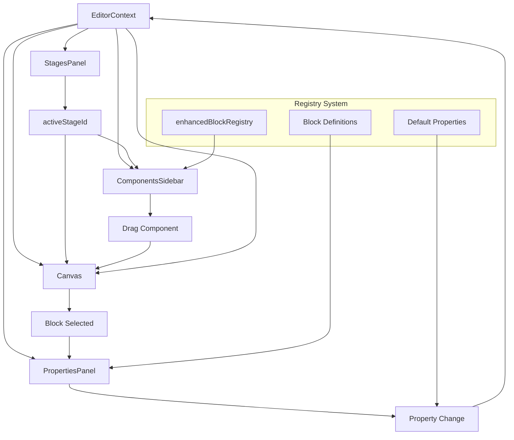

# 🏗️ Arquitetura de Componentes - Painel de Controle

## 📋 Visão Geral do Sistema

```
┌─────────────────────────────────────────────────────────────────────────────────────────┐
│                           EDITOR FIXED - 4 COLUNAS LAYOUT                                │
├─────────────┬──────────────┬─────────────────────────────┬─────────────────────────────┤
│   ETAPAS    │ COMPONENTES  │           CANVAS            │   PAINEL PROPRIEDADES       │
│   (Stages)  │  (Sidebar)   │        (Renderização)       │     (Properties Panel)      │
│             │              │                             │                             │
│ ┌─────────┐ │ ┌──────────┐ │ ┌─────────────────────────┐ │ ┌─────────────────────────┐ │
│ │ Step 01 │ │ │ Blocos   │ │ │    DRAG & DROP ZONE     │ │ │  Propriedades Ativas    │ │
│ │ Step 02 │ │ │ Text     │ │ │                         │ │ │                         │ │
│ │ Step 03 │ │ │ Image    │ │ │  ┌─────────────────┐    │ │ │ ┌─────────────────────┐ │ │
│ │ Step 04 │ │ │ Button   │ │ │  │ Bloco Selected  │    │ │ │ │ Color Picker        │ │ │
│ │ Step 05 │ │ │ Quiz     │ │ │  │ (Highlighted)   │    │ │ │ │ Size Slider         │ │ │
│ │   ...   │ │ │ Header   │ │ │  └─────────────────┘    │ │ │ │ Text Input          │ │ │
│ │ Step 21 │ │ │ CTA      │ │ │                         │ │ │ │ Toggle Switch       │ │ │
│ └─────────┘ │ │ Footer   │ │ │  Outros blocos...       │ │ │ │ Dropdown Select     │ │ │
│             │ │ Options  │ │ │                         │ │ │ │ Number Input        │ │ │
│    ↓        │ │ Results  │ │ │  ┌─────┐ ┌─────┐       │ │ │ │ Checkbox            │ │ │
│ Navegação   │ │   ...    │ │ │  │Block│ │Block│       │ │ │ │ Range Slider        │ │ │
│   entre     │ └──────────┘ │ │  │  1  │ │  2  │       │ │ │ └─────────────────────┘ │ │
│  etapas     │              │ │  └─────┘ └─────┘       │ │ │                         │ │
│             │      ↓       │ │                         │ │ │         ↓ Save         │ │
│             │  Arrastar    │ │         ↓ Update        │ │ │    Auto-aplicação       │ │
│             │    para      │ │    Re-renderização      │ │ │    de propriedades      │ │
│             │   Canvas     │ │                         │ │ │                         │ │
│             │              │ └─────────────────────────┘ │ └─────────────────────────┘ │
└─────────────┴──────────────┴─────────────────────────────┴─────────────────────────────┘
```

## 🔄 Fluxo de Dados Principal



## 1️⃣ COLUNA DE ETAPAS (Stages Panel)

### 📁 Estrutura da Coluna de Etapas

```typescript
// src/components/editor/funnel/FunnelStagesPanel.tsx
const FunnelStagesPanel = () => {
  const stages = [
    { id: 'step-01', title: 'Introdução', type: 'intro' },
    { id: 'step-02', title: 'Pergunta 1', type: 'question' },
    { id: 'step-03', title: 'Pergunta 2', type: 'question' },
    // ... até step-21
    { id: 'step-21', title: 'Resultado', type: 'result' }
  ];

  return (
    <div className="stages-panel">
      {stages.map(stage => (
        <StageItem
          key={stage.id}
          stage={stage}
          isActive={activeStageId === stage.id}
          onClick={() => setActiveStage(stage.id)}
          hasBlocks={getBlocksForStage(stage.id).length > 0}
        />
      ))}
    </div>
  );
};
```

### 🎯 Como as Etapas são Carregadas

```
┌─────────────────────────────────────────────────────────────────┐
│                    CARREGAMENTO DE ETAPAS                        │
├─────────────────────────────────────────────────────────────────┤
│                                                                 │
│  1. EditorContext inicializa                                    │
│     ↓                                                          │
│  2. useEditor hook carrega stages do localStorage/API           │
│     ↓                                                          │
│  3. FunnelStagesPanel renderiza lista                          │
│     ↓                                                          │
│  4. Cada StageItem mostra:                                     │
│     • Título da etapa                                          │
│     • Ícone do tipo (intro/question/result)                    │
│     • Indicador de blocos presentes                           │
│     • Estado ativo/inativo                                     │
│     ↓                                                          │
│  5. Click em etapa → setActiveStage()                          │
│     ↓                                                          │
│  6. Canvas recarrega com blocos da etapa ativa                 │
│                                                                 │
└─────────────────────────────────────────────────────────────────┘
```

## 2️⃣ COLUNA DE COMPONENTES (Components Sidebar)

### 🧩 Registry de Componentes

```typescript
// src/config/enhancedBlockRegistry.tsx
export const blockRegistry = {
  // Categoria: Texto
  text: {
    type: "TextInlineBlock",
    name: "Texto",
    description: "Bloco de texto editável",
    category: "basic",
    icon: Type,
    component: TextInlineBlock,
    defaultProps: {
      text: "Digite seu texto aqui...",
      fontSize: "16px",
      color: "#432818",
      textAlign: "left",
    },
    properties: {
      text: { type: "string", label: "Conteúdo" },
      fontSize: { type: "select", label: "Tamanho", options: ["12px", "16px", "20px", "24px"] },
      color: { type: "color", label: "Cor do Texto" },
      textAlign: { type: "select", label: "Alinhamento", options: ["left", "center", "right"] },
      fontWeight: { type: "select", label: "Peso", options: ["normal", "bold", "600", "700"] },
      marginTop: { type: "range", label: "Margem Superior", min: 0, max: 100 },
      marginBottom: { type: "range", label: "Margem Inferior", min: 0, max: 100 },
    },
  },

  // Categoria: Mídia
  image: {
    type: "ImageBlock",
    name: "Imagem",
    description: "Bloco de imagem responsiva",
    category: "media",
    icon: Image,
    component: ImageBlock,
    defaultProps: {
      src: "/placeholder.jpg",
      alt: "Imagem",
      width: "100%",
      height: "auto",
      borderRadius: "8px",
    },
    properties: {
      src: { type: "string", label: "URL da Imagem" },
      alt: { type: "string", label: "Texto Alternativo" },
      width: { type: "string", label: "Largura" },
      height: { type: "string", label: "Altura" },
      borderRadius: { type: "range", label: "Bordas Arredondadas", min: 0, max: 50 },
      objectFit: { type: "select", label: "Ajuste", options: ["cover", "contain", "fill"] },
    },
  },

  // Categoria: Interação
  button: {
    type: "ButtonInlineFixed",
    name: "Botão",
    description: "Botão interativo com validações",
    category: "interactive",
    icon: MousePointer,
    component: ButtonInlineFixed,
    defaultProps: {
      text: "Clique aqui",
      backgroundColor: "#B89B7A",
      textColor: "#FFFFFF",
      borderRadius: "8px",
      padding: "12px 24px",
      fontSize: "16px",
      fontWeight: "600",
      width: "auto",
      hoverColor: "#A38A69",
    },
    properties: {
      text: { type: "string", label: "Texto do Botão" },
      backgroundColor: { type: "color", label: "Cor de Fundo" },
      textColor: { type: "color", label: "Cor do Texto" },
      borderRadius: { type: "range", label: "Bordas Arredondadas", min: 0, max: 50 },
      padding: { type: "string", label: "Espaçamento Interno" },
      fontSize: { type: "range", label: "Tamanho da Fonte", min: 12, max: 32 },
      fontWeight: {
        type: "select",
        label: "Peso da Fonte",
        options: ["normal", "bold", "600", "700"],
      },
      width: { type: "select", label: "Largura", options: ["auto", "100%", "50%", "fit-content"] },
      hoverColor: { type: "color", label: "Cor ao Passar Mouse" },
      action: { type: "select", label: "Ação", options: ["next-step", "submit", "custom"] },
    },
  },
};
```

### 🎨 Como a Sidebar Carrega Componentes

```
┌─────────────────────────────────────────────────────────────────┐
│                  CARREGAMENTO DE COMPONENTES                     │
├─────────────────────────────────────────────────────────────────┤
│                                                                 │
│  1. CombinedComponentsPanel inicializa                          │
│     ↓                                                          │
│  2. generateBlockDefinitions() lê o registry                    │
│     ↓                                                          │
│  3. Componentes agrupados por categoria:                       │
│     • basic (texto, espaçador)                                │
│     • media (imagem, vídeo)                                    │
│     • interactive (botão, formulário)                          │
│     • quiz (pergunta, opções)                                  │
│     • layout (header, footer)                                  │
│     ↓                                                          │
│  4. Para cada categoria:                                        │
│     • Accordion expansível                                     │
│     • Lista de componentes disponíveis                         │
│     • Ícone + Nome + Descrição                                │
│     ↓                                                          │
│  5. Drag & Drop habilitado:                                    │
│     • onDragStart → define blockType                          │
│     • onDragEnd → adiciona ao canvas                          │
│     ↓                                                          │
│  6. Click direto → addBlock(type, activeStageId)               │
│                                                                 │
└─────────────────────────────────────────────────────────────────┘
```

## 3️⃣ RENDERIZAÇÃO DO CANVAS

### 🎨 Como o Canvas Renderiza os Blocos

```typescript
// src/components/editor/canvas/CanvasDropZone.tsx
const CanvasDropZone = ({ blocks, selectedBlockId, onSelectBlock, onUpdateBlock }) => {
  const currentStageBlocks = blocks.filter(block => block.stageId === activeStageId);

  return (
    <div className="canvas-drop-zone">
      <DropZone
        onDrop={(blockType, position) => addBlockAtPosition(blockType, position)}
      >
        {currentStageBlocks.map((block, index) => (
          <DraggableBlock
            key={block.id}
            block={block}
            isSelected={selectedBlockId === block.id}
            onClick={() => onSelectBlock(block.id)}
            onUpdate={(updates) => onUpdateBlock(block.id, updates)}
            position={index}
          />
        ))}
      </DropZone>
    </div>
  );
};
```

### 🔄 Fluxo de Renderização

```
┌─────────────────────────────────────────────────────────────────┐
│                    RENDERIZAÇÃO DO CANVAS                        │
├─────────────────────────────────────────────────────────────────┤
│                                                                 │
│  1. activeStageId mudou                                         │
│     ↓                                                          │
│  2. getBlocksForStage(activeStageId)                           │
│     ↓                                                          │
│  3. Canvas filtra blocos da etapa ativa                        │
│     ↓                                                          │
│  4. Para cada bloco:                                           │
│     • Busca definição no registry                             │
│     • Carrega componente React                                 │
│     • Aplica propriedades atuais                              │
│     • Renderiza com DraggableWrapper                          │
│     ↓                                                          │
│  5. Drag & Drop ativo:                                         │
│     • Drop entre blocos → reorderBlocks()                     │
│     • Drop novo componente → addBlockAtPosition()              │
│     ↓                                                          │
│  6. Click em bloco:                                            │
│     • setSelectedBlockId(block.id)                            │
│     • Highlight visual                                         │
│     • Ativa painel de propriedades                            │
│                                                                 │
└─────────────────────────────────────────────────────────────────┘
```

## 4️⃣ PAINEL DE PROPRIEDADES

### ⚙️ Sistema Universal de Propriedades

```typescript
// src/components/universal/EnhancedUniversalPropertiesPanel.tsx
const EnhancedUniversalPropertiesPanel = ({
  selectedBlock,
  blockDefinition,
  onUpdate
}) => {
  const renderPropertyControl = (propertyKey, propertyConfig) => {
    switch (propertyConfig.type) {
      case 'string':
        return (
          <Input
            value={selectedBlock.properties[propertyKey] || propertyConfig.default}
            onChange={(value) => handlePropertyChange(propertyKey, value)}
            label={propertyConfig.label}
          />
        );

      case 'color':
        return (
          <ColorPicker
            value={selectedBlock.properties[propertyKey] || propertyConfig.default}
            onChange={(color) => handlePropertyChange(propertyKey, color)}
            label={propertyConfig.label}
          />
        );

      case 'range':
        return (
          <Slider
            value={selectedBlock.properties[propertyKey] || propertyConfig.default}
            min={propertyConfig.min}
            max={propertyConfig.max}
            onChange={(value) => handlePropertyChange(propertyKey, value)}
            label={propertyConfig.label}
          />
        );

      case 'select':
        return (
          <Select
            value={selectedBlock.properties[propertyKey] || propertyConfig.default}
            options={propertyConfig.options}
            onChange={(value) => handlePropertyChange(propertyKey, value)}
            label={propertyConfig.label}
          />
        );

      case 'boolean':
        return (
          <Switch
            checked={selectedBlock.properties[propertyKey] || propertyConfig.default}
            onChange={(checked) => handlePropertyChange(propertyKey, checked)}
            label={propertyConfig.label}
          />
        );
    }
  };

  return (
    <div className="properties-panel">
      <h3>{blockDefinition.name} - Propriedades</h3>

      {Object.entries(blockDefinition.properties).map(([key, config]) => (
        <div key={key} className="property-group">
          {renderPropertyControl(key, config)}
        </div>
      ))}

      <Button
        onClick={() => onUpdate(selectedBlock.id, currentProperties)}
        variant="primary"
      >
        Aplicar Alterações
      </Button>
    </div>
  );
};
```

### 🔧 Como as Propriedades são Alteradas

```
┌─────────────────────────────────────────────────────────────────┐
│                  ALTERAÇÃO DE PROPRIEDADES                       │
├─────────────────────────────────────────────────────────────────┤
│                                                                 │
│  1. Bloco selecionado no canvas                                │
│     ↓                                                          │
│  2. setSelectedBlockId(block.id)                               │
│     ↓                                                          │
│  3. PropertiesPanel carrega:                                   │
│     • Block atual (selectedBlock)                             │
│     • Definição do registry (blockDefinition)                  │
│     • Propriedades atuais (block.properties)                  │
│     ↓                                                          │
│  4. Painel renderiza controles baseado na definição:           │
│     • string → Input de texto                                 │
│     • color → Color picker                                     │
│     • range → Slider numérico                                 │
│     • select → Dropdown                                        │
│     • boolean → Switch toggle                                  │
│     ↓                                                          │
│  5. Usuário altera propriedade:                               │
│     • handlePropertyChange(key, newValue)                     │
│     • Estado local atualizado                                 │
│     • Preview em tempo real (opcional)                        │
│     ↓                                                          │
│  6. Aplicar alterações:                                        │
│     • onUpdate(blockId, newProperties)                        │
│     • updateBlock() no EditorContext                          │
│     • Re-renderização do bloco no canvas                      │
│     ↓                                                          │
│  7. Persistência:                                              │
│     • localStorage (desenvolvimento)                           │
│     • API/Database (produção)                                 │
│                                                                 │
└─────────────────────────────────────────────────────────────────┘
```

## 🎯 Exemplo Completo: Configuração de um Botão

### 1. Definição no Registry

```typescript
button: {
  type: 'ButtonInlineFixed',
  properties: {
    text: { type: 'string', label: 'Texto do Botão' },
    backgroundColor: { type: 'color', label: 'Cor de Fundo' },
    size: { type: 'select', label: 'Tamanho', options: ['small', 'medium', 'large'] },
    rounded: { type: 'boolean', label: 'Bordas Arredondadas' },
    padding: { type: 'range', label: 'Espaçamento', min: 4, max: 32 }
  }
}
```

### 2. Componente Renderizado

```typescript
const ButtonInlineFixed = ({ text, backgroundColor, size, rounded, padding }) => {
  const sizeClasses = {
    small: 'px-3 py-1 text-sm',
    medium: 'px-4 py-2 text-base',
    large: 'px-6 py-3 text-lg'
  };

  return (
    <button
      className={`
        ${sizeClasses[size]}
        ${rounded ? 'rounded-full' : 'rounded'}
      `}
      style={{
        backgroundColor,
        padding: `${padding}px`
      }}
    >
      {text}
    </button>
  );
};
```

### 3. Painel de Propriedades Gerado

```typescript
// Automaticamente gerado baseado na definição:
<div className="properties-panel">
  <Input label="Texto do Botão" value={text} onChange={...} />
  <ColorPicker label="Cor de Fundo" value={backgroundColor} onChange={...} />
  <Select label="Tamanho" options={['small', 'medium', 'large']} value={size} onChange={...} />
  <Switch label="Bordas Arredondadas" checked={rounded} onChange={...} />
  <Slider label="Espaçamento" min={4} max={32} value={padding} onChange={...} />
</div>
```

## 🚀 Vantagens desta Arquitetura

### ✅ **Escalabilidade**

- Novos componentes = apenas adicionar ao registry
- Propriedades automáticas no painel
- Tipagem TypeScript completa

### ✅ **Flexibilidade**

- Qualquer tipo de propriedade suportada
- Validações customizáveis
- Preview em tempo real

### ✅ **Manutenibilidade**

- Código centralizado no registry
- Painel universal reutilizável
- Separação clara de responsabilidades

### ✅ **UX Superior**

- Drag & drop intuitivo
- Propriedades visuais
- Feedback imediato
- Undo/redo automático

Esta arquitetura garante que cada componente seja facilmente configurável, editável e extensível através do painel de controle universal!
