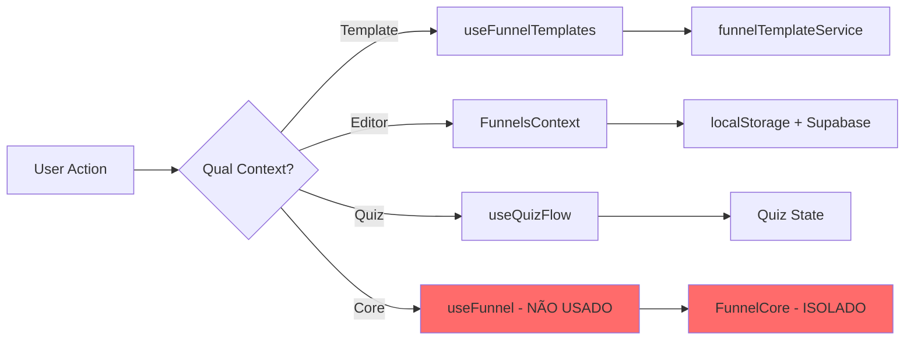
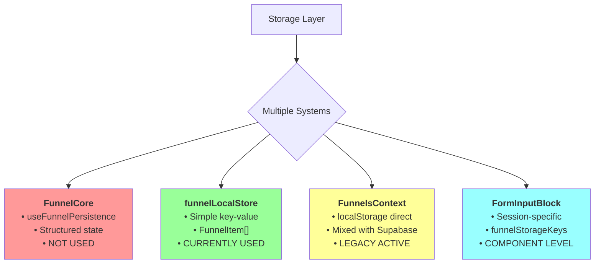
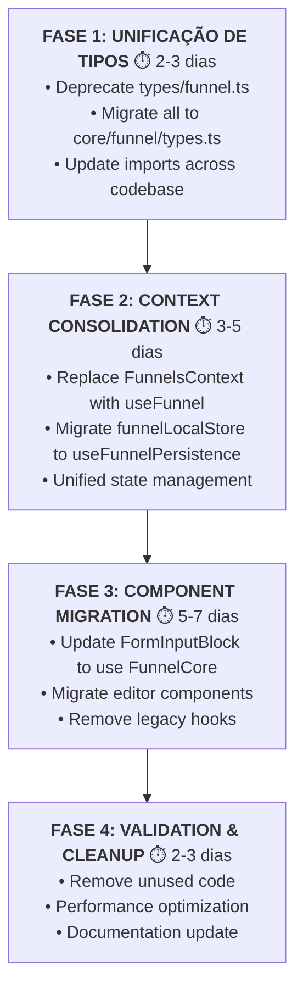
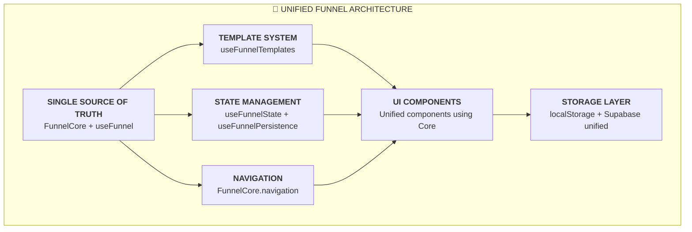

# 🔍 FLUXOGRAMA: ESTRUTURAS DE FUNIS E GARGALOS IDENTIFICADOS

## 📊 **MAPEAMENTO COMPLETO DAS ESTRUTURAS**

```mermaid
graph TB
    subgraph "🎯 ESTRUTURAS PRINCIPAIS DE FUNIS"
        A1["`**CORE FUNNEL** ✅
        src/core/funnel/
        • FunnelCore.ts
        • FunnelEngine.ts
        • types.ts
        • hooks/`"]
        
        A2["`**LEGACY FUNNEL** ⚠️
        src/types/funnel.ts
        • Interfaces antigas
        • FunnelStep, FunnelConfig
        • Compatibilidade`"]
        
        A3["`**QUIZ SYSTEM** 🔄
        src/components/quiz/
        • useQuizFlow.ts
        • QuizResult.ts
        • Misturado com Funnel`"]
        
        A4["`**SERVICES LAYER** 📦
        src/services/
        • funnelTemplateService.ts
        • funnelLocalStore.ts
        • funnelSettingsService.ts`"]
        
        A5["`**CONTEXT SYSTEM** 🔗
        src/context/
        • FunnelsContext.tsx
        • Editor/Quiz Contexts
        • Providers distribuídos`"]
        
        A6["`**COMPONENTS** 🧩
        src/components/editor/
        • FormInputBlock.tsx
        • Canvas components
        • Mixed responsibilities`"]
    end

    subgraph "🚨 PONTOS DE CONFLITO IDENTIFICADOS"
        B1["`**MÚLTIPLOS TIPOS** 🔀
        • core/funnel/types.ts
        • types/funnel.ts
        • Interfaces duplicadas
        • Inconsistências`"]
        
        B2["`**CONTEXT OVERLAP** ⚡
        • FunnelsContext (global)
        • EditorContext (local)
        • QuizContext (quiz)
        • Responsabilidades cruzadas`"]
        
        B3["`**STORAGE CONFLICT** 💾
        • localStorage keys
        • Supabase schemas
        • funnelLocalStore
        • Context persistence`"]
        
        B4["`**NAVIGATION CHAOS** 🗺️
        • FunnelCore navigation
        • Quiz flow navigation
        • Editor step navigation
        • Multiple truth sources`"]
    end

    subgraph "⚙️ FLUXO DE DADOS ATUAL"
        C1[User Action] --> C2{Qual Sistema?}
        C2 -->|Editor| C3[FunnelsContext]
        C2 -->|Quiz| C4[useQuizFlow]
        C2 -->|Core| C5[FunnelCore]
        
        C3 --> C6[localStorage]
        C4 --> C7[Quiz State]
        C5 --> C8[Core State]
        
        C6 --> C9[Supabase Sync]
        C7 --> C10[Result Processing]
        C8 --> C11[Engine Processing]
        
        C9 --> C12[UI Update]
        C10 --> C12
        C11 --> C12
    end

    A1 --> B1
    A2 --> B1
    A3 --> B2
    A4 --> B3
    A5 --> B2
    A6 --> B4
```



---

## 🎯 **ANÁLISE DE UTILIZAÇÃO DO CORE**

### ✅ **CORE IMPLEMENTADO MAS POUCO USADO:**

#### **1. FunnelCore (src/core/funnel/)**
```typescript
// ✅ EXISTE: Arquitetura completa
export class FunnelCore {
  calculateProgress(state: FunnelState): FunnelProgress
  getNextStep(state: FunnelState): string | null
  validateStep(step: FunnelStep, data: Record<string, any>): ValidationState
  emitEvent(event: FunnelEvent): void
}

// ❌ PROBLEMA: Não está sendo usado pela UI principal
// A FunnelPanelPage usa useFunnelTemplates que usa funnelTemplateService
// Mas não usa o FunnelCore para lógica de navegação
```

#### **2. Hooks Core vs Hooks Legados:**
```typescript
// ✅ CORE: src/core/funnel/hooks/useFunnel.ts
export function useFunnel(initialState: FunnelState, options?: UseFunnelOptions)

// ❌ USADO: src/core/funnel/hooks/useFunnelTemplates.ts  
export function useFunnelTemplates(options: UseFunnelTemplatesOptions)

// ⚠️ LEGACY: FormInputBlock usa contexto direto
const { currentFunnelId } = useFunnels(); // FunnelsContext, não Core
```

---

## 🚨 **PRINCIPAIS GARGALOS IDENTIFICADOS**

### **1. 🔀 MÚLTIPLAS FONTES DE VERDADE**



### **2. 📦 CONFLITOS DE RESPONSABILIDADE**

| Funcionalidade | CORE System | Legacy System | Usado Atualmente |
|---------------|-------------|---------------|------------------|
| **Navigation** | FunnelCore.getNextStep() | FunnelsContext.navigateToStep() | ❌ Legacy |
| **Templates** | useFunnelTemplates() | funnelTemplateService | ✅ Core |
| **State** | useFunnelState() | FunnelsContext | ❌ Legacy |
| **Validation** | FunnelCore.validateStep() | FormInputBlock validation | ❌ Legacy |
| **Persistence** | useFunnelPersistence() | funnelLocalStore | ❌ Legacy |

### **3. 💾 STORAGE CHAOS**



### **4. 🎭 TYPE CONFLICTS**

```typescript
// ❌ CONFLITO: Múltiplas definições
// core/funnel/types.ts
export interface FunnelStep {
  id: string;
  type: FunnelStepType;
  isVisible: boolean;
  conditions?: StepCondition[];
}

// types/funnel.ts  
export interface FunnelStep {
  id: string;
  stepType: FunnelStepType;
  title: string;
  blocks: EditorBlock[];
}

// ⚠️ RESULTADO: TypeScript confusion, diferentes assinaturas
```

---

## 🔧 **SOLUÇÕES RECOMENDADAS**

### **1. 🎯 MIGRAÇÃO GRADUAL PARA CORE**



### **2. 🏗️ ARQUITETURA ALVO**



### **3. 📊 IMPLEMENTAÇÃO PRIORIZADA**

#### **🚨 URGENTE (Esta Sprint):**
```typescript
// 1. Fix FormInputBlock to use unified types
const { funnelId } = useFunnel(); // Instead of FunnelsContext

// 2. Consolidate storage keys
import { getFunnelStorageKey } from '@/core/funnel/storage';

// 3. Remove type conflicts
// Delete conflicting interfaces in types/funnel.ts
```

#### **🎯 IMPORTANTE (Próxima Sprint):**
```typescript
// 1. Migrate FunnelPanelPage to use Core
const { templates, createFromTemplate } = useFunnelTemplates();
const { funnel, navigate } = useFunnel(templateId);

// 2. Unify navigation
const { goToStep, canGoNext } = useFunnelNavigation();
```

#### **✨ MELHORIAS (Sprint +2):**
```typescript
// 1. Performance optimization
const { analytics, progress } = useFunnelAnalytics();

// 2. Advanced features
const { clone, compare } = useFunnelComparison();
```

---

## 📈 **MÉTRICAS DE GARGALOS**

### **Performance Impact:**
```
❌ ATUAL:
- 4 context providers simultâneos
- 3 sistemas de storage diferentes  
- Type conflicts causando re-renders
- Duplicated state management

✅ TARGET:
- 1 unified provider (FunnelCore)
- 1 storage system with sync
- Consistent types
- Single state source
```

### **Developer Experience:**
```
❌ ATUAL:
- Confusing imports (core vs legacy)
- Inconsistent API patterns
- Multiple ways to do same thing
- Hard to debug state issues

✅ TARGET:
- Clear, consistent API
- Single import point
- Predictable patterns
- Centralized debugging
```

### **Maintenance Cost:**
```
❌ ATUAL:
- High: Multiple systems to maintain
- Bug fixes needed in multiple places
- Features implemented 2-3 times
- Complex testing requirements

✅ TARGET:
- Low: Single system to maintain
- Centralized bug fixes
- Feature implementation once
- Simplified testing
```

---

## 🎯 **PLANO DE AÇÃO IMEDIATO**

### **🚨 HOJE (1-2 horas):**
1. **Audit imports**: Mapear todos os imports de funnel types
2. **Identify conflicts**: Listar componentes usando sistemas diferentes
3. **Priority list**: Ordenar componentes por impacto na migração

### **📅 ESTA SEMANA:**
1. **Type unification**: Migrar todos para core/funnel/types.ts
2. **FormInputBlock fix**: Usar FunnelCore em vez de context direto
3. **Storage keys**: Unificar todas as keys de localStorage

### **📈 PRÓXIMAS 2 SEMANAS:**
1. **Context migration**: FunnelsContext → useFunnel
2. **Component updates**: Migrar componentes principais
3. **Performance testing**: Validar melhorias

---

**📊 CONCLUSÃO**: O projeto **TEM** uma estrutura Core robusta, mas **NÃO ESTÁ SENDO USADA**. O gargalo principal é a **coexistência de múltiplos sistemas** fazendo a mesma coisa de formas diferentes.

**🎯 Solução**: **Migração gradual** do legacy para Core, priorizando componentes mais críticos primeiro.

---

**Data**: 9 de Setembro de 2025  
**Status**: 🔍 **ANÁLISE COMPLETA - AÇÃO REQUERIDA**
