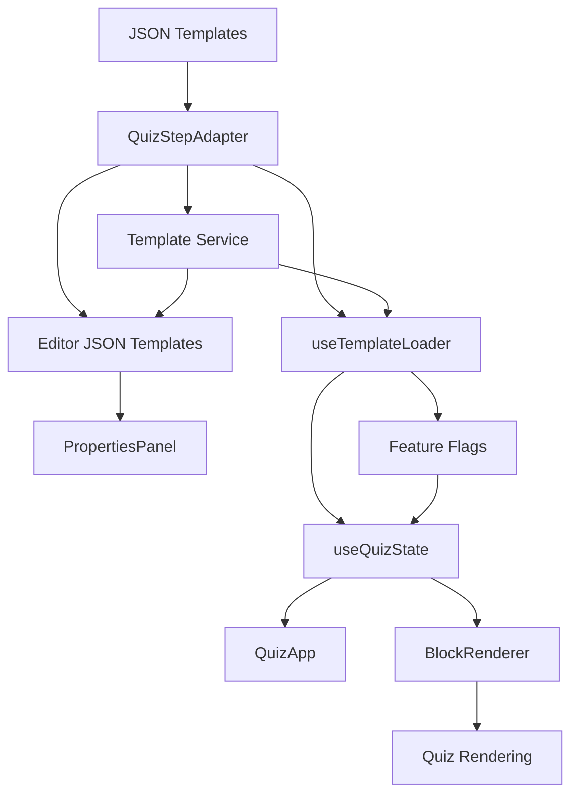

# 🎯 Alinhamento de Arquitetura - Sistema de Templates JSON

## 📋 Visão Geral

Este documento mapeia **TODOS os códigos** que precisam estar alinhados com a nova estrutura de **Templates JSON** implementada no sistema.

---

## 🏗️ Arquitetura Atual

```
📁 Sistema de Templates JSON
├── 📄 Templates JSON (/templates/*.json)
├── 🔄 QuizStepAdapter (conversão JSON ↔ QuizStep)
├── 🎨 Editor Visual (/editor/json-templates)
├── 🚀 Renderização (/quiz-estilo)
└── 🔧 Painel de Propriedades (vários)
```

---

## 1️⃣ CORE - Componentes Principais

### ✅ **Já Implementados**

#### 1.1 Adapter de Conversão
```typescript
📁 src/adapters/QuizStepAdapter.ts (465 linhas)
```
**Responsabilidade:**
- Converte JSON → QuizStep
- Converte QuizStep → JSON
- Validação de estrutura

**Status:** ✅ Implementado e testado
**Testes:** `src/adapters/__tests__/QuizStepAdapter.test.ts`

---

#### 1.2 Editor de Templates JSON
```typescript
📁 src/pages/editor-json-templates/index.tsx (682 linhas)
📁 Route: /editor/json-templates
```
**Funcionalidades:**
- ✅ Lista de 21 templates
- ✅ Visualização e edição
- ✅ Validação em tempo real
- ✅ Import/Export
- ✅ Duplicate/Delete
- ✅ Preview

**Status:** ✅ Completo
**Testes:** `src/pages/editor-json-templates/__tests__/`

---

#### 1.3 Loader de Templates
```typescript
📁 src/hooks/useTemplateLoader.ts
```
**Responsabilidade:**
- Carrega templates JSON de `/templates/*.json`
- Cache em memória
- Fallback para defaults

**Status:** ✅ Implementado
**⚠️ Precisa:** Integrar com feature flags

---

#### 1.4 Feature Flags
```typescript
📁 src/hooks/useFeatureFlags.ts (143 linhas)
```
**Responsabilidade:**
- Controla rollout JSON vs TypeScript
- Percentual de usuários
- A/B testing

**Status:** ✅ Implementado
**⏳ Pendente:** Integração com dashboard

---

### ⚠️ **Precisam Alinhamento**

#### 1.5 useQuizState Hook
```typescript
📁 src/hooks/useQuizState.ts
📍 Linha: ~50-200
```
**Problema Atual:**
- Carrega templates TypeScript (`quizStepsTS`)
- Não usa JSON templates

**O que precisa:**
```typescript
// ❌ ATUAL
import { quizStepsTS } from '@/data/quizStepsTS';

// ✅ NOVO
import { useTemplateLoader } from '@/hooks/useTemplateLoader';
import { useFeatureFlags } from '@/hooks/useFeatureFlags';

function useQuizState() {
  const { loadTemplate } = useTemplateLoader();
  const { shouldUseJsonTemplates } = useFeatureFlags();
  
  // Carregar template baseado em feature flag
  const template = shouldUseJsonTemplates 
    ? await loadTemplate(stepNumber)
    : quizStepsTS[stepNumber];
}
```

**Prioridade:** 🔴 ALTA
**Arquivo guia:** `FASE_2_GUIA_RAPIDO.md`

---

#### 1.6 QuizApp Component
```typescript
📁 src/components/quiz/QuizApp.tsx
📍 Linha: ~100-300
```
**Problema Atual:**
- Usa templates TypeScript diretamente
- Sem loading states
- Sem error boundaries

**O que precisa:**
```typescript
// Adicionar states
const [isLoadingTemplate, setIsLoadingTemplate] = useState(false);
const [templateError, setTemplateError] = useState<Error | null>(null);

// Loading UI
if (isLoadingTemplate) {
  return <TemplateLoadingSkeleton />;
}

// Error UI
if (templateError) {
  return <TemplateErrorFallback error={templateError} />;
}
```

**Prioridade:** 🔴 ALTA

---

## 2️⃣ EDITORES - Sistema de Edição Visual

### 2.1 Editor Principal (QuizModularProductionEditor)
```typescript
📁 src/components/editor/quiz/QuizModularProductionEditor.tsx (2000+ linhas)
📍 Linha: 96, 516, 1916
```
**Usa:**
- ✅ PropertiesPanel (próprio)
- ✅ Blocks system

**Precisa Alinhar:**
```typescript
// Importar adapter
import { QuizStepAdapter } from '@/adapters/QuizStepAdapter';

// Ao salvar template
const saveAsJson = () => {
  const jsonTemplate = QuizStepAdapter.toJSON(currentStep);
  await fetch('/api/templates', {
    method: 'POST',
    body: JSON.stringify(jsonTemplate)
  });
};

// Ao carregar template
const loadFromJson = async (templateId: string) => {
  const response = await fetch(`/templates/${templateId}.json`);
  const jsonTemplate = await response.json();
  const quizStep = QuizStepAdapter.fromJSON(jsonTemplate);
  setCurrentStep(quizStep);
};
```

**Prioridade:** 🟡 MÉDIA

---

### 2.2 Editor Unificado (EditorProUnified)
```typescript
📁 src/components/editor/EditorProUnified.tsx
📍 Linha: 36, 457, 459
```
**Usa:**
- DynamicPropertiesPanelImproved

**Precisa Alinhar:**
- Suportar blocos JSON format
- Validar com QuizStepAdapter antes de salvar

**Prioridade:** 🟡 MÉDIA

---

### 2.3 Editor WYSIWYG Refatorado
```typescript
📁 src/components/editor/quiz/QuizFunnelEditorWYSIWYG_Refactored.tsx
📍 Linha: 16, 57, 76, 267, 310
```
**Usa:**
- QuizEditorPropertiesPanel
- showPropertiesPanel state

**Precisa Alinhar:**
- Carregar templates via useTemplateLoader
- Salvar usando QuizStepAdapter.toJSON()

**Prioridade:** 🟡 MÉDIA

---

### 2.4 Editor de Templates (Página)
```typescript
📁 src/pages/editor-templates/index.tsx
📁 Route: /editor/templates
```
**Problema Atual:**
- Edita UnifiedTemplate (antigo formato)
- Não usa JSON templates

**O que precisa:**
- Migrar para usar `/editor/json-templates`
- Ou adicionar toggle para JSON vs TS

**Prioridade:** 🟢 BAIXA (editor novo substitui)

---

## 3️⃣ PAINEL DE PROPRIEDADES - Sistema de Edição de Blocos

### 3.1 PropertiesPanel (Quiz Editor)
```typescript
📁 src/components/editor/quiz/components/PropertiesPanel.tsx
```
**Status:** ✅ Alinhado (usa blocks system)

**Precisa Verificar:**
- Se aceita todos os block types do JSON
- Se valida styling corretamente

---

### 3.2 DynamicPropertiesPanelImproved
```typescript
📁 src/core/editor/DynamicPropertiesPanelImproved.tsx
📍 Usado em: EditorProUnified
```
**Precisa Alinhar:**
- Suportar metadata do JSON template
- Editar layout (containerWidth, spacing, backgroundColor)
- Editar validation rules
- Editar analytics config

**Exemplo:**
```typescript
// Adicionar seções para metadata JSON
<Section title="Template Metadata">
  <Input 
    label="Template Name"
    value={template.metadata.name}
    onChange={(val) => updateMetadata('name', val)}
  />
  <Input 
    label="Category"
    value={template.metadata.category}
    onChange={(val) => updateMetadata('category', val)}
  />
</Section>

<Section title="Layout">
  <Input 
    label="Container Width"
    value={template.layout.containerWidth}
  />
  <ColorPicker 
    label="Background Color"
    value={template.layout.backgroundColor}
  />
</Section>
```

**Prioridade:** 🟡 MÉDIA

---

### 3.3 QuizEditorPropertiesPanel
```typescript
📁 src/components/editor/quiz/components/QuizEditorPropertiesPanel.tsx
```
**Status:** ✅ Provavelmente alinhado

**Verificar:**
- Se aceita content types do JSON
- Se preserva styling ao editar

---

### 3.4 EnhancedUniversalPropertiesPanel
```typescript
📁 src/components/universal/EnhancedUniversalPropertiesPanel.tsx
```
**Precisa Alinhar:**
- Suportar JSON template format
- Adicionar validação via QuizStepAdapter

**Prioridade:** 🟢 BAIXA

---

### 3.5 UnifiedEditorLayout
```typescript
📁 src/components/editor/layouts/UnifiedEditorLayout.tsx
📍 Linha: 7, 122
```
**Usa:**
- PropertiesPanel

**Precisa Verificar:**
- Se passa JSON template corretamente
- Se atualiza template ao editar

---

## 4️⃣ TIPOS E SCHEMAS - Sistema de Validação

### 4.1 Editor Types
```typescript
📁 src/types/editor.ts
📍 Linha: 72, 470, 600
```
**Define:**
- BlockType
- Block interface
- getContentType()

**Precisa Alinhar:**
```typescript
// ⚠️ Garantir compatibilidade com JSON blocks
export type BlockType =
  | 'title'       // ✅ JSON
  | 'text'        // ✅ JSON
  | 'button'      // ✅ JSON
  | 'image'       // ✅ JSON
  | 'quiz-question' // ✅ JSON
  | 'multi-choice'  // ✅ JSON
  | 'headline'    // ❌ Legado
  | 'cta'         // ❌ Legado
  // ... outros

// Adicionar helper
export function isJsonBlockType(type: BlockType): boolean {
  const jsonTypes = ['title', 'text', 'button', 'image', 'quiz-question', 'multi-choice'];
  return jsonTypes.includes(type);
}
```

**Prioridade:** 🔴 ALTA

---

### 4.2 Schema Validation
```typescript
📁 src/lib/schema-validation.ts
📁 src/utils/schemaValidation.ts
📁 src/utils/schemaValidator.ts
```
**Precisa Adicionar:**
```typescript
// Validação de JSON Template
export function validateJsonTemplate(template: any): ValidationResult {
  try {
    QuizStepAdapter.fromJSON(template);
    return { valid: true };
  } catch (error) {
    return { 
      valid: false, 
      errors: [error.message] 
    };
  }
}
```

**Prioridade:** 🟡 MÉDIA

---

### 4.3 Unified Schema
```typescript
📁 src/types/unified-schema.ts
```
**Precisa Adicionar:**
```typescript
// Tipo para JSON Template
export type JsonTemplate = {
  templateVersion: string;
  metadata: TemplateMetadata;
  layout: TemplateLayout;
  validation: Record<string, any>;
  analytics: TemplateAnalytics;
  blocks: JsonBlock[];
};

// Extender Database schema
export interface Database {
  public: {
    Tables: {
      // ... existing
      json_templates: {
        Row: JsonTemplate;
        Insert: Omit<JsonTemplate, 'metadata.createdAt'>;
        Update: Partial<JsonTemplate>;
      };
    };
  };
}
```

**Prioridade:** 🟡 MÉDIA

---

## 5️⃣ RENDERIZAÇÃO - Sistema de Exibição

### 5.1 QuizApp (Componente Principal)
```typescript
📁 src/components/quiz/QuizApp.tsx
```
**Já mencionado em 1.6**

**Prioridade:** 🔴 ALTA

---

### 5.2 BlockRenderer
```typescript
📁 src/components/quiz/BlockRenderer.tsx (se existir)
```
**Precisa Verificar:**
- Se renderiza blocos JSON corretamente
- Se aplica styling do JSON
- Se executa animations do JSON

**Código esperado:**
```typescript
function BlockRenderer({ block }: { block: JsonBlock }) {
  // Aplicar styling
  const style = {
    fontSize: block.styling?.fontSize,
    color: block.styling?.color,
    textAlign: block.styling?.textAlign,
    // ...
  };
  
  // Aplicar animation
  const animationClass = block.animation?.type 
    ? `animate-${block.animation.type}` 
    : '';
  
  return (
    <div 
      className={animationClass}
      style={style}
    >
      {renderContent(block)}
    </div>
  );
}
```

**Prioridade:** 🔴 ALTA

---

### 5.3 Template Engine
```typescript
📁 Procurar por: template.*engine|TemplateEngine
```
**Precisa Alinhar:**
- Usar QuizStepAdapter para carregar templates
- Renderizar baseado em JSON structure

**Prioridade:** 🟡 MÉDIA

---

## 6️⃣ SERVIÇOS E APIs - Backend Integration

### 6.1 Template Service
```typescript
📁 src/services/templateService.ts (criar se não existir)
```
**Precisa Implementar:**
```typescript
export class TemplateService {
  async getTemplate(stepNumber: number): Promise<JsonTemplate> {
    const response = await fetch(`/templates/step-${String(stepNumber).padStart(2, '0')}-template.json`);
    return response.json();
  }
  
  async saveTemplate(template: JsonTemplate): Promise<void> {
    // TODO: API backend
    localStorage.setItem(`json-template-${template.metadata.id}`, JSON.stringify(template));
  }
  
  async validateTemplate(template: JsonTemplate): Promise<ValidationResult> {
    try {
      QuizStepAdapter.fromJSON(template);
      return { valid: true };
    } catch (error) {
      return { valid: false, error: error.message };
    }
  }
}
```

**Prioridade:** 🔴 ALTA

---

### 6.2 Configuration API
```typescript
📁 src/services/ConfigurationAPI.ts
📍 Linha: 272, 294, 316, 336
```
**Usa:**
- propertiesPanelTitle

**Precisa Alinhar:**
- Adicionar configurações para JSON templates
- Suportar metadata do template

**Prioridade:** 🟢 BAIXA

---

### 6.3 Schema Driven Funnel Service
```typescript
📁 src/services/schemaDrivenFunnelService.ts
```
**Precisa Alinhar:**
- Usar JSON templates como source
- Converter JSON → Funnel config

**Prioridade:** 🟢 BAIXA

---

## 7️⃣ ROTAS - Sistema de Navegação

### 7.1 App.tsx (Rotas Principais)
```typescript
📁 src/App.tsx
📍 Linhas: 63-64, 133-198, 243-247
```
**Status Atual:**
```typescript
// ✅ Rota JSON Templates (nova)
<Route path="/editor/json-templates">
  <EditorJsonTemplatesPage />
</Route>

// ✅ Rota Editor Principal
<Route path="/editor">
  <QuizModularProductionEditor />
</Route>

// ✅ Rota Templates (legado)
<Route path="/editor/templates">
  <EditorTemplatesPage />
</Route>

// ✅ Rotas legadas redirecionam para /editor
<Route path="/editor/quiz-estilo">
  <RedirectRoute to="/editor" />
</Route>
```

**Ações Necessárias:**
- ✅ Nenhuma - rotas já corretas
- ⚠️ Considerar depreciar `/editor/templates`

---

## 8️⃣ HOOKS - Sistema de Estado

### 8.1 useGlobalState
```typescript
📁 src/hooks/core/useGlobalState.ts
📍 Linha: 38, 98, 138, 234, 537
```
**Define:**
- propertiesPanelOpen
- togglePropertiesPanel

**Precisa Adicionar:**
```typescript
interface GlobalState {
  // ... existing
  templates: {
    currentTemplate: JsonTemplate | null;
    isLoadingTemplate: boolean;
    templateError: Error | null;
    useJsonTemplates: boolean; // Feature flag
  };
}

// Actions
loadTemplate: (stepNumber: number) => Promise<void>;
saveTemplate: (template: JsonTemplate) => Promise<void>;
toggleJsonTemplates: () => void;
```

**Prioridade:** 🟡 MÉDIA

---

### 8.2 useQuizState
```typescript
📁 src/hooks/useQuizState.ts
```
**Já mencionado em 1.5**

**Prioridade:** 🔴 ALTA

---

## 9️⃣ DADOS - Templates e Configurações

### 9.1 Templates JSON
```typescript
📁 /templates/*.json (21 arquivos)
```
**Status:** ✅ Gerados e validados

**Manutenção:**
- Usar `/editor/json-templates` para editar
- Versionar no git
- Validar antes de commit

---

### 9.2 QuizStepsTS (Legado)
```typescript
📁 src/data/quizStepsTS.ts
```
**Status:** 🟡 Legado (manter para fallback)

**Ação:**
- Não deletar ainda
- Usar como fallback se JSON falhar
- Migrar gradualmente usuários

---

## 🎯 PLANO DE AÇÃO PRIORIZADO

### 🔴 **PRIORIDADE ALTA** (Fazer AGORA)

1. **useQuizState** - Integrar com JSON templates
   - Arquivo: `src/hooks/useQuizState.ts`
   - Guia: `FASE_2_GUIA_RAPIDO.md`
   - Estimativa: 2-3 horas

2. **QuizApp** - Adicionar loading/error states
   - Arquivo: `src/components/quiz/QuizApp.tsx`
   - Estimativa: 1-2 horas

3. **BlockRenderer** - Verificar renderização JSON
   - Verificar se aplica styling e animations
   - Estimativa: 1 hora

4. **Editor Types** - Alinhar BlockType
   - Arquivo: `src/types/editor.ts`
   - Adicionar isJsonBlockType helper
   - Estimativa: 30 min

5. **Template Service** - Criar serviço centralizado
   - Arquivo: `src/services/templateService.ts` (criar)
   - Estimativa: 1-2 horas

---

### 🟡 **PRIORIDADE MÉDIA** (Próxima Semana)

6. **QuizModularProductionEditor** - Suporte JSON save/load
   - Estimativa: 3-4 horas

7. **DynamicPropertiesPanelImproved** - Editar metadata JSON
   - Estimativa: 2-3 horas

8. **useGlobalState** - Adicionar template state
   - Estimativa: 1-2 horas

9. **Schema Validation** - Adicionar validateJsonTemplate
   - Estimativa: 1 hora

10. **Unified Schema** - Adicionar JsonTemplate type
    - Estimativa: 30 min

---

### 🟢 **PRIORIDADE BAIXA** (Futuro)

11. EditorProUnified - Suporte JSON
12. QuizFunnelEditorWYSIWYG_Refactored - Migração
13. EnhancedUniversalPropertiesPanel - Suporte JSON
14. Configuration API - Templates config
15. Schema Driven Funnel Service - JSON source
16. Depreciar `/editor/templates` (antigo)

---

## 📊 MATRIZ DE DEPENDÊNCIAS



---

## 🔍 COMO VERIFICAR ALINHAMENTO

### Checklist por Componente:

```typescript
// ✅ Componente está alinhado se:
1. Usa QuizStepAdapter para conversão
2. Carrega templates via useTemplateLoader
3. Respeita feature flags (useFeatureFlags)
4. Valida templates antes de salvar
5. Renderiza styling e animations do JSON
6. Tem error boundaries
7. Tem loading states
8. Está testado

// ❌ Componente NÃO está alinhado se:
1. Importa quizStepsTS diretamente
2. Hard-codes template structure
3. Ignora metadata do JSON
4. Não valida antes de salvar
5. Ignora styling/animations
6. Sem error handling
7. Sem loading UI
8. Sem testes
```

---

## 📝 SCRIPTS DE VERIFICAÇÃO

### Verificar Imports Antigos
```bash
# Procurar importações de quizStepsTS
grep -r "from '@/data/quizStepsTS'" src/

# Procurar usos diretos de quizStepsTS
grep -r "quizStepsTS\[" src/
```

### Verificar Uso do Adapter
```bash
# Procurar uso de QuizStepAdapter
grep -r "QuizStepAdapter" src/ --include="*.tsx" --include="*.ts"

# Verificar se está usando .fromJSON() e .toJSON()
grep -r "\.fromJSON\|\.toJSON" src/
```

### Verificar Feature Flags
```bash
# Procurar uso de useFeatureFlags
grep -r "useFeatureFlags" src/

# Procurar uso de useTemplateLoader
grep -r "useTemplateLoader" src/
```

---

## 🚀 PRÓXIMOS PASSOS IMEDIATOS

### Semana 1 (AGORA):
```bash
# 1. Implementar useQuizState integração
code src/hooks/useQuizState.ts

# 2. Atualizar QuizApp com loading states
code src/components/quiz/QuizApp.tsx

# 3. Verificar BlockRenderer
find src/ -name "*BlockRenderer*" -o -name "*block-renderer*"

# 4. Criar Template Service
code src/services/templateService.ts

# 5. Rodar testes
npm test
```

### Semana 2:
- Implementar itens de prioridade média
- Adicionar mais testes
- Documentar changes

### Semana 3:
- Implementar backend API
- Deploy gradual com feature flags
- Monitorar métricas

---

## 📚 DOCUMENTAÇÃO RELACIONADA

1. **FASE_1_COMPLETA_STATUS.md** - Status da Fase 1
2. **FASE_2_GUIA_RAPIDO.md** - Guia de implementação Fase 2
3. **EDITOR_JSON_TEMPLATES_GUIA.md** - Guia do editor
4. **PLANO_ACAO_IMPLEMENTACAO_JSON.md** - Plano completo
5. **EDITOR_PRONTO_PARA_TESTAR.md** - Guia de testes

---

## ✅ RESUMO EXECUTIVO

### Alinhados (✅):
- QuizStepAdapter
- Editor JSON Templates
- useTemplateLoader
- useFeatureFlags
- Rotas (App.tsx)
- Templates JSON (21 arquivos)

### Precisam Alinhamento (⚠️):
- **useQuizState** 🔴
- **QuizApp** 🔴
- **BlockRenderer** 🔴
- **Editor Types** 🔴
- **Template Service** 🔴
- QuizModularProductionEditor 🟡
- DynamicPropertiesPanelImproved 🟡
- useGlobalState 🟡

### Não Urgentes (🟢):
- EditorProUnified
- EnhancedUniversalPropertiesPanel
- Configuration API
- Editores legados

---

**Data:** 11 de Outubro de 2025  
**Status:** 🟡 Em Progresso (Fase 1 completa, Fase 2 pendente)  
**Próxima Ação:** Implementar useQuizState + QuizApp

