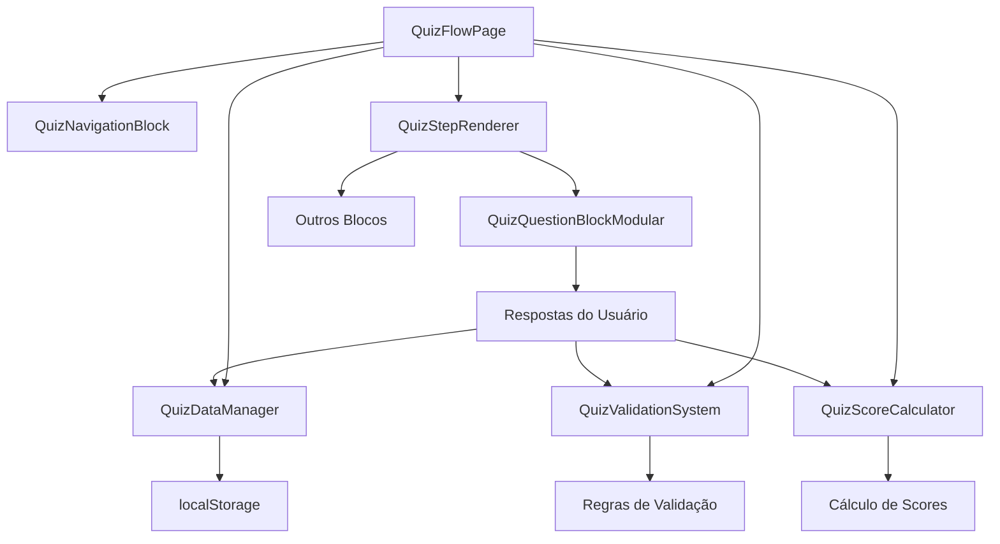

# 🎯 **DOCUMENTAÇÃO: ESTRUTURA MODULAR DAS 21 ETAPAS**

## 📋 **Visão Geral**

Esta documentação descreve a estrutura modular implementada para o gerenciamento das 21 etapas do quiz, permitindo edição ao vivo com preview idêntico ao modelo de produção.

## 🏗️ **Arquitetura dos Componentes**

### **1. QuizFlowPage.tsx** - Componente Principal

```tsx
// Uso básico
<QuizFlowPage
  mode="editor" // 'editor' | 'preview' | 'production'
  template={QUIZ_STYLE_21_STEPS_TEMPLATE}
  onBlocksChange={handleBlocksChange}
  initialData={quizState}
  customConfig={config}
/>
```

**Responsabilidades:**

- ✅ Gerencia estado global das 21 etapas
- ✅ Coordena navegação entre etapas
- ✅ Suporta modo editor com preview ao vivo
- ✅ Integração com sistema de validação e scoring

### **2. QuizNavigationBlock.tsx** - Navegação Modular

```tsx
// Variantes disponíveis
<QuizNavigationBlock
  config={navigationConfig}
  variant="full" // 'full' | 'minimal' | 'stepper'
  showDebugInfo={true}
/>
```

**Recursos:**

- 🧭 Navegação inteligente entre etapas
- 📊 Barra de progresso dinâmica
- 🔄 Botões de voltar/avançar com validação
- 🐛 Modo debug para desenvolvimento

### **3. QuizStepRenderer.tsx** - Renderizador de Etapas

```tsx
// Renderização dinâmica
<QuizStepRenderer
  blocks={currentStepBlocks}
  config={rendererConfig}
  onBlocksReorder={handleReorder}
  onAddBlock={handleAddBlock}
/>
```

**Funcionalidades:**

- 🎨 Renderização dinâmica de blocos
- 🖱️ Drag & drop para reordenação (modo editor)
- ➕ Adição de novos blocos
- 👁️ Preview idêntico à produção

### **4. QuizDataManager.tsx** - Gerenciador de Dados

```tsx
// Componente invisível para gerenciamento de dados
<QuizDataManager config={dataConfig} autoSave={true} storageKey="quiz-session" />
```

**Capacidades:**

- 💾 Auto-save no localStorage
- 🔄 Sincronização de estado
- 📱 Restauração de sessão
- 📊 Analytics integrado

### **5. QuizValidationSystem.tsx** - Sistema de Validação

```tsx
// Sistema de validação em tempo real
<QuizValidationSystem
  config={validationConfig}
  enableRealTimeValidation={true}
  showValidationMessages={true}
/>
```

**Recursos:**

- ✅ Validação em tempo real
- 📝 Regras customizáveis por etapa
- 🔔 Feedback visual de erros
- 🎯 Validação específica por tipo de questão

### **6. QuizScoreCalculator.tsx** - Calculadora de Pontuação

```tsx
// Cálculo automático de scores
<QuizScoreCalculator
  config={calculatorConfig}
  enableRealTimeCalculation={true}
  recalculateOnAnswerChange={true}
/>
```

**Funcionalidades:**

- 🧮 Cálculo automático de pontuação
- 🎨 Determinação de estilo predominante
- 📈 Scores secundários
- 🔄 Recálculo em tempo real

### **7. QuizQuestionBlockModular.tsx** - Bloco de Questão Reutilizável

```tsx
// Bloco modular para questões
<QuizQuestionBlockModular
  block={questionBlock}
  selectedOptions={selections}
  onSelectionChange={handleChange}
  config={questionConfig}
/>
```

**Características:**

- ❓ Suporte a múltipla escolha e seleção única
- 🖼️ Suporte a imagens nas opções
- ✅ Validação integrada
- 🎨 Styling customizável

## 🔧 **Configuração e Uso**

### **Configuração Básica**

```tsx
const quizConfig = {
  enableLivePreview: true,
  enableValidation: true,
  enableScoring: true,
  enableAnalytics: false,
  theme: {
    primaryColor: '#B89B7A',
    backgroundColor: '#FEFEFE',
    textColor: '#432818',
  },
};
```

### **Estado Inicial**

```tsx
const initialData = {
  currentStep: 1,
  totalSteps: 21,
  sessionData: { userName: '' },
  userAnswers: {},
  stepValidation: {},
  calculatedScores: {},
  isCompleted: false,
};
```

### **Template das 21 Etapas**

```tsx
import { QUIZ_STYLE_21_STEPS_TEMPLATE } from '@/templates/quiz21StepsComplete';

// Template contém:
// - step-1: Coleta de nome
// - step-2 a step-11: 10 questões pontuadas (3 seleções)
// - step-12: Transição para questões estratégicas
// - step-13 a step-18: 6 questões estratégicas (1 seleção)
// - step-19: Transição para resultado
// - step-20: Página de resultado personalizada
// - step-21: Página de oferta
```

## 🎨 **Modos de Operação**

### **1. Modo Editor** (`mode="editor"`)

- ✏️ Edição completa de blocos
- 🖱️ Drag & drop para reordenação
- ➕ Adição/remoção de blocos
- 🐛 Informações de debug
- 💾 Auto-save de alterações

### **2. Modo Preview** (`mode="preview"`)

- 👁️ Visualização idêntica à produção
- ✅ Validação ativa
- 🧮 Cálculo de scores
- 🚫 Sem controles de edição

### **3. Modo Produção** (`mode="production"`)

- 🚀 Experiência final do usuário
- 📊 Analytics completo
- 💾 Persistência no localStorage
- 🔒 Sem funcionalidades de debug

## 📊 **Fluxo de Dados**



## 🔄 **Integração com Editor Existente**

### **1. Importar no Editor Principal**

```tsx
import { QuizFlowPage } from '@/components/editor/quiz/QuizFlowPage';

// No seu editor existente
<QuizFlowPage
  mode="editor"
  template={currentTemplate}
  onBlocksChange={handleTemplateUpdate}
  initialData={editorState}
  customConfig={editorConfig}
/>;
```

### **2. Integrar com Sistema de Blocos**

```tsx
// Registrar novos blocos no registry
import { QuizQuestionBlockModular } from '@/components/editor/quiz/QuizQuestionBlockModular';

export const ENHANCED_BLOCK_REGISTRY = {
  ...existingBlocks,
  'quiz-question-modular': QuizQuestionBlockModular,
  // outros blocos...
};
```

### **3. Configurar Roteamento**

```tsx
// pages/editor/quiz.tsx
export default function QuizEditorPage() {
  return <QuizEditorExample initialStep={1} />;
}
```

## 🧪 **Exemplo de Implementação Completa**

```tsx
import React, { useState } from 'react';
import { QuizFlowPage } from '@/components/editor/quiz/QuizFlowPage';
import { QUIZ_STYLE_21_STEPS_TEMPLATE } from '@/templates/quiz21StepsComplete';

export const MyQuizEditor = () => {
  const [mode, setMode] = useState('editor');
  const [template, setTemplate] = useState(QUIZ_STYLE_21_STEPS_TEMPLATE);

  const handleBlocksChange = (stepId, blocks) => {
    setTemplate(prev => ({
      ...prev,
      [stepId]: blocks,
    }));
  };

  return (
    <QuizFlowPage
      mode={mode}
      template={template}
      onBlocksChange={handleBlocksChange}
      initialData={{
        currentStep: 1,
        totalSteps: 21,
        sessionData: {},
        userAnswers: {},
        stepValidation: {},
        calculatedScores: {},
        isCompleted: false,
      }}
      customConfig={{
        enableLivePreview: true,
        enableValidation: true,
        enableScoring: true,
        enableAnalytics: false,
        theme: {
          primaryColor: '#B89B7A',
          backgroundColor: '#FEFEFE',
          textColor: '#432818',
        },
      }}
    />
  );
};
```

## 🎯 **Benefícios da Estrutura Modular**

### ✅ **Componentes Duplicáveis**

- Cada bloco é independente e reutilizável
- Configuração via props sem dependências externas
- Template system flexível

### ✅ **Componentes Reutilizáveis**

- `QuizQuestionBlockModular` serve para qualquer tipo de questão
- `QuizNavigationBlock` com variantes para diferentes contextos
- Sistema de temas unificado

### ✅ **Componentes Modulares**

- Cada componente tem responsabilidade específica
- Comunicação via props e callbacks bem definidos
- Fácil teste e manutenção

### ✅ **Componentes Independentes**

- Nenhum componente depende de estado global específico
- Pode ser usado em qualquer contexto
- Configuração via props

## 🔧 **Debug e Desenvolvimento**

### **Ferramentas de Debug Disponíveis**

```javascript
// No console do navegador (modo editor)
window.quizDebug.getCurrentData();
window.quizDebug.exportData();
window.quizValidation.validateAllSteps();
window.quizCalculator.getCurrentScores();
```

### **Logs de Desenvolvimento**

- 📱 `Quiz data saved to localStorage`
- 🧮 `Quiz scores calculated`
- ✅ `Step validation results`
- 📊 `Analytics events`

## 🚀 **Próximos Passos**

1. **Integrar com Editor Existente**: Substituir sistema atual
2. **Adicionar Mais Blocos**: Implementar blocos específicos do template
3. **Melhorar Performance**: Otimizar renderização e cálculos
4. **Testes Automatizados**: Criar suite de testes
5. **Documentação Interativa**: Demo ao vivo dos componentes

---

Esta estrutura garante que você tenha um sistema robusto, modular e extensível para gerenciar as 21 etapas do quiz com experiência idêntica entre editor e produção! 🎯✨
