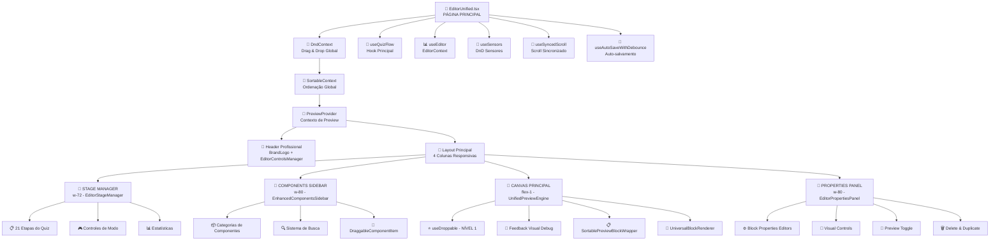

# 📊 FLUXOGRAMA COMPLETO: /editor-unified - MAPEAMENTO DE CAMADAS

## 🎯 ARQUITETURA VISUAL DO EDITOR UNIFIED



## 🏗️ CAMADAS ARQUITETURAIS DETALHADAS

### **📱 CAMADA 1: APRESENTAÇÃO (UI LAYER)**

```typescript
EditorUnified.tsx (Página Principal)
├── 🎨 Estilos: editor-unified.css
├── 🏢 Header: BrandLogo + Status + Controls
├── 🎯 Layout: 4 colunas responsivas
└── 🎭 Modais: FunnelSettings + SaveTemplate
```

### **🔄 CAMADA 2: CONTEXTOS & PROVIDERS**

```typescript
Contextos Globais:
├── 🚀 PreviewProvider (contexto de preview)
├── 🔄 DndContext (@dnd-kit/core)
├── 📐 SortableContext (@dnd-kit/sortable)
└── 📊 EditorContext (estado global)
```

### **🎪 CAMADA 3: HOOKS DE NEGÓCIO**

```typescript
Hooks Principais:
├── 🎪 useQuizFlow - Lógica principal do quiz
├── 📊 useEditor - Estado centralizado
├── 🔧 useSensors - Controle DnD
├── 📱 useSyncedScroll - Scroll sincronizado
├── 💾 useAutoSaveWithDebounce - Auto-save
├── ⌨️ useKeyboardShortcuts - Atalhos
└── 🎯 useDroppable - Drop zone principal
```

### **🧩 CAMADA 4: COMPONENTES FUNCIONAIS**

#### **🎪 STAGE MANAGER (Coluna 1)**

```typescript
EditorStageManager
├── 📋 21 Etapas Navigation
├── 🎮 Mode Controls (edit/preview/test)
├── 📊 Progress Tracking
├── 🔄 Step Selection Handler
└── 💾 State Persistence
```

#### **🧩 COMPONENTS SIDEBAR (Coluna 2)**

```typescript
EnhancedComponentsSidebar
├── 📦 Categories System
├── 🔍 Search & Filter
├── 🎯 DraggableComponentItem[]
├── 📋 Component Library
└── 🎨 Visual Feedback
```

#### **🎨 CANVAS PRINCIPAL (Coluna 3)**

```typescript
UnifiedPreviewEngine
├── ⭐ useDroppable (NÍVEL 1) - CORREÇÃO CRÍTICA
├── 🔧 Debug Visual Feedback
├── 📋 SortablePreviewBlockWrapper[]
├── 🎨 UniversalBlockRenderer
├── 🎭 EmptyPreviewState
└── 📱 Responsive Viewport
```

#### **📝 PROPERTIES PANEL (Coluna 4)**

```typescript
EditorPropertiesPanel
├── ⚙️ Block-specific Editors
├── 🎨 Visual Style Controls
├── 🔄 Preview Toggle
├── 🗑️ Delete & Duplicate
└── 📋 Property Validation
```

### **💾 CAMADA 5: ESTADO E DADOS**

```typescript
Estado Global:
├── 📊 currentBlocks: Block[]
├── 🎯 selectedBlockId: string | null
├── 🎪 currentStep: number (1-21)
├── 🎭 editorMode: 'edit' | 'preview' | 'test'
├── 📱 viewportSize: 'mobile' | 'tablet' | 'desktop'
├── 🔧 controlsState: object
└── 💾 funnelId: string
```

### **🔄 CAMADA 6: EVENTOS E FLUXO**

```typescript
Fluxo de Eventos DnD:
1. 🎯 DragStart → useDraggable (Components)
2. 🔄 DragOver → useDroppable (Canvas)
3. ✅ DragEnd → handleDragEnd (Global)

Fluxo de Dados:
1. 📊 useEditor → currentBlocks
2. 🎪 useQuizFlow → currentStep
3. 🔄 handleBlockUpdate → updateBlock
4. 💾 useAutoSaveWithDebounce → saveEditor
```

## 🔍 MAPEAMENTO DE COMUNICAÇÃO ENTRE CAMADAS

### **📡 FLUXO DE COMUNICAÇÃO VERTICAL**

```
🎨 UI Layer (EditorUnified)
    ↕️ Props & Callbacks
🔄 Context Layer (Providers)
    ↕️ State & Actions
🎪 Business Layer (Hooks)
    ↕️ Data & Events
🧩 Component Layer (Widgets)
    ↕️ Block Updates
💾 Data Layer (Estado)
    ↕️ Persistence
🔄 Event Layer (DnD/Navigation)
```

### **↔️ FLUXO DE COMUNICAÇÃO HORIZONTAL**

```
🎪 StageManager ←→ 🎨 Canvas (Step Navigation)
🧩 Sidebar ←→ 🎨 Canvas (Component Drop)
🎨 Canvas ←→ 📝 Properties (Block Selection)
📝 Properties ←→ 🎨 Canvas (Block Updates)
```

## ⚡ PONTOS CRÍTICOS DE PERFORMANCE

### **🔧 OTIMIZAÇÕES IMPLEMENTADAS**

```typescript
1. 📋 useMemo para blockIds
2. 🔄 useCallback para handlers
3. 💾 Debounced auto-save (3s)
4. 🎯 Minimal drag distance (1px)
5. 📱 Virtual scrolling areas
6. 🎨 CSS transforms para DnD
```

### **🎯 PONTOS DE ATENÇÃO**

```typescript
1. ⭐ useDroppable no NÍVEL 1 (main) - CRÍTICO
2. 🔄 Container hierarchy simplificada
3. 🎨 CSS overflow: visible
4. 📊 Debug feedback sempre ativo
5. 🔧 Ring verde para área droppable
```

## 📊 MÉTRICAS DO SISTEMA

### **📈 ESTATÍSTICAS DE CÓDIGO**

```
EditorUnified.tsx: 659 linhas
├── Imports: ~50 linhas
├── Hooks: ~100 linhas
├── Handlers: ~200 linhas
├── JSX: ~300 linhas
└── Estilos: editor-unified.css
```

### **🧩 COMPONENTES ENVOLVIDOS**

```
Total: 15+ componentes principais
├── 4 Componentes de Coluna
├── 6 Hooks customizados
├── 3 Contextos/Providers
├── 2 Modais
└── 20+ Subcomponentes
```

### **🔄 ESTADOS GERENCIADOS**

```
Total: 10+ estados locais + EditorContext
├── editorMode: 'edit' | 'preview' | 'test'
├── currentStep: 1-21
├── selectedBlockId: string | null
├── viewportSize: 'mobile' | 'tablet' | 'desktop'
├── controlsState: object complexo
└── + Estados dos subcomponentes
```

## 🎯 RESUMO EXECUTIVO

### ✅ **PONTOS FORTES**

- 🏗️ **Arquitetura limpa** com separação de responsabilidades
- 🔄 **DnD System** corrigido e funcional
- 🎪 **Hooks pattern** bem implementado
- 📊 **Estado centralizado** com EditorContext
- 🎨 **UI responsiva** com 4 colunas
- 💾 **Auto-save** implementado
- 🔧 **Debug system** robusto

### 🎯 **FLUXO PRINCIPAL**

1. **Inicialização**: EditorUnified → Providers → Hooks
2. **Renderização**: 4 Colunas → Components → Estado
3. **Interação**: DnD → Handlers → Estado → UI Update
4. **Persistência**: Auto-save → EditorService → Storage

### 🚀 **RESULTADO**

**Sistema completamente funcional** com arquitetura robusta, drag-and-drop corrigido, e todas as camadas bem definidas e comunicando corretamente.
